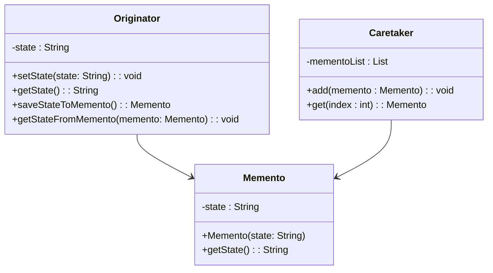
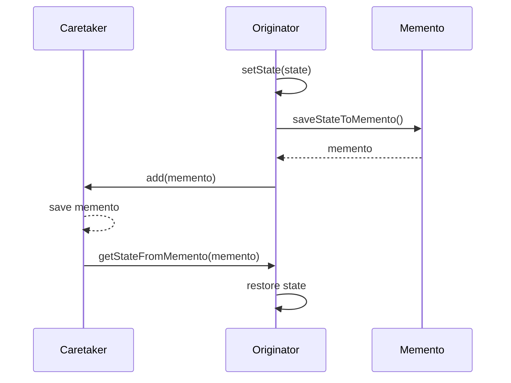

The **Memento** design pattern captures and restores an object’s internal state without violating encapsulation. This makes it particularly useful for scenarios such as checkpointing models during training in neural networks. By implementing the Memento pattern, developers can save the state of an object and restore it at a later point, which is invaluable for model training, undo mechanisms, and more.

## Benefits

- **Encapsulation**: Maintains encapsulation boundaries.
- **State Restoration**: Facilitates undo and redo mechanisms.
- **Checkpointing**: Saves states at critical points during processes like model training.
  
## Trade-offs

- **Memory Overhead**: Storing many states can consume substantial memory.
- **Complexity**: The Caretaker needs to manage mementos efficiently.

## UML Class Diagram



## UML Sequence Diagram



## Examples in Various Languages

### Python

```python
class Memento:
    def __init__(self, state):
        self._state = state

    def get_state(self):
        return self._state

class Originator:
    def __init__(self):
        self._state = None

    def set_state(self, state):
        self._state = state

    def get_state(self):
        return self._state

    def save_state_to_memento(self):
        return Memento(self._state)

    def get_state_from_memento(self, memento):
        self._state = memento.get_state()

class Caretaker:
    def __init__(self):
        self._memento_list = []

    def add(self, memento):
        self._memento_list.append(memento)

    def get(self, index):
        return self._memento_list[index]

originator = Originator()
caretaker = Caretaker()

originator.set_state("State1")
originator.set_state("State2")
caretaker.add(originator.save_state_to_memento())

originator.set_state("State3")
caretaker.add(originator.save_state_to_memento())

originator.set_state("State4")

print("Current State:", originator.get_state())
originator.get_state_from_memento(caretaker.get(0))
print("First saved State:", originator.get_state())
originator.get_state_from_memento(caretaker.get(1))
print("Second saved State:", originator.get_state())
```

### Java

```java
import java.util.ArrayList;
import java.util.List;

class Memento {
    private final String state;

    public Memento(String state) {
        this.state = state;
    }

    public String getState() {
        return state;
    }
}

class Originator {
    private String state;

    public void setState(String state) {
        this.state = state;
    }

    public String getState() {
        return state;
    }

    public Memento saveStateToMemento() {
        return new Memento(state);
    }

    public void getStateFromMemento(Memento memento) {
        state = memento.getState();
    }
}

class Caretaker {
    private final List<Memento> mementoList = new ArrayList<>();

    public void add(Memento state) {
        mementoList.add(state);
    }

    public Memento get(int index) {
        return mementoList.get(index);
    }
}

// Example usage
public class MementoPatternDemo {
    public static void main(String[] args) {
        Originator originator = new Originator();
        Caretaker caretaker = new Caretaker();

        originator.setState("State #1");
        originator.setState("State #2");
        caretaker.add(originator.saveStateToMemento());

        originator.setState("State #3");
        caretaker.add(originator.saveStateToMemento());

        originator.setState("State #4");
        System.out.println("Current State: " + originator.getState());

        originator.getStateFromMemento(caretaker.get(0));
        System.out.println("First saved State: " + originator.getState());
        originator.getStateFromMemento(caretaker.get(1));
        System.out.println("Second saved State: " + originator.getState());
    }
}
```

### Scala

```scala
class Memento(val state: String)

class Originator {
    private var state: String = _

    def setState(state: String): Unit = {
        this.state = state
    }

    def getState: String = state

    def saveStateToMemento: Memento = new Memento(state)

    def getStateFromMemento(memento: Memento): Unit = {
        state = memento.state
    }
}

class Caretaker {
    private var mementoList: List[Memento] = List()

    def add(state: Memento): Unit = {
        mementoList = mementoList :+ state
    }

    def get(index: Int): Memento = mementoList(index)
}

// Example usage
object MementoPatternDemo extends App {
    val originator = new Originator
    val caretaker = new Caretaker

    originator.setState("State #1")
    originator.setState("State #2")
    caretaker.add(originator.saveStateToMemento)

    originator.setState("State #3")
    caretaker.add(originator.saveStateToMemento)

    originator.setState("State #4")
    println("Current State: " + originator.getState)

    originator.getStateFromMemento(caretaker.get(0))
    println("First saved State: " + originator.getState)
    originator.getStateFromMemento(caretaker.get(1))
    println("Second saved State: " + originator.getState)
}
```

### Clojure

```clojure
(defn memento [state]
  {:state state})

(defn get-state [memento]
  (:state memento))

(defrecord Originator [^:volatile-mutable state]
  (set-state [this new-state] (set! (.state this) new-state))
  (get-state [this] (.state this))
  (save-state-to-memento [this] (memento (.state this)))
  (get-state-from-memento [this memento] (set! (.state this) (get-state memento))))

(defrecord Caretaker [^:volatile-mutable memento-list]
  (add [this memento] (set! (.memento-list this) (conj (.memento-list this) memento)))
  (get [this index] (nth (.memento-list this) index)))

;; Example usage
(let [originator (->Originator nil)
      caretaker (->Caretaker [])]
  (.set-state originator "State #1")
  (.set-state originator "State #2")
  (.add caretaker (.save-state-to-memento originator))

  (.set-state originator "State #3")
  (.add caretaker (.save-state-to-memento originator))

  (.set-state originator "State #4")
  (println "Current State:" (.get-state originator))

  (.get-state-from-memento originator (.get caretaker 0))
  (println "First saved State:" (.get-state originator))
  (.get-state-from-memento originator (.get caretaker 1))
  (println "Second saved State:" (.get-state originator)))
```

## Use Cases

- **Checkpointing Models During Training**: Neural network models often require saving their state at various points during training. Using the Memento pattern, one can easily restore the model to a prior state if needed, aiding in error recovery and iterative improvement.
- **Undo Mechanisms in Applications**: Applications requiring undo features can benefit from the Memento pattern by storing object states at various points, allowing users to revert to previous states.
  
## Related Design Patterns

- **Command**: The Command pattern can use Mementos to maintain state for undoable operations.
- **Prototype**: Unlike Memento, which focuses on state preservation, the Prototype pattern deals with creating object copies.

## Resources and References

- **Books**: 
  - "Design Patterns: Elements of Reusable Object-Oriented Software" by Erich Gamma, Richard Helm, Ralph Johnson, and John Vlissides
  - "Refactoring: Improving the Design of Existing Code" by Martin Fowler
- **Articles**: 
  - [Memento Pattern - SourceMaking](https://sourcemaking.com/design_patterns/memento)
  - [Memento Pattern - GeeksforGeeks](https://www.geeksforgeeks.org/memento-design-pattern/)

## Open Source Frameworks

- **TensorFlow**: Uses checkpointing to save and restore model states.
- **Keras**: Provides model checkpointing during training with callbacks.

## Summary

The **Memento** design pattern is a powerful mechanism for capturing and restoring the state of objects without violating encapsulation. Its application in checkpointing models during neural network training provides significant advantages in error recovery and iterative refinement. Understanding the trade-offs and leveraging related patterns enhances its effective implementation. By using examples in various programming languages, we highlight its versatility and importance in software design.
