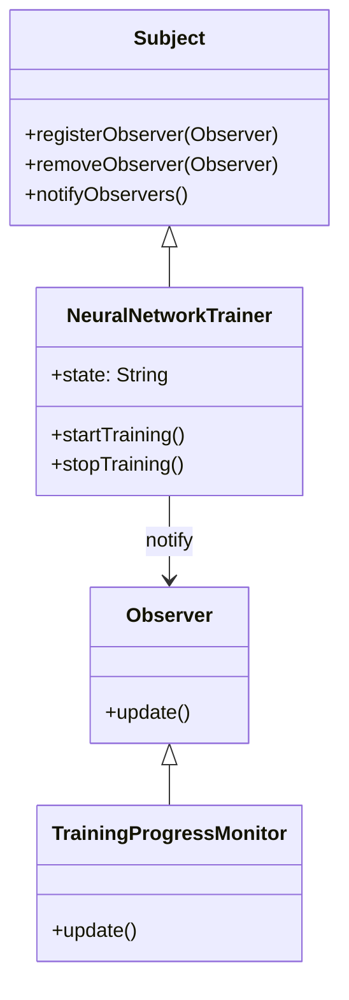
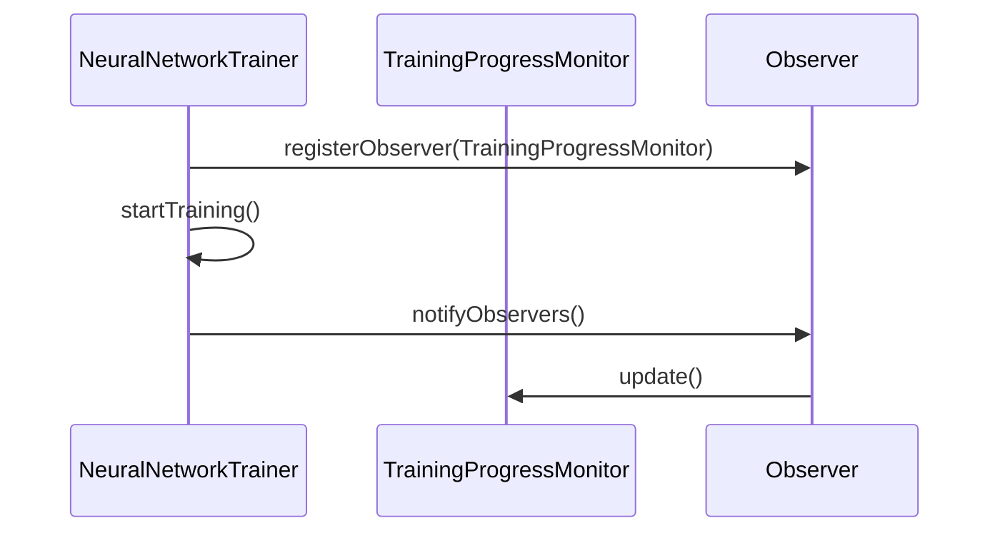

## Observer Pattern in Neural Networks: Monitoring Training Progress

### Introduction
The Observer Pattern is a behavioral design pattern that establishes a one-to-many dependency between objects so that when one object changes state, all its dependents are notified and updated automatically. In the context of neural networks, this pattern can be utilized to monitor the training progress, keeping various components in sync without creating tight coupling between them.

### UML Class Diagram


### UML Sequence Diagram


### Detailed Explanation
- **Subject (NeuralNetworkTrainer)**: The object that holds the state and notifies the observers about changes.
- **Observer (TrainingProgressMonitor)**: The object that monitors the state changes and reacts accordingly.

### Implementation in Various Languages

#### Python
```python
class Observer:
    def update(self, state):
        pass

class NeuralNetworkTrainer:
    def __init__(self):
        self.observers = []
        self.state = None

    def register_observer(self, observer):
        self.observers.append(observer)

    def remove_observer(self, observer):
        self.observers.remove(observer)

    def notify_observers(self):
        for observer in self.observers:
            observer.update(self.state)

    def start_training(self):
        self.state = "Training Started"
        self.notify_observers()

    def stop_training(self):
        self.state = "Training Stopped"
        self.notify_observers()

class TrainingProgressMonitor(Observer):
    def update(self, state):
        print(f"State changed to: {state}")

trainer = NeuralNetworkTrainer()
monitor = TrainingProgressMonitor()
trainer.register_observer(monitor)
trainer.start_training()
```

#### Java
```java
interface Observer {
    void update(String state);
}

class NeuralNetworkTrainer {
    private List<Observer> observers = new ArrayList<>();
    private String state;

    public void registerObserver(Observer observer) {
        observers.add(observer);
    }

    public void removeObserver(Observer observer) {
        observers.remove(observer);
    }

    public void notifyObservers() {
        for (Observer observer : observers) {
            observer.update(state);
        }
    }

    public void startTraining() {
        state = "Training Started";
        notifyObservers();
    }

    public void stopTraining() {
        state = "Training Stopped";
        notifyObservers();
    }
}

class TrainingProgressMonitor implements Observer {
    @Override
    public void update(String state) {
        System.out.println("State changed to: " + state);
    }
}

// Example usage
public class Main {
    public static void main(String[] args) {
        NeuralNetworkTrainer trainer = new NeuralNetworkTrainer();
        TrainingProgressMonitor monitor = new TrainingProgressMonitor();
        trainer.registerObserver(monitor);
        trainer.startTraining();
    }
}
```

#### Scala
```scala
trait Observer {
  def update(state: String): Unit
}

class NeuralNetworkTrainer {
  private var observers: List[Observer] = List()
  private var state: String = _

  def registerObserver(observer: Observer): Unit = {
    observers = observer :: observers
  }

  def removeObserver(observer: Observer): Unit = {
    observers = observers.filterNot(_ == observer)
  }

  def notifyObservers(): Unit = {
    observers.foreach(_.update(state))
  }

  def startTraining(): Unit = {
    state = "Training Started"
    notifyObservers()
  }

  def stopTraining(): Unit = {
    state = "Training Stopped"
    notifyObservers()
  }
}

class TrainingProgressMonitor extends Observer {
  def update(state: String): Unit = {
    println(s"State changed to: $state")
  }
}

// Example usage
object Main extends App {
  val trainer = new NeuralNetworkTrainer()
  val monitor = new TrainingProgressMonitor()
  trainer.registerObserver(monitor)
  trainer.startTraining()
}
```

#### Clojure
```clojure
(defprotocol Observer
  (update [this state]))

(defprotocol Subject
  (register-observer [this observer])
  (remove-observer [this observer])
  (notify-observers [this]))

(defrecord NeuralNetworkTrainer [observers state]
  Subject
  (register-observer [this observer]
    (swap! observers conj observer))
  (remove-observer [this observer]
    (swap! observers disj observer))
  (notify-observers [this]
    (doseq [observer @observers]
      (update observer state)))
  (start-training [this]
    (swap! state (constantly "Training Started"))
    (notify-observers this))
  (stop-training [this]
    (swap! state (constantly "Training Stopped"))
    (notify-observers this)))

(defrecord TrainingProgressMonitor []
  Observer
  (update [this state]
    (println "State changed to:" state)))

;; Example usage
(def trainer (->NeuralNetworkTrainer (atom #{})(atom nil)))
(def monitor (->TrainingProgressMonitor))

(register-observer trainer monitor)
(start-training trainer)
```

### Benefits
- **Loose Coupling**: Observers can be added or removed independently.
- **Scalability**: Easy to add multiple observers.
- **Reusability**: Observers can be reused across different subjects.

### Trade-Offs
- **Performance Overhead**: Frequent notifications can degrade performance.
- **Complexity**: Increased complexity with many interconnected objects.
- **Potential for Memory Leaks**: If observers are not properly managed and removed.

### Use Cases
- **Monitoring Training Progress**: Real-time monitoring and logging of training progress in neural networks.
- **Event Handling Systems**: Real-time notifications of state changes in GUI applications.
- **Distributed Systems**: Keeping nodes in a distributed system informed about the state of other nodes.

### Related Design Patterns
- **Mediator**: Manages communication between multiple objects to reduce dependencies.
- **MVC (Model-View-Controller)**: Separates application logic, user interface, and input control to improve the modularity and scalability of the software.

### Resources and References
- **Books**: "Design Patterns: Elements of Reusable Object-Oriented Software" by Erich Gamma, Richard Helm, Ralph Johnson, and John Vlissides.
- **Online Resources**: 
  - [Refactoring Guru - Observer](https://refactoring.guru/design-patterns/observer)
  - [GeeksforGeeks - Observer Pattern](https://www.geeksforgeeks.org/observer-pattern-set-1-introduction/)

### Open Source Frameworks
- **TensorFlow**: Incorporates observer pattern in event-driven architecture for monitoring.
- **PyTorch**: Uses similar patterns for logging and monitoring during model training.

### Summary
The Observer Pattern offers an effective way to manage state dependencies and keep various components updated automatically, making it an excellent choice for monitoring training progress in neural networks. By understanding its benefits and trade-offs, and by leveraging the right tools and frameworks, developers can create flexible, scalable, and maintainable neural network applications.
