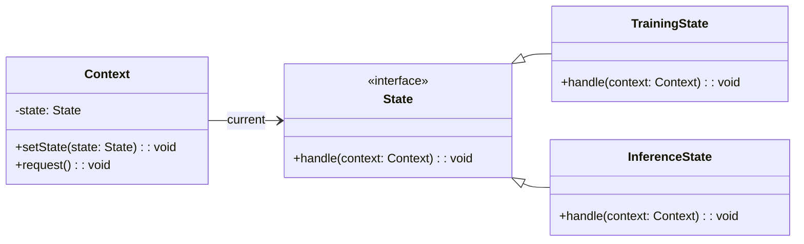
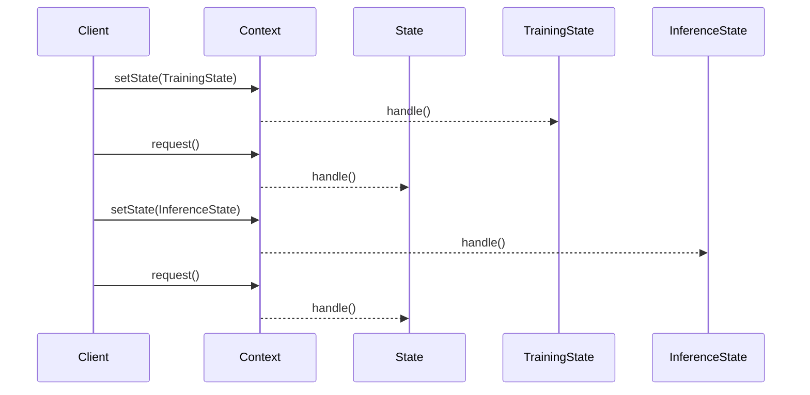

## Overview

The **State** design pattern is a behavioral design pattern that allows an object to change its behavior when its internal state changes. This pattern is particularly useful in managing the different states of a neural network during training and inference phases. By encapsulating state-specific behavior within state objects, the State pattern enables cleaner and more maintainable code.

## Use Case in Neural Networks

In the context of neural networks, the State pattern can manage transitions between different layers or states during training and inference. This allows the network to adapt its behavior dynamically based on its state, such as switching between dropout layers in training versus inference.

## UML Class Diagram



### Explanation

1. **Context**: Maintains an instance of a `State` subclass defining the current state.
2. **State**: Defines an interface for encapsulating behavior associated with a particular state of the `Context`.
3. **TrainingState** and **InferenceState**: Implement state-specific behavior.

## UML Sequence Diagram



### Explanation

1. The client sets the `TrainingState` in the `Context`.
2. The client requests an operation, and the `Context` delegates the request to the current state (`TrainingState`).
3. The client sets the `InferenceState` in the `Context`.
4. The client requests another operation, and the `Context` delegates the request to the current state (`InferenceState`).

## Examples

### Python

```python
class State:
    def handle(self, context):
        raise NotImplementedError

class TrainingState(State):
    def handle(self, context):
        print("Handling training state.")

class InferenceState(State):
    def handle(self, context):
        print("Handling inference state.")

class Context:
    def __init__(self):
        self._state = None

    def set_state(self, state):
        self._state = state

    def request(self):
        self._state.handle(self)

context = Context()
context.set_state(TrainingState())
context.request()
context.set_state(InferenceState())
context.request()
```

### Java

```java
interface State {
    void handle(Context context);
}

class TrainingState implements State {
    public void handle(Context context) {
        System.out.println("Handling training state.");
    }
}

class InferenceState implements State {
    public void handle(Context context) {
        System.out.println("Handling inference state.");
    }
}

class Context {
    private State state;

    public void setState(State state) {
        this.state = state;
    }

    public void request() {
        state.handle(this);
    }
}

// Usage
public class Main {
    public static void main(String[] args) {
        Context context = new Context();
        context.setState(new TrainingState());
        context.request();
        context.setState(new InferenceState());
        context.request();
    }
}
```

### Scala

```scala
trait State {
  def handle(context: Context): Unit
}

class TrainingState extends State {
  override def handle(context: Context): Unit = {
    println("Handling training state.")
  }
}

class InferenceState extends State {
  override def handle(context: Context): Unit = {
    println("Handling inference state.")
  }
}

class Context {
  private var state: State = _

  def setState(state: State): Unit = {
    this.state = state
  }

  def request(): Unit = {
    state.handle(this)
  }
}

// Usage
object Main extends App {
  val context = new Context()
  context.setState(new TrainingState())
  context.request()
  context.setState(new InferenceState())
  context.request()
}
```

### Clojure

```clojure
(defprotocol State
  (handle [this context]))

(deftype TrainingState []
  State
  (handle [this context]
    (println "Handling training state.")))

(deftype InferenceState []
  State
  (handle [this context]
    (println "Handling inference state.")))

(defrecord Context [^State state]
  (set-state [this state]
    (assoc this :state state))
  (request [this]
    (.handle state this)))

;; Usage
(let [context (->Context nil)]
  (-> context
      (set-state (->TrainingState))
      (request)
      (set-state (->InferenceState))
      (request)))
```

## Benefits

- **Encapsulation**: Separates state-specific behavior, making the code easier to maintain and extend.
- **Flexibility**: Allows dynamic switching between states, enabling more flexible design.
- **Simplification**: Reduces the complexity by organizing states and transitions in an organized manner.

## Trade-offs

- **Overhead**: Introduces additional classes and interfaces which can be overkill for simple scenarios.
- **Complexity**: If not used appropriately, can make the design overly complex.

## Use Cases

- **Layer Management**: Dynamically switching between different layers (dropout, batch normalization) during training and inference.
- **Neural Network Phases**: Managing different phases of a neural network lifecycle like initialization, training, evaluation, and deployment.

## Related Design Patterns

- **Strategy Pattern**: Similar in terms of swapping algorithms, but State pattern focuses on changing behavior based on state.
- **Observer Pattern**: Can be used in conjunction with the State pattern to notify other parts of the system when the state changes.
- **Factory Pattern**: Can be used to create specific state objects dynamically.

## Resources and References

- **Books**:
  - "Design Patterns: Elements of Reusable Object-Oriented Software" by Erich Gamma, Richard Helm, Ralph Johnson, and John Vlissides.
  - "Patterns of Enterprise Application Architecture" by Martin Fowler.

- **Articles**:
  - [Refactoring Guru: State Pattern](https://refactoring.guru/design-patterns/state)
  - [GeeksforGeeks: State Design Pattern](https://www.geeksforgeeks.org/state-design-pattern/)

- **Open Source Frameworks**:
  - TensorFlow
  - PyTorch
  - Keras
  
## Summary

The **State** design pattern is an elegant solution for managing the different states of a neural network during its lifecycle. It allows the object to change its behavior when its internal state changes, providing flexibility and modularity. By encapsulating state-specific behavior and maintaining state transitions, the State pattern contributes to cleaner, more maintainable, and scalable code. This pattern is particularly valuable in scenarios like layer switching during training and inference, enabling efficient and effective neural network design.
