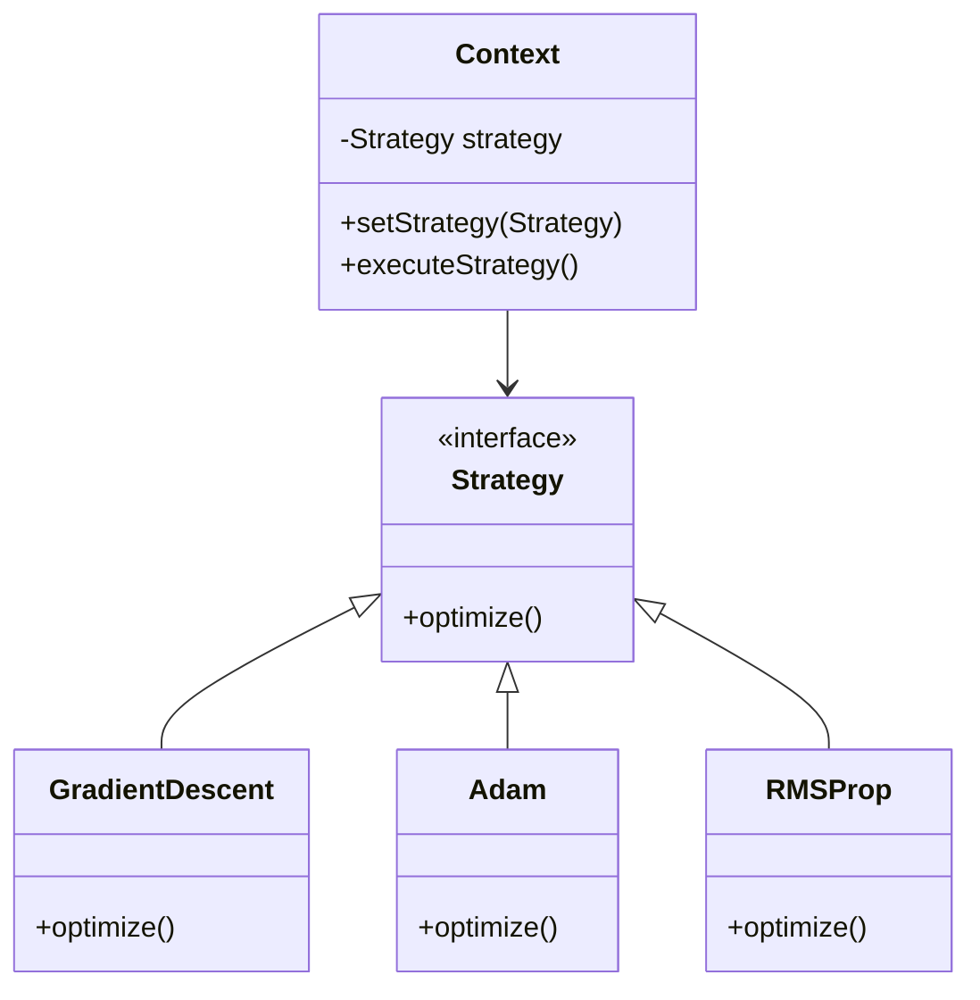
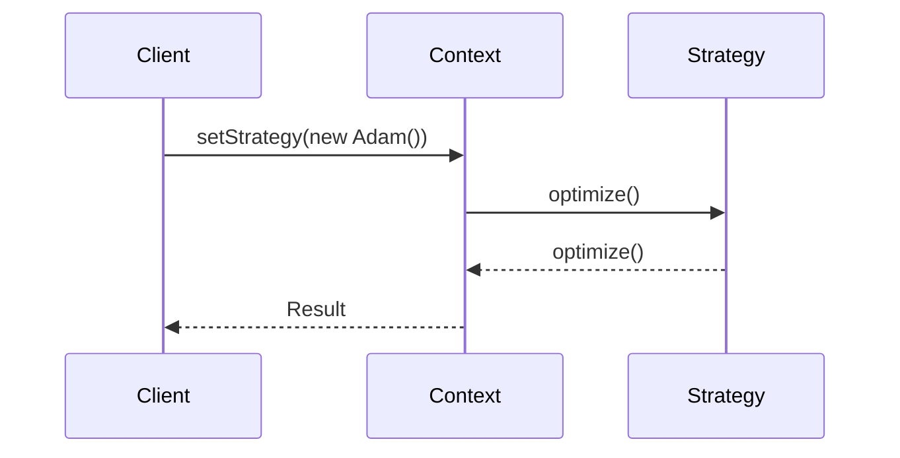

## Strategy: Encapsulate Algorithms

### Introduction

The **Strategy Design Pattern** defines a family of algorithms, encapsulates each one, and makes them interchangeable. This pattern allows algorithms to vary independently from clients that use them. In the context of neural networks, the Strategy Pattern is particularly useful for managing different optimization strategies, such as Gradient Descent, Adam, RMSProp, etc.

### Benefits

- **Flexibility:** Easily switch between different algorithms without altering the client code.
- **Encapsulation:** Keep algorithms encapsulated, promoting cleaner and more maintainable code.
- **Open/Closed Principle:** New strategies can be introduced without changing the existing system.

### Trade-Offs

- **Overhead:** Introduces additional interfaces and classes, which can increase complexity.
- **Learning Curve:** Developers need to understand the pattern and how to implement it correctly.

### UML Class Diagram



### UML Sequence Diagram



### Implementation in Various Languages

#### Python

```python
class Strategy:
    def optimize(self):
        pass

class GradientDescent(Strategy):
    def optimize(self):
        print("Using Gradient Descent optimization")

class Adam(Strategy):
    def optimize(self):
        print("Using Adam optimization")

class RMSProp(Strategy):
    def optimize(self):
        print("Using RMSProp optimization")

class Context:
    def __init__(self, strategy: Strategy):
        self._strategy = strategy

    def set_strategy(self, strategy: Strategy):
        self._strategy = strategy

    def execute_strategy(self):
        self._strategy.optimize()

context = Context(Adam())
context.execute_strategy()
context.set_strategy(RMSProp())
context.execute_strategy()
```

#### Java

```java
interface Strategy {
    void optimize();
}

class GradientDescent implements Strategy {
    @Override
    public void optimize() {
        System.out.println("Using Gradient Descent optimization");
    }
}

class Adam implements Strategy {
    @Override
    public void optimize() {
        System.out.println("Using Adam optimization");
    }
}

class RMSProp implements Strategy {
    @Override
    public void optimize() {
        System.out.println("Using RMSProp optimization");
    }
}

class Context {
    private Strategy strategy;

    public Context(Strategy strategy) {
        this.strategy = strategy;
    }

    public void setStrategy(Strategy strategy) {
        this.strategy = strategy;
    }

    public void executeStrategy() {
        strategy.optimize();
    }
}

// Example usage
public class StrategyPatternDemo {
    public static void main(String[] args) {
        Context context = new Context(new Adam());
        context.executeStrategy();
        context.setStrategy(new RMSProp());
        context.executeStrategy();
    }
}
```

#### Scala

```scala
trait Strategy {
  def optimize(): Unit
}

class GradientDescent extends Strategy {
  override def optimize(): Unit = println("Using Gradient Descent optimization")
}

class Adam extends Strategy {
  override def optimize(): Unit = println("Using Adam optimization")
}

class RMSProp extends Strategy {
  override def optimize(): Unit = println("Using RMSProp optimization")
}

class Context(var strategy: Strategy) {
  def setStrategy(strategy: Strategy): Unit = {
    this.strategy = strategy
  }

  def executeStrategy(): Unit = {
    strategy.optimize()
  }
}

// Example usage
object StrategyPatternDemo extends App {
  val context = new Context(new Adam())
  context.executeStrategy()
  context.setStrategy(new RMSProp())
  context.executeStrategy()
}
```

#### Clojure

```clojure
(defprotocol Strategy
  (optimize [this]))

(defrecord GradientDescent []
  Strategy
  (optimize [this] (println "Using Gradient Descent optimization")))

(defrecord Adam []
  Strategy
  (optimize [this] (println "Using Adam optimization")))

(defrecord RMSProp []
  Strategy
  (optimize [this] (println "Using RMSProp optimization")))

(defn context [strategy]
  {:strategy strategy})

(defn set-strategy [ctx strategy]
  (assoc ctx :strategy strategy))

(defn execute-strategy [ctx]
  (optimize (:strategy ctx)))

; Example usage
(def ctx (context (->Adam)))
(execute-strategy ctx)
(def ctx (set-strategy ctx (->RMSProp)))
(execute-strategy ctx)
```

### Use Cases

- **Optimization in Neural Networks:** Switch between various optimization algorithms like Adam, Gradient Descent, and RMSProp.
- **Payment Processing Systems:** Use different payment algorithms such as credit card, PayPal, etc.
- **File Compression:** Choose between algorithms like ZIP, RAR, and GZIP.

### Related Design Patterns

- **Factory Pattern:** Can be used to create instances of various strategies.
- **Template Method Pattern:** Can define the skeleton of an algorithm in a method, deferring some steps to subclasses.
- **Decorator Pattern:** Enhances the functionalities of existing algorithms at runtime.

### Resources and References

- **Books:** 
  - "Design Patterns: Elements of Reusable Object-Oriented Software" by Erich Gamma, Richard Helm, Ralph Johnson, John Vlissides
  - "Patterns of Enterprise Application Architecture" by Martin Fowler
- **Online Articles:**
  - [Wikipedia on Strategy Pattern](https://en.wikipedia.org/wiki/Strategy_pattern)
  - [GeeksforGeeks on Strategy Pattern](https://www.geeksforgeeks.org/strategy-pattern-set-1/)
- **Open Source Frameworks:**
  - **TensorFlow:** Allows for different optimization strategies.
  - **PyTorch:** Supports various optimizers via its `torch.optim` package.

### Summary

The Strategy Pattern is a powerful design pattern for managing a family of algorithms and encapsulating each one, making them interchangeable. It is particularly useful in neural networks for optimization strategies, providing flexibility and promoting clean code. However, it does introduce complexity and has a learning curve. Understanding and correctly implementing the Strategy Pattern can bring significant benefits to your software projects, particularly in areas requiring multiple algorithm implementations.
