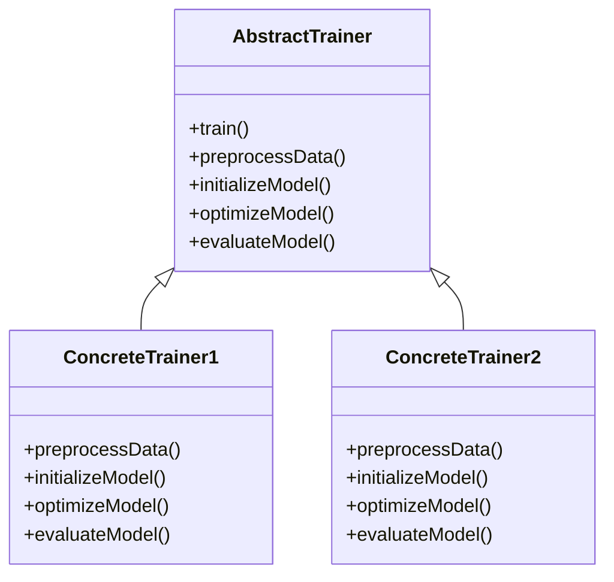
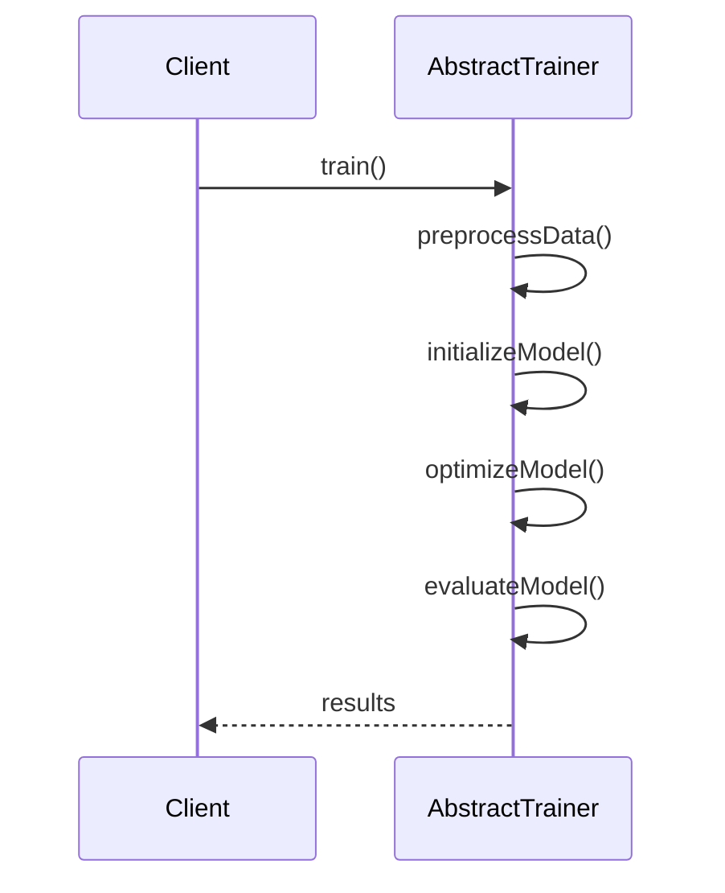

## Introduction

The **Template Method** design pattern defines the skeleton of an algorithm in an operation, while deferring some steps to subclasses. This design pattern allows subclasses to redefine certain steps of an algorithm without changing its structure. This is particularly useful in the context of neural networks, where the general workflow for tasks like model training can be standardized, but specific steps can vary.

## UML Class Diagram

The following is a UML Class Diagram for the Template Method pattern applied to a neural network training pipeline:



## UML Sequence Diagram



## Detailed Description

### Benefits
1. **Code Reusability**: Common algorithm steps are defined in the abstract class, which can be reused by multiple concrete classes.
2. **Ease of Maintenance**: Changes to the algorithm structure need to be made only in the abstract class.
3. **Flexibility**: Allows for subclass-specific implementations of certain steps in the algorithm.

### Trade-offs
1. **Increased Complexity**: Introducing abstract classes and inheritance can increase the complexity of the code.
2. **Tight Coupling**: Subclasses become tightly coupled to the abstract class, which can make changes more difficult.

### Example Use Cases
1. **Model Training Pipeline**: Define a standard training workflow for neural networks but allow different preprocessing or optimization strategies.
2. **Data Processing Pipelines**: Use the template method to define a general data processing pipeline with customizable steps.

### Implementation in Python
```python
from abc import ABC, abstractmethod

class AbstractTrainer(ABC):
    def train(self):
        self.preprocessData()
        self.initializeModel()
        self.optimizeModel()
        self.evaluateModel()
    
    @abstractmethod
    def preprocessData(self):
        pass
    
    @abstractmethod
    def initializeModel(self):
        pass
    
    @abstractmethod
    def optimizeModel(self):
        pass
    
    @abstractmethod
    def evaluateModel(self):
        pass

class ConcreteTrainer1(AbstractTrainer):
    def preprocessData(self):
        print("Preprocessing data using method 1")
    
    def initializeModel(self):
        print("Initializing model using method 1")
    
    def optimizeModel(self):
        print("Optimizing model using method 1")
    
    def evaluateModel(self):
        print("Evaluating model using method 1")

class ConcreteTrainer2(AbstractTrainer):
    def preprocessData(self):
        print("Preprocessing data using method 2")
    
    def initializeModel(self):
        print("Initializing model using method 2")
    
    def optimizeModel(self):
        print("Optimizing model using method 2")
    
    def evaluateModel(self):
        print("Evaluating model using method 2")

trainer = ConcreteTrainer1()
trainer.train()

trainer = ConcreteTrainer2()
trainer.train()
```

### Implementation in Java
```java
abstract class AbstractTrainer {
    public final void train() {
        preprocessData();
        initializeModel();
        optimizeModel();
        evaluateModel();
    }
    
    protected abstract void preprocessData();
    protected abstract void initializeModel();
    protected abstract void optimizeModel();
    protected abstract void evaluateModel();
}

class ConcreteTrainer1 extends AbstractTrainer {
    @Override
    protected void preprocessData() {
        System.out.println("Preprocessing data using method 1");
    }

    @Override
    protected void initializeModel() {
        System.out.println("Initializing model using method 1");
    }

    @Override
    protected void optimizeModel() {
        System.out.println("Optimizing model using method 1");
    }

    @Override
    protected void evaluateModel() {
        System.out.println("Evaluating model using method 1");
    }
}

class ConcreteTrainer2 extends AbstractTrainer {
    @Override
    protected void preprocessData() {
        System.out.println("Preprocessing data using method 2");
    }

    @Override
    protected void initializeModel() {
        System.out.println("Initializing model using method 2");
    }

    @Override
    protected void optimizeModel() {
        System.out.println("Optimizing model using method 2");
    }

    @Override
    protected void evaluateModel() {
        System.out.println("Evaluating model using method 2");
    }
}

// Usage
public class Main {
    public static void main(String[] args) {
        AbstractTrainer trainer = new ConcreteTrainer1();
        trainer.train();
        
        trainer = new ConcreteTrainer2();
        trainer.train();
    }
}
```

### Implementation in Scala
```scala
trait AbstractTrainer {
  final def train(): Unit = {
    preprocessData()
    initializeModel()
    optimizeModel()
    evaluateModel()
  }

  def preprocessData(): Unit
  def initializeModel(): Unit
  def optimizeModel(): Unit
  def evaluateModel(): Unit
}

class ConcreteTrainer1 extends AbstractTrainer {
  def preprocessData(): Unit = println("Preprocessing data using method 1")
  def initializeModel(): Unit = println("Initializing model using method 1")
  def optimizeModel(): Unit = println("Optimizing model using method 1")
  def evaluateModel(): Unit = println("Evaluating model using method 1")
}

class ConcreteTrainer2 extends AbstractTrainer {
  def preprocessData(): Unit = println("Preprocessing data using method 2")
  def initializeModel(): Unit = println("Initializing model using method 2")
  def optimizeModel(): Unit = println("Optimizing model using method 2")
  def evaluateModel(): Unit = println("Evaluating model using method 2")
}

// Usage
object Main extends App {
  val trainer1 = new ConcreteTrainer1()
  trainer1.train()

  val trainer2 = new ConcreteTrainer2()
  trainer2.train()
}
```

### Implementation in Clojure
```clojure
(defprotocol Trainer
  (preprocess-data [this])
  (initialize-model [this])
  (optimize-model [this])
  (evaluate-model [this])
  (train [this]))

(defn- base-train [this]
  (preprocess-data this)
  (initialize-model this)
  (optimize-model this)
  (evaluate-model this))

(defrecord ConcreteTrainer1 []
  Trainer
  (preprocess-data [this] (println "Preprocessing data using method 1"))
  (initialize-model [this] (println "Initializing model using method 1"))
  (optimize-model [this] (println "Optimizing model using method 1"))
  (evaluate-model [this] (println "Evaluating model using method 1"))
  (train [this] (base-train this)))

(defrecord ConcreteTrainer2 []
  Trainer
  (preprocess-data [this] (println "Preprocessing data using method 2"))
  (initialize-model [this] (println "Initializing model using method 2"))
  (optimize-model [this] (println "Optimizing model using method 2"))
  (evaluate-model [this] (println "Evaluating model using method 2"))
  (train [this] (base-train this)))

;; Usage
(def trainer1 (->ConcreteTrainer1))
(train trainer1)

(def trainer2 (->ConcreteTrainer2))
(train trainer2)
```

## Related Design Patterns
1. **Strategy Pattern**: Defines a family of algorithms, encapsulates each one, and makes them interchangeable. This is similar but allows entire algorithms to be swapped.
2. **Factory Method Pattern**: Defines an interface for creating an object but lets subclasses alter the type of objects that will be created.

## References and Resources
- **"Design Patterns: Elements of Reusable Object-Oriented Software" by Erich Gamma, Richard Helm, Ralph Johnson, John Vlissides** - The foundational book where the Template Method is described in detail.
- **"Design Patterns in Python" by Peter Gottschling** - A practical guide to implementing design patterns in Python.
- **Open-source frameworks**: Check out open-source deep learning frameworks like TensorFlow, PyTorch, which use the Template Method pattern in various components for flexibility and extendibility.

## Summary

The Template Method design pattern is invaluable in software design for neural networks, especially in creating standardized yet flexible training pipelines. By defining the skeleton of the algorithm while allowing the specifics to be defined by subclasses, it combines structure and flexibility, ensuring code reusability and ease of maintenance. Despite some trade-offs like increased complexity and tight coupling, the benefits often outweigh the drawbacks, making it a go-to pattern in many software engineering scenarios.

By understanding and implementing the Template Method pattern, developers can create robust, maintainable, and flexible systems, particularly in the complex and ever-evolving field of neural networks.
