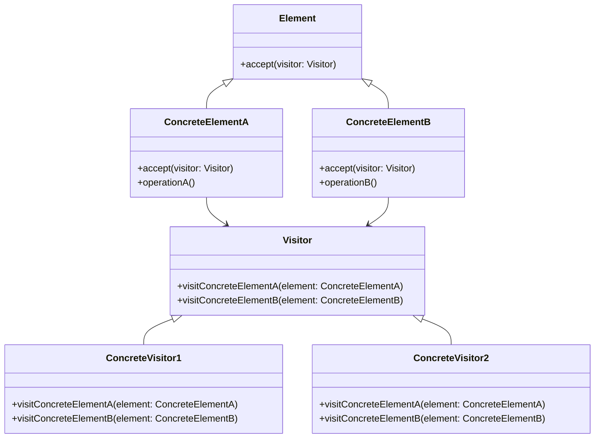
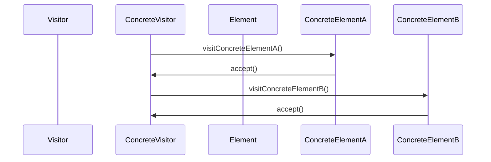

The Visitor Pattern is a behavioral design pattern that enables you to add further operations to objects without modifying their structure. This pattern is particularly useful in scenarios where new operations are required to be performed on a set of objects, and modifying these objects directly isn't feasible or desirable. A classic use case in neural networks is implementing custom metrics during evaluations.

## Benefits

- **Separation of Concerns**: Keeps the algorithms (operations) separate from the object structure.
- **Open/Closed Principle**: Allows new operations to be added without changing existing object structures.
- **Simplifies Complex Hierarchies**: Eases the implementation of complex operations across object hierarchies.

## Trade-offs

- **Visitor Complexity**: Can become complex with multiple visitors and new elements.
- **Double Dispatch Requirement**: The pattern requires the programming language to support double dispatch.
- **Maintains Object State**: Keeping the object state unchanged might limit certain operations.

## UML Class Diagram

Here's a UML class diagram illustrating the Visitor Pattern:



## UML Sequence Diagram

Here's a UML sequence diagram to demonstrate the interaction between elements and visitors:



## Examples in Multiple Languages

### Python

```python
class Visitor:
    def visit(self, element):
        pass

class Element:
    def accept(self, visitor):
        pass

class ConcreteElementA(Element):
    def accept(self, visitor):
        visitor.visit(self)

    def operation_a(self):
        return "ConcreteElementA"

class ConcreteElementB(Element):
    def accept(self, visitor):
        visitor.visit(self)

    def operation_b(self):
        return "ConcreteElementB"

class ConcreteVisitor(Visitor):
    def visit(self, element):
        if isinstance(element, ConcreteElementA):
            print(f"Processing {element.operation_a()}")
        elif isinstance(element, ConcreteElementB):
            print(f"Processing {element.operation_b()}")

visitor = ConcreteVisitor()
element_a = ConcreteElementA()
element_b = ConcreteElementB()

element_a.accept(visitor)
element_b.accept(visitor)
```

### Java

```java
interface Visitor {
    void visit(ConcreteElementA element);
    void visit(ConcreteElementB element);
}

interface Element {
    void accept(Visitor visitor);
}

class ConcreteElementA implements Element {
    public void accept(Visitor visitor) {
        visitor.visit(this);
    }

    public String operationA() {
        return "ConcreteElementA";
    }
}

class ConcreteElementB implements Element {
    public void accept(Visitor visitor) {
        visitor.visit(this);
    }

    public String operationB() {
        return "ConcreteElementB";
    }
}

class ConcreteVisitor implements Visitor {
    public void visit(ConcreteElementA element) {
        System.out.println("Processing " + element.operationA());
    }

    public void visit(ConcreteElementB element) {
        System.out.println("Processing " + element.operationB());
    }
}

public class Main {
    public static void main(String[] args) {
        Visitor visitor = new ConcreteVisitor();
        Element elementA = new ConcreteElementA();
        Element elementB = new ConcreteElementB();

        elementA.accept(visitor);
        elementB.accept(visitor);
    }
}
```

### Scala

```scala
trait Visitor {
  def visit(element: Element): Unit
}

trait Element {
  def accept(visitor: Visitor): Unit
}

class ConcreteElementA extends Element {
  override def accept(visitor: Visitor): Unit = visitor.visit(this)

  def operationA: String = "ConcreteElementA"
}

class ConcreteElementB extends Element {
  override def accept(visitor: Visitor): Unit = visitor.visit(this)

  def operationB: String = "ConcreteElementB"
}

class ConcreteVisitor extends Visitor {
  override def visit(element: Element): Unit = element match {
    case e: ConcreteElementA => println(s"Processing ${e.operationA}")
    case e: ConcreteElementB => println(s"Processing ${e.operationB}")
  }
}

object Main extends App {
  val visitor = new ConcreteVisitor()
  val elementA = new ConcreteElementA()
  val elementB = new ConcreteElementB()

  elementA.accept(visitor)
  elementB.accept(visitor)
}
```

### Clojure

```clojure
(defprotocol Visitor
  (visit [this element]))

(defprotocol Element
  (accept [this visitor]))

(defrecord ConcreteElementA []
  Element
  (accept [this visitor]
    (visit visitor this))
  Object
  (operationA [this]
    "ConcreteElementA"))

(defrecord ConcreteElementB []
  Element
  (accept [this visitor]
    (visit visitor this))
  Object
  (operationB [this]
    "ConcreteElementB"))

(defrecord ConcreteVisitor []
  Visitor
  (visit [this element]
    (cond
      (instance? ConcreteElementA element) (println "Processing" (.operationA element))
      (instance? ConcreteElementB element) (println "Processing" (.operationB element)))))

(def visitor (->ConcreteVisitor))
(def elementA (->ConcreteElementA))
(def elementB (->ConcreteElementB))

(accept elementA visitor)
(accept elementB visitor)
```

## Use Cases in Neural Networks

- **Custom Metrics**: Easily add new metrics for evaluating neural network performance without altering the model architecture.
- **Data Transformation**: Apply different preprocessing operations on datasets without changing the dataset classes.
- **Logging and Monitoring**: Add logging or monitoring operations to neural network layers without changing their implementation.

## Related Design Patterns

- **Strategy Pattern**: Both patterns define a family of algorithms. Visitor focuses on the operations performed, while Strategy encapsulates the algorithms and allows them to be interchangeable.
- **Decorator Pattern**: Allows adding behavior to objects dynamically, similar to Visitor, but differs in its focus on wrapping objects rather than visiting a structure of elements.

## Resources and References

- [Design Patterns: Elements of Reusable Object-Oriented Software](https://www.goodreads.com/book/show/85009.Design_Patterns) by Erich Gamma, Richard Helm, Ralph Johnson, John Vlissides.
- [Visitor Pattern](https://refactoring.guru/design-patterns/visitor) on Refactoring.Guru
- [Gang of Four (GoF) Design Patterns](https://en.wikipedia.org/wiki/Design_Patterns)

## Open Source Frameworks

- [TensorFlow](https://www.tensorflow.org/)
- [PyTorch](https://pytorch.org/)

## Summary

The Visitor Pattern is a powerful design pattern that allows you to add new operations to objects without modifying them, aligning well with principles like Open/Closed and Separation of Concerns. It is highly beneficial for neural network applications such as implementing custom metrics, data transformation, and monitoring. The trade-offs include the potential complexity and the need for double dispatch support in the programming language. However, with the right use cases, the Visitor Pattern can provide clear and maintainable solutions for adding new functionalities.

By understanding and correctly implementing the Visitor Pattern, software engineers can create more flexible and scalable systems, especially in fields like neural networks where extensibility is crucial.
