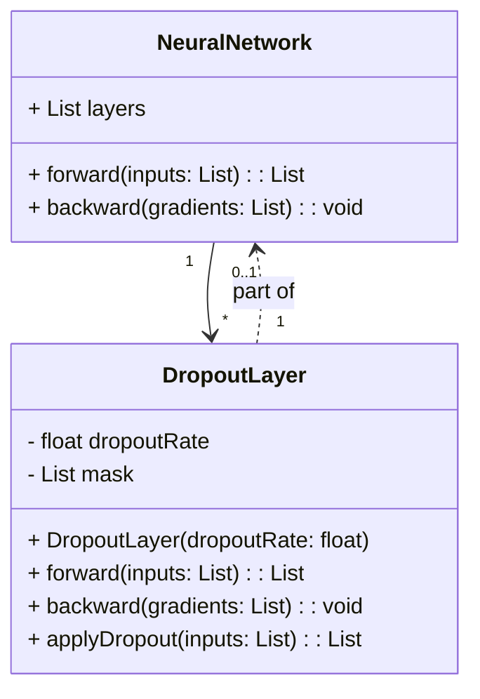
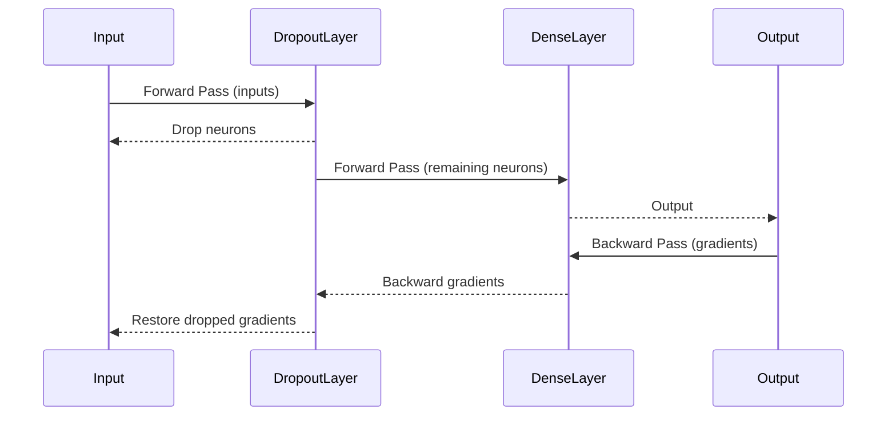

## Overview

Dropout is a popular regularization technique used in neural networks to reduce overfitting. During the training phase, Dropout randomly ignores (or drops out) a subset of neurons, preventing them from participating in both the forward and backward propagation steps. This simple yet effective approach helps improve the generalization performance of the model by mitigating the risk of overfitting.

## UML Class Diagram

Below is a UML Class Diagram for Dropout implementation in a neural network:



## Sequence Diagram

Here's a sequence diagram illustrating the forward and backward pass in a neural network with Dropout:



## Detailed Explanation

### Benefits
1. **Reduces Overfitting:** By ignoring random neurons during training, the network is forced to learn more robust features that generalize well on unseen data.
2. **Increases Network Robustness:** Dropout can act as an ensemble method where multiple subnetworks (with different dropped neurons) are trained simultaneously, improving overall performance.
3. **Simplifies Network Training:** It prevents the network from becoming overly reliant on certain neurons, thus distributing the learning more evenly.

### Trade-offs
1. **Increased Training Time:** Training with Dropout can be slower due to the stochastic nature of the method and the need for multiple subnetwork evaluations.
2. **Optimization Challenges:** Finding the optimal dropout rate can be tricky and may require extensive hyperparameter tuning.
3. **Inference Complexity:** While training time increases, inference time may remain unaffected since Dropout is typically only applied during training.

## Example Implementations

### Python (TensorFlow)
```python
import tensorflow as tf

model = tf.keras.Sequential([
    tf.keras.layers.Dense(128, activation='relu'),
    tf.keras.layers.Dropout(0.5),
    tf.keras.layers.Dense(10, activation='softmax')
])

model.compile(optimizer='adam', loss='sparse_categorical_crossentropy', metrics=['accuracy'])
```

### Java (DL4J)
```java
import org.deeplearning4j.nn.conf.MultiLayerConfiguration;
import org.deeplearning4j.nn.conf.layers.DenseLayer;
import org.deeplearning4j.nn.conf.layers.OutputLayer;
import org.deeplearning4j.nn.conf.layers.Dropout;
import org.deeplearning4j.nn.conf.NeuralNetConfiguration;
import org.deeplearning4j.optimize.api.IterationListener;

MultiLayerConfiguration conf = new NeuralNetConfiguration.Builder()
    .list()
    .layer(0, new DenseLayer.Builder().nIn(784).nOut(128).activation(Activation.RELU)
        .dropOut(0.5)
        .build())
    .layer(1, new OutputLayer.Builder(LossFunctions.LossFunction.NEGATIVELOGLIKELIHOOD)
        .nIn(128).nOut(10).activation(Activation.SOFTMAX)
        .build())
    .build();
```

### Scala (Spark MLlib)
```scala
import org.apache.spark.ml.classification.MultilayerPerceptronClassifier
import org.apache.spark.sql.SparkSession

val spark = SparkSession.builder.appName("DropoutExample").getOrCreate()

val layers = Array[Int](4, 5, 4, 3)

val trainer = new MultilayerPerceptronClassifier()
  .setLayers(layers)
  .setBlockSize(128)
  .setSeed(1234L)
  .setMaxIter(100)

val model = trainer.fit(trainingData)
```

### Clojure (DeepLearning4j)
```clojure
(ns dropout-example
  (:require [org.deeplearning4j.nn.conf MultiLayerConfiguration NeuralNetConfiguration DenseLayer OutputLayer])
  (:import [org.deeplearning4j.nn.conf.layers DenseLayer Dropout OutputLayer]))

(def config (doto (NeuralNetConfiguration$Builder.)
               (.list)
               (.layer 0 (doto (DenseLayer$Builder.)
                            (.nIn 784) (.nOut 128) (.activation "relu") (.dropOut 0.5)
                            (.build)))
               (.layer 1 (doto (OutputLayer$Builder. "negative-loglikelihood")
                            (.nIn 128) (.nOut 10) (.activation "softmax")
                            (.build)))
               (.build)))
```

## Use Cases
- **Image Classification:** Dropout is commonly used in CNNs to reduce overfitting, especially in tasks with limited labeled data.
- **Natural Language Processing:** Helps improve generalization in models dealing with sequential data like RNNs or transformers.
- **Speech Recognition:** Utilized in deep learning models to prevent overfitting on speech datasets.

## Related Design Patterns
- **Batch Normalization:** Often used in conjunction with Dropout for stable and fast training.
- **Early Stopping:** Another regularization technique that halts training when performance on a validation set starts to degrade.
- **Data Augmentation:** Often used in tandem with Dropout to increase the effective size of the training dataset.

## Resources and References
1. [Dropout: A Simple Way to Prevent Neural Networks from Overfitting](https://jmlr.org/papers/volume15/srivastava14a.old/srivastava14a.pdf) - Research paper by Srivastava et al.
2. [TensorFlow Dropout Documentation](https://www.tensorflow.org/api_docs/python/tf/keras/layers/Dropout)
3. [DL4J Dropout Documentation](https://deeplearning4j.org/api/latest/org/deeplearning4j/nn/conf/layers/Dropout.html)

## Open Source Frameworks
- **TensorFlow:** Comprehensive framework for machine learning.
- **PyTorch:** Popular deep learning framework known for flexibility.
- **DL4J (DeepLearning4j):** Java library for neural networks.
- **Spark MLlib:** Apache Spark's scalable machine learning library.

## Final Summary
Dropout is a highly effective regularization method that helps reduce overfitting in neural networks by randomly ignoring neurons during training. This technique has numerous benefits, including enhanced generalization and increased robustness of the model, though it also presents challenges such as increased training time and optimization difficulties. With implementations in multiple languages and across several frameworks, Dropout remains a cornerstone technique in the modern machine learning toolbox.

Exploring and combining Dropout with other design patterns and regularization techniques can lead to robust, high-performing models that generalize well to new data.
