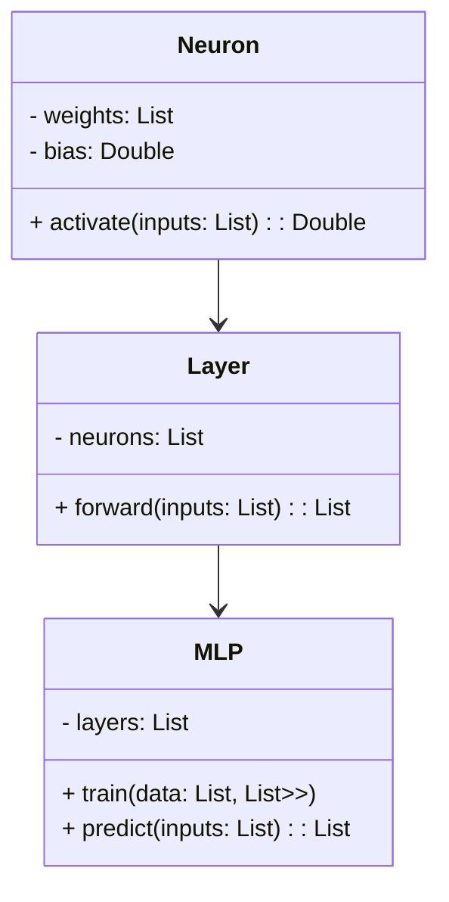
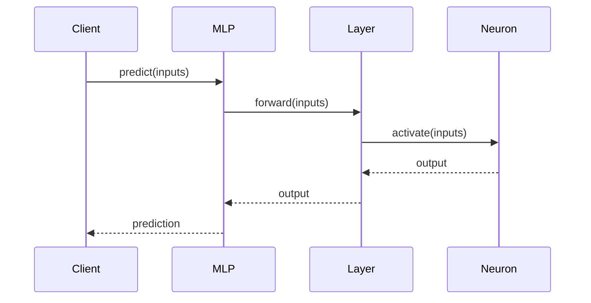

A Multi-layer Perceptron (MLP) consists of multiple layers of perceptrons and is ideal for handling general nonlinear datasets. This design pattern in neural networks is one of the foundational architectures in deep learning and is widely used for tasks involving classification, regression, and even some forms of clustering.

## UML Class Diagram



## UML Sequence Diagram



## Detailed Description

An MLP is a feedforward artificial neural network that maps sets of input data onto appropriate outputs. It consists of an input layer, one or more hidden layers, and an output layer. Each node (neuron) in one layer connects with a certain weight to every node in the following layer. Here's a deeper dive into its components:

- **Neuron:** A computational unit that processes inputs via a weighted sum and an activation function.
- **Layer:** A collection of neurons; multiple layers can capture more complex features.
- **MLP:** A sequence of layers forming the neural network.

## Benefits

- **Flexibility:** Can model complex relationships through layers and activation functions.
- **Scalability:** Works well with both small and large datasets.
- **Versatility:** Suitable for a variety of tasks such as classification, regression, and more.

## Trade-offs

- **Computational Cost:** More layers and neurons increase computational requirements.
- **Overfitting:** Risk of overfitting if the network is too complex.
- **Training Time:** Can be slow to train, particularly for deep networks.

## Examples

### Python Example using Keras

```python
from keras.models import Sequential
from keras.layers import Dense

model = Sequential()
model.add(Dense(64, input_dim=8, activation='relu'))
model.add(Dense(64, activation='relu'))
model.add(Dense(1, activation='sigmoid'))

model.compile(loss='binary_crossentropy', optimizer='adam', metrics=['accuracy'])

model.fit(X_train, y_train, epochs=150, batch_size=10)
```

### Java Example using DL4J

```java
import org.deeplearning4j.nn.multilayer.MultiLayerNetwork;
import org.deeplearning4j.nn.conf.MultiLayerConfiguration;
import org.deeplearning4j.nn.conf.NeuralNetConfiguration;
import org.deeplearning4j.nn.conf.layers.DenseLayer;
import org.deeplearning4j.nn.conf.layers.OutputLayer;
import org.nd4j.linalg.activations.Activation;
import org.nd4j.linalg.lossfunctions.LossFunctions;

MultiLayerConfiguration conf = new NeuralNetConfiguration.Builder()
    .list()
    .layer(new DenseLayer.Builder().nIn(8).nOut(64)
        .activation(Activation.RELU).build())
    .layer(new DenseLayer.Builder().nIn(64).nOut(64)
        .activation(Activation.RELU).build())
    .layer(new OutputLayer.Builder(LossFunctions.LossFunction.XENT)
        .activation(Activation.SIGMOID)
        .nIn(64).nOut(1).build())
    .build();

MultiLayerNetwork model = new MultiLayerNetwork(conf);
model.init();
model.fit(trainData);
```

### Scala Example using Breeze

```scala
import breeze.linalg._
import breeze.numerics._

class MLP(layers: List[Layer]) {
  def predict(inputs: DenseVector[Double]): DenseVector[Double] = {
    layers.foldLeft(inputs)((inp, layer) => layer.forward(inp))
  }
}

class Layer(neurons: List[Neuron]) {
  def forward(inputs: DenseVector[Double]): DenseVector[Double] = {
    DenseVector(neurons.map(_.activate(inputs)).toArray)
  }
}

class Neuron(weights: DenseVector[Double], bias: Double) {
  def activate(inputs: DenseVector[Double]): Double = {
    sigmoid(weights.t * inputs + bias)
  }
}

def sigmoid(x: Double): Double = 1 / (1 + exp(-x))
```

### Clojure Example using Cortex

```clojure
(require '[cortex.nn.layers :as layers])
(require '[cortex.nn.networks :as networks])

(defn create-mlp []
  (-> (layers/linear {:n-inputs 8 :n-units 64 :activation :relu})
      (layers/linear {:n-units 64 :activation :relu})
      (layers/linear {:n-units 1 :activation :sigmoid})))

(def model (create-mlp))

;; Training and prediction logic can be added here
```

## Use Cases

- **Image Recognition:** MLPs can classify images into different categories.
- **Financial Forecasting:** Predicting stock prices and financial indicators.
- **Speech Recognition:** Converting audio input into textual data.

## Related Design Patterns

- **Convolutional Neural Networks (CNN):** Specialized neural networks for processing grid-like data such as images.
- **Recurrent Neural Networks (RNN):** Networks with loops for handling sequential data.

## Resources and References

- [Keras Documentation](https://keras.io/)
- [DL4J Documentation](https://deeplearning4j.org/)
- [Breeze Documentation](http://scalanlp.org/)
- [Cortex Documentation](https://github.com/thinktopic/cortex)

## Summary

The Multi-layer Perceptron (MLP) is a versatile and powerful neural network architecture ideal for general nonlinear datasets. By stacking multiple layers of neurons, MLPs can model complex relationships in the data. Understanding the benefits and trade-offs, along with practical implementation examples in various languages, can help in effectively utilizing MLPs for various machine learning tasks.
