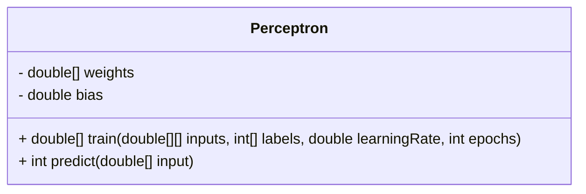
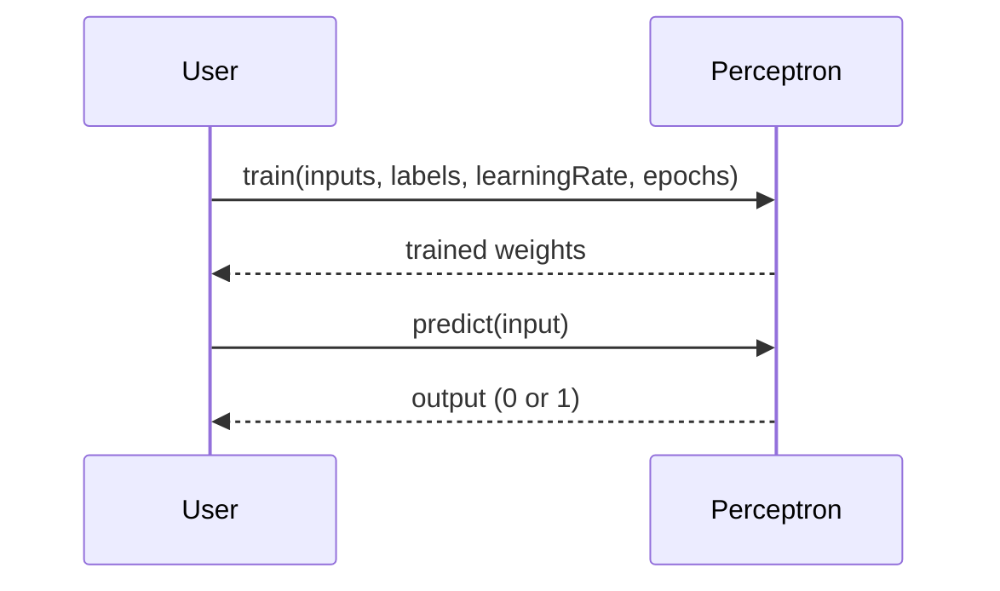

## Introduction to Perceptron

The Perceptron is the simplest neural network architecture consisting of a single layer. Developed in the late 1950s, the Perceptron is a type of linear classifier and is mainly used for binary classification problems. This article explores the Perceptron in depth, covering its architecture, advantages, trade-offs, implementation in multiple programming languages, and various use cases.

## Detailed Description

The Perceptron model is one of the foundational blocks in neural network and machine learning paradigms. It takes a set of input features, applies weights to these features, sums them up, and passes the result through an activation function (typically a step function for binary classification).

### Perceptron Equation

The Perceptron algorithm can be described by the following equation:


y = \begin{cases} 
      1 & \text{if } \sum_{i=1}^n w_i x_i + b \geq 0 \\
      0 & \text{otherwise}
   \end{cases}


Where:
- \\( w_i \\) are the weights
- \\( x_i \\) are the input features
- \\( b \\) is the bias
- \\( y \\) is the output

### UML Class Diagram



### UML Sequence Diagram



## Advantages and Trade-offs

### Benefits

- **Simplicity:** Easy to understand and implement.
- **Efficiency:** Fast training for small datasets.
- **Foundation:** Serves as a building block for more complex neural networks.

### Trade-offs

- **Linearity:** Can only solve linearly separable problems.
- **Scalability:** Not suitable for large, complex datasets.
- **Feature Engineering:** Requires manual feature engineering.

## Implementation Examples

### Python

```python
import numpy as np

class Perceptron:
    def __init__(self, input_dim):
        self.weights = np.zeros(input_dim)
        self.bias = 0

    def predict(self, x):
        linear_output = np.dot(x, self.weights) + self.bias
        return 1 if linear_output >= 0 else 0

    def train(self, inputs, labels, learning_rate, epochs):
        for _ in range(epochs):
            for x, label in zip(inputs, labels):
                prediction = self.predict(x)
                update = learning_rate * (label - prediction)
                self.weights += update * x
                self.bias += update
        return self.weights, self.bias

perceptron = Perceptron(input_dim=2)
inputs = np.array([[2, 3], [1, 1], [2, 1], [0, 2]])
labels = np.array([1, 0, 1, 0])
perceptron.train(inputs, labels, learning_rate=0.1, epochs=10)
print(perceptron.predict([1, 2]))  # Output: 0 or 1
```

### Java

```java
public class Perceptron {
    private double[] weights;
    private double bias;

    public Perceptron(int inputDim) {
        weights = new double[inputDim];
        bias = 0;
    }

    public int predict(double[] x) {
        double linearOutput = 0;
        for (int i = 0; i < x.length; i++) {
            linearOutput += weights[i] * x[i];
        }
        linearOutput += bias;
        return linearOutput >= 0 ? 1 : 0;
    }

    public void train(double[][] inputs, int[] labels, double learningRate, int epochs) {
        for (int i = 0; i < epochs; i++) {
            for (int j = 0; j < inputs.length; j++) {
                double[] x = inputs[j];
                int label = labels[j];
                int prediction = predict(x);
                double update = learningRate * (label - prediction);
                for (int k = 0; k < x.length; k++) {
                    weights[k] += update * x[k];
                }
                bias += update;
            }
        }
    }

    // Usage
    public static void main(String[] args) {
        Perceptron perceptron = new Perceptron(2);
        double[][] inputs = {{2, 3}, {1, 1}, {2, 1}, {0, 2}};
        int[] labels = {1, 0, 1, 0};
        perceptron.train(inputs, labels, 0.1, 10);
        System.out.println(perceptron.predict(new double[]{1, 2}));  // Output: 0 or 1
    }
}
```

### Scala

```scala
class Perceptron(inputDim: Int) {
  private var weights: Array[Double] = Array.fill(inputDim)(0.0)
  private var bias: Double = 0.0

  def predict(x: Array[Double]): Int = {
    val linearOutput = (weights, x).zipped.map(_ * _).sum + bias
    if (linearOutput >= 0) 1 else 0
  }

  def train(inputs: Array[Array[Double]], labels: Array[Int], learningRate: Double, epochs: Int): Unit = {
    for (_ <- 0 until epochs) {
      for ((x, label) <- inputs zip labels) {
        val prediction = predict(x)
        val update = learningRate * (label - prediction)
        weights = (weights, x).zipped.map(_ + update * _)
        bias += update
      }
    }
  }
}

// Usage
val perceptron = new Perceptron(2)
val inputs = Array(Array(2.0, 3.0), Array(1.0, 1.0), Array(2.0, 1.0), Array(0.0, 2.0))
val labels = Array(1, 0, 1, 0)
perceptron.train(inputs, labels, 0.1, 10)
println(perceptron.predict(Array(1.0, 2.0)))  // Output: 0 or 1
```

### Clojure

```clojure
(ns perceptron.core
  (:require [clojure.core.matrix :as m]))

(defn create-perceptron [input-dim]
  {:weights (m/zero-vector input-dim)
   :bias 0.0})

(defn predict [perceptron x]
  (let [linear-output (+ (m/dot (:weights perceptron) x) (:bias perceptron))]
    (if (>= linear-output 0) 1 0)))

(defn train [perceptron inputs labels learning-rate epochs]
  (dotimes [_ epochs]
    (doseq [[x label] (map vector inputs labels)]
      (let [prediction (predict perceptron x)
            update (* learning-rate (- label prediction))]
        (update-in perceptron [:weights] #(m/add % (m/mul update x)))
        (update-in perceptron [:bias] + update))))
  perceptron)

;; Usage
(def perceptron (create-perceptron 2))
(def inputs [[2 3] [1 1] [2 1] [0 2]])
(def labels [1 0 1 0])
(def trained-perceptron (train perceptron inputs labels 0.1 10))
(println (predict trained-perceptron [1 2]))  ;; Output: 0 or 1
```

## Use Cases

1. **Binary Classification:**
   - Spam detection in emails.
   - Fraud detection in financial transactions.
   - Sentiment analysis (positive/negative classification).

2. **Feature Selection:**
   - Used as a feature selection method to identify the most relevant features for a particular task.

## Related Design Patterns

1. **Multilayer Perceptron (MLP):**
   - Extends the Perceptron by adding one or more hidden layers, capable of solving more complex and non-linear problems.
  
2. **Convolutional Neural Networks (CNN):**
   - Specialized neural network architecture primarily used for image recognition tasks.

3. **Recurrent Neural Networks (RNN):**
   - Neural network architecture designed for sequential data, such as time series or natural language.

## Resources and References

- **Books:**
  - "Neural Networks and Deep Learning" by Michael Nielsen
  - "Deep Learning" by Ian Goodfellow, Yoshua Bengio, and Aaron Courville

- **Research Papers:**
  - Rosenblatt, Frank. "The Perceptron: A Probabilistic Model for Information Storage and Organization in The Brain," Psychological Review, 1958.
  
- **Online Tutorials:**
  - [Coursera - Neural Networks and Deep Learning](https://www.coursera.org/learn/neural-networks-deep-learning)
  - [Stanford CS231n: Convolutional Neural Networks for Visual Recognition](http://cs231n.stanford.edu/)

- **Open-Source Frameworks:**
  - TensorFlow
  - PyTorch
  - Scikit-learn

## Summary

The Perceptron serves as the cornerstone of neural network architectures. Despite its simplicity, it offers critical insights into the functioning and training of neural networks. While it is constrained to solving linearly separable problems, it establishes the groundwork for more advanced neural network models. Whether in academia or industry, understanding the Perceptron is pivotal for anyone venturing into the world of machine learning and artificial intelligence.
