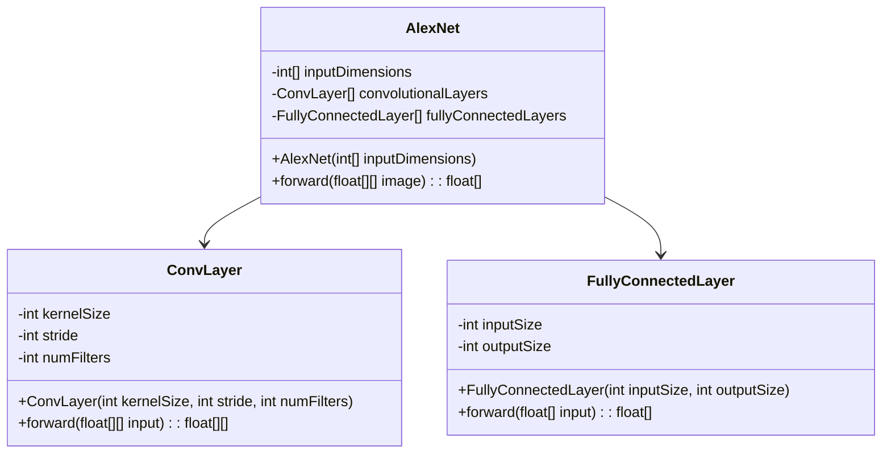
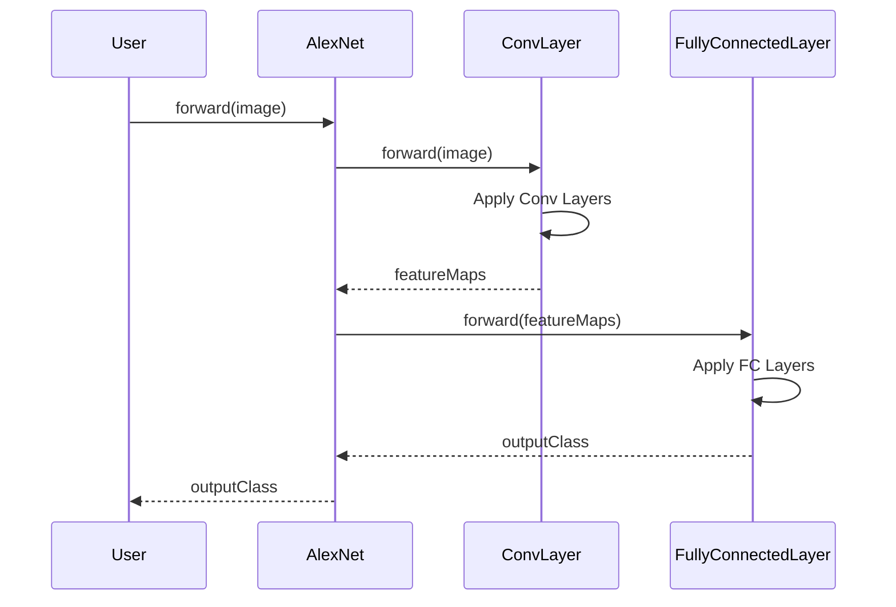

## AlexNet: Deep CNN Architecture for Image Classification

AlexNet is a pioneering deep convolutional neural network (CNN) architecture, designed by Alex Krizhevsky, Ilya Sutskever, and Geoffrey Hinton. It achieved groundbreaking results in the 2012 ImageNet LSVRC-2012 competition, significantly outperforming other methods and setting the stage for the rapid advancement of deep learning.

### Description

AlexNet consists of eight layers: five convolutional layers followed by three fully connected layers. It introduced several key innovations to overcome the limitations of earlier CNN architectures:

- **ReLU Activation Function**: Accelerates training by mitigating vanishing gradient problems.
- **GPU Implementation**: Enables handling of large datasets and complex models efficiently.
- **Dropout Regularization**: Reduces overfitting by randomly dropping units during training.
- **Data Augmentation**: Increases the diversity of the training data without actually collecting new data.

### Use Case

AlexNet is particularly well-suited for large-scale image classification tasks. Its architecture efficiently manages the high dimensionality of image data and is capable of learning complex hierarchical representations.

### UML Class Diagram



### Sequence Diagram



### Python Example

```python
import tensorflow as tf
from tensorflow.keras import layers, models

def AlexNet(input_shape):
    model = models.Sequential()
    model.add(layers.Conv2D(96, (11, 11), strides=(4, 4), activation='relu', input_shape=input_shape))
    model.add(layers.MaxPooling2D((3, 3), strides=(2, 2)))
    model.add(layers.Conv2D(256, (5, 5), activation='relu', padding='same'))
    model.add(layers.MaxPooling2D((3, 3), strides=(2, 2)))
    model.add(layers.Conv2D(384, (3, 3), activation='relu', padding='same'))
    model.add(layers.Conv2D(384, (3, 3), activation='relu', padding='same'))
    model.add(layers.Conv2D(256, (3, 3), activation='relu', padding='same'))
    model.add(layers.MaxPooling2D((3, 3), strides=(2, 2)))
    model.add(layers.Flatten())
    model.add(layers.Dense(4096, activation='relu'))
    model.add(layers.Dropout(0.5))
    model.add(layers.Dense(4096, activation='relu'))
    model.add(layers.Dropout(0.5))
    model.add(layers.Dense(1000, activation='softmax'))
    return model

model = AlexNet((227, 227, 3))
model.summary()
```

### Java Example

```java
import org.deeplearning4j.nn.conf.layers.*;
import org.deeplearning4j.nn.conf.NeuralNetConfiguration;
import org.deeplearning4j.nn.multilayer.MultiLayerNetwork;
import org.nd4j.linalg.learning.config.Adam;

public class AlexNetExample {
    public static void main(String[] args) {
        MultiLayerConfiguration conf = new NeuralNetConfiguration.Builder()
            .updater(new Adam(0.001))
            .list()
            .layer(new ConvolutionLayer.Builder(11, 11)
                .nIn(3)
                .nOut(96)
                .stride(4, 4)
                .activation(Activation.RELU)
                .build())
            .layer(new SubsamplingLayer.Builder(SubsamplingLayer.PoolingType.MAX)
                .kernelSize(3, 3)
                .stride(2, 2)
                .build())
            .layer(new ConvolutionLayer.Builder(5, 5)
                .nOut(256)
                .activation(Activation.RELU)
                .build())
            .layer(new SubsamplingLayer.Builder(SubsamplingLayer.PoolingType.MAX)
                .kernelSize(3, 3)
                .stride(2, 2)
                .build())
            .layer(new ConvolutionLayer.Builder(3, 3)
                .nOut(384)
                .activation(Activation.RELU)
                .build())
            .layer(new ConvolutionLayer.Builder(3, 3)
                .nOut(384)
                .activation(Activation.RELU)
                .build())
            .layer(new ConvolutionLayer.Builder(3, 3)
                .nOut(256)
                .activation(Activation.RELU)
                .build())
            .layer(new SubsamplingLayer.Builder(SubsamplingLayer.PoolingType.MAX)
                .kernelSize(3, 3)
                .stride(2, 2)
                .build())
            .layer(new DenseLayer.Builder().nOut(4096).activation(Activation.RELU).dropOut(0.5).build())
            .layer(new DenseLayer.Builder().nOut(4096).activation(Activation.RELU).dropOut(0.5).build())
            .layer(new OutputLayer.Builder(LossFunctions.LossFunction.NEGATIVELOGLIKELIHOOD)
                .nOut(1000)
                .activation(Activation.SOFTMAX)
                .build())
            .setInputType(InputType.convolutional(227, 227, 3))
            .build();

        MultiLayerNetwork model = new MultiLayerNetwork(conf);
        model.init();
        System.out.println(model.summary());
    }
}
```

### Scala Example

```scala
import org.deeplearning4j.nn.conf.{NeuralNetConfiguration, MultiLayerConfiguration}
import org.deeplearning4j.nn.conf.layers._
import org.deeplearning4j.nn.multilayer.MultiLayerNetwork
import org.nd4j.linalg.learning.config.Adam

object AlexNetExample {
  def main(args: Array[String]): Unit = {
    val conf: MultiLayerConfiguration = new NeuralNetConfiguration.Builder()
      .updater(new Adam(0.001))
      .list()
      .layer(new ConvolutionLayer.Builder(11, 11)
        .nIn(3)
        .nOut(96)
        .stride(4, 4)
        .activation(Activation.RELU)
        .build())
      .layer(new SubsamplingLayer.Builder(SubsamplingLayer.PoolingType.MAX)
        .kernelSize(3, 3)
        .stride(2, 2)
        .build())
      .layer(new ConvolutionLayer.Builder(5, 5)
        .nOut(256)
        .activation(Activation.RELU)
        .build())
      .layer(new SubsamplingLayer.Builder(SubsamplingLayer.PoolingType.MAX)
        .kernelSize(3, 3)
        .stride(2, 2)
        .build())
      .layer(new ConvolutionLayer.Builder(3, 3)
        .nOut(384)
        .activation(Activation.RELU)
        .build())
      .layer(new ConvolutionLayer.Builder(3, 3)
        .nOut(384)
        .activation(Activation.RELU)
        .build())
      .layer(new ConvolutionLayer.Builder(3, 3)
        .nOut(256)
        .activation(Activation.RELU)
        .build())
      .layer(new SubsamplingLayer.Builder(SubsamplingLayer.PoolingType.MAX)
        .kernelSize(3, 3)
        .stride(2, 2)
        .build())
      .layer(new DenseLayer.Builder().nOut(4096).activation(Activation.RELU).dropOut(0.5).build())
      .layer(new DenseLayer.Builder().nOut(4096).activation(Activation.RELU).dropOut(0.5).build())
      .layer(new OutputLayer.Builder(LossFunctions.LossFunction.NEGATIVELOGLIKELIHOOD)
        .nOut(1000)
        .activation(Activation.SOFTMAX)
        .build())
      .setInputType(InputType.convolutional(227, 227, 3))
      .build()

    val model: MultiLayerNetwork = new MultiLayerNetwork(conf)
    model.init()
    println(model.summary())
  }
}
```

### Clojure Example

```clojure
(require '[dl4clj.nn.api.model :as nn-model])
(require '[dl4clj.nn.api.conf :as nn-conf])
(require '[dl4clj.nn.conf.layers :as layers])

(def model-config
  (nn-conf/new-seq
    (nn-conf/seq->map
      :list (list
              (layers/conv-layer :n-in 3 :n-out 96 :kernel-size [11 11] :stride [4 4] :activation "relu")
              (layers/subsampling-layer :pooling-type "max" :kernel-size [3 3] :stride [2 2])
              (layers/conv-layer :n-out 256 :kernel-size [5 5] :activation "relu")
              (layers/subsampling-layer :pooling-type "max" :kernel-size [3 3] :stride [2 2])
              (layers/conv-layer :n-out 384 :kernel-size [3 3] :activation "relu")
              (layers/conv-layer :n-out 384 :kernel-size [3 3] :activation "relu")
              (layers/conv-layer :n-out 256 :kernel-size [3 3] :activation "relu")
              (layers/subsampling-layer :pooling-type "max" :kernel-size [3 3] :stride [2 2])
              (layers/dense-layer :n-out 4096 :activation "relu" :dropout 0.5)
              (layers/dense-layer :n-out 4096 :activation "relu" :dropout 0.5)
              (layers/output-layer :n-out 1000 :activation "softmax" :loss-function "negativeloglikelihood")))
    :updater "adam"
    :learning-rate 0.001
    :input-type (nn-conf/new-input-type :convolutional 227 227 3)))

(def alexnet-model (nn-model/init-new-model model-config))

(println (nn-model/summary alexnet-model))
```

### Benefits

- **Performance**: Significantly improved performance on large-scale image classification tasks.
- **Scalability**: Easily scalable using GPUs for training large datasets.
- **Regularization**: Dropout reduces overfitting, improving generalization.
- **Versatility**: Can be adapted for various image-related tasks beyond classification.

### Trade-offs

- **Resource Intensive**: Requires substantial computational resources and memory.
- **Training Time**: Training deep models like AlexNet can be time-consuming.
- **Complexity**: The architecture is relatively complex and may be harder to implement compared to simpler models.

### Use Cases

- **ImageNet Classification**: Winning the 2012 competition and setting new benchmarks.
- **Medical Imaging**: Detecting diseases and anomalies in medical scans.
- **Autonomous Vehicles**: Real-time object detection and classification.

### Related Design Patterns

- **ResNet**: Improves on deep architectures by introducing residual connections to address vanishing gradients.
- **VGGNet**: Similar to AlexNet but with smaller filters and deeper architectures.
- **Inception (GoogLeNet)**: Uses parallel convolutions to capture multi-scale features.

### Resources and References

- [AlexNet Original Paper](https://www.cs.toronto.edu/~fritz/absps/imagenet.pdf)
- [Deep Learning for Computer Vision - PyImageSearch](https://www.pyimagesearch.com/)
- [Stanford CS231n: Convolutional Neural Networks for Visual Recognition](http://cs231n.stanford.edu/)
- [Deeplearning4j: Java Libraries for Deep Learning](https://deeplearning4j.org/)
- [TensorFlow: An Open Source Machine Learning Framework](https://www.tensorflow.org/)

### Open Source Frameworks

- **TensorFlow**: Offers high-level APIs to build and train CNNs like AlexNet.
- **Keras**: Simplifies the construction and training of deep learning models with a user-friendly API.
- **Deeplearning4j**: Java-based framework designed for integrating deep learning models into enterprise applications.
- **Caffe**: Specialized in fast, efficient, and scalable training of deep learning models.

### Summary

AlexNet was a transformative design pattern in the realm of neural networks, demonstrating the immense potential of deep learning for image classification tasks. Despite being resource-intensive, its benefits in performance and scalability make it an enduring choice for many image-related tasks. By understanding and implementing AlexNet, one can leverage its powerful architecture for large-scale image classification challenges.


