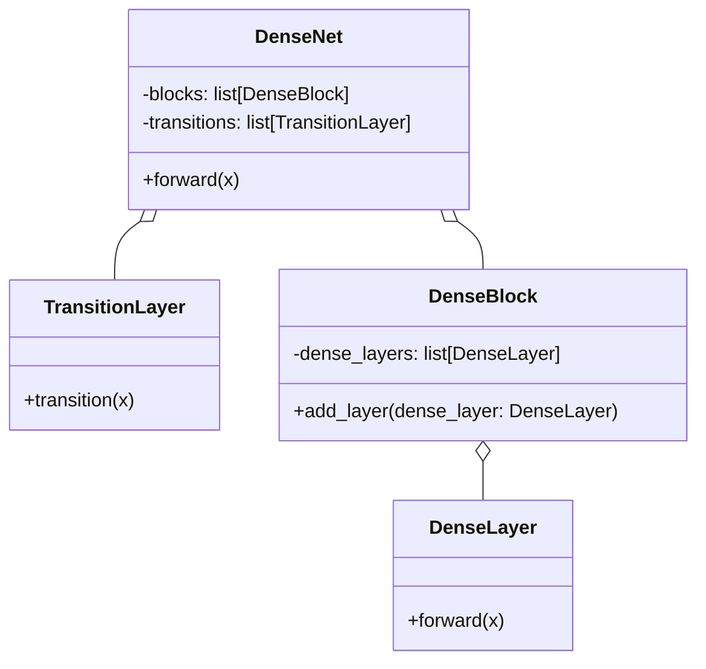
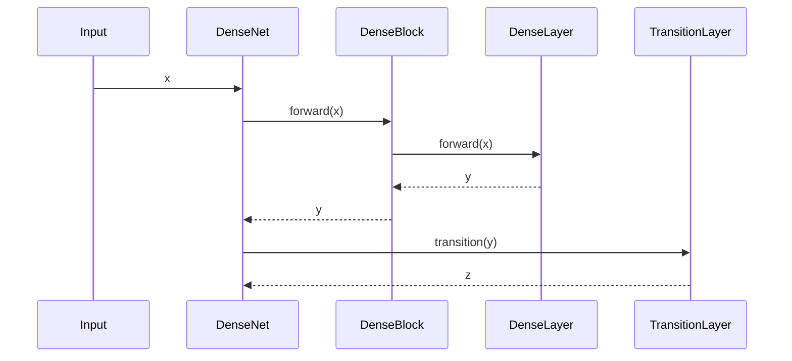

## Introduction to DenseNet

DenseNet, short for Densely Connected Convolutional Networks, introduces an innovative design where each layer is directly connected to every other subsequent layer. This ensures a more efficient flow of information and gradients throughout the network, thereby mitigating vanishing gradient issues and enabling the development of deeper networks.

## Benefits of DenseNet

1. **Improved Information Flow:** Each layer receives collective knowledge from all preceding layers.
2. **Efficiency in Parameter Usage:** Reduced number of parameters compared to traditional Convolutional Neural Networks (CNNs).
3. **Mitigation of Vanishing Gradient Problem:** Enhanced gradient propagation ensures more stable and faster training.
4. **Implicit Deep Supervision:** Ensures the deep network layers are well supervised throughout the training phase.

## Trade-offs of DenseNet

1. **Computational Overhead:** Increased number of connections can lead to higher memory and computational requirements.
2. **Implementation Complexity:** The network's architecture can be more complex to implement and manage.

## Use Cases

1. **Image Classification:** DenseNet has demonstrated state-of-the-art performance on various image classification benchmarks.
2. **Object Detection:** Enhances feature reuse in object detection frameworks.
3. **Medical Imaging:** Widely used in medical imaging tasks for improved accuracy.

## UML Class Diagram



## UML Sequence Diagram



## Examples in Various Programming Languages

### Python
```python
import torch
import torch.nn as nn

class DenseLayer(nn.Module):
    def __init__(self, in_channels, growth_rate):
        super(DenseLayer, self).__init__()
        self.conv = nn.Conv2d(in_channels, growth_rate, kernel_size=3, padding=1)

    def forward(self, x):
        return torch.cat([x, self.conv(x)], 1)

class DenseBlock(nn.Module):
    def __init__(self, num_layers, in_channels, growth_rate):
        super(DenseBlock, self).__init__()
        self.layers = nn.ModuleList()
        for i in range(num_layers):
            self.layers.append(DenseLayer(in_channels + i * growth_rate, growth_rate))

    def forward(self, x):
        for layer in self.layers:
            x = layer(x)
        return x

class DenseNet(nn.Module):
    def __init__(self, block_config, growth_rate, num_classes):
        super(DenseNet, self).__init__()
        self.blocks = nn.ModuleList()
        self.transitions = nn.ModuleList()
        num_channels = 2 * growth_rate
        self.initial_conv = nn.Conv2d(3, num_channels, kernel_size=3, padding=1)
        
        for num_layers in block_config:
            block = DenseBlock(num_layers, num_channels, growth_rate)
            self.blocks.append(block)
            num_channels += num_layers * growth_rate
            trans = nn.Conv2d(num_channels, num_channels // 2, kernel_size=1)
            self.transitions.append(trans)
            num_channels = num_channels // 2

        self.final_fc = nn.Linear(num_channels, num_classes)

    def forward(self, x):
        x = self.initial_conv(x)
        for i, block in enumerate(self.blocks):
            x = block(x)
            x = self.transitions[i](x)
        x = nn.functional.adaptive_avg_pool2d(x, (1, 1)).view(x.size(0), -1)
        x = self.final_fc(x)
        return x

model = DenseNet(block_config=[6, 12, 24, 16], growth_rate=12, num_classes=10)
```

### Java
```java
// Assuming usage of a deep learning library like DL4J (Deeplearning4j)

import org.deeplearning4j.nn.api.Layer;
import org.deeplearning4j.nn.conf.layers.*;
import org.deeplearning4j.nn.conf.*;
import org.deeplearning4j.nn.multilayer.MultiLayerNetwork;
import org.nd4j.linalg.factory.Nd4j;

public class DenseNet {

    public static void main(String[] args) {
        int[] blockConfig = {6, 12, 24, 16};
        int growthRate = 12;
        int numClasses = 10;
        
        NeuralNetConfiguration.ListBuilder listBuilder = new NeuralNetConfiguration.Builder()
            .updater(new Adam())
            .list();

        int inputChannels = 3;
        int numChannels = 2 * growthRate;

        listBuilder.layer(new ConvolutionLayer.Builder(3, 3)
            .nIn(inputChannels)
            .nOut(numChannels)
            .build());

        for (int i = 0; i < blockConfig.length; i++) {
            for (int j = 0; j < blockConfig[i]; j++) {
                listBuilder.layer(new ConvolutionLayer.Builder(3, 3)
                    .nOut(growthRate)
                    .build());
            }
            numChannels += blockConfig[i] * growthRate;
            listBuilder.layer(new ConvolutionLayer.Builder(1, 1)
                .nOut(numChannels / 2)
                .build());
            numChannels /= 2;
        }

        listBuilder.layer(new OutputLayer.Builder()
            .nOut(numClasses)
            .activation(Activation.SOFTMAX)
            .build());

        MultiLayerConfiguration conf = listBuilder.build();
        MultiLayerNetwork model = new MultiLayerNetwork(conf);
        model.init();
        
        // Dummy forward pass
        model.output(Nd4j.rand(new int[]{1, 3, 32, 32}));
    }
}
```

### Scala
```scala
import org.deeplearning4j.nn.conf._
import org.deeplearning4j.nn.conf.layers._
import org.deeplearning4j.nn.multilayer.MultiLayerNetwork
import org.nd4j.linalg.factory.Nd4j

object DenseNet extends App {
  val blockConfig = Array(6, 12, 24, 16)
  val growthRate = 12
  val numClasses = 10

  val listBuilder = new NeuralNetConfiguration.Builder()
    .updater(new Adam())
    .list()

  var inputChannels = 3
  var numChannels = 2 * growthRate

  listBuilder.layer(0, new ConvolutionLayer.Builder(3, 3)
    .nIn(inputChannels)
    .nOut(numChannels)
    .build())

  for (i <- blockConfig.indices) {
    for (j <- 0 until blockConfig(i)) {
      listBuilder.layer(new ConvolutionLayer.Builder(3, 3)
        .nOut(growthRate)
        .build())
    }
    numChannels += blockConfig(i) * growthRate
    listBuilder.layer(new ConvolutionLayer.Builder(1, 1)
      .nOut(numChannels / 2)
      .build())
    numChannels /= 2
  }

  listBuilder.layer(new OutputLayer.Builder()
    .nOut(numClasses)
    .activation(Activation.SOFTMAX)
    .build())

  val conf = listBuilder.build()
  val model = new MultiLayerNetwork(conf)
  model.init()

  // Dummy forward pass
  model.output(Nd4j.rand(1, 3, 32, 32))
}
```

### Clojure
```clojure
; Assuming usage of a deep learning library like DL4J (Deeplearning4j)

(ns densenet.core
  (:import [org.deeplearning4j.nn.conf NeuralNetConfiguration]
           [org.deeplearning4j.nn.conf.layers ConvolutionLayer OutputLayer]
           [org.deeplearning4j.nn.multilayer MultiLayerNetwork]
           [org.nd4j.linalg.factory Nd4j]))

(defn build-densenet []
  (let [block-config [6 12 24 16]
        growth-rate 12
        num-classes 10
        list-builder (-> (NeuralNetConfiguration$Builder.)
                         (.updater (org.deeplearning4j.nn.conf.Updater/Adam))
                         (.list))
        input-channels 3
        num-channels (* 2 growth-rate)
        list-builder (doto list-builder
                       (.layer 0 (-> (ConvolutionLayer$Builder. 3 3)
                                     (.nIn input-channels)
                                     (.nOut num-channels)
                                     (.build))))]
    (doseq [i (range (count block-config))]
      (doseq [j (range (get block-config i))]
        (.layer list-builder (ConvolutionLayer$Builder. 3 3) (.nOut growth-rate) (.build)))
      (let [num-channels (+ num-channels (* (get block-config i) growth-rate))]
        (.layer list-builder (ConvolutionLayer$Builder. 1 1) (.nOut (/ num-channels 2)) (.build))
        (set! num-channels (/ num-channels 2))))
    (.layer list-builder (OutputLayer$Builder.)
                           (.nOut num-classes)
                           (.activation (org.nd4j.linalg.activations.Activation/SOFTMAX))
                           (.build))
    (let [conf (.build list-builder)]
      (doto (MultiLayerNetwork. conf)
        (.init)
        (.output (Nd4j/rand 1 3 32 32))))))

; Example usage:
(def model (build-densenet))
```

## Related Design Patterns

1. **ResNet:** Residual Networks add shortcuts to jump over some layers, promoting the flow of gradients and allowing the construction of deeper networks.
2. **Inception:** Inception Modules allow for parallel paths with different sizes of filters, optimizing computational efficiency.

## Open Source Frameworks

1. **PyTorch:** Comprehensive support for DenseNet through custom implementations.
2. **TensorFlow:** Implementations available in Keras and TensorFlow Model Zoo.
3. **DL4J (Deeplearning4j):** Robust support for DenseNet architecture in Java and Scala.

## Resources and References

1. **[DenseNet Paper (arXiv)](https://arxiv.org/abs/1608.06993)**: The original paper introducing DenseNet.
2. **[PyTorch DenseNet Documentation](https://pytorch.org/hub/pytorch_vision_densenet/)**: Official PyTorch implementations and tutorials.
3. **[Keras Applications](https://keras.io/api/applications/densenet/)**: DenseNet models available in Keras.

## Summary

DenseNet, with its dense connections, offers an advanced architecture that significantly improves information flow and gradient propagation in deep networks. While computational overhead can be a concern, the benefits in terms of efficiency and effectiveness in deep learning tasks make DenseNet a valuable design pattern. Whether in image classification or other complex tasks, DenseNet provides a robust solution backed by comprehensive open-source support and resources.
