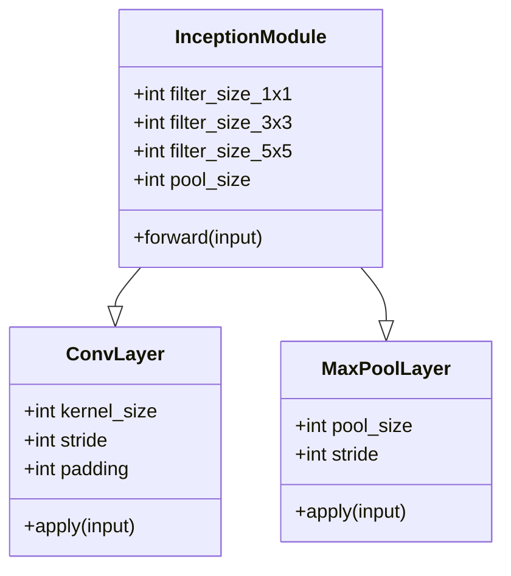
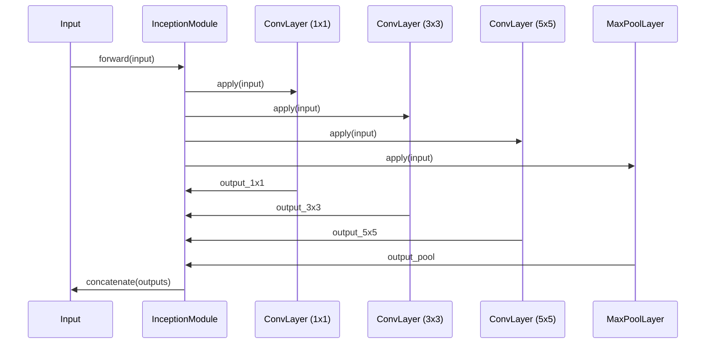

The Inception Network, introduced by Szegedy et al. in the "Going Deeper with Convolutions" paper, is a groundbreaking approach in the field of Convolutional Neural Networks (CNNs). This architecture leverages parallel convolutions with different filter sizes to improve the efficiency and performance of image classification tasks.


## Introduction

The Inception Network is designed to address the limitations of standard CNN architectures by enabling the model to extract multi-scale features effectively. By using multiple parallel convolutions with different filter sizes, the Inception Network captures various levels of detail, which enhances its capability to classify images accurately.

## Detailed Description

The core idea of the Inception architecture is to perform convolutions with different kernel sizes (e.g., 1x1, 3x3, 5x5) in parallel and concatenate the results. This method allows the network to learn various spatial features at different scales, making it more robust and efficient.

### Architecture

- **1x1 Convolutions**: Used for dimensionality reduction before applying larger filters, thus reducing computational cost.
- **3x3 and 5x5 Convolutions**: Capture detailed spatial features.
- **Max Pooling**: Preserves the salient information while reducing dimensions.

## UML Diagrams

### Class Diagram



### Sequence Diagram



## Examples

### Python

```python
import tensorflow as tf
from tensorflow.keras.layers import Conv2D, MaxPooling2D, concatenate

class InceptionModule(tf.keras.layers.Layer):
    def __init__(self, filter_size_1x1, filter_size_3x3, filter_size_5x5, pool_size):
        super(InceptionModule, self).__init__()
        self.conv1x1 = Conv2D(filters=filter_size_1x1, kernel_size=1)
        self.conv3x3 = Conv2D(filters=filter_size_3x3, kernel_size=3, padding='same')
        self.conv5x5 = Conv2D(filters=filter_size_5x5, kernel_size=5, padding='same')
        self.max_pool = MaxPooling2D(pool_size=pool_size, strides=(1, 1), padding='same')

    def call(self, inputs):
        conv1x1 = self.conv1x1(inputs)
        conv3x3 = self.conv3x3(inputs)
        conv5x5 = self.conv5x5(inputs)
        max_pool = self.max_pool(inputs)
        return concatenate([conv1x1, conv3x3, conv5x5, max_pool], axis=-1)
```

### Java

```java
import org.deeplearning4j.nn.conf.NeuralNetConfiguration;
import org.deeplearning4j.nn.conf.layers.ConvolutionLayer;
import org.deeplearning4j.nn.conf.layers.SubsamplingLayer;
import org.deeplearning4j.nn.conf.graph.MergeVertex;
import org.deeplearning4j.nn.conf.layers.Layer;
import org.deeplearning4j.nn.conf.inputs.InputType;

public class InceptionModule extends NeuralNetConfiguration.ListBuilder {
    public InceptionModule(int[] filterSizes, int poolSize) {
        addLayer("1x1", new ConvolutionLayer.Builder(1, 1).nIn(1).nOut(filterSizes[0]).build());
        addLayer("3x3", new ConvolutionLayer.Builder(3, 3).nIn(1).nOut(filterSizes[1]).build());
        addLayer("5x5", new ConvolutionLayer.Builder(5, 5).nIn(1).nOut(filterSizes[2]).build());
        addLayer("maxpool", new SubsamplingLayer.Builder(poolSize, poolSize).build());
        addVertex("merge", new MergeVertex(), "1x1", "3x3", "5x5", "maxpool");
    }
}
```

### Scala

```scala
import org.apache.spark.ml.linalg._
import org.apache.spark.ml.PipelineStage
import org.apache.spark.ml.feature._

class InceptionModule(
  filterSize1x1: Int,
  filterSize3x3: Int,
  filterSize5x5: Int,
  poolSize: Int
) extends PipelineStage {

  override def transform(dataset: Dataset[_]): DataFrame = {
    // Define transformations for each convolutional path
    val conv1x1 = new ConvolutionLayer().setKernelSize(Array(1, 1)).setNumFilters(filterSize1x1)
    val conv3x3 = new ConvolutionLayer().setKernelSize(Array(3, 3)).setNumFilters(filterSize3x3)
    val conv5x5 = new ConvolutionLayer().setKernelSize(Array(5, 5)).setNumFilters(filterSize5x5)
    val maxPool = new MaxPoolingLayer().setPoolSize(Array(poolSize, poolSize))

    // Apply transformations and merge the results
    val conv1x1DF = conv1x1.transform(dataset)
    val conv3x3DF = conv3x3.transform(dataset)
    val conv5x5DF = conv5x5.transform(dataset)
    val maxPoolDF = maxPool.transform(dataset)

    conv1x1DF.union(conv3x3DF).union(conv5x5DF).union(maxPoolDF)
  }
}
```

### Clojure

```clojure
(ns inception.module
  (:require [deeplearning4j.nn.conf.layers :refer [ConvolutionLayer SubsamplingLayer]]
            [deeplearning4j.nn.conf.inputs :refer [InputType]]
            [deeplearning4j.nn.conf :refer [NeuralNetConfiguration]]))

(defn inception-module
  [filter-size-1x1 filter-size-3x3 filter-size-5x5 pool-size]
  (let [conv1x1 (ConvolutionLayer$Builder. 1 1)
        conv3x3 (ConvolutionLayer$Builder. 3 3)
        conv5x5 (ConvolutionLayer$Builder. 5 5)
        max-pool (SubsamplingLayer$Builder. pool-size pool-size)]
    (.build (.layer (NeuralNetConfiguration$ListBuilder.)
                    conv1x1 conv3x3 conv5x5 max-pool))))
```

## Benefits and Trade-offs

### Benefits

- **Efficient Multi-scale Feature Extraction**: By capturing features at multiple scales, the Inception Network can better handle various object sizes within images.
- **Reduced Computational Cost**: Using 1x1 convolutions before larger convolutions reduces the dimensionality and computation cost.
- **Improved Performance**: The architecture has been shown to improve classification accuracy on various benchmarks.

### Trade-offs

- **Complexity**: The architecture is more complex compared to traditional CNNs, making it harder to design and debug.
- **Resource Intensive**: Despite being efficient, it still requires significant computational resources for training and inference.

## Use Cases

- **Image Classification**: Enhancing the accuracy and efficiency of classifying objects in images.
- **Object Detection**: Used in combination with other networks for detecting objects within images.
- **Image Segmentation**: Assisting in segmenting various regions in an image for detailed analysis.

## Related Design Patterns

- **ResNet (Residual Network)**: Uses skip connections to solve the vanishing gradient problem.
- **VGGNet**: Employs very deep networks with small filters for image classification.

## Resources and References

- **Paper**: [Going Deeper with Convolutions](https://arxiv.org/abs/1409.4842)
- **TensorFlow**: [Inception Network Implementation](https://www.tensorflow.org/api_docs/python/tf/keras/applications/InceptionV3)
- **PyTorch**: [Inception Module Example](https://pytorch.org/hub/pytorch_vision_inception_v3/)
- **Deeplearning4j**: [Inception Module Documentation](https://deeplearning4j.org/)

## Conclusion

The Inception Network is a powerful architectural pattern in deep learning that leverages parallel convolutions with different filter sizes to effectively capture multi-scale features in images. Its innovative design provides a balance between performance and computational efficiency, making it a valuable tool for various computer vision tasks.

---

This article provides a comprehensive overview of the Inception Network design pattern, its benefits, trade-offs, and practical implementations in multiple programming languages. For further exploration, refer to the linked resources and references.
