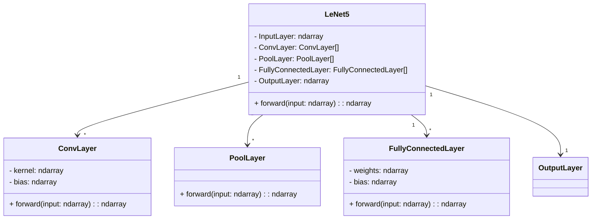
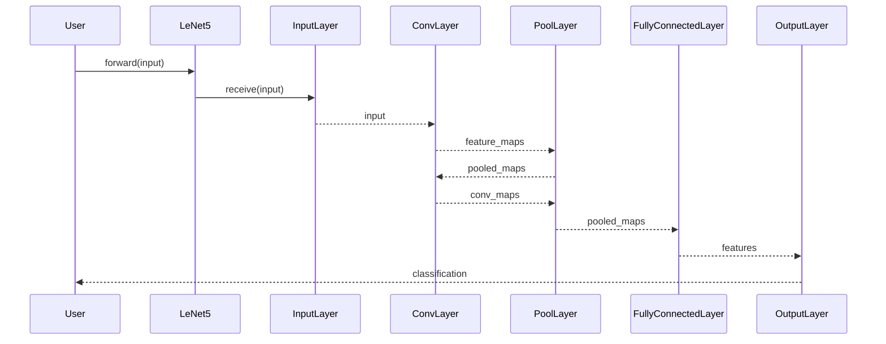

LeNet-5, introduced by Yann LeCun and his colleagues in 1998, is a seminal convolutional neural network (CNN) architecture primarily used for handwritten digit recognition. This article explores its design, applications, benefits, and trade-offs, alongside providing examples and diagrams.

## Overview

### What is LeNet-5?

LeNet-5 is one of the earliest CNN architectures that helped establish the feasibility of deep learning in image processing. It consists of multiple layers, including convolutional layers, subsampling (pooling) layers, and fully connected layers.

### Use Case

LeNet-5 was specifically designed for recognizing handwritten digits, such as those in the MNIST dataset, but its architecture has influenced many modern CNNs used in various computer vision tasks.

## LeNet-5 Architecture

### Layers and Components

LeNet-5 comprises seven layers, excluding the input layer, each with learnable parameters:

1. **Input Layer**: 32x32 grayscale image.
2. **C1 Convolutional Layer**: 6 feature maps of size 28x28 with 5x5 kernels.
3. **S2 Subsampling Layer (Pooling)**: 6 feature maps of size 14x14 with 2x2 kernels.
4. **C3 Convolutional Layer**: 16 feature maps of size 10x10 with 5x5 kernels.
5. **S4 Subsampling Layer (Pooling)**: 16 feature maps of size 5x5 with 2x2 kernels.
6. **C5 Convolutional Layer**: Fully connected with 120 units.
7. **F6 Fully Connected Layer**: Fully connected with 84 units.
8. **Output Layer**: 10 output units for classification.

### UML Class Diagram



### Sequence Diagram



## Implementation Examples

### Python Example

```python
import tensorflow as tf
from tensorflow.keras import layers, models

def create_lenet5():
    model = models.Sequential()
    model.add(layers.Conv2D(6, kernel_size=(5, 5), activation='tanh', input_shape=(32, 32, 1)))
    model.add(layers.AveragePooling2D())
    model.add(layers.Conv2D(16, kernel_size=(5, 5), activation='tanh'))
    model.add(layers.AveragePooling2D())
    model.add(layers.Flatten())
    model.add(layers.Dense(120, activation='tanh'))
    model.add(layers.Dense(84, activation='tanh'))
    model.add(layers.Dense(10, activation='softmax'))
    
    return model

model = create_lenet5()
model.summary()
```

### Java Example

```java
import org.deeplearning4j.nn.api.OptimizationAlgorithm;
import org.deeplearning4j.nn.conf.NeuralNetConfiguration;
import org.deeplearning4j.nn.conf.layers.ConvolutionLayer;
import org.deeplearning4j.nn.conf.layers.DenseLayer;
import org.deeplearning4j.nn.conf.layers.OutputLayer;
import org.deeplearning4j.nn.conf.layers.SubsamplingLayer;
import org.deeplearning4j.nn.multilayer.MultiLayerNetwork;
import org.deeplearning4j.nn.weights.WeightInit;
import org.nd4j.linalg.activations.Activation;
import org.nd4j.linalg.dataset.api.iterator.DataSetIterator;
import org.nd4j.linalg.lossfunctions.LossFunctions.LossFunction;

public class LeNet5Example {

    public static void main(String[] args) {
        MultiLayerNetwork model = new MultiLayerNetwork(new NeuralNetConfiguration.Builder()
            .optimizationAlgo(OptimizationAlgorithm.STOCHASTIC_GRADIENT_DESCENT)
            .weightInit(WeightInit.XAVIER)
            .updater(new Nesterovs(0.006, 0.9))
            .list()
            .layer(0, new ConvolutionLayer.Builder(5, 5)
                .nIn(1)
                .stride(1, 1)
                .nOut(6)
                .activation(Activation.IDENTITY)
                .build())
            .layer(1, new SubsamplingLayer.Builder(SubsamplingLayer.PoolingType.AVG)
                .kernelSize(2, 2)
                .stride(2, 2)
                .build())
            .layer(2, new ConvolutionLayer.Builder(5, 5)
                .stride(1, 1)
                .nOut(16)
                .activation(Activation.IDENTITY)
                .build())
            .layer(3, new SubsamplingLayer.Builder(SubsamplingLayer.PoolingType.AVG)
                .kernelSize(2, 2)
                .stride(2, 2)
                .build())
            .layer(4, new DenseLayer.Builder().nOut(120).activation(Activation.TANH).build())
            .layer(5, new DenseLayer.Builder().nOut(84).activation(Activation.TANH).build())
            .layer(6, new OutputLayer.Builder(LossFunction.NEGATIVELOGLIKELIHOOD)
                .activation(Activation.SOFTMAX)
                .nOut(10)
                .build())
            .backprop(true).pretrain(false).build());

        model.init();
        DataSetIterator mnistTrain = ...; // Provide the data iterator here
        model.fit(mnistTrain);
    }
}
```

## Benefits and Trade-offs

### Benefits

- **Proven Effectiveness**: Effective for digit recognition and inspired modern CNN architectures.
- **Layered Architecture**: Encourages modular design with distinct functionalities.
- **Parameter Efficiency**: Efficient parameter utilization through shared weights.

### Trade-offs

- **Compute Intensity**: High computational requirement for training.
- **Limited Flexibility**: May not generalize well to tasks vastly different from digit recognition.
- **Memory Usage**: Can consume significant memory depending on input size and depth.

## Use Cases

- **Handwritten Digit Recognition**: Widely used for recognizing handwritten digits in postal code, bank cheque processing.
- **Other Image Processing Tasks**: Basis for more advanced CNN architectures used in various image classification and object detection tasks.

## Related Design Patterns

- **AlexNet**: More complex CNN architecture for large-scale image classification.
- **VGGNet**: Deep CNN with smaller convolutional filters.
- **ResNet**: Introduces residual connections to allow training of very deep networks.

## Resources and References

- **Original Paper**: [Gradient-Based Learning Applied to Document Recognition](http://yann.lecun.com/exdb/publis/pdf/lecun-98.pdf)
- **Frameworks**: TensorFlow, PyTorch, Keras, Deeplearning4j
- **Online Courses**: Coursera, edX, Udacity

## Summary

LeNet-5 remains a foundational CNN architecture in the field of deep learning, particularly for handwritten digit recognition. Its simple yet powerful design serves as a stepping stone for understanding more advanced CNN architectures. Despite some trade-offs, LeNet-5 continues to be relevant in both educational contexts and foundational research in machine learning.

By leveraging various software design patterns, LeNet-5 showcases the impact of modular, efficient, and effective neural network design.
