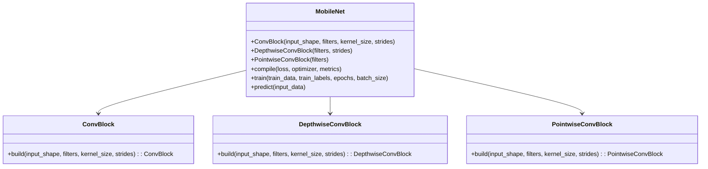
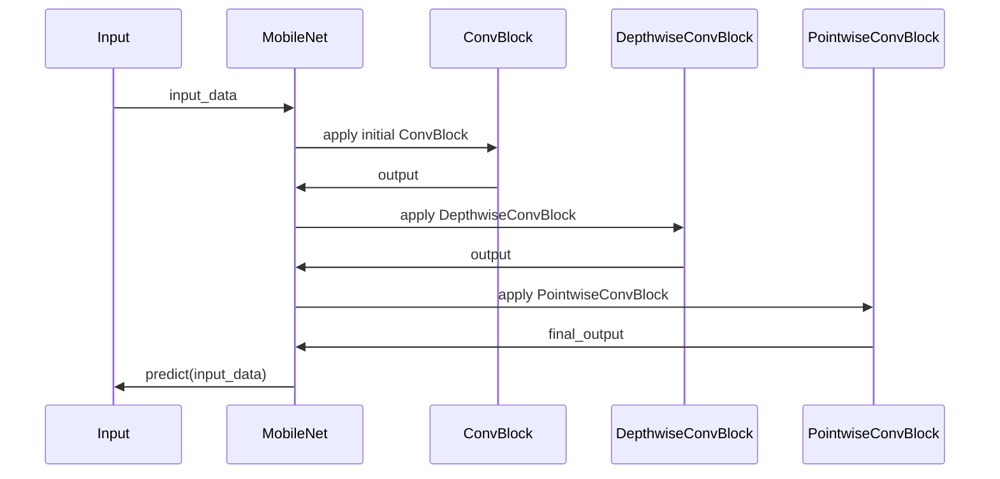

MobileNet is an optimized convolutional neural network (CNN) designed to execute efficient image analysis on mobile and embedded devices. Its architecture employs depthwise separable convolutions to reduce the computational load, enabling real-time performance even on hardware with limited resources.

## Key Concepts

MobileNet is fundamentally built around the idea of depthwise separable convolutions. This concept breaks down a standard convolution into a depthwise convolution and a pointwise convolution, significantly reducing the computation and the number of parameters required.

## UML Class Diagram

To better understand the architecture, we can represent MobileNet using a UML Class Diagram:



## UML Sequence Diagram

A sequence diagram to illustrate how MobileNet processes an image input through various convolution blocks:



## Python Implementation Example

```python
import tensorflow as tf
from tensorflow.keras import layers, models

def depthwise_separable_conv_block(x, filters, strides):
    x = layers.DepthwiseConv2D(kernel_size=3, strides=strides, padding='same')(x)
    x = layers.BatchNormalization()(x)
    x = layers.ReLU()(x)
    x = layers.Conv2D(filters, kernel_size=1, padding='same')(x)
    x = layers.BatchNormalization()(x)
    x = layers.ReLU()(x)
    return x

def MobileNet(input_shape=(224, 224, 3), num_classes=1000):
    input_layer = layers.Input(shape=input_shape)
    x = depthwise_separable_conv_block(input_layer, 32, strides=2)
    x = depthwise_separable_conv_block(x, 64, strides=1)
    x = layers.GlobalAveragePooling2D()(x)
    output_layer = layers.Dense(num_classes, activation='softmax')(x)

    model = models.Model(inputs=input_layer, outputs=output_layer)
    return model

model = MobileNet()
model.compile(optimizer='adam', loss='categorical_crossentropy', metrics=['accuracy'])
```

## Java Implementation Example

```java
// Java implementation typically uses a high-level framework like Deeplearning4j

import org.deeplearning4j.nn.conf.layers.ConvolutionLayer;
import org.deeplearning4j.nn.conf.layers.SubsamplingLayer;
import org.deeplearning4j.nn.conf.layers.DenseLayer;
import org.deeplearning4j.nn.conf.layers.OutputLayer;
import org.deeplearning4j.nn.conf.NeuralNetConfiguration;
import org.deeplearning4j.nn.multilayer.MultiLayerNetwork;
import org.nd4j.linalg.activations.Activation;
import org.nd4j.linalg.lossfunctions.LossFunctions;

public class MobileNet {
    public static void main(String[] args) {
        int inputHeight = 224;
        int inputWidth = 224;
        int numChannels = 3;
        int numClasses = 1000;

        MultiLayerConfiguration conf = new NeuralNetConfiguration.Builder()
            .list()
            .layer(new ConvolutionLayer.Builder(3, 3)
                .nIn(numChannels)
                .stride(2, 2)
                .nOut(32)
                .activation(Activation.RELU)
                .build())
            .layer(new ConvolutionLayer.Builder(3, 3)
                .stride(1, 1)
                .depthWise(64)
                .activation(Activation.RELU)
                .build())
            .layer(new DenseLayer.Builder().nOut(1000).activation(Activation.SOFTMAX).build())
            .layer(new OutputLayer.Builder(LossFunctions.LossFunction.NEGATIVELOGLIKELIHOOD)
                .activation(Activation.SOFTMAX).nOut(numClasses).build())
            .build();
        
        MultiLayerNetwork model = new MultiLayerNetwork(conf);
        model.init();
    }
}
```

## Benefits and Trade-offs

### Benefits
- **Efficiency:** By utilizing depthwise separable convolutions, MobileNet achieves significant reductions in computational cost and model size.
- **Real-time Performance:** Suitable for real-time image analysis tasks on mobile and embedded devices.
- **Flexibility:** Can be adjusted using width and resolution multipliers to strike a balance between accuracy and latency.

### Trade-offs
- **Accuracy:** MobileNet's efficiency may come at the cost of reduced accuracy compared to larger, more complex models.
- **Resource Dependency:** Performance heavily depends on the specific hardware capabilities of the mobile or embedded device.

## Use Cases
- **Mobile Image Classification:** Efficiently classify images directly on mobile devices without the need for cloud-based computation.
- **Object Detection:** Deploy in real-time object detection applications like security surveillance or augmented reality.
- **Face Recognition:** Implement face recognition systems on smartphones for authentication purposes.

## Related Design Patterns

### SqueezeNet
- **Description:** Another lightweight CNN architecture that achieves AlexNet-level accuracy with fewer parameters.
- **Use Case:** Designed for mobile and embedded devices with stringent memory and computational constraints.

### ShuffleNet
- **Description:** Utilizes group convolution and channel shuffle operations to reduce computation and improve efficiency.
- **Use Case:** Suitable for mobile vision applications requiring efficient inference with lower latency.

## Resources and References
- **MobileNet V1:** Howard et al., "MobileNets: Efficient Convolutional Neural Networks for Mobile Vision Applications" (2017). [ArXiv](https://arxiv.org/abs/1704.04861)
- **TensorFlow Implementation:** [TensorFlow MobileNet](https://www.tensorflow.org/api_docs/python/tf/keras/applications/MobileNet)
- **Deeplearning4j Documentation:** [Deeplearning4j](https://deeplearning4j.konduit.ai/)

## Open Source Frameworks
- **TensorFlow:** TensorFlow provides comprehensive support for MobileNet, including pre-trained models.
- **PyTorch:** PyTorch has implementations and pre-trained models of MobileNet available through `torchvision`.
- **Deeplearning4j:** A Java-based deep learning library that supports MobileNet architectures for deployment on JVM-based systems.

## Summary

MobileNet is a specialized design pattern in neural network architectures tailored for mobile and embedded vision applications. Its use of depthwise separable convolutions makes it highly efficient, balancing accuracy with reduced computational requirements. While it may not achieve the same accuracy as more complex models, its benefits for real-time image analysis on resource-constrained devices are substantial. Whether for mobile image classification, object detection, or face recognition, MobileNet stands out as a practical solution for deploying neural networks in mobile environments.


