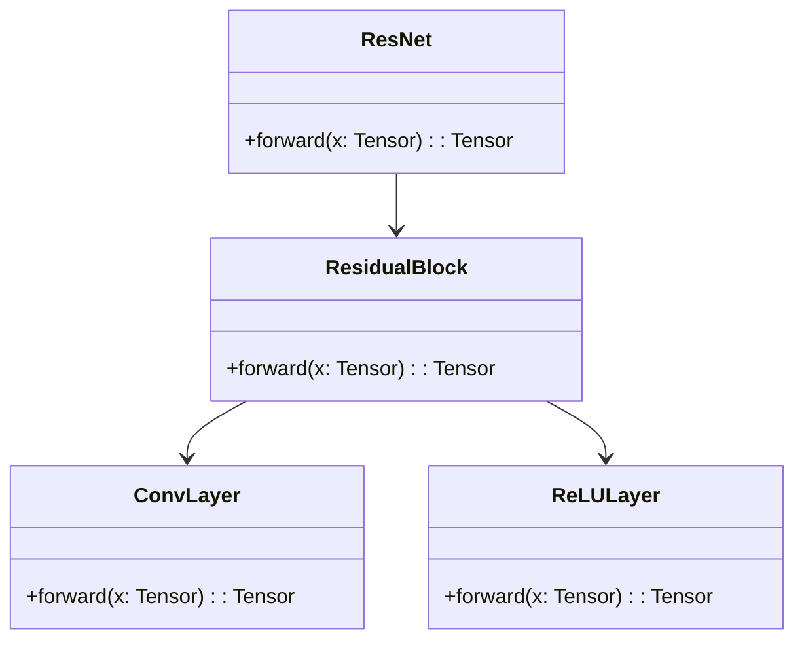
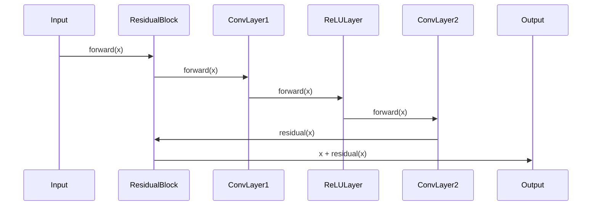

Residual Networks (ResNet) revolutionized the training of very deep neural networks by addressing the degradation problem, where the accuracy gets saturated and then degrades rapidly. This is achieved using a novel approach called *residual learning*.

## Introduction to ResNet

ResNet, short for Residual Network, was introduced by Kaiming He et al. in their 2015 paper ["Deep Residual Learning for Image Recognition"](https://arxiv.org/abs/1512.03385). The key innovation of ResNet is the use of *residual blocks* that allow the network to learn residual functions with reference to the layer inputs. This simple yet powerful idea helps in training extremely deep networks, mitigating the degradation problem observed in very deep architectures.

## UML Class Diagram

The UML Class Diagram below represents the high-level architecture of a ResNet.



## UML Sequence Diagram

The UML Sequence Diagram below illustrates the flow of data through a residual block in ResNet.



## Detailed Description

### Residual Learning

The core idea behind residual learning is to bypass the traditional mapping using skip connections. In a residual block, the input \\( \mathbf{x} \\) is added directly to the output after passing through several layers, allowing the network to learn the residual mapping \\( \mathcal{F}(\mathbf{x}) = \mathcal{H}(\mathbf{x}) - \mathbf{x} \\), where \\( \mathcal{H}(\mathbf{x}) \\) is the desired underlying mapping.

### Implementation in Different Languages

#### Python

```python
import torch
import torch.nn as nn

class ResidualBlock(nn.Module):
    def __init__(self, in_channels):
        super(ResidualBlock, self).__init__()
        self.conv1 = nn.Conv2d(in_channels, in_channels, kernel_size=3, padding=1)
        self.relu = nn.ReLU(inplace=True)
        self.conv2 = nn.Conv2d(in_channels, in_channels, kernel_size=3, padding=1)
    
    def forward(self, x):
        residual = x
        out = self.conv1(x)
        out = self.relu(out)
        out = self.conv2(out)
        out += residual
        return out

class ResNet(nn.Module):
    def __init__(self, num_blocks, in_channels):
        super(ResNet, self).__init__()
        self.blocks = nn.ModuleList([ResidualBlock(in_channels) for _ in range(num_blocks)])
    
    def forward(self, x):
        for block in self.blocks:
            x = block(x)
        return x
```

#### Java

```java
public class ResidualBlock {
    private ConvLayer conv1;
    private ConvLayer conv2;
    private ReLULayer relu;

    public ResidualBlock(int inChannels) {
        this.conv1 = new ConvLayer(inChannels, inChannels, 3);
        this.relu = new ReLULayer();
        this.conv2 = new ConvLayer(inChannels, inChannels, 3);
    }

    public Tensor forward(Tensor x) {
        Tensor residual = x;
        Tensor out = conv1.forward(x);
        out = relu.forward(out);
        out = conv2.forward(out);
        out.add(residual);
        return out;
    }
}

public class ResNet {
    private List<ResidualBlock> blocks;

    public ResNet(int numBlocks, int inChannels) {
        blocks = new ArrayList<>();
        for (int i = 0; i < numBlocks; i++) {
            blocks.add(new ResidualBlock(inChannels));
        }
    }

    public Tensor forward(Tensor x) {
        for (ResidualBlock block : blocks) {
            x = block.forward(x);
        }
        return x;
    }
}
```

#### Scala

```scala
import scala.collection.mutable.ArrayBuffer

class ResidualBlock(inChannels: Int) {
  private val conv1 = new ConvLayer(inChannels, inChannels, 3)
  private val relu = new ReLULayer
  private val conv2 = new ConvLayer(inChannels, inChannels, 3)

  def forward(x: Tensor): Tensor = {
    val residual = x
    var out = conv1.forward(x)
    out = relu.forward(out)
    out = conv2.forward(out)
    out.add(residual)
    out
  }
}

class ResNet(numBlocks: Int, inChannels: Int) {
  private val blocks = new ArrayBuffer[ResidualBlock]()

  for (_ <- 0 until numBlocks) {
    blocks += new ResidualBlock(inChannels)
  }

  def forward(x: Tensor): Tensor = {
    var out = x
    for (block <- blocks) {
      out = block.forward(out)
    }
    out
  }
}
```

#### Clojure

```clojure
(defn residual-block [in-channels]
  (let [conv1 (conv-layer in-channels in-channels 3)
        relu  (relu-layer)
        conv2 (conv-layer in-channels in-channels 3)]
    (fn [x]
      (let [residual x
            out      (conv2 (relu (conv1 x)))]
        (add-tensor out residual)))))

(defn resnet [num-blocks in-channels]
  (let [blocks (repeatedly num-blocks #(residual-block in-channels))]
    (fn [x]
      (reduce (fn [out block] (block out)) x blocks))))
```

## Benefits and Trade-offs

### Benefits

1. **Mitigation of the Degradation Problem:** ResNet addresses the problem where deeper networks begin to degrade in performance.
2. **Ease of Training:** Facilitates training of very deep networks.
3. **Improved Accuracy:** Proven to achieve better accuracy on challenging datasets.

### Trade-offs

1. **Complexity:** The introduction of skip connections can increase the architectural complexity.
2. **Computational Overhead:** Increased computational requirements due to additional layers.

## Use Cases

1. **Image Classification:** ResNet has achieved state-of-the-art performance in image classification tasks.
2. **Object Detection:** Enhanced detection accuracy in complex object detection problems.
3. **Semantic Segmentation:** Improves segmentation results in various domains such as medical imaging and autonomous driving.

## Related Design Patterns

- **DenseNet:** Similar to ResNet, DenseNet uses dense connections to encourage feature reuse and reduce parameter redundancy.
- **Inception:** Combines multiple convolutional operations to capture various features.

## Resources and References

- He, K., Zhang, X., Ren, S., & Sun, J. (2015). [Deep Residual Learning for Image Recognition](https://arxiv.org/abs/1512.03385).
- Open Source Frameworks:
  - [TensorFlow](https://www.tensorflow.org/)
  - [PyTorch](https://pytorch.org/)
  - [Keras](https://keras.io/)
  - [Apache MXNet](https://mxnet.apache.org/)

## Summary

ResNet introduces residual learning as a breakthrough approach to train very deep neural networks efficiently, overcoming the degradation problem. By employing residual blocks with skip connections, ResNet allows the network to learn residual mappings, thus facilitating training and improving performance in various complex tasks.

The architecture of ResNet, while complex, brings significant improvements in accuracy and ease of training for deep networks. It has been widely adopted and forms the foundation for various advanced neural network architectures.


