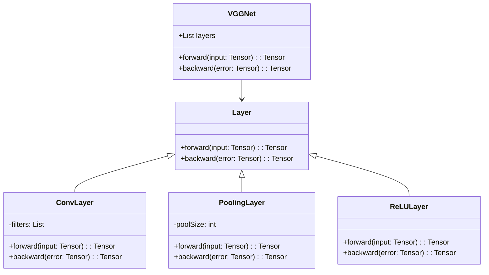
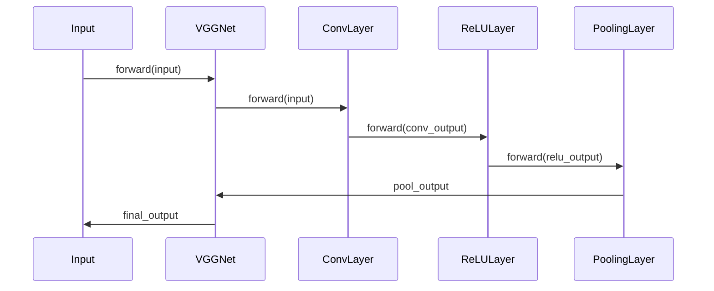

VGGNet is a convolutional neural network architecture introduced by Karen Simonyan and Andrew Zisserman from the University of Oxford in their paper "Very Deep Convolutional Networks for Large-Scale Image Recognition". The architecture uses very small (3x3) convolution filters, which allows it to achieve excellent performance on image classification tasks.

## Key Concepts

### Very Small (3x3) Convolution Filters
VGGNet uses 3x3 convolutional layers stacked on top of each other, with an occasional 1x1 convolutional layer to control the depth of the network. This small filter size allows for capturing fine details and constructing deep networks.

### Deep Architecture
The depth of VGGNet is a key element of its design. The network can have up to 19 weight layers, making it significantly deeper than other architectures like AlexNet.

### Uniform Architecture
VGGNet follows a uniform architecture pattern, simplifying the design and implementation. Each convolutional layer is followed by a ReLU activation, and after every few convolutional layers, a max-pooling layer is applied to reduce the spatial dimensions.

## Benefits

1. **Accuracy**: VGGNet has demonstrated superior performance on several image classification benchmarks, including the ImageNet dataset.
2. **Simplicity**: The use of small filters and a uniform architecture simplifies network design and understanding.
3. **Transfer Learning**: Pre-trained VGGNet models are widely used for transfer learning in various computer vision tasks.

## Trade-offs

1. **Computationally Intensive**: The depth of VGGNet makes it computationally expensive and resource-intensive.
2. **Memory Usage**: Deep networks require a significant amount of memory, making them less suitable for low-resource environments.
3. **Training Time**: The complexity of the network increases training time, requiring powerful GPUs for efficient training.

## UML Class Diagram



## UML Sequence Diagram



## Code Examples

### Python

```python
import torch.nn as nn

class VGGNet(nn.Module):
    def __init__(self):
        super(VGGNet, self).__init__()
        self.conv1 = nn.Conv2d(3, 64, kernel_size=3, padding=1)
        self.relu = nn.ReLU(inplace=True)
        self.pool = nn.MaxPool2d(kernel_size=2, stride=2)

    def forward(self, x):
        x = self.conv1(x)
        x = self.relu(x)
        x = self.pool(x)
        return x
```

### Java

```java
public class VGGNet {
    private ConvLayer conv1;
    private ReLULayer relu;
    private PoolingLayer pool;

    public VGGNet() {
        this.conv1 = new ConvLayer(3, 64, 3);
        this.relu = new ReLULayer();
        this.pool = new PoolingLayer(2, 2);
    }

    public Tensor forward(Tensor input) {
        Tensor x = conv1.forward(input);
        x = relu.forward(x);
        x = pool.forward(x);
        return x;
    }
}
```

### Scala

```scala
class VGGNet {
  val conv1 = new ConvLayer(3, 64, 3)
  val relu = new ReLULayer()
  val pool = new PoolingLayer(2, 2)

  def forward(input: Tensor): Tensor = {
    val x = conv1.forward(input)
    val reluOutput = relu.forward(x)
    pool.forward(reluOutput)
  }
}
```

### Clojure

```clojure
(defn forward [vggnet input]
  (-> input
      ((:conv1 vggnet) :forward)
      ((:relu vggnet) :forward)
      ((:pool vggnet) :forward)))

(def vggnet {:conv1 (ConvLayer. 3 64 3)
             :relu (ReLULayer.)
             :pool (PoolingLayer. 2 2)})
```

## Use Cases

1. **Image Classification**: VGGNet is commonly used for classifying images into various categories.
2. **Object Detection**: Leveraged as a backbone network in object detection frameworks.
3. **Semantic Segmentation**: Forms the basis for many semantic segmentation architectures.

## Related Design Patterns

1. **AlexNet**: Earlier architecture that inspired the VGGNet design but with larger filters.
2. **ResNet**: Successor to VGGNet, introducing residual connections to address the vanishing gradient problem.
3. **Inception**: Introduces parallel convolutions with different filter sizes within the same layer for multi-scale feature extraction.

## Resources and References

1. **Paper**: "Very Deep Convolutional Networks for Large-Scale Image Recognition" by Karen Simonyan and Andrew Zisserman.
2. **TensorFlow Implementation**: [tensorflow/models](https://github.com/tensorflow/models)
3. **PyTorch Implementation**: [pytorch/vision](https://github.com/pytorch/vision)

## Summary

VGGNet is a highly influential convolutional neural network architecture known for its simplicity and effectiveness in image classification tasks. By employing very small (3x3) convolutional filters, it can capture intricate details and build deep networks that perform exceptionally well on large-scale image recognition benchmarks. Despite its computational intensity, VGGNet remains a popular choice for researchers and practitioners in the field of deep learning.
