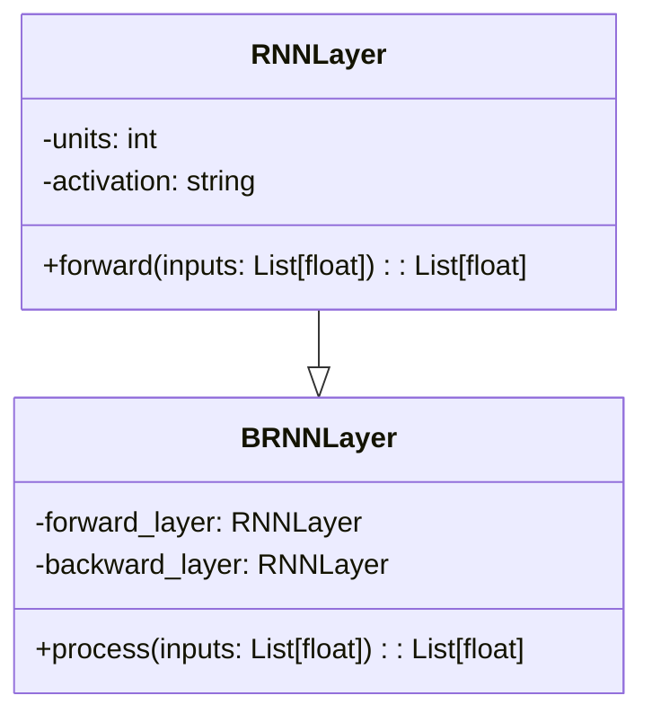
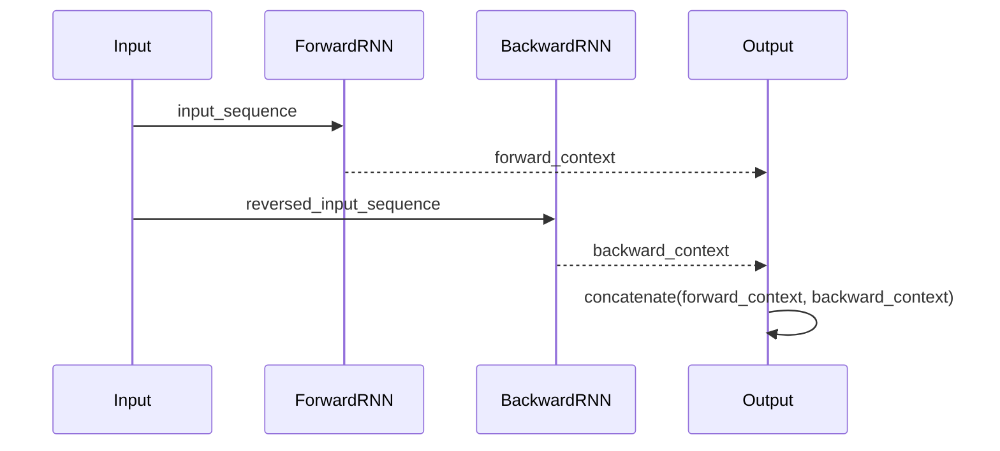

## Bidirectional RNN: Bidirectional Sequence Processing

A Bidirectional Recurrent Neural Network (BRNN) is an extension of the traditional RNN model that processes data in both forward and backward directions, capturing past and future context in sequence data. This makes BRNNs especially useful for tasks where context from both ends of the sequence is crucial, such as Natural Language Processing (NLP).

### Benefits
- **Context Awareness:** Access to both past and future contexts improves performance on tasks where context matters.
- **Improved Accuracy:** Generally results in better accuracy for sequence prediction tasks.
- **Flexibility:** Can be applied to various sequence data types, not just text.

### Trade-Offs
- **Increased Complexity:** Requires more computational resources due to processing in both directions.
- **Longer Training Time:** Takes more time to train compared to unidirectional RNNs.
- **More Memory:** Requires additional memory to store intermediate states.

## UML Class Diagram



## UML Sequence Diagram



## Implementation Examples

### Python (using TensorFlow)
```python
import tensorflow as tf
from tensorflow.keras.layers import Bidirectional, LSTM
from tensorflow.keras.models import Sequential

model = Sequential()
model.add(Bidirectional(LSTM(64, return_sequences=True), input_shape=(timesteps, features)))
model.add(tf.keras.layers.Dense(1, activation='sigmoid'))

model.compile(optimizer='adam', loss='binary_crossentropy', metrics=['accuracy'])
model.summary()
```

### Java (using DL4J)
```java
import org.deeplearning4j.nn.conf.MultiLayerConfiguration;
import org.deeplearning4j.nn.conf.NeuralNetConfiguration;
import org.deeplearning4j.nn.conf.layers.Bidirectional;
import org.deeplearning4j.nn.conf.layers.LSTM;

MultiLayerConfiguration conf = new NeuralNetConfiguration.Builder()
    .list()
    .layer(0, new Bidirectional(new LSTM.Builder()
            .nIn(inputNum)
            .nOut(hiddenLayerSize)
            .activation(Activation.TANH)
            .build()))
    .layer(1, new OutputLayer.Builder(LossFunction.NEGATIVELOGLIKELIHOOD)
            .activation(Activation.SOFTMAX)
            .nIn(hiddenLayerSize)
            .nOut(outputNum)
            .build())
    .build();
```

### Scala (using Breeze)
```scala
import breeze.linalg._
import breeze.numerics._

class BidirectionalRNN(val forwardLayer: RNNLayer, val backwardLayer: RNNLayer) {

  def process(input: DenseMatrix[Double]): DenseMatrix[Double] = {
    val forwardOutput = forwardLayer.forward(input)
    val backwardOutput = backwardLayer.forward(input(::, ::-1))
    DenseMatrix.horzcat(forwardOutput, backwardOutput(::, ::-1))
  }
}
```

### Clojure (using Cortex)
```clojure
(require '[thinktopic.cortex :as cortex])

(defn bidirectional-rnn [input-seq]
  (let [forward-output (cortex/forward-rnn input-seq)
        backward-output (cortex/forward-rnn (reverse input-seq))]
    (concat forward-output (reverse backward-output))))
```

## Use Cases

- **Speech Recognition:** Leveraging the context from future frames to understand speech better.
- **Text Translation:** Translating text by considering the context from the entire sentence.
- **Named Entity Recognition (NER):** Identifying entities in a text with improved accuracy by using the context from surrounding words.

## Related Design Patterns

- **Unidirectional RNN:** Processes sequences in only one direction.
- **LSTM:** A type of RNN that can capture long-term dependencies.
- **GRU:** Another type of RNN with fewer parameters compared to LSTMs.

## Resources and References

- [TensorFlow Bidirectional RNN](https://www.tensorflow.org/guide/keras/rnn#bidirectional_rnns)
- [DL4J Bidirectional RNN](https://deeplearning4j.org/docs/latest/deeplearning4j-nn-architect-bidirectional)
- [Bidirectional RNN Paper](https://arxiv.org/abs/1303.5778)

## Summary

Bidirectional RNNs are powerful for tasks where context from both ends of a sequence matters. While they do come with increased computational costs and complexity, the benefits in terms of accuracy and context-awareness make them invaluable in context-heavy NLP tasks. Consider using BRNNs in applications such as speech recognition, text translation, and named entity recognition to leverage the full context of your sequence data.
