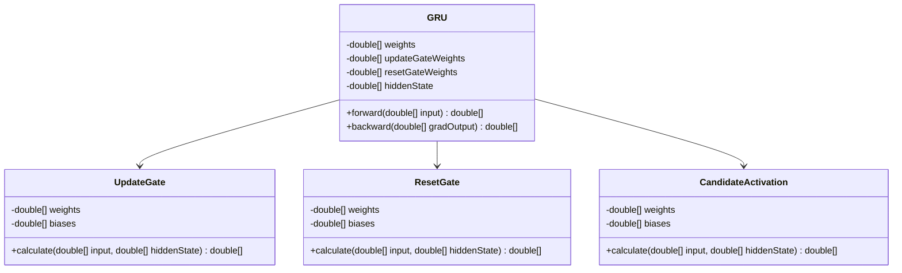
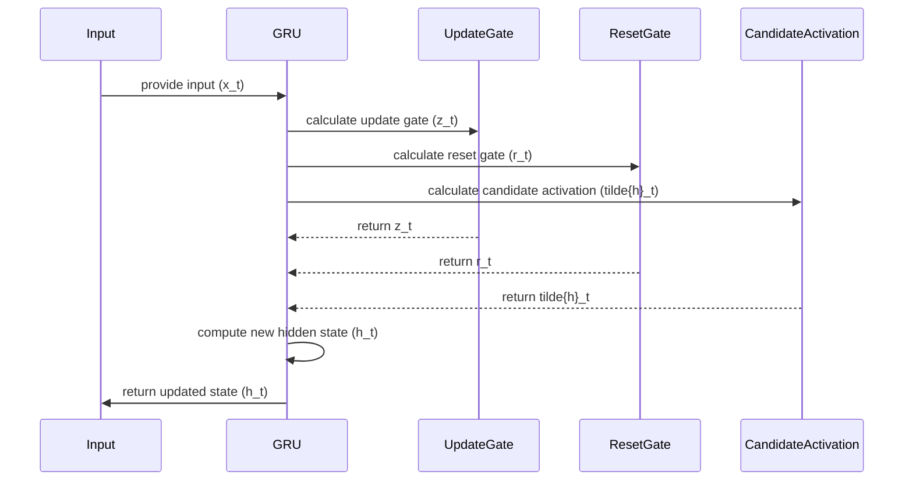

## Introduction

Gated Recurrent Unit (GRU) is a type of Recurrent Neural Network (RNN) that addresses the vanishing gradient problem and offers more efficient memory usage compared to Long Short-Term Memory (LSTM) networks. This makes GRUs a preferred choice in various sequence learning tasks such as natural language processing (NLP) and time-series analysis.

## Detailed Description

GRUs are designed to provide a simplified architecture while retaining the core benefits of LSTM networks. They incorporate gating units to control the flow of information, allowing them to capture long-term dependencies more efficiently.

### Components of GRU

1. **Update Gate (\\( z_t \\))**: Decides how much of the past information needs to be passed along to the future.
2. **Reset Gate (\\( r_t \\))**: Determines how much of the past information to forget.
3. **Candidate Activation (\\( \tilde{h}_t \\))**: Combines the input and reset gate to form a candidate for the new hidden state.

### Mathematical Representation


\begin{aligned}
&z_t = \sigma(W_z \cdot [h_{t-1}, x_t]) \\
&r_t = \sigma(W_r \cdot [h_{t-1}, x_t]) \\
&\tilde{h}_t = \tanh(W \cdot [r_t * h_{t-1}, x_t]) \\
&h_t = (1 - z_t) * h_{t-1} + z_t * \tilde{h}_t
\end{aligned}


where:
- \\( \sigma \\) is the sigmoid activation function.
- \\( \tanh \\) is the hyperbolic tangent activation function.
- \\( [ , ] \\) denotes concatenation.

## UML Class Diagram



## UML Sequence Diagram



## Example Implementations

### Python

```python
import numpy as np

class GRUCell:
    def __init__(self, input_size, hidden_size):
        self.input_size = input_size
        self.hidden_size = hidden_size
        
        self.W_z = np.random.randn(hidden_size, input_size + hidden_size)
        self.W_r = np.random.randn(hidden_size, input_size + hidden_size)
        self.W = np.random.randn(hidden_size, input_size + hidden_size)
        
    def sigmoid(self, x):
        return 1 / (1 + np.exp(-x))
    
    def tanh(self, x):
        return np.tanh(x)
    
    def forward(self, x, h):
        z = self.sigmoid(np.dot(self.W_z, np.concatenate([h, x])))
        r = self.sigmoid(np.dot(self.W_r, np.concatenate([h, x])))
        h_tilde = self.tanh(np.dot(self.W, np.concatenate([r * h, x])))
        h_new = (1 - z) * h + z * h_tilde
        return h_new

input_size = 5
hidden_size = 3
gru = GRUCell(input_size, hidden_size)

x = np.random.randn(input_size)
h = np.zeros(hidden_size)

h_new = gru.forward(x, h)
print(h_new)
```

### Java

```java
import java.util.Arrays;

public class GRUCell {
    private double[] W_z, W_r, W;
    private int hiddenSize;

    public GRUCell(int inputSize, int hiddenSize) {
        this.hiddenSize = hiddenSize;
        this.W_z = new double[hiddenSize * (inputSize + hiddenSize)];
        this.W_r = new double[hiddenSize * (inputSize + hiddenSize)];
        this.W = new double[hiddenSize * (inputSize + hiddenSize)];
    }
    
    private double sigmoid(double x) {
        return 1 / (1 + Math.exp(-x));
    }

    private double tanh(double x) {
        return Math.tanh(x);
    }

    public double[] forward(double[] x, double[] h) {
        double[] z = new double[hiddenSize];
        double[] r = new double[hiddenSize];
        double[] h_tilde = new double[hiddenSize];
        double[] h_new = new double[hiddenSize];

        // Concatenate h and x and compute z, r, h_tilde
        for (int i = 0; i < hiddenSize; i++) {
            double[] hx = concatenate(h, x);
            z[i] = sigmoid(dotProduct(W_z, hx));
            r[i] = sigmoid(dotProduct(W_r, hx));
            h_tilde[i] = tanh(dotProduct(W, elementwiseMultiply(r, h)));
            h_new[i] = (1 - z[i]) * h[i] + z[i] * h_tilde[i];
        }
        
        return h_new;
    }

    private double[] concatenate(double[] a, double[] b) {
        double[] result = new double[a.length + b.length];
        System.arraycopy(a, 0, result, 0, a.length);
        System.arraycopy(b, 0, result, a.length, b.length);
        return result;
    }

    private double dotProduct(double[] a, double[] b) {
        double sum = 0;
        for (int i = 0; i < a.length; i++) {
            sum += a[i] * b[i];
        }
        return sum;
    }

    private double[] elementwiseMultiply(double[] a, double[] b) {
        double[] result = new double[a.length];
        for (int i = 0; i < a.length; i++) {
            result[i] = a[i] * b[i];
        }
        return result;
    }

    public static void main(String[] args) {
        int inputSize = 5;
        int hiddenSize = 3;
        GRUCell gru = new GRUCell(inputSize, hiddenSize);

        double[] x = new double[inputSize];
        Arrays.fill(x, 0.5);
        double[] h = new double[hiddenSize];

        double[] h_new = gru.forward(x, h);
        System.out.println(Arrays.toString(h_new));
    }
}
```

### Scala

```scala
import scala.util.Random

class GRUCell(val inputSize: Int, val hiddenSize: Int) {
  private val W_z = Array.fill(hiddenSize, inputSize + hiddenSize)(Random.nextGaussian())
  private val W_r = Array.fill(hiddenSize, inputSize + hiddenSize)(Random.nextGaussian())
  private val W = Array.fill(hiddenSize, inputSize + hiddenSize)(Random.nextGaussian())

  def sigmoid(x: Double): Double = 1 / (1 + Math.exp(-x))

  def tanh(x: Double): Double = Math.tanh(x)

  def forward(x: Array[Double], h: Array[Double]): Array[Double] = {
    val z = new Array[Double](hiddenSize)
    val r = new Array[Double](hiddenSize)
    val h_tilde = new Array[Double](hiddenSize)
    val h_new = new Array[Double](hiddenSize)
    
    val hx = h ++ x
    for (i <- 0 until hiddenSize) {
      z(i) = sigmoid((W_z(i) zip hx).map { case (w, h) => w * h }.sum)
      r(i) = sigmoid((W_r(i) zip hx).map { case (w, h) => w * h }.sum)
      h_tilde(i) = tanh((W(i) zip (r(i) *: h ++ x)).map { case (w, h) => w * h }.sum)
      h_new(i) = (1 - z(i)) * h(i) + z(i) * h_tilde(i)
    }
    h_new
  }
}

// Example usage
val inputSize = 5
val hiddenSize = 3
val gru = new GRUCell(inputSize, hiddenSize)

val x = Array.fill(inputSize)(Random.nextDouble)
val h = Array.fill(hiddenSize)(0.0)

val h_new = gru.forward(x, h)
println(h_new.mkString(", "))
```

### Clojure

```clojure
(ns gru-example
  (:require [clojure.core.matrix :as m]))

(defn sigmoid [x]
  (/ 1.0 (+ 1.0 (Math/exp (- x)))))

(defn tanh [x]
  (Math/tanh x))

(defn forward [input hidden-state W_z W_r W]
  (let [concatenated (m/concat hidden-state input)
        z (map sigmoid (m/mmul W_z concatenated))
        r (map sigmoid (m/mmul W_r concatenated))
        h-tilde (map tanh (m/mmul W (m/emul r hidden-state)))
        h-new (m/add (m/emul (m/sub 1.0 z) hidden-state) (m/emul z h-tilde))]
    h-new))

;; Example usage
(def input-size 5)
(def hidden-size 3)

(def W_z (m/matrix (repeatedly hidden-size #(repeatedly (+ input-size hidden-size) rand))))
(def W_r (m/matrix (repeatedly hidden-size #(repeatedly (+ input-size hidden-size) rand))))
(def W (m/matrix (repeatedly hidden-size #(repeatedly (+ input-size hidden-size) rand))))

(def input (m/matrix (repeatedly input-size rand)))
(def hidden-state (m/matrix (repeatedly hidden-size (constantly 0))))

(def h-new (forward input hidden-state W_z W_r W))
(println h-new)
```

## Benefits

- **Efficient Memory Usage:** GRUs use fewer parameters, making them less memory-intensive compared to LSTMs.
- **Simplified Architecture:** With fewer gates, GRUs have a less complex structure, leading to faster computation times.
- **Effective for Smaller Datasets:** Performs well even on smaller datasets where LSTMs may overfit.

## Trade-offs

- **Less Expressive Power:** In some cases, GRUs may underperform compared to LSTMs for very complex tasks due to their simplified gating mechanism.
- **Application-Specific Performance:** The effectiveness of GRUs vs. LSTMs can be application-specific, requiring empirical testing to determine the better architecture for a given problem.

## Use Cases

- **Natural Language Processing (NLP):** GRUs are commonly used in language modeling, translation, and text generation tasks.
- **Time-Series Analysis:** GRUs perform well in forecasting, anomaly detection, and other sequential data-related tasks.
- **Speech Recognition:** Used in end-to-end models for processing audio data.

## Related Design Patterns

- **LSTM:** Long Short-Term Memory networks are closely related to GRUs, providing more complex gating mechanisms.
- **Attention Mechanisms:** Often combined with GRUs to provide improved handling of long-term dependencies.
- **Bidirectional RNNs:** GRUs can be used in a bidirectional manner to capture context from both past and future data points.

## Resources and References

- [Original GRU Paper by Cho et al.](https://arxiv.org/abs/1406.1078)
- [OpenAI GRU Documentation](https://openai.com)
- [TensorFlow GRU Documentation](https://www.tensorflow.org/api_docs/python/tf/keras/layers/GRU)
- [PyTorch GRU Documentation](https://pytorch.org/docs/stable/generated/torch.nn.GRU.html)

## Open Source Frameworks

- **TensorFlow:** Includes implementations for GRU cells.
- **PyTorch:** Provides GRU layers with GPU acceleration.
- **Keras:** High-level neural network API running on top of TensorFlow with GRU support.

## Final Summary

The Gated Recurrent Unit (GRU) offers an efficient and powerful alternative to LSTM networks, particularly in situations where memory usage and computation speed are critical. By simplifying the gating mechanisms while maintaining performance, GRUs are a versatile tool in the arsenal of deep learning practitioners. For those looking to implement sequence learning models, GRUs offer a blend of efficiency and effectiveness, making them suitable for a wide range of applications.
