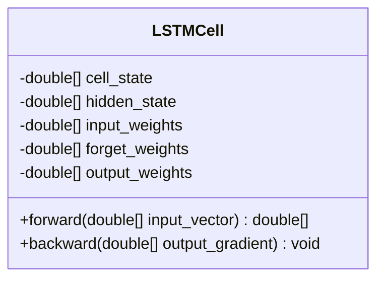
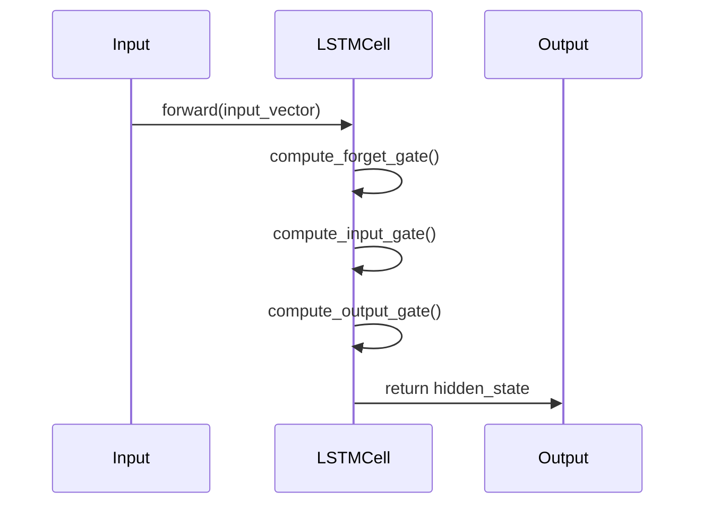

## Introduction

Long Short-Term Memory (LSTM) networks are a type of Recurrent Neural Network (RNN) designed to remember long-term dependencies and solve the vanishing gradient problem, which is prevalent in traditional RNNs. This makes LSTMs particularly useful in various sequence modeling tasks such as natural language processing, time series forecasting, and speech recognition.

## Key Concepts

### The Vanishing Gradient Problem
In traditional RNNs, as the gradient is backpropagated through many layers, it often becomes extremely small, effectively preventing the network from learning long-term dependencies. LSTMs mitigate this issue by utilizing a more complex architecture that includes gates to control the flow of information.

### LSTM Cell Structure

An LSTM cell consists of three main gates:
- **Forget Gate** (\\(f_t\\)): Determines what information to discard from the cell state.
- **Input Gate** (\\(i_t\\)): Decides which new information to add to the cell state.
- **Output Gate** (\\(o_t\\)): Controls what part of the cell state should be output.

Mathematically, these gates can be defined as:


f_t = \sigma(W_f \cdot [h_{t-1}, x_t] + b_f)



i_t = \sigma(W_i \cdot [h_{t-1}, x_t] + b_i)



\tilde{C}_t = \tanh(W_C \cdot [h_{t-1}, x_t] + b_C)



C_t = f_t * C_{t-1} + i_t * \tilde{C}_t



o_t = \sigma(W_o \cdot [h_{t-1}, x_t] + b_o)



h_t = o_t * \tanh(C_t)


where \\(\sigma\\) denotes the sigmoid function and \\( * \\) denotes element-wise multiplication.

### UML Class Diagram



### UML Sequence Diagram



## Benefits and Trade-offs

### Benefits
- **Handles Long-Term Dependencies**: Capable of learning long-term dependencies due to the gated architecture.
- **Vanishing Gradient Solution**: Reduces the impact of vanishing gradients, enabling better training of deep networks.

### Trade-offs
- **Computational Complexity**: More computationally intensive than simple RNNs due to the gating mechanisms.
- **Hyperparameter Tuning**: Requires careful tuning of parameters like the number of LSTM layers and units per layer.

## Example Implementations

### Python
```python
import tensorflow as tf
from tensorflow.keras.models import Sequential
from tensorflow.keras.layers import LSTM, Dense

model = Sequential([
    LSTM(50, input_shape=(100, 1)),
    Dense(1)
])

model.compile(optimizer='adam', loss='mse')
```

### Java
```java
import org.deeplearning4j.nn.conf.MultiLayerConfiguration;
import org.deeplearning4j.nn.conf.NeuralNetConfiguration;
import org.deeplearning4j.nn.conf.layers.LSTM;
import org.deeplearning4j.nn.conf.layers.RnnOutputLayer;
import org.deeplearning4j.nn.weights.WeightInit;
import org.nd4j.linalg.activations.Activation;
import org.nd4j.linalg.lossfunctions.LossFunctions.LossFunction;

MultiLayerConfiguration conf = new NeuralNetConfiguration.Builder()
    .list()
    .layer(new LSTM.Builder()
        .nIn(100)
        .nOut(50)
        .weightInit(WeightInit.XAVIER)
        .activation(Activation.TANH)
        .build())
    .layer(new RnnOutputLayer.Builder(LossFunction.MSE)
        .activation(Activation.IDENTITY)
        .nIn(50)
        .nOut(1)
        .build())
    .build();
```

### Scala
```scala
import org.deeplearning4j.nn.conf.NeuralNetConfiguration
import org.deeplearning4j.nn.conf.layers.{LSTM, RnnOutputLayer}
import org.deeplearning4j.nn.weights.WeightInit
import org.nd4j.linalg.activations.Activation
import org.nd4j.linalg.lossfunctions.LossFunctions.LossFunction

val conf = new NeuralNetConfiguration.Builder()
  .list()
  .layer(new LSTM.Builder()
    .nIn(100)
    .nOut(50)
    .weightInit(WeightInit.XAVIER)
    .activation(Activation.TANH)
    .build())
  .layer(new RnnOutputLayer.Builder(LossFunction.MSE)
    .activation(Activation.IDENTITY)
    .nIn(50)
    .nOut(1)
    .build())
  .build()
```

### Clojure
```clojure
(def lstm-config
  (doto (NeuralNetConfiguration$Builder.)
    (.list)
    (.layer (doto (LSTM$Builder.)
               (.nIn 100)
               (.nOut 50)
               (.activation (Activation/TANH))
               (.weightInit (WeightInit/XAVIER))))
    (.layer (doto (RnnOutputLayer$Builder.)
               (.activation (Activation/IDENTITY))
               (.lossFunction (LossFunction/MSE))
               (.nIn 50)
               (.nOut 1)))
    .build))
```

## Use Cases
- **Natural Language Processing (NLP)**: LSTMs are widely used in machine translation, text summarization, and language modeling.
- **Time Series Forecasting**: Useful for predicting future values in financial data, weather patterns, and other time-dependent series.
- **Speech Recognition**: Employed to model sequential data in automatic speech recognition systems.
- **Video Processing**: Applied to recognize and analyze patterns in video sequences.

## Related Design Patterns
- **GRU (Gated Recurrent Unit)**: A simpler variant of LSTM with fewer gates and reduced computational complexity.
- **Bidirectional RNNs**: Extends traditional RNNs by adding a second layer that runs backward, enabling the model to consider future context as well.
- **Attention Mechanisms**: Enhances sequence models by allowing the network to focus on specific parts of the input sequence.

## Resources and References
- **Books**: 
  - "Deep Learning" by Ian Goodfellow, Yoshua Bengio, and Aaron Courville
  - "Neural Networks and Deep Learning" by Michael Nielsen
- **Papers**: 
  - "Long Short-Term Memory" by Sepp Hochreiter and Jürgen Schmidhuber
  - "Learning to Forget: Continual Prediction with LSTM" by Felix Gers, Jürgen Schmidhuber, and Fred Cummins
- **Online Courses**:
  - Coursera: Deep Learning Specialization by Andrew Ng
  - Udacity: Deep Learning Nanodegree
- **Frameworks**:
  - TensorFlow
  - Keras
  - PyTorch
  - Deeplearning4j
  - Apache MXNet

## Summary
LSTM networks address the vanishing gradient problem in RNNs, making them highly effective for tasks requiring the learning of long-term dependencies. By incorporating gating mechanisms, LSTMs retain important information across many time steps, thereby overcoming the limitations of traditional RNNs. While they are computationally intensive, the benefits they provide in sequence modeling make them indispensable in various machine learning and artificial intelligence applications.
