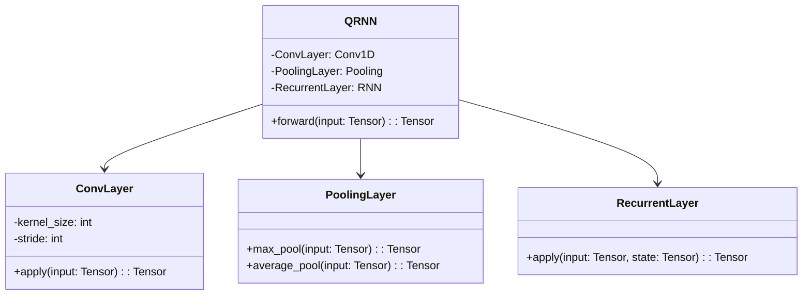
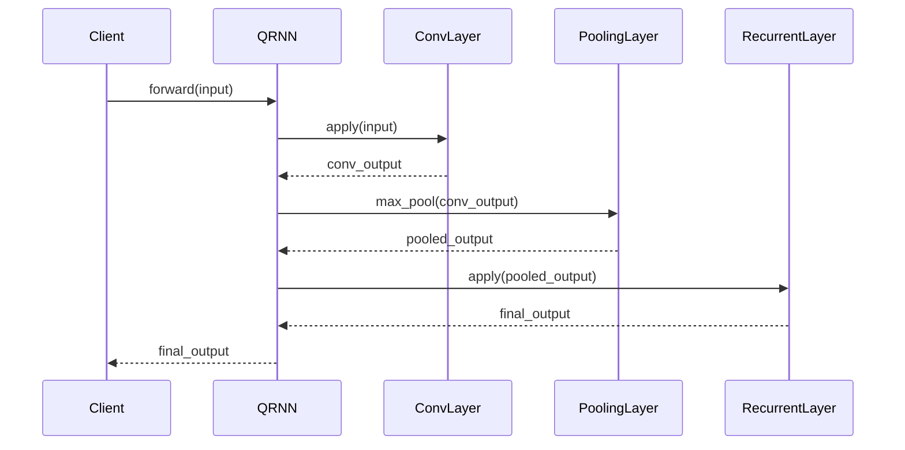

## QRNN: Quasi-Recurrent Neural Network

The **Quasi-Recurrent Neural Network (QRNN)** is a neural network architecture that integrates convolutional and recurrent layers to model sequences efficiently. Unlike traditional RNNs, which use only recurrent layers, QRNNs leverage convolutional layers to capture local dependencies and recurrent layers for sequential dependencies, striking a balance between computation speed and performance.

### Detailed Description

QRNNs address some of the computational limitations of standard RNNs by using convolutions, which can be parallelized, in combination with recurrent layers, which help in capturing longer dependencies.

The architecture typically follows these steps:
1. **Convolutional Layer**: Applies a 1D convolution to the input sequence to capture local context and produce multiple feature maps.
2. **Gates Calculation**: Utilizes convolutional results to calculate gates (like those in LSTMs) that control the information flow.
3. **Recurrent Layer**: Uses these gates to apply recurrence across the feature maps, capturing long-term dependencies.

### UML Class Diagram



### UML Sequence Diagram



### Example Implementations

#### Python

```python
import torch
import torch.nn as nn

class QRNN(nn.Module):
    def __init__(self, input_size, hidden_size, kernel_size=2, stride=1):
        super(QRNN, self).__init__()
        self.conv = nn.Conv1d(input_size, hidden_size, kernel_size, stride)
        self.pool = nn.MaxPool1d(kernel_size)
        self.rnn = nn.RNN(hidden_size, hidden_size, batch_first=True)

    def forward(self, x):
        x = self.conv(x)
        x = self.pool(x)
        x, _ = self.rnn(x)
        return x

qrnn = QRNN(input_size=10, hidden_size=20)
input_tensor = torch.randn(5, 10, 15)  # (batch_size, input_size, seq_length)
output = qrnn(input_tensor)
print(output.shape)
```

#### Java

```java
import org.deeplearning4j.nn.conf.NeuralNetConfiguration;
import org.deeplearning4j.nn.conf.layers.ConvolutionLayer;
import org.deeplearning4j.nn.conf.layers.RnnOutputLayer;
import org.deeplearning4j.nn.conf.layers.SubsamplingLayer;
import org.deeplearning4j.nn.conf.MultiLayerConfiguration;
import org.deeplearning4j.nn.multilayer.MultiLayerNetwork;
import org.nd4j.linalg.activations.Activation;
import org.nd4j.linalg.learning.config.Adam;

public class QRNN {
    public static void main(String[] args) {
        MultiLayerConfiguration conf = new NeuralNetConfiguration.Builder()
            .updater(new Adam(0.01))
            .list()
            .layer(new ConvolutionLayer.Builder(2, 1)
                .nIn(10).nOut(20)
                .activation(Activation.RELU)
                .build())
            .layer(new SubsamplingLayer.Builder(SubsamplingLayer.PoolingType.MAX)
                .kernelSize(2)
                .build())
            .layer(new RnnOutputLayer.Builder()
                .nIn(20).nOut(20)
                .activation(Activation.IDENTITY)
                .build())
            .build();

        MultiLayerNetwork model = new MultiLayerNetwork(conf);
        model.init();
        
        // Example usage with ND4J tensors (input shape: [batch_size, input_size, seq_length])
        // INDArray input = Nd4j.randn(new int[]{5, 10, 15});
        // INDArray output = model.output(input);
    }
}
```

### Benefits

- **Efficiency**: Convolutional layers can be parallelized, making the QRNN faster than traditional RNNs.
- **Performance**: QRNNs capture both local and global dependencies effectively.
- **Flexibility**: Can be adapted for various sequence modeling tasks.

### Trade-offs

- **Complexity**: More complex architecture compared to traditional RNNs.
- **Tuning**: Requires careful hyperparameter tuning for optimal performance.

### Use Cases

- **Natural Language Processing**: Text classification, translation, summarization.
- **Time Series Analysis**: Financial forecasting, weather prediction.
- **Speech Recognition**: Transcription, speaker identification.

### Related Design Patterns

- **Convolutional Neural Networks (CNNs)**: Used for capturing local patterns.
- **Recurrent Neural Networks (RNNs)**: Capturing sequential dependencies.
- **LSTM/GRU**: Special types of RNNs addressing the vanishing gradient problem.

### Resources and References

- [PyTorch Documentation](https://pytorch.org/docs/stable/nn.html#torch.nn.Conv1d)
- [DeepLearning4J Documentation](https://deeplearning4j.konduit.ai/)
- **Research Papers**:
  - Bradbury, James, et al. "Quasi-Recurrent Neural Networks." ICLR 2017.
  
### Open Source Frameworks

- **PyTorch**: `torch.nn.Conv1d`, `torch.nn.RNN`
- **TensorFlow**: `tf.keras.layers.Conv1D`, `tf.keras.layers.RNN`
- **Deeplearning4J**: `org.deeplearning4j.nn.conf.layers.ConvolutionLayer`, `org.deeplearning4j.nn.conf.layers.RnnOutputLayer`

### Summary

The Quasi-Recurrent Neural Network (QRNN) stands out by combining the strengths of convolutional and recurrent architectures, making it a powerful tool for sequence modeling. By efficiently capturing both local and global dependencies, QRNNs offer a scalable and robust solution for a variety of applications in natural language processing, time series analysis, and beyond.

### Final Thoughts

QRNNs blend the best of both worlds from CNNs and RNNs, providing an efficient yet powerful approach to sequence modeling. While they introduce some complexity and require careful tuning, the performance gains can be substantial, making them an excellent choice for many modern machine learning tasks.
