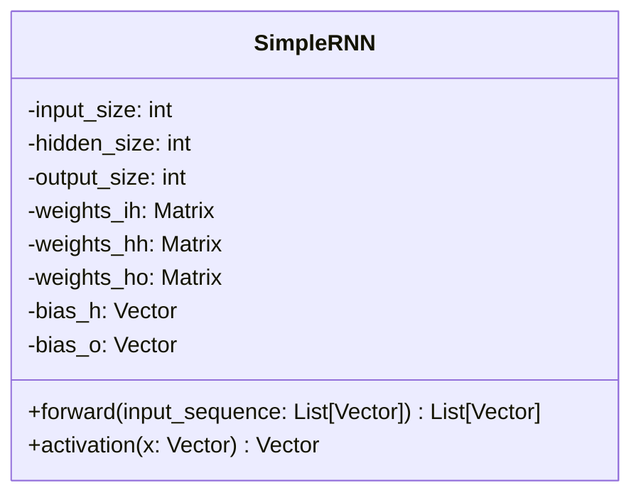
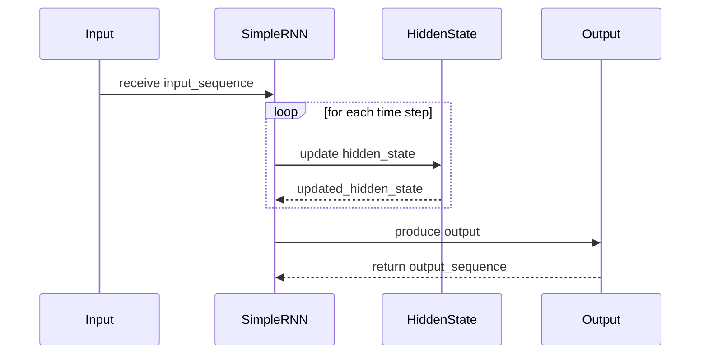

## Introduction

A Simple Recurrent Neural Network (Simple RNN) is a fundamental architecture in the realm of neural networks. Specifically designed for sequence prediction, Simple RNNs excel in tasks such as time series forecasting, language modeling, and other scenarios where temporal dependencies are critical.

## UML Diagrams

### Class Diagram

Below is the UML Class Diagram representing the structure of a Simple RNN:



### Sequence Diagram

The following UML Sequence Diagram shows the flow of data through a Simple RNN during the forward pass:



## Example Implementations

### Python

```python
import numpy as np

class SimpleRNN:
    def __init__(self, input_size, hidden_size, output_size):
        self.hidden_size = hidden_size
        self.weights_ih = np.random.randn(hidden_size, input_size)
        self.weights_hh = np.random.randn(hidden_size, hidden_size)
        self.weights_ho = np.random.randn(output_size, hidden_size)
        self.bias_h = np.zeros(hidden_size)
        self.bias_o = np.zeros(output_size)

    def activation(self, x):
        return np.tanh(x)

    def forward(self, input_sequence):
        h_t = np.zeros(self.hidden_size)
        outputs = []
        
        for x_t in input_sequence:
            h_t = self.activation(np.dot(self.weights_ih, x_t) + np.dot(self.weights_hh, h_t) + self.bias_h)
            y_t = np.dot(self.weights_ho, h_t) + self.bias_o
            outputs.append(y_t)
        
        return outputs

input_sequence = [np.random.randn(3) for _ in range(5)]  # Example input sequence
rnn = SimpleRNN(input_size=3, hidden_size=4, output_size=2)
output_sequence = rnn.forward(input_sequence)
print(output_sequence)
```

### Java

```java
import java.util.ArrayList;

public class SimpleRNN {
    private int hiddenSize;
    private double[][] weightsIH;
    private double[][] weightsHH;
    private double[][] weightsHO;
    private double[] biasH;
    private double[] biasO;

    public SimpleRNN(int inputSize, int hiddenSize, int outputSize) {
        this.hiddenSize = hiddenSize;
        this.weightsIH = new double[hiddenSize][inputSize];
        this.weightsHH = new double[hiddenSize][hiddenSize];
        this.weightsHO = new double[outputSize][hiddenSize];
        this.biasH = new double[hiddenSize];
        this.biasO = new double[outputSize];
        // Initialize weights with random values
    }

    public double[] activation(double[] x) {
        for (int i = 0; i < x.length; i++) {
            x[i] = Math.tanh(x[i]);
        }
        return x;
    }

    public ArrayList<double[]> forward(ArrayList<double[]> inputSequence) {
        double[] hT = new double[hiddenSize];
        ArrayList<double[]> outputs = new ArrayList<>();

        for (double[] xT : inputSequence) {
            hT = activation(matrixVectorProduct(weightsIH, xT));
            hT = activation(matrixVectorProduct(weightsHH, hT));
            double[] yT = matrixVectorProduct(weightsHO, hT);
            outputs.add(yT);
        }

        return outputs;
    }

    private double[] matrixVectorProduct(double[][] matrix, double[] vector) {
        double[] result = new double[matrix.length];
        for (int i = 0; i < matrix.length; i++) {
            for (int j = 0; j < vector.length; j++) {
                result[i] += matrix[i][j] * vector[j];
            }
        }
        return result;
    }

    public static void main(String[] args) {
        ArrayList<double[]> inputSequence = new ArrayList<>();
        // Initialize input sequence with example data

        SimpleRNN rnn = new SimpleRNN(3, 4, 2);
        ArrayList<double[]> outputSequence = rnn.forward(inputSequence);
        System.out.println(outputSequence);
    }
}
```

### Scala

```scala
import scala.util.Random

class SimpleRNN(inputSize: Int, hiddenSize: Int, outputSize: Int) {
  private val weightsIH = Array.ofDim[Double](hiddenSize, inputSize).map(_ => Random.nextDouble())
  private val weightsHH = Array.ofDim[Double](hiddenSize, hiddenSize).map(_ => Random.nextDouble())
  private val weightsHO = Array.ofDim[Double](outputSize, hiddenSize).map(_ => Random.nextDouble())
  private val biasH = Array.fill(hiddenSize)(0.0)
  private val biasO = Array.fill(outputSize)(0.0)

  private def activation(x: Array[Double]): Array[Double] = {
    x.map(Math.tanh)
  }

  def forward(inputSequence: Seq[Array[Double]]): Seq[Array[Double]] = {
    var hT = Array.fill(hiddenSize)(0.0)
    inputSequence.map { xT =>
      hT = activation((weightsIH zip xT).map{ case (row, x) => row.map(_ * x) }.flatten ++ (weightsHH zip hT).map{ case (row, h) => row.map(_ * h) }.flatten)
      val yT = (weightsHO zip hT).map{ case (row, h) => row.map(_ * h) }.flatten
      yT
    }
  }
}

// Example usage
val inputSequence = Seq.fill(5)(Array.fill(3)(Random.nextDouble))
val rnn = new SimpleRNN(3, 4, 2)
val outputSequence = rnn.forward(inputSequence)
outputSequence.foreach(seq => println(seq.mkString(", ")))
```

### Clojure

```clojure
(ns simple-rnn.core
  (:require [clojure.core.matrix :as mat]))

(defn init-weights [rows cols]
  (mat/matrix (repeatedly rows #(repeatedly cols rand))))

(defn activation [x]
  (mat/tanh x))

(defn forward [weights-ih weights-hh weights-ho bias-h bias-o input-sequence]
  (loop [h-t (mat/zeros (mat/row-count weights-hh))
         inputs input-sequence
         outputs []]
    (if (empty? inputs)
      outputs
      (let [x-t (first inputs)
            h-t-new (activation (mat/add (mat/mmul weights-ih x-t)
                                         (mat/mmul weights-hh h-t)
                                         bias-h))
            y-t (mat/add (mat/mmul weights-ho h-t-new)
                         bias-o)]
        (recur h-t-new (rest inputs) (conj outputs y-t))))))

;; Example usage
(def input-sequence [(mat/matrix [0.5 0.6 0.7])
                     (mat/matrix [0.1 0.2 0.3])
                     (mat/matrix [0.9 0.8 0.7])])

(def weights-ih (init-weights 4 3))
(def weights-hh (init-weights 4 4))
(def weights-ho (init-weights 2 4))
(def bias-h (mat/zeros 4))
(def bias-o (mat/zeros 2))

(forward weights-ih weights-hh weights-ho bias-h bias-o input-sequence)
```

## Benefits

- **Simplicity:** Easy to understand and implement, making it a good starting point for learning about recurrent neural networks.
- **Sequential Data Handling:** Specifically designed to handle sequence data, making them suitable for various tasks involving time series, language modeling, etc.

## Trade-offs

- **Short-Term Memory:** Simple RNNs suffer from short-term memory and cannot capture long-term dependencies due to the vanishing gradient problem.
- **Performance:** They may not perform well on complex tasks compared to more advanced architectures like LSTMs and GRUs.

## Use Cases

- **Time Series Prediction:** Forecasting future values in time series data.
- **Language Modeling:** Predicting the next word in a sequence of words.
- **Speech Recognition:** Understanding and predicting speech sequences.

## Related Design Patterns

- **Long Short-Term Memory (LSTM):** Addresses the vanishing gradient problem by using gates to control the flow of information.
- **Gated Recurrent Unit (GRU):** A simplified version of LSTM with fewer gates, offering comparable performance with less computational complexity.

## Resources and References

- [Original Paper on RNNs](https://www.jstor.org/stable/2635266)
- [Understanding RNNs](https://towardsdatascience.com/understanding-rnn-and-lstm-f7cdf6dfc14e)
- [Deep Learning Book by Ian Goodfellow](https://www.deeplearningbook.org/)

## Open Source Frameworks

- **TensorFlow:** Widely used library that includes support for RNNs.
- **PyTorch:** Another popular deep learning framework that provides RNN modules.

## Summary

Simple RNNs are a foundational architecture for sequence prediction tasks, offering simplicity and effective handling of sequential data. While they have limitations, understanding Simple RNNs is crucial for anyone diving into the world of recurrent neural networks. For tasks requiring long-term memory, consider exploring more advanced architectures like LSTMs and GRUs.
