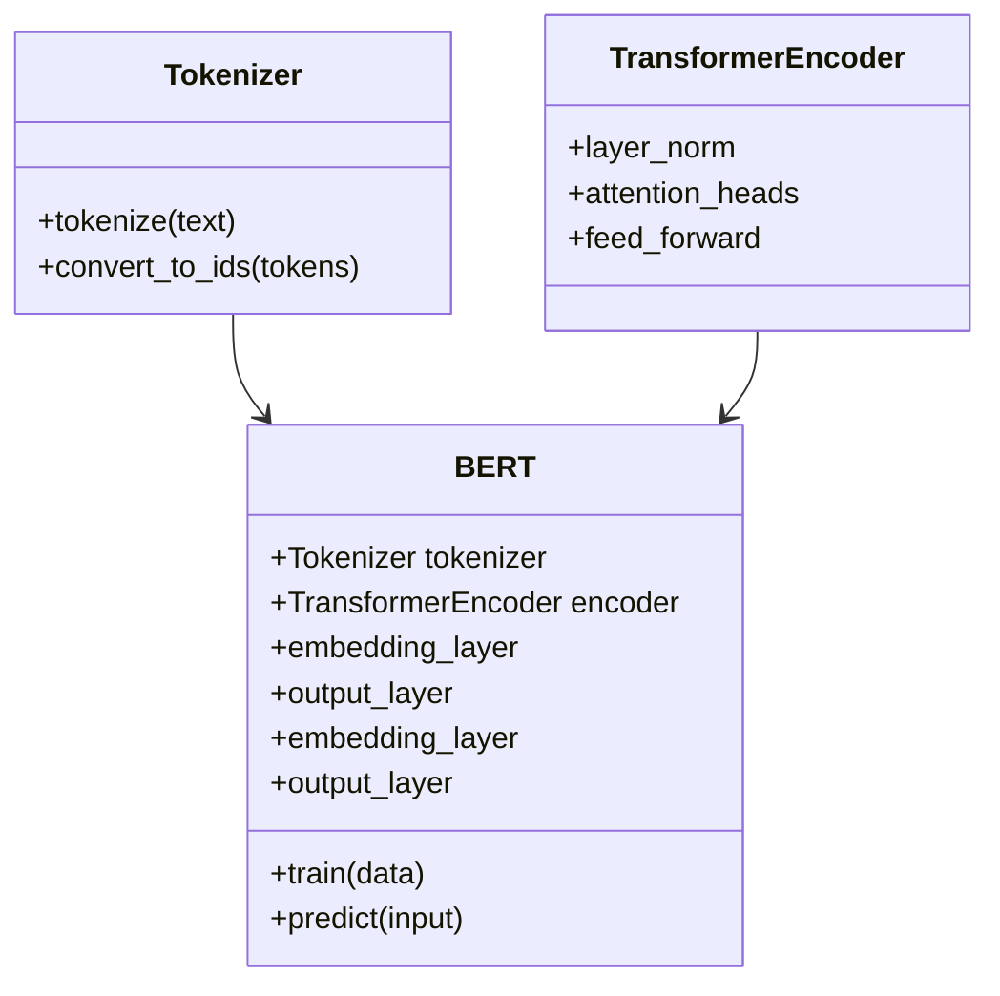
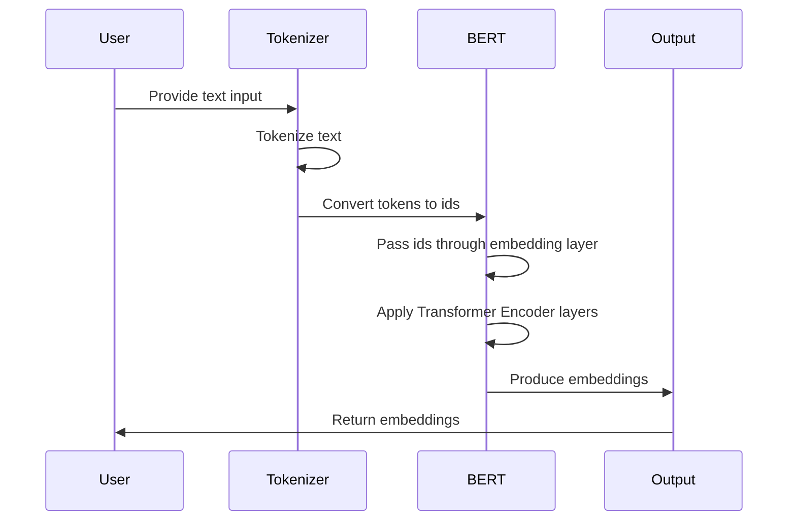

## Introduction to BERT

Bidirectional Encoder Representations from Transformers (BERT) is a revolutionary neural network architecture introduced by Google in 2018. BERT is designed to better understand the context of words in search queries by looking at the surrounding text. This capability makes it particularly powerful for a variety of Natural Language Processing (NLP) tasks.

## Architecture

BERT is built upon the Transformer architecture, which employs an attention mechanism to improve the learning of contextual relations between words (or sub-words) in a text. Unlike traditional models that read text input sequentially (left-to-right or right-to-left), the Transformer reads the entire sequence of words at once, making it bidirectional and allowing for better contextual understanding.



## Sequence Diagram

Below is a sequence diagram that illustrates the workflow of BERT during the text embedding process.



## Implementations in Different Languages

### Python

```python
import torch
from transformers import BertTokenizer, BertModel

tokenizer = BertTokenizer.from_pretrained('bert-base-uncased')
model = BertModel.from_pretrained('bert-base-uncased')

text = "Transformers are amazing!"
input_ids = tokenizer.encode(text, return_tensors='pt')

with torch.no_grad():
    embeddings = model(input_ids)[0]
```

### Java

Using DL4J:

```java
import org.deeplearning4j.nn.graph.ComputationGraph;
import org.deeplearning4j.nn.conf.graph.ElementWiseVertex;

public class BERTExample {
    public static void main(String[] args) {
        // Loading pre-trained BERT model
        ComputationGraph bertModel = ComputationGraph.load(new File("path/to/bert/model"), false);

        // Example text
        String text = "Transformers are amazing!";
        
        // Process the text and get embeddings
        INDArray embeddings = bertModel.outputSingle(text);
    }
}
```

### Scala

Using Spark NLP:

```scala
import com.johnsnowlabs.nlp.embeddings.BertEmbeddings
import org.apache.spark.ml.PipelineModel
import org.apache.spark.sql.SparkSession

val spark = SparkSession.builder().appName("BERTExample").getOrCreate()
val bertModel = PipelineModel.load("/path/to/bert_model")

val text = Seq("Transformers are amazing!")
val data = spark.createDataFrame(text.map(Tuple1.apply)).toDF("text")

val embeddings = bertModel.transform(data)
```

### Clojure

Using Apache MXNet:

```clojure
(require '[org.apache.mxnet :as mx])
(require '[org.apache.mxnet.gluon :as gluon])
(require '[clj-http.client :as client])

(def model (mx/load-parameters "bert-params.params" {}))

(def tokenizer (mx/tokenizer. "bert-base-uncased"))

(def text "Transformers are amazing!")
(def input-ids (tokenizer token-to-id text))

(let [embeddings (mx/forward model input-ids)]
  (println "Embeddings:" embeddings))
```

## Benefits

- **Bidirectionality:** BERT’s bidirectional attention mechanism allows it to learn context from both left and right sides of a word.
- **Pre-training and Fine-tuning:** BERT can be pre-trained on a large corpus and fine-tuned on a specific task, offering great flexibility.
- **Versatility:** Effective in a wide range of NLP tasks, including text classification, entity recognition, and question answering.

## Trade-offs

- **Resource Intensive:** Training BERT requires substantial computational resources and time.
- **Complexity:** The architecture is more complex than traditional models, making it harder to implement and fine-tune without expertise.

## Use Cases

- **Search Engines:** Enhancing search result relevance by better understanding query context.
- **Chatbots:** Improving the contextual understanding and response generation in conversational agents.
- **Text Classification:** Enabling more accurate categorization of texts across various domains.
- **Named Entity Recognition (NER):** Identifying and classifying entities mentioned in the text.

## Related Design Patterns

- **Transformer:** The foundation of BERT, focusing on attention mechanisms for context understanding.
- **Sequence-to-Sequence:** Often used in tasks like translation, which BERT can improve by better understanding context.

## Resources and References

- **Original Paper:** [BERT: Pre-training of Deep Bidirectional Transformers for Language Understanding](https://arxiv.org/abs/1810.04805)
- **Transformer Library:** [Hugging Face Transformers](https://github.com/huggingface/transformers)
- **DL4J:** [DeepLearning4J](https://deeplearning4j.konduit.ai/)
- **Spark NLP:** [John Snow Labs Spark NLP](https://nlp.johnsnowlabs.com/)

## Summary

BERT has set new benchmarks in various NLP tasks, proving its capability to understand and model language context with high accuracy. With implementations available in multiple languages and extensive resources for deployment, BERT stands as a cornerstone in modern NLP applications.

By leveraging its bidirectional nature and fine-tuning flexibility, BERT brings substantial improvements to search engines, chatbots, text classification, and beyond, making it an essential tool in the NLP toolkit.
