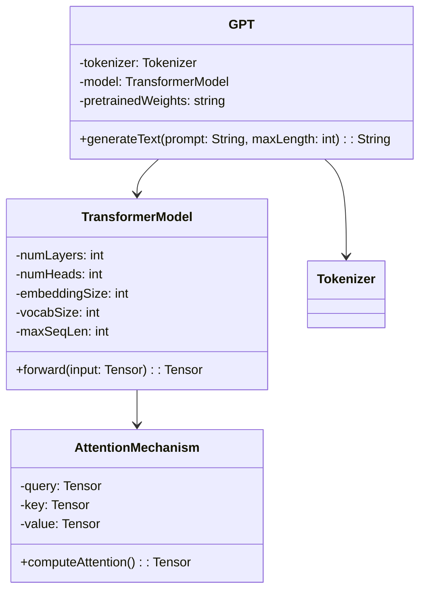
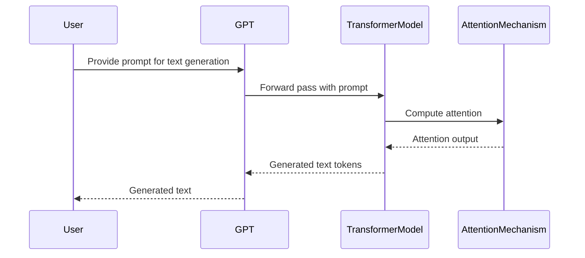

## Introduction

Generative Pre-trained Transformer (GPT) is a neural network-based model that has revolutionized the field of natural language processing (NLP). The GPT architecture is an autoregressive language model that uses deep learning techniques to generate text that is remarkably coherent and contextually appropriate. This model has a wide range of applications, from text completion to creative writing, chatbots, and more.

## Description

GPT leverages a transformer architecture, which uses attention mechanisms to understand the context of each word in a sequence. It is trained in an unsupervised manner using large datasets, making it highly versatile and powerful for various NLP tasks.

### Key Concepts

- **Autoregression**: GPT generates text one token at a time, predicting the next token based on the previous ones.
- **Transformer Architecture**: Utilizes self-attention mechanisms to capture long-range dependencies and relationships in the text.
- **Pre-training and Fine-tuning**: The model is pre-trained on a large corpus of text and then fine-tuned for specific tasks.

## UML Diagrams

### Class Diagram



### Sequence Diagram



## Implementation Examples

### Python

```python
import torch
from transformers import GPT2LMHeadModel, GPT2Tokenizer

tokenizer = GPT2Tokenizer.from_pretrained('gpt2')
model = GPT2LMHeadModel.from_pretrained('gpt2')

prompt = "Once upon a time"
inputs = tokenizer.encode(prompt, return_tensors='pt')
outputs = model.generate(inputs, max_length=50, num_return_sequences=1)

generated_text = tokenizer.decode(outputs[0], skip_special_tokens=True)
print(generated_text)
```

### Java

```java
// Pseudo code: Java does not have direct support for transformers as in Python,
// but one can use the ONNX runtime or Java bindings for deep learning libraries

String prompt = "Once upon a time";
// Assume we have a method to get pre-trained GPT model in Java
GptModel model = getPretrainedGptModel();
String generatedText = model.generate(prompt, 50);
System.out.println(generatedText);
```

### Scala

```scala
// Pseudo code: Similar to Java, using a pre-trained model
val prompt = "Once upon a time"
val model = getPretrainedGptModel()
val generatedText = model.generate(prompt, 50)
println(generatedText)
```

### Clojure

```clojure
;; Pseudo code: Assuming we have a deep learning library in Clojure
(def prompt "Once upon a time")
(def model (get-pretrained-gpt-model))
(def generated-text (generate-text model prompt 50))
(println generated-text)
```

## Benefits

- **High Quality Text Generation**: Produces human-like text.
- **Versatility**: Can be fine-tuned for various NLP tasks.
- **Context Awareness**: Uses attention mechanisms to understand context.

## Trade-offs

- **Resource Intensive**: Requires significant computational resources for training and inference.
- **Data Hungry**: Needs large datasets for effective training.
- **Complexity**: Implementation and fine-tuning can be complex.

## Use Cases

- **Text Completion**: Autocomplete sentences or paragraphs.
- **Chatbots**: Develop more natural and engaging conversational agents.
- **Creative Writing**: Assist in writing stories, poems, or other creative content.
- **Code Generation**: Generate code snippets from natural language descriptions.

## Related Design Patterns

- **Seq2Seq Models**: For tasks involving sequence to sequence transformation.
- **BERT (Bidirectional Encoder Representations from Transformers)**: Another transformer-based model used for understanding language context.

## Resources

- **Hugging Face Transformers Library**: [Link](https://github.com/huggingface/transformers)
- **OpenAI GPT-3 Paper**: [Link](https://arxiv.org/abs/2005.14165)
- **BERT Paper**: [Link](https://arxiv.org/abs/1810.04805)

## References

- Radford, A., et al. (2018). "Improving Language Understanding by Generative Pre-Training."
- Vaswani, A., et al. (2017). "Attention is All You Need."

## Open Source Frameworks

- **Hugging Face Transformers**: A popular library for implementing transformer models.
- **TensorFlow**: Another framework that supports implementing GPT models.

## Summary

Generative Pre-trained Transformer (GPT) is a cutting-edge autoregressive language model that has significantly advanced the field of natural language processing. Utilizing the transformer architecture, GPT models can generate highly coherent and contextually appropriate text, making them invaluable for a variety of applications such as text completion, chatbots, and creative writing. While powerful, GPT models are resource-intensive and require large datasets for training, but their versatility and effectiveness make them a cornerstone in modern NLP techniques.

---

This article has covered the architecture, benefits, trade-offs, and various use cases of GPT. Additionally, we've provided examples in multiple programming languages and resources for further exploration, making it a comprehensive guide to understanding and implementing GPT models.
