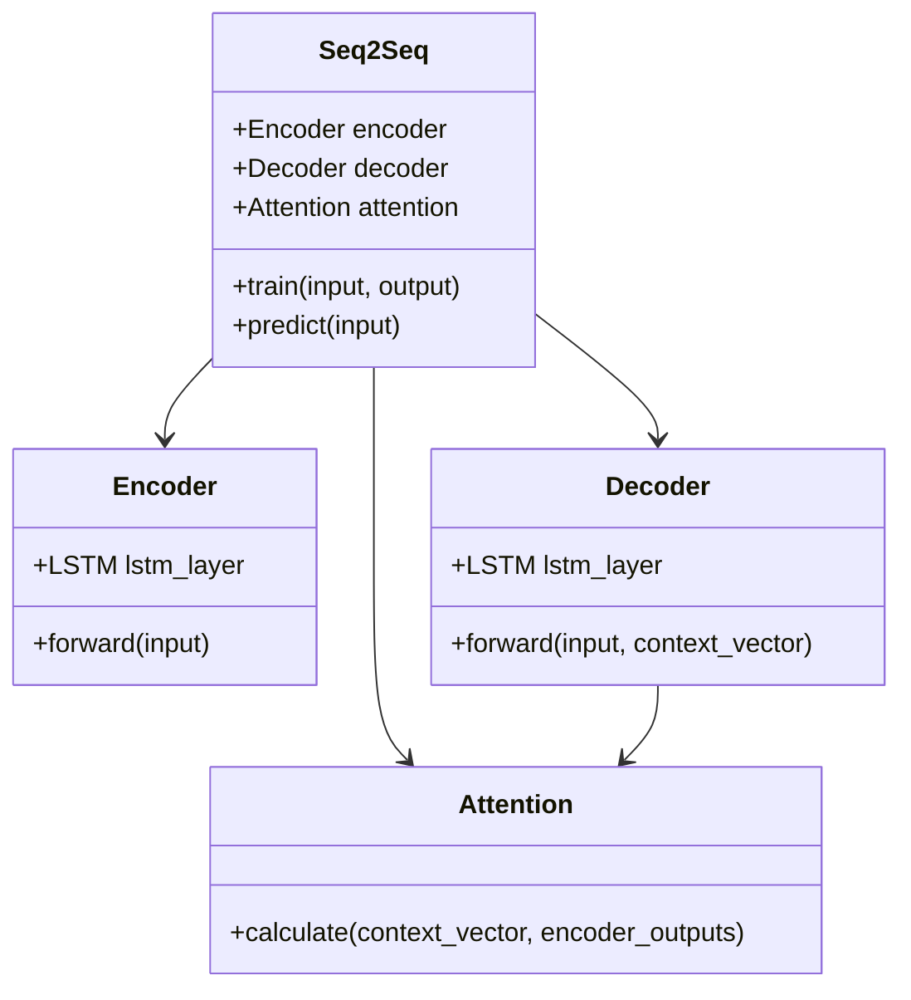
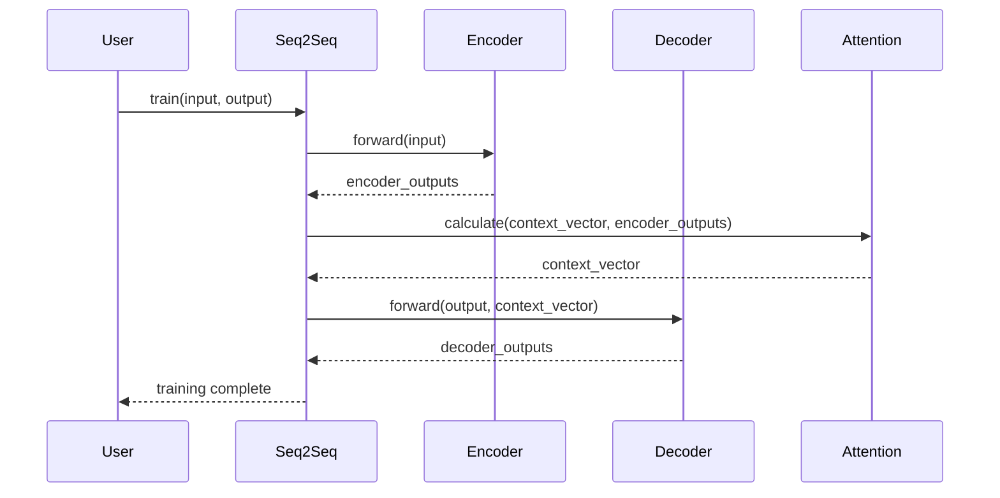

## Introduction
Seq2Seq with Attention is a powerful neural network design pattern that enhances the capabilities of the basic Encoder-Decoder architecture. The attention mechanism allows the model to selectively focus on different parts of the input sequence, which is particularly useful in tasks like machine translation, where context from various parts of the input sentence is crucial for generating the output.

## Use Case: Machine Translation

In machine translation, the goal is to convert a sequence of words in one language (source) into a sequence in another language (target). The attention mechanism in Seq2Seq models significantly improves translation quality by allowing the model to consider relevant context from the input sequence dynamically.

## Benefits
- **Improved Accuracy**: Selective attention improves the model's ability to handle long input sequences.
- **Flexibility**: Can be adapted to various sequence-to-sequence tasks beyond machine translation, such as text summarization and image captioning.
- **Interpretability**: Attention weights provide insights into which parts of the input the model is focusing on.

## Trade-offs
- **Complexity**: Adding an attention mechanism increases the computational complexity.
- **Training Time**: May require more data and time to train compared to basic Seq2Seq models.
- **Resource Intensive**: More memory and processing power are needed due to the additional computations for attention.

## UML Class Diagram


## UML Sequence Diagram


## Example Implementations

### Python
```python
import torch
import torch.nn as nn
import torch.optim as optim

class Encoder(nn.Module):
    def __init__(self, input_dim, emb_dim, hidden_dim, n_layers, dropout):
        super().__init__()
        self.embedding = nn.Embedding(input_dim, emb_dim)
        self.lstm = nn.LSTM(emb_dim, hidden_dim, n_layers, dropout=dropout)
    
    def forward(self, src):
        embedded = self.embedding(src)
        outputs, (hidden, cell) = self.lstm(embedded)
        return outputs, hidden, cell

class Attention(nn.Module):
    def __init__(self, hidden_dim):
        super().__init__()
        self.attn = nn.Linear(hidden_dim * 2, hidden_dim)
        self.v = nn.Linear(hidden_dim, 1, bias=False)

    def forward(self, hidden, encoder_outputs):
        src_len = encoder_outputs.shape[0]
        hidden = hidden.unsqueeze(1).repeat(1, src_len, 1)
        energy = torch.tanh(self.attn(torch.cat((hidden, encoder_outputs), dim=2)))
        attention = self.v(energy).squeeze(2)
        return torch.softmax(attention, dim=1)

class Decoder(nn.Module):
    def __init__(self, output_dim, emb_dim, hidden_dim, n_layers, dropout, attention):
        super().__init__()
        self.embedding = nn.Embedding(output_dim, emb_dim)
        self.lstm = nn.LSTM(emb_dim + hidden_dim, hidden_dim, n_layers, dropout=dropout)
        self.fc_out = nn.Linear(emb_dim + hidden_dim * 2, output_dim)
        self.attention = attention
    
    def forward(self, input, hidden, cell, encoder_outputs):
        input = input.unsqueeze(0)
        embedded = self.embedding(input)
        attn_weights = self.attention(hidden[-1], encoder_outputs)
        attn_applied = torch.bmm(attn_weights.unsqueeze(1), encoder_outputs.permute(1, 0, 2))
        lstm_input = torch.cat((embedded, attn_applied.permute(1, 0, 2)), dim=2)
        output, (hidden, cell) = self.lstm(lstm_input, (hidden, cell))
        output = self.fc_out(torch.cat((embedded.squeeze(0), output.squeeze(0), attn_applied.squeeze(0)), dim=1))
        return output, hidden, cell

class Seq2Seq(nn.Module):
    def __init__(self, encoder, decoder, device):
        super().__init__()
        self.encoder = encoder
        self.decoder = decoder
        self.device = device

    def forward(self, src, trg, teacher_forcing_ratio=0.5):
        trg_len = trg.shape[0]
        trg_vocab_size = self.decoder.output_dim
        outputs = torch.zeros(trg_len, trg.shape[1], trg_vocab_size).to(self.device)
        encoder_outputs, hidden, cell = self.encoder(src)
        input = trg[0, :]
        for t in range(1, trg_len):
            output, hidden, cell = self.decoder(input, hidden, cell, encoder_outputs)
            outputs[t] = output
            top1 = output.argmax(1)
            input = trg[t] if random.random() < teacher_forcing_ratio else top1
        return outputs
```

### Java
```java
import java.util.*;

public class Seq2Seq {
    private Encoder encoder;
    private Decoder decoder;
    private Attention attention;

    public Seq2Seq(Encoder encoder, Decoder decoder, Attention attention) {
        this.encoder = encoder;
        this.decoder = decoder;
        this.attention = attention;
    }

    public void train(List<Integer> input, List<Integer> output) {
        List<Float> encoderOutputs = encoder.forward(input);
        List<Float> contextVector = attention.calculate(encoderOutputs);
        List<Float> decoderOutputs = decoder.forward(output, contextVector);
    }

    public List<Float> predict(List<Integer> input) {
        List<Float> encoderOutputs = encoder.forward(input);
        List<Float> contextVector = attention.calculate(encoderOutputs);
        return decoder.forward(Collections.emptyList(), contextVector);
    }
}
```

### Scala
```scala
class Encoder(val inputDim: Int, val embDim: Int, val hiddenDim: Int) {
  def forward(input: Seq[Int]): Seq[Seq[Float]] = {
    // Implementation of forward pass for encoder
    ???
  }
}

class Attention(val hiddenDim: Int) {
  def calculate(hidden: Seq[Float], encoderOutputs: Seq[Seq[Float]]): Seq[Float] = {
    // Implementation of attention mechanism
    ???
  }
}

class Decoder(val outputDim: Int, val embDim: Int, val hiddenDim: Int, val attention: Attention) {
  def forward(input: Seq[Int], contextVector: Seq[Float]): Seq[Float] = {
    // Implementation of forward pass for decoder
    ???
  }
}

class Seq2Seq(encoder: Encoder, decoder: Decoder) {
  def train(input: Seq[Int], output: Seq[Int]): Seq[Float] = {
    val encoderOutputs = encoder.forward(input)
    val contextVector = decoder.attention.calculate(encoderOutputs.last, encoderOutputs)
    decoder.forward(output, contextVector)
  }

  def predict(input: Seq[Int]): Seq[Float] = {
    val encoderOutputs = encoder.forward(input)
    val contextVector = decoder.attention.calculate(encoderOutputs.last, encoderOutputs)
    decoder.forward(Seq(), contextVector)
  }
}
```

### Clojure
```clojure
(defn forward-encoder [input]
  ;; Implementation of forward pass for encoder
  )

(defn calculate-attention [hidden encoder-outputs]
  ;; Implementation of attention mechanism
  )

(defn forward-decoder [input context-vector]
  ;; Implementation of forward pass for decoder
  )

(defn train-seq2seq [input output]
  (let [encoder-outputs (forward-encoder input)
        context-vector (calculate-attention (last encoder-outputs) encoder-outputs)
        decoder-outputs (forward-decoder output context-vector)]
    decoder-outputs))

(defn predict-seq2seq [input]
  (let [encoder-outputs (forward-encoder input)
        context-vector (calculate-attention (last encoder-outputs) encoder-outputs)]
    (forward-decoder [] context-vector)))
```

## Related Design Patterns
- **Transformer**: Uses self-attention mechanisms, a more advanced architecture for handling sequential data.
- **Bidirectional Encoder Representations from Transformers (BERT)**: A transformer-based model pre-trained on large text corpora for various NLP tasks.
- **Convolutional Sequence-to-Sequence (ConvSeq2Seq)**: Uses convolutional layers for encoding and decoding sequences.

## Resources and References
- [Attention Is All You Need](https://arxiv.org/abs/1706.03762)
- [Neural Machine Translation by Jointly Learning to Align and Translate](https://arxiv.org/abs/1409.0473)
- [PyTorch Seq2Seq Tutorial](https://pytorch.org/tutorials/intermediate/seq2seq_translation_tutorial.html)
- [TensorFlow Neural Machine Translation (NMT)](https://www.tensorflow.org/tutorials/text/nmt_with_attention)

## Open Source Frameworks
- **TensorFlow**: An end-to-end open source platform for machine learning.
- **PyTorch**: An open source machine learning library based on the Torch library.
- **Hugging Face Transformers**: Provides state-of-the-art general-purpose architectures for NLP.

## Summary
The Seq2Seq with Attention design pattern enhances the traditional encoder-decoder architecture by allowing the model to dynamically focus on different parts of the input sequence. This results in significant improvements in tasks such as machine translation. While it increases complexity and computational requirements, the benefits in terms of accuracy and interpretability make it a valuable tool in the domain of neural networks.
