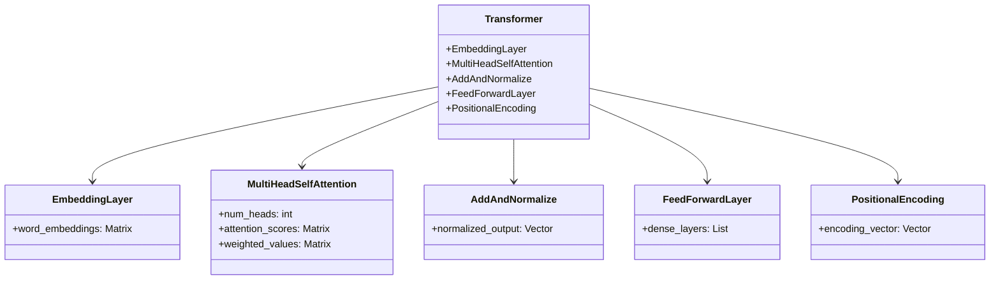
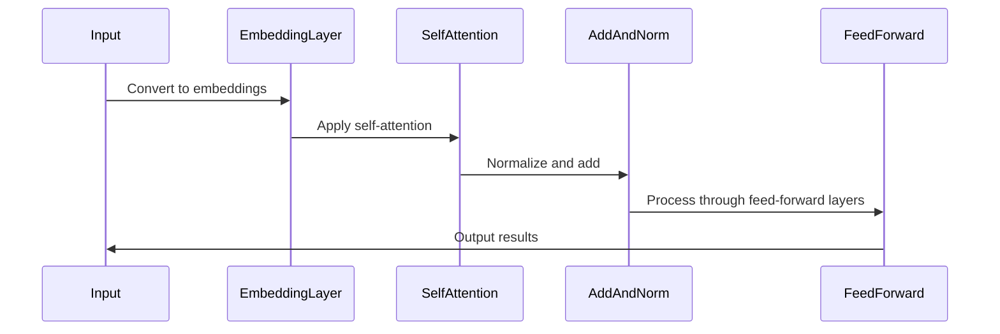

## Introduction to Transformers

Transformers have transformed the field of Natural Language Processing (NLP) by eliminating the dependency on Recurrent Neural Networks (RNNs). They achieve this through self-attention mechanisms that enable the model to weigh the significance of different words in a sentence, independent of their position. This article delves deep into the architecture, benefits, trade-offs, and practical implementations of Transformers.

## Architecture

### Self-Attention Mechanism

At the heart of the Transformer model lies the self-attention mechanism. Self-attention allows the model to consider the relevance of each word in the context of the entire sentence. Here’s how self-attention works:

- **Input Embedding**: Words are converted into vectors using embeddings.
- **Self-Attention**: Compute attention scores to measure relevance.
- **Add & Norm**: Apply normalization and addition.
- **Feed-Forward**: Pass through feed-forward neural networks.
- **Stacked Layers**: Repeat multiple times to capture complex patterns.

### UML Class Diagram



### Sequence Diagram



## Code Implementations

### Python (using PyTorch)

```python
import torch
import torch.nn as nn

class Transformer(nn.Module):
    def __init__(self, num_embeddings, embedding_dim, num_heads, feedforward_dim):
        super(Transformer, self).__init__()
        self.embedding = nn.Embedding(num_embeddings, embedding_dim)
        self.positional_encoding = PositionalEncoding(embedding_dim)
        self.attention = nn.MultiheadAttention(embedding_dim, num_heads)
        self.feed_forward = nn.Sequential(
            nn.Linear(embedding_dim, feedforward_dim),
            nn.ReLU(),
            nn.Linear(feedforward_dim, embedding_dim)
        )
        self.norm = nn.LayerNorm(embedding_dim)

    def forward(self, x):
        x = self.embedding(x) + self.positional_encoding(x)
        attn_output, _ = self.attention(x, x, x)
        x = self.norm(x + attn_output)
        feedforward_output = self.feed_forward(x)
        x = self.norm(x + feedforward_output)
        return x
```

### Java (using DL4J)

```java
import org.deeplearning4j.nn.graph.ComputationGraph;
import org.deeplearning4j.nn.conf.ComputationGraphConfiguration;
import org.deeplearning4j.nn.conf.layers.DenseLayer;
import org.deeplearning4j.nn.conf.layers.LayerNormalization;
import org.deeplearning4j.nn.conf.layers.MultiHeadAttention;

public class Transformer {
    public static void main(String[] args) {
        ComputationGraphConfiguration config = new NeuralNetConfiguration.Builder()
                .graphBuilder()
                .addInputs("input")
                .addLayer("embedding", new EmbeddingLayer.Builder().nIn(inputSize).nOut(embeddingSize).build(), "input")
                .addLayer("positionalEncoding", new PositionalEncodingLayer.Builder().build(), "embedding")
                .addLayer("selfAttention", new MultiHeadAttention.Builder().numHeads(numHeads).nIn(embeddingSize).nOut(attentionSize).build(), "positionalEncoding")
                .addLayer("addNorm1", new LayerNormalization.Builder().build(), "selfAttention", "positionalEncoding")
                .addLayer("feedForward", new DenseLayer.Builder().nIn(attentionSize).nOut(feedforwardSize).activation(Activation.RELU).build(), "addNorm1")
                .addLayer("addNorm2", new LayerNormalization.Builder().build(), "feedForward", "addNorm1")
                .addOutputs("output")
                .build();

        ComputationGraph graph = new ComputationGraph(config);
        graph.init();
    }
}
```

### Scala

```scala
import org.apache.spark.ml.linalg.DenseVector
import org.apache.spark.ml.Pipeline
import org.apache.spark.ml.feature.{OneHotEncoder, StringIndexer, VectorAssembler}
import org.apache.spark.sql.SparkSession

val spark = SparkSession.builder.appName("Transformer").getOrCreate()
val data = Seq(
    (0, "apple", 1.0),
    (1, "banana", 0.5),
    (2, "carrot", 0.1)
)

val df = spark.createDataFrame(data).toDF("id", "fruit", "weight")

val indexer = new StringIndexer().setInputCol("fruit").setOutputCol("fruitIndex")
val encoder = new OneHotEncoder().setInputCol("fruitIndex").setOutputCol("fruitVec")
val assembler = new VectorAssembler().setInputCols(Array("fruitVec", "weight")).setOutputCol("features")

val pipeline = new Pipeline().setStages(Array(indexer, encoder, assembler))
val model = pipeline.fit(df)
val result = model.transform(df)

result.show()
```

### Clojure (using Cortex)

```clojure
(require '[cortex.nn.core :as nn]
         '[cortex.nn.layers :as layers]
         '[cortex.nn.optimizers :as optimizers])

(defn transformer-model
  [input-dim embedding-dim num-heads ff-dim]
  (let [embedding-layer (layers/embedding-layer {:input-dim input-dim :output-dim embedding-dim})
        pos-encoding-layer (layers/positional-encoding-layer {})
        attention-layer (layers/multi-head-attention {:num-heads num-heads})
        feed-forward-layer (layers/feed-forward-layer {:input-dim embedding-dim :output-dim ff-dim})
        norm-layer (layers/layer-norm {})]
    (-> (nn/network {})
        (nn/add embedding-layer)
        (nn/add pos-encoding-layer)
        (nn/add attention-layer)
        (nn/add norm-layer)
        (nn/add feed-forward-layer)
        (nn/add norm-layer))))

(def model (transformer-model 10000 512 8 2048))
```

## Benefits

- **Parallelization**: Unlike RNNs, Transformers can be parallelized easily.
- **Scalability**: Handles long-range dependencies better and can be scaled with more layers.
- **Performance**: Superior performance on various NLP tasks.

## Trade-offs

- **Computationally Intensive**: Requires significant computational resources.
- **Data Requirement**: Needs large datasets to train effectively.
- **Complexity**: More complex to implement and tune.

## Use Cases

- **Machine Translation**: Revolutionized translation tasks.
- **Text Summarization**: Summarizes long articles efficiently.
- **Sentiment Analysis**: Detects sentiment with high accuracy.
- **Question Answering**: Powers advanced Q&A systems.

## Related Design Patterns

- **Attention Mechanisms**: Utilized in various neural network architectures.
- **Seq2Seq Models**: Used for machine translation before Transformers.
- **Convolutional Neural Networks (CNNs)**: Often combined with Transformers for image captioning.

## Resources and References

- **Papers**:
  - *Attention Is All You Need* by Vaswani et al.
- **Frameworks**:
  - [Hugging Face Transformers](https://huggingface.co/transformers/)
  - [TensorFlow Transform](https://www.tensorflow.org/tfx/transform)

## Summary

Transformers have redefined how sequential data is processed, especially in NLP. Through their self-attention mechanisms, they have overcome the limitations of RNNs, allowing for better parallelization and scalability. While they do have their trade-offs, their benefits far outweigh these, making them the go-to choice for many modern machine learning applications.

By understanding the architecture, benefits, and practical implementations of Transformers, you can leverage this powerful design pattern to solve complex problems in NLP and beyond.
