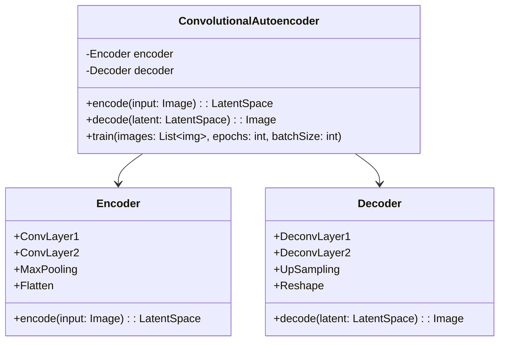
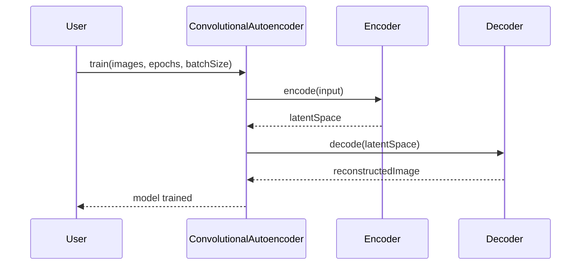

## Convolutional Autoencoder (CAE): Efficient Image Compression

### Introduction
A Convolutional Autoencoder (CAE) is a type of autoencoder that uses convolutional layers to compress and then reconstruct images. This design pattern is particularly effective for image compression, making it a valuable tool in machine learning and neural networks.

### Detailed Description
A Convolutional Autoencoder consists of two main components:

1. **Encoder:** This part of the network compresses the input image into a latent-space representation using convolutional layers.
2. **Decoder:** The decoder reconstructs the image from the latent-space representation using transposed convolutional layers.

### Benefits
- **Reduced Dimensionality:** Efficiently reduces the dimensionality of image data.
- **Feature Extraction:** Automatically extracts important features using convolutional operations.
- **Lossy Compression:** Allows for lossy image compression which is useful in scenarios where perfect reconstruction is not critical.

### Trade-offs
- **Complexity:** More complex than traditional autoencoders due to the convolutional layers.
- **Computation Time:** Higher computational cost during training.
- **Quality Loss:** There may be some loss in the quality of the reconstructed image.

### Use Cases
- **Image Compression:** Reducing the file size of images while maintaining important features.
- **Denoising:** Removing noise from images.
- **Anomaly Detection:** Identifying unusual patterns in images.

### UML Class Diagram


### UML Sequence Diagram


### Example Implementations

#### Python (using Keras)
```python
import numpy as np
from tensorflow.keras.models import Model
from tensorflow.keras.layers import Input, Conv2D, MaxPooling2D, UpSampling2D

input_img = Input(shape=(28, 28, 1))
x = Conv2D(32, (3, 3), activation='relu', padding='same')(input_img)
x = MaxPooling2D((2, 2), padding='same')(x)
x = Conv2D(32, (3, 3), activation='relu', padding='same')(x)
encoded = MaxPooling2D((2, 2), padding='same')(x)

x = Conv2D(32, (3, 3), activation='relu', padding='same')(encoded)
x = UpSampling2D((2, 2))(x)
x = Conv2D(32, (3, 3), activation='relu', padding='same')(x)
x = UpSampling2D((2, 2))(x)
decoded = Conv2D(1, (3, 3), activation='sigmoid', padding='same')(x)

autoencoder = Model(input_img, decoded)
autoencoder.compile(optimizer='adam', loss='binary_crossentropy')

autoencoder.fit(X_train, X_train, epochs=50, batch_size=256, shuffle=True)
```

#### Java (using DL4J)
```java
import org.deeplearning4j.nn.conf.layers.ConvolutionLayer;
import org.deeplearning4j.nn.conf.layers.SubsamplingLayer;
import org.deeplearning4j.nn.conf.layers.Upsampling2D;
import org.deeplearning4j.nn.conf.layers.OutputLayer;
import org.deeplearning4j.nn.conf.NeuralNetConfiguration;
import org.deeplearning4j.nn.conf.MultiLayerConfiguration;
import org.deeplearning4j.nn.multilayer.MultiLayerNetwork;
import org.nd4j.linalg.dataset.api.iterator.DataSetIterator;

MultiLayerConfiguration conf = new NeuralNetConfiguration.Builder()
    .list()
    .layer(0, new ConvolutionLayer.Builder(3, 3)
        .nIn(1).nOut(32).activation(Activation.RELU)
        .build())
    .layer(1, new SubsamplingLayer.Builder(SubsamplingLayer.PoolingType.MAX)
        .kernelSize(2, 2).build())
    .layer(2, new ConvolutionLayer.Builder(3, 3)
        .nOut(32).activation(Activation.RELU)
        .build())
    .layer(3, new SubsamplingLayer.Builder(SubsamplingLayer.PoolingType.MAX)
        .kernelSize(2, 2).build())
    .layer(4, new Upsampling2D.Builder(2).build())
    .layer(5, new ConvolutionLayer.Builder(3, 3)
        .nOut(32).activation(Activation.RELU)
        .build())
    .layer(6, new Upsampling2D.Builder(2).build())
    .layer(7, new OutputLayer.Builder(LossFunctions.LossFunction.XENT)
        .activation(Activation.SIGMOID).nOut(1).build())
    .build();

MultiLayerNetwork model = new MultiLayerNetwork(conf);
model.init();
model.fit(dataSetIterator);
```

### Scala (using DL4J)
```scala
import org.deeplearning4j.nn.conf.NeuralNetConfiguration
import org.deeplearning4j.nn.conf.layers.{ConvolutionLayer, SubsamplingLayer, Upsampling2D, OutputLayer}
import org.nd4j.linalg.dataset.api.iterator.DataSetIterator

val conf = new NeuralNetConfiguration.Builder()
  .list()
  .layer(new ConvolutionLayer.Builder(3, 3)
    .nIn(1).nOut(32).activation("relu")
    .build())
  .layer(new SubsamplingLayer.Builder(SubsamplingLayer.PoolingType.MAX)
    .kernelSize(2, 2).build())
  .layer(new ConvolutionLayer.Builder(3, 3)
    .nOut(32).activation("relu")
    .build())
  .layer(new SubsamplingLayer.Builder(SubsamplingLayer.PoolingType.MAX)
    .kernelSize(2, 2).build())
  .layer(new Upsampling2D.Builder(2).build())
  .layer(new ConvolutionLayer.Builder(3, 3)
    .nOut(32).activation("relu")
    .build())
  .layer(new Upsampling2D.Builder(2).build())
  .layer(new OutputLayer.Builder(LossFunctions.LossFunction.XENT)
    .activation("sigmoid").nOut(1).build())
  .build()

val model = new MultiLayerNetwork(conf)
model.init()
model.fit(dataSetIterator)
```

#### Clojure (using DL4J and LibPython-clj for Keras interop)
```clojure
(require '[libpython-clj2.python :as py])
(require '[libpython-clj2.require :refer [require-python]]

(require-python 'tensorflow.keras.models)
(require-python 'tensorflow.keras.layers)

(py/initialize!)

(def model (py/call-attr tf.keras.models 'Sequential))
(def add-layer (py/get-attr model 'add))

;; Add encoder layers
(add-layer (py/call-attr tf.keras.layers 'Conv2D :shape [32 3 3] :activation "relu" :padding "same"))
(add-layer (py/call-attr tf.keras.layers 'MaxPooling2D :pool_size [2 2] :padding "same"))
(add-layer (py/call-attr tf.keras.layers 'Conv2D :shape [32 3 3] :activation "relu" :padding "same"))
(add-layer (py/call-attr tf.keras.layers 'MaxPooling2D :pool_size [2 2] :padding "same"))

;; Add decoder layers
(add-layer (py/call-attr tf.keras.layers 'Conv2D :shape [32 3 3] :activation "relu" :padding "same"))
(add-layer (py/call-attr tf.keras.layers 'UpSampling2D :size [2 2]))
(add-layer (py/call-attr tf.keras.layers 'Conv2D :shape [32 3 3] :activation "relu" :padding "same"))
(add-layer (py/call-attr tf.keras.layers 'UpSampling2D :size [2 2]))
(add-layer (py/call-attr tf.keras.layers 'Conv2D :shape [1 3 3] :activation "sigmoid" :padding "same"))

;; Compile model
(py/call-attr model 'compile :optimizer "adam" :loss "binary_crossentropy")

;; Fit model
(py/call-attr model 'fit :x X_train :y X_train :epochs 50 :batch_size 256)
```

### Related Design Patterns
- **Vanilla Autoencoder:** A simpler form of autoencoder without convolutional layers.
- **Variational Autoencoder (VAE):** Introduces variability by making latent space representation probabilistic.
- **Denoising Autoencoder:** Specifically designed for noise reduction in images.

### Resources & References
- [Deep Learning Book by Ian Goodfellow, Yoshua Bengio, and Aaron Courville](http://www.deeplearningbook.org/)
- [TensorFlow Documentation](https://www.tensorflow.org/guide/keras)
- [Deeplearning4j Documentation](https://deeplearning4j.konduit.ai/)

### Open Source Frameworks
- **TensorFlow/Keras:** Widely used for deep learning tasks.
- **Deeplearning4j:** A Java-based deep learning library.

### Summary
Convolutional Autoencoders are a powerful tool for image compression. By leveraging convolutional layers, they can efficiently reduce image dimensionality while preserving crucial information. However, the trade-offs include complexity and higher computational costs. Various languages and frameworks like Python, Java, Scala, and Clojure support CAE implementations, making them accessible to a wide range of developers.
