## Overview
A Denoising Autoencoder (DAE) is a specific type of autoencoder designed to learn a representation (encoding) of a set of data, typically for the purpose of removing noise or corruption from the data. The core idea is to intentionally corrupt the input data and train the network to reconstruct the original, uncorrupted data.

## Structure and Components

### 1. Architecture
A Denoising Autoencoder consists of an Encoder and a Decoder. The Encoder maps input data to a lower-dimensional space (latent space), and the Decoder reconstructs the original input from this lower-dimensional representation.


### 2. Training Process
Training a Denoising Autoencoder involves feeding the network corrupted inputs and updating the weights to minimize the difference between the reconstructed outputs and the original, uncorrupted inputs.

```mermaid
sequenceDiagram
    participant Input
    participant Encoder
    participant LatentSpace
    participant Decoder
    participant Output
    
    Input->>Encoder: corrupted input
    Encoder->>LatentSpace: latent representation
    LatentSpace->>Decoder: compressed representation
    Decoder->>Output: reconstructed data
    Output-->>Input: compare with original data
```



## Implementation in Different Languages

### Python
```python
import torch
import torch.nn as nn

class DenoisingAutoencoder(nn.Module):
    def __init__(self, input_dim, hidden_dim):
        super(DenoisingAutoencoder, self).__init__()
        self.encoder = nn.Sequential(
            nn.Linear(input_dim, hidden_dim),
            nn.ReLU()
        )
        self.decoder = nn.Sequential(
            nn.Linear(hidden_dim, input_dim),
            nn.Sigmoid()
        )
    
    def forward(self, x):
        x = self.encoder(x)
        x = self.decoder(x)
        return x

model = DenoisingAutoencoder(input_dim=784, hidden_dim=128)
```

### Java
```java
import org.deeplearning4j.nn.multilayer.MultiLayerNetwork;
import org.deeplearning4j.nn.conf.NeuralNetConfiguration;
import org.deeplearning4j.nn.conf.layers.DenseLayer;
import org.deeplearning4j.nn.conf.layers.AutoEncoder;
import org.deeplearning4j.optimize.listeners.ScoreIterationListener;
import org.nd4j.linalg.dataset.DataSet;
import org.nd4j.linalg.factory.Nd4j;

public class DenoisingAutoencoder {
    public static void main(String[] args) {
        int inputSize = 784;
        int hiddenSize = 128;

        NeuralNetConfiguration.ListBuilder listBuilder = new NeuralNetConfiguration.Builder()
            .list()
            .layer(0, new DenseLayer.Builder().nIn(inputSize).nOut(hiddenSize).activation("relu").build())
            .layer(1, new AutoEncoder.Builder().nIn(hiddenSize).nOut(inputSize).activation("sigmoid").build());

        MultiLayerNetwork model = new MultiLayerNetwork(listBuilder.build());
        model.init();
        model.setListeners(new ScoreIterationListener(100));

        // Use DataSet and training loop for training the model
    }
}
```

### Scala
```scala
import org.deeplearning4j.nn.conf.NeuralNetConfiguration
import org.deeplearning4j.nn.conf.layers.{DenseLayer, AutoEncoder}
import org.deeplearning4j.nn.multilayer.MultiLayerNetwork
import org.nd4j.linalg.dataset.DataSet
import org.nd4j.linalg.factory.Nd4j

object DenoisingAutoencoder extends App {
  val inputSize = 784
  val hiddenSize = 128

  val conf = new NeuralNetConfiguration.Builder()
    .list()
    .layer(0, new DenseLayer.Builder().nIn(inputSize).nOut(hiddenSize).activation("relu").build())
    .layer(1, new AutoEncoder.Builder().nIn(hiddenSize).nOut(inputSize).activation("sigmoid").build())
    .build()

  val model = new MultiLayerNetwork(conf)
  model.init()
  
  // Use DataSet and training loop for training the model
}
```

### Clojure
```clojure
(require '[dl4clj.nn.api.model :as model])
(require '[dl4clj.nn.conf.builders :as b])
(require '[dl4clj.nn.conf.layers :as l])

(defn denoising-autoencoder []
  (let [input-size 784
        hidden-size 128
        conf (b/neural-net-conf {:layers [(l/dense {:n-in input-size :n-out hidden-size :activation "relu"})
                                          (l/autoencoder {:n-in hidden-size :n-out input-size :activation "sigmoid"})]})]
    (model/init conf)))
```

## Benefits and Trade-offs

### Benefits
- **Noise Reduction:** Effectively removes noise from data.
- **Feature Learning:** Learns useful representations of data.
- **Data Quality:** Enhances data quality for downstream tasks.

### Trade-offs
- **Computational Cost:** Can be expensive to train due to the need for corrupted and uncorrupted data pairs.
- **Complexity:** Requires careful tuning of hyperparameters.

## Use Cases
- **Image Denoising:** Removing noise from images to enhance clarity.
- **Speech Denoising:** Enhancing the quality of recorded audio by removing background noise.
- **Data Imputation:** Reconstructing missing or corrupted data in datasets.

## Related Design Patterns
- **Autoencoder:** Basic form of autoencoder without noise corruption.
- **Variational Autoencoder (VAE):** Enhances regular autoencoders by adding constraints on the latent space.

## Resources and References
- **Books:** "Deep Learning" by Ian Goodfellow, Yoshua Bengio, and Aaron Courville.
- **Research Papers:** "Reducing the Dimensionality of Data with Neural Networks" by Geoffrey E. Hinton and Ruslan R. Salakhutdinov.
- **Frameworks:** TensorFlow, PyTorch, DL4J (DeepLearning4J).

## Summary
The Denoising Autoencoder is a powerful neural network architecture designed to reconstruct original data from corrupted inputs. Its utility in noise reduction and data quality improvement makes it an essential tool in the machine learning toolbox. While computationally intensive, the benefits in applications ranging from image and speech denoising to data imputation make it a worthwhile investment for many machine learning projects.

Use this article as a comprehensive guide for understanding, implementing, and optimizing Denoising Autoencoders in your projects.
