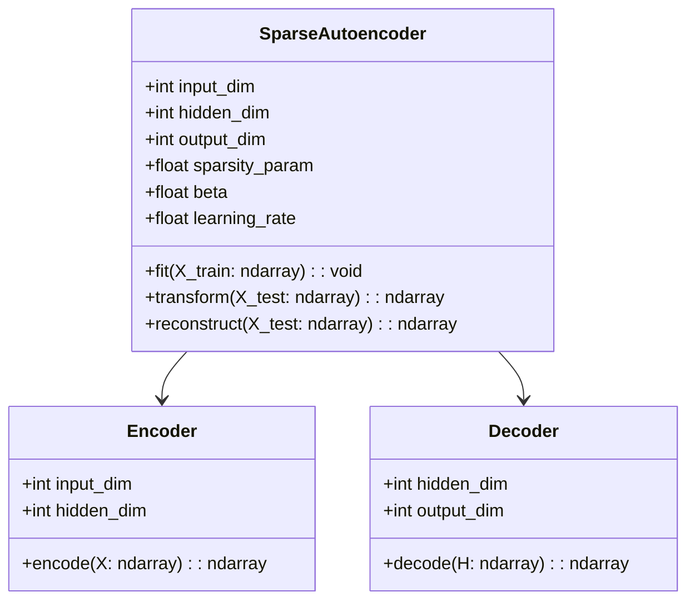
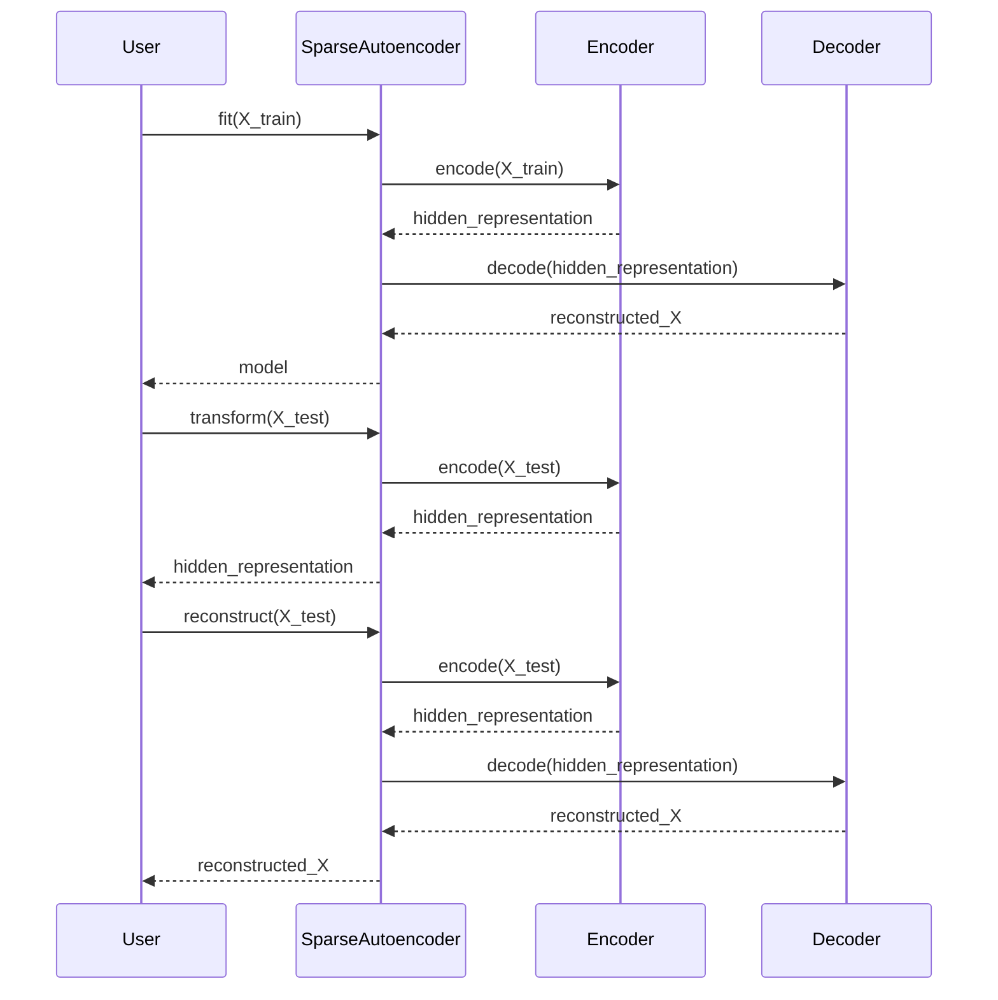

## Introduction

Sparse Autoencoders are a unique type of autoencoder neural network that include an additional sparsity constraint applied to the hidden units. This helps the network learn robust features for tasks such as feature extraction and dimensionality reduction. 

## Overview

### What is a Sparse Autoencoder?

A Sparse Autoencoder is a neural network designed with an encoder-decoder architecture, similar to a traditional autoencoder. However, the hidden layer in a Sparse Autoencoder is designed to have a high level of sparsity. This means that most of the hidden units are inactive (or close to zero) at any given time. The sparsity constraint is usually imposed using techniques like L1 regularization or KL divergence.

### Key Components
- **Encoder:** Maps the input to a hidden representation.
- **Decoder:** Reconstructs the input from the hidden representation.
- **Sparsity Constraint:** A penalty term that ensures most hidden units are inactive.

### Use Case: Feature Extraction

Sparse Autoencoders are particularly useful for feature extraction, where the goal is to derive meaningful and reduced representations of the input data.

## Benefits

- **Improved Feature Extraction:** By penalizing the hidden layer, the autoencoder can learn more robust and informative features.
- **Dimensionality Reduction:** Helps in reducing the dimensionality of the input data, making it suitable for various downstream tasks.
- **Enhanced Generalization:** The sparsity constraint improves the generalization of the model to unseen data.

## Trade-offs

- **Complexity:** The addition of sparsity constraints increases the complexity of the model.
- **Training Time:** The time required to train a Sparse Autoencoder can be longer due to the additional sparsity penalty.

## UML Diagrams

### Class Diagram


### Sequence Diagram


## Example Implementations

### Python

```python
import numpy as np
from tensorflow.keras import layers, models, regularizers

class SparseAutoencoder:
    def __init__(self, input_dim, hidden_dim, sparsity_param, beta, learning_rate=0.01):
        self.input_dim = input_dim
        self.hidden_dim = hidden_dim
        self.sparsity_param = sparsity_param
        self.beta = beta

        self.model = self.build_model()
        self.model.compile(optimizer='adam', loss='mse')

    def build_model(self):
        input_layer = layers.Input(shape=(self.input_dim,))
        hidden_layer = layers.Dense(self.hidden_dim, activation='relu',
                                    activity_regularizer=regularizers.l1(self.sparsity_param))(input_layer)
        output_layer = layers.Dense(self.input_dim, activation='sigmoid')(hidden_layer)

        return models.Model(inputs=input_layer, outputs=output_layer)

    def fit(self, X_train):
        self.model.fit(X_train, X_train, epochs=50, batch_size=256, shuffle=True)

    def transform(self, X):
        encoder = models.Model(self.model.input, self.model.layers[1].output)
        return encoder.predict(X)

    def reconstruct(self, X):
        return self.model.predict(X)

# sa = SparseAutoencoder(input_dim=784, hidden_dim=128, sparsity_param=1e-4, beta=3)
# encoded_data = sa.transform(X_test)
```

### Java

```java
// SparseAutoencoder in Java using DL4J
import org.deeplearning4j.nn.conf.layers.DenseLayer;
import org.deeplearning4j.nn.conf.NeuralNetConfiguration;
import org.deeplearning4j.nn.conf.inputs.InputType;
import org.deeplearning4j.nn.conf.layers.OutputLayer;
import org.deeplearning4j.nn.multilayer.MultiLayerNetwork;
import org.deeplearning4j.nn.weights.WeightInit;
import org.deeplearning4j.optimize.listeners.ScoreIterationListener;
import org.nd4j.linalg.api.ndarray.INDArray;
import org.nd4j.linalg.activations.Activation;
import org.nd4j.linalg.dataset.api.iterator.DataSetIterator;
import org.nd4j.linalg.learning.config.Adam;
import org.nd4j.linalg.lossfunctions.LossFunctions;

public class SparseAutoencoder {
    private MultiLayerNetwork model;
    private int inputDim;
    private int hiddenDim;
    private double sparsityParam;
    private double beta;

    public SparseAutoencoder(int inputDim, int hiddenDim, double sparsityParam, double beta) {
        this.inputDim = inputDim;
        this.hiddenDim = hiddenDim;
        this.sparsityParam = sparsityParam;
        this.beta = beta;
        buildModel();
    }

    private void buildModel() {
        NeuralNetConfiguration.ListBuilder builder = new NeuralNetConfiguration.Builder()
                .seed(123)
                .updater(new Adam(0.01))
                .list()
                .layer(0, new DenseLayer.Builder()
                        .nIn(inputDim)
                        .nOut(hiddenDim)
                        .weightInit(WeightInit.XAVIER)
                        .activation(Activation.RELU)
                        .build())
                .layer(1, new OutputLayer.Builder()
                        .nIn(hiddenDim)
                        .nOut(inputDim)
                        .lossFunction(LossFunctions.LossFunction.MSE)
                        .activation(Activation.SIGMOID)
                        .build());

        this.model = new MultiLayerNetwork(builder.build());
        this.model.init();
        this.model.setListeners(new ScoreIterationListener(10));
    }

    public void fit(DataSetIterator iterator) {
        model.fit(iterator);
    }

    public INDArray transform(INDArray input) {
        return model.feedForwardToLayer(1, input).get(1);
    }

    public INDArray reconstruct(INDArray input) {
        return model.output(input);
    }
}
```

### Scala

```scala
// Sparse Autoencoder in Scala using Breeze and DL4J
import org.deeplearning4j.nn.conf.NeuralNetConfiguration
import org.deeplearning4j.nn.conf.layers.{DenseLayer, OutputLayer}
import org.deeplearning4j.nn.multilayer.MultiLayerNetwork
import org.deeplearning4j.optimize.listeners.ScoreIterationListener
import org.nd4j.linalg.activations.Activation
import org.nd4j.linalg.dataset.api.iterator.DataSetIterator
import org.nd4j.linalg.learning.config.Adam
import org.nd4j.linalg.lossfunctions.LossFunctions
import org.nd4j.linalg.api.ndarray.INDArray

class SparseAutoencoder(val inputDim: Int, val hiddenDim: Int, val sparsityParam: Double, val beta: Double) {
  
  private var model: MultiLayerNetwork = buildModel()
  
  def buildModel(): MultiLayerNetwork = {
    val conf = new NeuralNetConfiguration.Builder()
      .seed(123)
      .updater(new Adam(0.01))
      .list()
      .layer(0, new DenseLayer.Builder()
        .nIn(inputDim)
        .nOut(hiddenDim)
        .activation(Activation.RELU)
        .build())
      .layer(1, new OutputLayer.Builder(LossFunctions.LossFunction.MSE)
        .nIn(hiddenDim)
        .nOut(inputDim)
        .activation(Activation.SIGMOID)
        .build())
      .build()
    
    val net = new MultiLayerNetwork(conf)
    net.init()
    net.setListeners(new ScoreIterationListener(10))
    net
  }

  def fit(iterator: DataSetIterator): Unit = {
    model.fit(iterator)
  }
  
  def transform(input: INDArray): INDArray = {
    model.feedForwardToLayer(1, input).get(1)
  }

  def reconstruct(input: INDArray): INDArray = {
    model.output(input)
  }
}
```

### Clojure

```clojure
(ns sparse-autoencoder.core
  (:require [clojure.core.matrix :as m])
  (:require [think.neural.network :as nn]))

(defn build-model [input-dim hidden-dim sparsity-param beta]
  (let [model (nn/initialize [input-dim hidden-dim input-dim]
                             {:activation-fn nn/relu
                              :output-activation-fn nn/sigmoid
                              :loss-fn nn/mse-loss})]
    model))

(defn fit [model x-train epochs]
  (nn/train! model x-train x-train {:epochs epochs}))

(defn transform [model x]
  (nn/feed-forward model x {:layer 1}))

(defn reconstruct [model x]
  (nn/feed-forward model x))

;; Usage
;; (def model (build-model 784 128 1e-4 3))
;; (fit model x-train 50)
;; (def encoded-data (transform model x-test))
;; (def reconstructed-data (reconstruct model x-test))
```

## Related Design Patterns

- **Denoising Autoencoder:** Adds noise to input data and learns to reconstruct the original data. Useful for creating robust features.
- **Variational Autoencoder:** Introduces probabilistic elements to encode data distribution, aiding in generative tasks.
- **Contractive Autoencoder:** Adds a penalty on the Frobenius norm of the Jacobian of hidden representations to ensure stability.

## Resources and References

- [Deep Learning Book by Ian Goodfellow, Yoshua Bengio, and Aaron Courville](https://www.deeplearningbook.org/)
- [CS231n Convolutional Neural Networks for Visual Recognition - Stanford](http://cs231n.stanford.edu/)
- [Keras Documentation](https://keras.io/)
- [Deeplearning4j Documentation](https://deeplearning4j.org/docs/latest/)
- [ThinkNeural Network Clojure Library](https://github.com/thinktopic/thinkneural)

## Open Source Frameworks

- **TensorFlow/Keras:** Popular deep learning libraries in Python.
- **Deeplearning4j:** Java and Scala-based deep learning framework.
- **ThinkNeural:** Neural network library for Clojure.

## Summary

Sparse Autoencoders introduce sparsity constraints to improve the feature extraction capabilities of traditional autoencoders. They are beneficial for dimensionality reduction, improved generalization, and robust feature learning. Despite the increased complexity and training time, Sparse Autoencoders are a powerful tool for machine learning and data processing tasks. With support from various programming languages and frameworks, implementing Sparse Autoencoders is both flexible and accessible.

Explore the concepts, benefits, and trade-offs discussed in this article to understand how Sparse Autoencoders can fit into your machine learning workflow.
