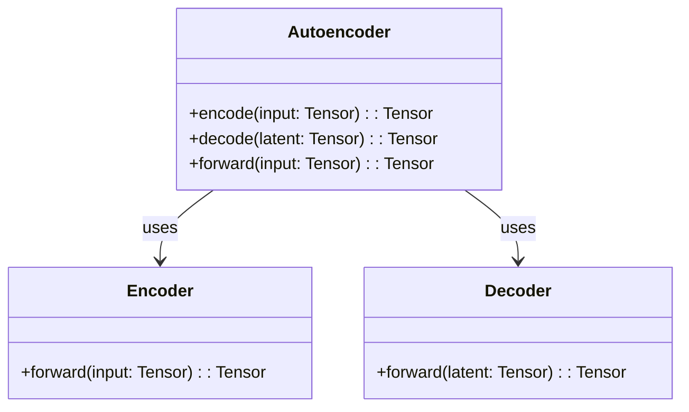
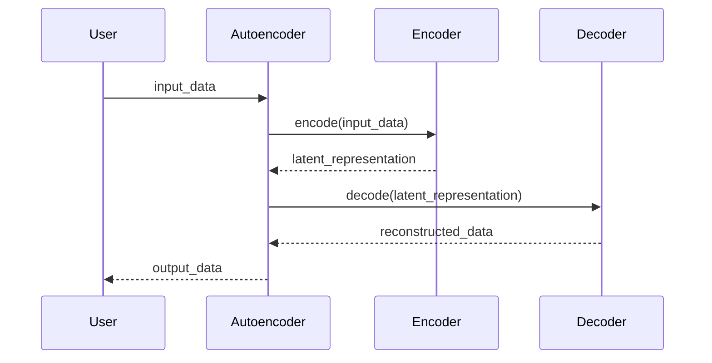

## Introduction

The **Vanilla Autoencoder** is a foundational neural network design pattern that leverages a basic encoder-decoder architecture. Its primary function is to perform data denoising and dimensionality reduction by learning efficient codings of input data.

## Key Concepts

### Encoder-Decoder Model
The autoencoder consists of two main components:
- **Encoder:** Compresses the input into a latent-space representation.
- **Decoder:** Reconstructs the original data from the latent-space representation.

## Use Cases

### Data Denoising
Vanilla Autoencoders are often utilized to clean noisy data, effectively separating the noise from the original signal.

### Dimensionality Reduction
They can also reduce the dimensionality of data, making it easier to visualize or process using other algorithms.

## UML Diagrams

### Class Diagram



### Sequence Diagram



## Implementations

### Python
```python
import torch
import torch.nn as nn

class Encoder(nn.Module):
    def __init__(self, input_dim, latent_dim):
        super(Encoder, self).__init__()
        self.fc = nn.Linear(input_dim, latent_dim)
        
    def forward(self, x):
        return self.fc(x)

class Decoder(nn.Module):
    def __init__(self, latent_dim, output_dim):
        super(Decoder, self).__init__()
        self.fc = nn.Linear(latent_dim, output_dim)
        
    def forward(self, x):
        return self.fc(x)

class Autoencoder(nn.Module):
    def __init__(self, input_dim, latent_dim):
        super(Autoencoder, self).__init__()
        self.encoder = Encoder(input_dim, latent_dim)
        self.decoder = Decoder(latent_dim, input_dim)
        
    def forward(self, x):
        latent = self.encoder.forward(x)
        return self.decoder.forward(latent)
```

### Java
```java
import org.deeplearning4j.nn.conf.MultiLayerConfiguration;
import org.deeplearning4j.nn.conf.NeuralNetConfiguration;
import org.deeplearning4j.nn.conf.layers.AutoEncoder;
import org.deeplearning4j.nn.multilayer.MultiLayerNetwork;
import org.nd4j.linalg.dataset.api.iterator.DataSetIterator;

public class VanillaAutoencoder {
    public static void main(String[] args) {
        MultiLayerConfiguration conf = new NeuralNetConfiguration.Builder()
            .list()
            .layer(0, new AutoEncoder.Builder().nIn(784).nOut(250).build())
            .layer(1, new AutoEncoder.Builder().nIn(250).nOut(784).build())
            .build();
        
        MultiLayerNetwork model = new MultiLayerNetwork(conf);
        model.init();
        
        // Assuming datasetIterator has been initialized
        DataSetIterator datasetIterator = ... ;
        model.fit(datasetIterator);
    }
}
```

### Scala
```scala
import org.apache.spark.ml.Pipeline
import org.apache.spark.ml.feature.PCA
import org.apache.spark.sql.SparkSession

object VanillaAutoencoder {
  def main(args: Array[String]): Unit = {
    val spark = SparkSession.builder.appName("VanillaAutoencoder").getOrCreate()
    val dataset = ... // Load dataset

    val pca = new PCA()
      .setInputCol("features")
      .setOutputCol("pcaFeatures")
      .setK(50)
    
    val pipeline = new Pipeline().setStages(Array(pca))
    val model = pipeline.fit(dataset)
    
    val pcaDF = model.transform(dataset)
    pcaDF.show()
    
    spark.stop()
  }
}
```

### Clojure
```clojure
(ns vanilla-autoencoder.core
  (:require [dl4j.nn :as nn]))

(defn build-autoencoder []
  (nn/build-network {:layers [{:type :autoencoder :n-in 784 :n-out 250}
                              {:type :autoencoder :n-in 250 :n-out 784}]
                     :input {}}))

(defn train-autoencoder [model data-iterator]
  (nn/train model data-iterator))
```

## Benefits
- **Simplicity:** Easy to implement and understand.
- **Versatility:** Suitable for a range of applications including denoising and dimensionality reduction.
- **Efficiency:** Capable of learning useful data representations.

## Trade-offs
- **Reconstruction Error:** May not perfectly reconstruct the input data.
- **Scalability:** Performance may degrade with very high-dimensional data.
- **Overfitting:** Prone to overfitting, especially with small datasets.

## Examples of Use Cases
- **Image Denoising:** Removing noise from images while preserving important details.
- **Anomaly Detection:** Identifying outliers by measuring reconstruction error.
- **Data Compression:** Reducing data size for more efficient storage and processing.

## Related Design Patterns
- **Variational Autoencoder (VAE):** Introduces probabilistic components to improve generalization.
- **Convolutional Autoencoder (CAE):** Utilizes convolutional layers to better handle spatial data like images.

## Resources and References
- [Deep Learning with PyTorch](https://pytorch.org/)
- [Deeplearning4j Documentation](https://deeplearning4j.org/docs/latest/)
- [Apache Spark MLlib](https://spark.apache.org/mllib/)
- [Keras Autoencoder Examples](https://keras.io/examples/)

## Summary
The Vanilla Autoencoder is a versatile and simple neural network design pattern that excels in tasks such as data denoising and dimensionality reduction. Its encoder-decoder architecture enables efficient data representation and reconstruction, making it a powerful tool in various machine learning applications. However, care must be taken to avoid overfitting and ensure scalability.

By understanding the benefits, trade-offs, and appropriate use cases, developers can effectively utilize Vanilla Autoencoders to enhance their data processing and machine learning workflows.
