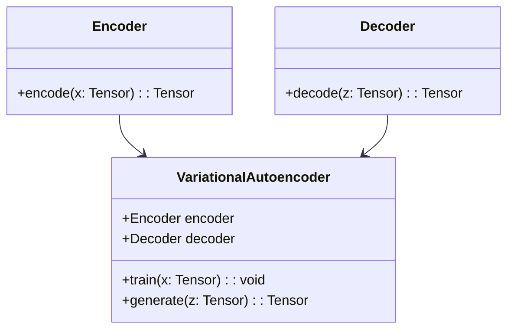
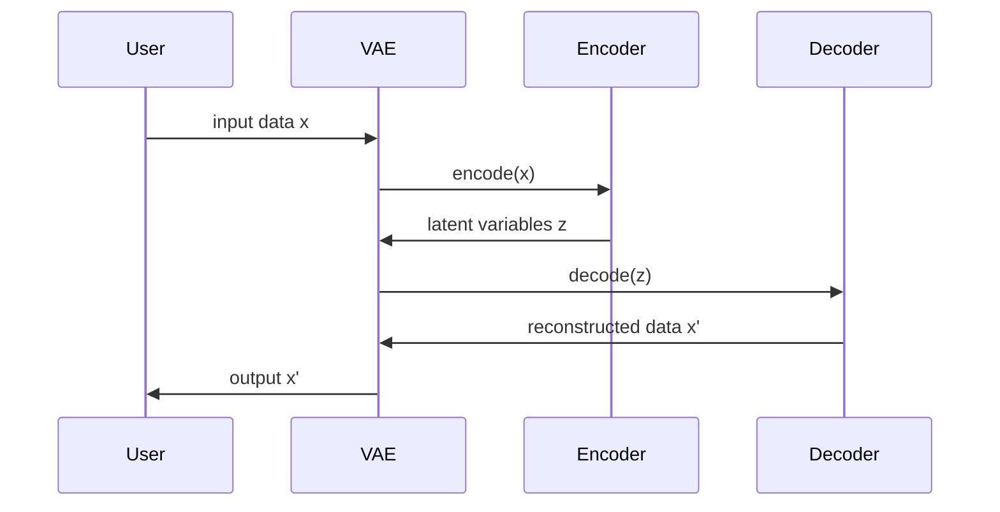

## Overview of Variational Autoencoder (VAE)

A Variational Autoencoder (VAE) is a type of generative model that uses neural networks to approximate complex probabilistic distributions. It leverages the power of variational inference to estimate the latent variables of the data. VAEs are designed to generate new data points that are similar to the training data, making them useful in applications like image generation, anomaly detection, and data compression.

## Structure and Components

### Encoder and Decoder Architecture

The VAE consists of two primary components:

1. **Encoder (Recognition Model):** This neural network maps the input data \\(x\\) to a latent space \\(z\\) by learning the parameters of a probability distribution, typically a Gaussian.

2. **Decoder (Generative Model):** This neural network maps the latent variables \\(z\\) back to the input data space, reconstructing the original data.

### Loss Function

The loss function in VAE is a combination of two terms:
1. **Reconstruction Loss:** Measures how well the decoder reconstructs the input data.
2. **KL Divergence Loss:** Measures how much the learned distribution diverges from the prior distribution.

The objective function to minimize is:


\mathcal{L} = \mathbb{E}_{q(z|x)} [ \log p(x|z) ] - \text{KL}( q(z|x) || p(z) )


where:
- \\( q(z|x) \\) is the approximate posterior.
- \\( p(z) \\) is the prior over the latent variables.
- \\( p(x|z) \\) is the likelihood of the data given the latent variables.

## UML Diagrams

### Class Diagram



### Sequence Diagram



## Implementation Examples

### Python

```python
import torch
import torch.nn as nn
import torch.optim as optim

class Encoder(nn.Module):
    def __init__(self, input_dim, latent_dim):
        super(Encoder, self).__init__()
        self.fc1 = nn.Linear(input_dim, 400)
        self.fc2_mu = nn.Linear(400, latent_dim)
        self.fc2_logvar = nn.Linear(400, latent_dim)

    def encode(self, x):
        h = torch.relu(self.fc1(x))
        return self.fc2_mu(h), self.fc2_logvar(h)

class Decoder(nn.Module):
    def __init__(self, latent_dim, output_dim):
        super(Decoder, self).__init__()
        self.fc3 = nn.Linear(latent_dim, 400)
        self.fc4 = nn.Linear(400, output_dim)

    def decode(self, z):
        h = torch.relu(self.fc3(z))
        return torch.sigmoid(self.fc4(h))

class VAE(nn.Module):
    def __init__(self, input_dim, latent_dim):
        super(VAE, self).__init__()
        self.encoder = Encoder(input_dim, latent_dim)
        self.decoder = Decoder(latent_dim, input_dim)

    def forward(self, x):
        mu, logvar = self.encoder.encode(x)
        std = torch.exp(0.5 * logvar)
        eps = torch.randn_like(std)
        z = mu + eps * std
        return self.decoder.decode(z), mu, logvar

    def loss_function(self, recon_x, x, mu, logvar):
        BCE = nn.functional.binary_cross_entropy(recon_x, x, reduction='sum')
        KLD = -0.5 * torch.sum(1 + logvar - mu.pow(2) - logvar.exp())
        return BCE + KLD

input_dim = 784 # example for MNIST
latent_dim = 20
vae = VAE(input_dim, latent_dim)
optimizer = optim.Adam(vae.parameters(), lr=1e-3)

def train(model, data_loader, optimizer):
    model.train()
    train_loss = 0
    for batch_idx, (data, _) in enumerate(data_loader):
        data = data.view(-1, 784)
        optimizer.zero_grad()
        recon_batch, mu, logvar = model(data)
        loss = model.loss_function(recon_batch, data, mu, logvar)
        loss.backward()
        train_loss += loss.item()
        optimizer.step()
    return train_loss / len(data_loader.dataset)
```

### Java

```java
import org.deeplearning4j.nn.conf.NeuralNetConfiguration;
import org.deeplearning4j.nn.conf.layers.DenseLayer;
import org.deeplearning4j.nn.conf.layers.OutputLayer;
import org.deeplearning4j.nn.multilayer.MultiLayerNetwork;
import org.deeplearning4j.nn.weights.WeightInit;
import org.deeplearning4j.optimize.listeners.ScoreIterationListener;
import org.nd4j.linalg.activations.Activation;
import org.nd4j.linalg.dataset.api.iterator.DataSetIterator;
import org.nd4j.linalg.lossfunctions.LossFunctions;
import org.nd4j.linalg.learning.config.Adam;

public class VAE {
    private MultiLayerNetwork encoder;
    private MultiLayerNetwork decoder;

    public VAE(int inputDim, int latentDim) {
        encoder = new MultiLayerNetwork(new NeuralNetConfiguration.Builder()
            .weightInit(WeightInit.XAVIER)
            .updater(new Adam(0.001))
            .list()
            .layer(new DenseLayer.Builder().nIn(inputDim).nOut(400)
                .activation(Activation.RELU)
                .build())
            .layer(new OutputLayer.Builder()
                .activation(Activation.IDENTITY)
                .nIn(400).nOut(latentDim)
                .lossFunction(LossFunctions.LossFunction.MSE)
                .build())
            .build());
        encoder.init();

        decoder = new MultiLayerNetwork(new NeuralNetConfiguration.Builder()
            .weightInit(WeightInit.XAVIER)
            .updater(new Adam(0.001))
            .list()
            .layer(new DenseLayer.Builder().nIn(latentDim).nOut(400)
                .activation(Activation.RELU)
                .build())
            .layer(new OutputLayer.Builder()
                .activation(Activation.SIGMOID)
                .nIn(400).nOut(inputDim)
                .lossFunction(LossFunctions.LossFunction.MSE)
                .build())
            .build());
        decoder.init();
    }

    public void train(DataSetIterator dataSetIterator) {
        encoder.setListeners(new ScoreIterationListener(10));
        decoder.setListeners(new ScoreIterationListener(10));

        while (dataSetIterator.hasNext()) {
            // Training logic for VAE
        }
    }
}
```

### Scala

```scala
import org.apache.spark.ml.feature._
import org.apache.spark.ml.linalg._
import org.apache.spark.ml.regression._
import org.apache.spark.sql.SparkSession

class VAE(inputDim: Int, latentDim: Int) {
  val encoder: LogisticRegression = new LogisticRegression()
    .setMaxIter(10)
    .setRegParam(0.3)
    .setElasticNetParam(0.8)
  val decoder: LinearRegression = new LinearRegression()
    .setMaxIter(10)
    .setRegParam(0.3)
    .setElasticNetParam(0.8)

  def train(data: DataFrame): Unit = {
    // Encoder and Decoder training logic
  }
}

val spark = SparkSession.builder.appName("VAE Example").getOrCreate()
val inputDim = 784 // example for MNIST
val latentDim = 20
val vae = new VAE(inputDim, latentDim)
// Prepare data and call vae.train(data)
```

### Clojure

```clojure
(ns vae-example.core
  (:require [clojure.core.matrix :as m]
            [dl4clj.nn.api.networks :refer [feed-forward-net]]
            [dl4clj.nn.api.layers :refer [dense-layer output-layer]]
            [dl4clj.optimize.api :refer [adam]]
            [dl4clj.data.api :refer [load-iris]]))

(defn create-vae [input-dim latent-dim]
  (let [encoder (feed-forward-net :layers [(dense-layer :n-in input-dim :n-out 400 :activation :relu)
                                           (output-layer :n-in 400 :n-out latent-dim)])
        decoder (feed-forward-net :layers [(dense-layer :n-in latent-dim :n-out 400 :activation :relu)
                                           (output-layer :n-in 400 :n-out input-dim :activation :sigmoid)])]
    {:encoder encoder :decoder decoder}))

(defn train-vae [vae data]
  ;; Training logic for VAE
  )

(def input-dim 784) ;; example for MNIST
(def latent-dim 20)
(def vae (create-vae input-dim latent-dim))
(def data (load-iris))
(train-vae vae data)
```

## Benefits

- **Probabilistic Framework:** Provides a probabilistic framework for unsupervised learning.
- **Generative Capability:** Can generate new data points similar to the training data.
- **Robust Representation:** Learns robust representations of data in a lower-dimensional latent space.

## Trade-offs

- **Complexity:** More complex and computationally intensive compared to traditional autoencoders.
- **Training Instability:** Training VAEs can be unstable and requires careful tuning of hyperparameters.

## Use Cases

- **Image Generation:** Generate new images that are similar to those in the training dataset.
- **Anomaly Detection:** Detect anomalies by measuring reconstruction error.
- **Data Compression:** Compress high-dimensional data to a lower-dimensional latent space.

## Related Design Patterns

- **Autoencoders:** Simplified version of VAEs that do not impose a probabilistic structure on the latent space.
- **Generative Adversarial Networks (GANs):** Another type of generative model that uses adversarial training.

## Resources and References

- **Kingma, D.P. & Welling, M.** Auto-Encoding Variational Bayes. [Link](https://arxiv.org/abs/1312.6114)
- **Deep Learning Libraries:** 
  - PyTorch
  - TensorFlow
  - Deeplearning4j
- **Books:**
  - "Deep Learning" by Ian Goodfellow, Yoshua Bengio, Aaron Courville

## Summary

Variational Autoencoders (VAEs) provide a powerful framework for generative modeling using probabilistic methods and neural networks. By learning a lower-dimensional representation of the data, VAEs can generate new, similar data points, detect anomalies, and compress data. Despite the complexity and training instability, the benefits and applications of VAEs make them a valuable tool in the arsenal of machine learning models.

---

By following this guide, you will gain a deep understanding of VAEs, their components, and how to implement them in various programming languages.
