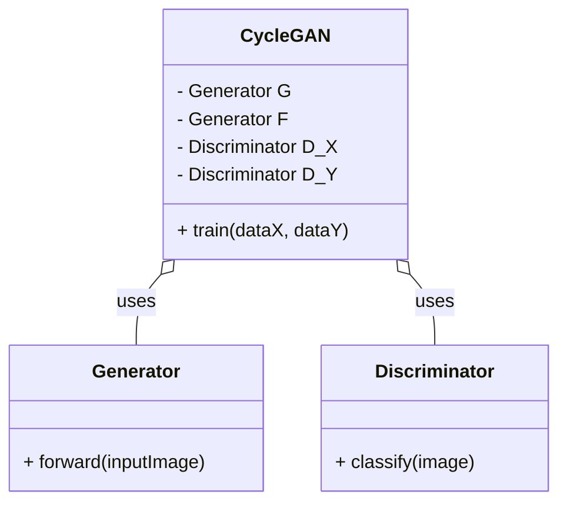
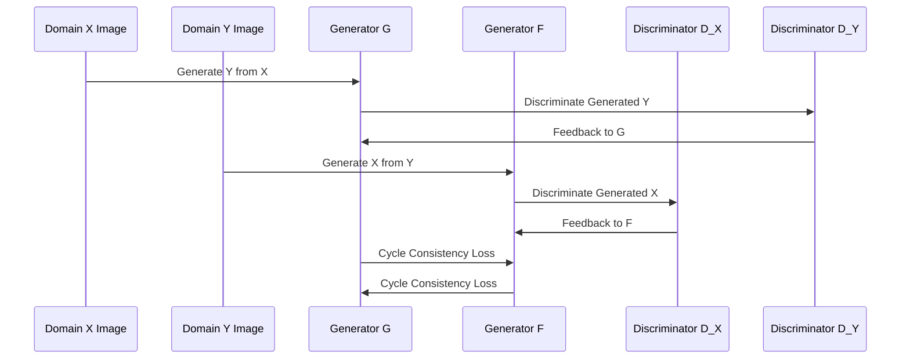

CycleGAN (Cycle-Consistent Generative Adversarial Networks) is a type of neural network architecture designed to convert images from one domain to another without needing paired examples. This capability makes CycleGAN ideal for tasks such as style transfer, where you want to map an image in one style to another style.

## Detailed Description

CycleGAN builds upon the foundations of Generative Adversarial Networks (GANs) but adds the unique twist of cycle consistency. This addition helps in learning an effective mapping between two domains without paired training examples, addressing significant limitations of traditional GANs.

### Core Concept

The central idea behind CycleGAN is the introduction of two generators and two discriminators:
- **Generator G**: Transforms images from domain \\( X \\) to domain \\( Y \\).
- **Generator F**: Transforms images from domain \\( Y \\) to domain \\( X \\).
- **Discriminator \\( D_X \\)**: Distinguishes between real images from domain \\( X \\) and fake images generated by \\( F \\).
- **Discriminator \\( D_Y \\)**: Distinguishes between real images from domain \\( Y \\) and fake images generated by \\( G \\).

Cycle consistency loss ensures that an image translated from one domain to another and back should closely resemble the original image.


\mathcal{L}_{cyc}(G, F) = \mathbb{E}_{x \sim p_{data}(x)}[\| F(G(x)) - x \|_1] + \mathbb{E}_{y \sim p_{data}(y)}[\| G(F(y)) - y \|_1]


### UML Class Diagram



### UML Sequence Diagram



## Example Implementations

### Python Implementation

```python
import torch
import torch.nn as nn

class Generator(nn.Module):
    def __init__(self):
        super(Generator, self).__init__()
        # Define layers

    def forward(self, x):
        # Define forward pass
        pass

class Discriminator(nn.Module):
    def __init__(self):
        super(Discriminator, self).__init__()
        # Define layers

    def forward(self, x):
        # Define forward pass
        pass

class CycleGAN(nn.Module):
    def __init__(self):
        super(CycleGAN, self).__init__()
        self.G = Generator()
        self.F = Generator()
        self.D_X = Discriminator()
        self.D_Y = Discriminator()

    def train(self, dataX, dataY):
        # Training process
        pass
```

### Java Implementation

```java
public class CycleGAN {
    private Generator G;
    private Generator F;
    private Discriminator D_X;
    private Discriminator D_Y;

    public CycleGAN() {
        this.G = new Generator();
        this.F = new Generator();
        this.D_X = new Discriminator();
        this.D_Y = new Discriminator();
    }

    public void train(List<Data> dataX, List<Data> dataY) {
        // Training process
    }
}

class Generator {
    public Image forward(Image inputImage) {
        // Define forward pass
        return new Image();
    }
}

class Discriminator {
    public boolean classify(Image image) {
        // Define classification
        return false;
    }
}
```

### Scala Implementation

```scala
class Generator {
  def forward(inputImage: Image): Image = {
    // Define forward pass
    new Image()
  }
}

class Discriminator {
  def classify(image: Image): Boolean = {
    // Define classification
    false
  }
}

class CycleGAN {
  val G: Generator = new Generator
  val F: Generator = new Generator
  val DX: Discriminator = new Discriminator
  val DY: Discriminator = new Discriminator

  def train(dataX: List[Image], dataY: List[Image]): Unit = {
    // Training process
  }
}
```

### Clojure Implementation

```clojure
(defrecord Generator []
  Object
  (forward [this input-image]
    ;; Define forward pass
    (Image.)))

(defrecord Discriminator []
  Object
  (classify [this image]
    ;; Define classification
    false))

(defrecord CycleGAN [G F DX DY]
  Object
  (train [this dataX dataY]
    ;; Training process
    ))

(defn create-cyclegan []
  (->CycleGAN (->Generator) (->Generator) (->Discriminator) (->Discriminator)))
```

## Benefits

- **Unpaired Data**: Ability to learn mappings without paired examples.
- **Flexibility**: Can be used for various image translation tasks.
- **Preservation**: Maintains the significant features of the source image.

## Trade-offs

- **Complexity**: More complex architecture requiring careful tuning.
- **Training Time**: Longer training time due to the cyclic consistency loss.
- **Resource Intensive**: Requires substantial computational resources.

## Use Cases

- **Style Transfer**: Converting photos into artwork or applying different artistic styles.
- **Image Enhancement**: Improving image quality by mapping images from a lower quality domain to a higher quality domain.
- **Synthetic Data Generation**: Generating new datasets by transferring styles between domains.

## Related Design Patterns

- **GAN (Generative Adversarial Networks)**: CycleGAN is built upon GANs but introduces the concept of cycle consistency.
- **Pix2Pix**: Unlike CycleGAN, Pix2Pix requires paired data, but it's another significant pattern in the domain of image-to-image translation.

## Resources and References

- [CycleGAN Paper](https://arxiv.org/abs/1703.10593)
- [CycleGAN GitHub Repository](https://github.com/junyanz/pytorch-CycleGAN-and-pix2pix)
- [TensorFlow CycleGAN Tutorial](https://www.tensorflow.org/tutorials/generative/cyclegan)
- [CycleGAN in Keras](https://github.com/eriklindernoren/Keras-GAN#cyclegan)

## Summary

CycleGAN is a powerful neural network architecture that enables the translation of images from one domain to another without paired examples. Its cycle consistency loss allows it to learn the inherent characteristics of both domains effectively. Despite its complexity, it opens up new possibilities in fields like style transfer and synthetic data generation. By understanding and implementing CycleGAN, developers can leverage advanced image processing techniques to develop innovative applications.


