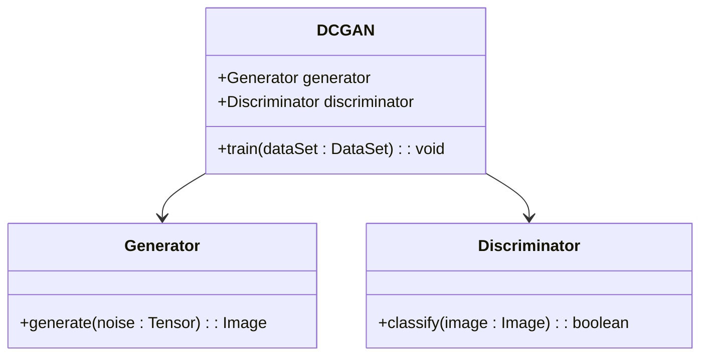
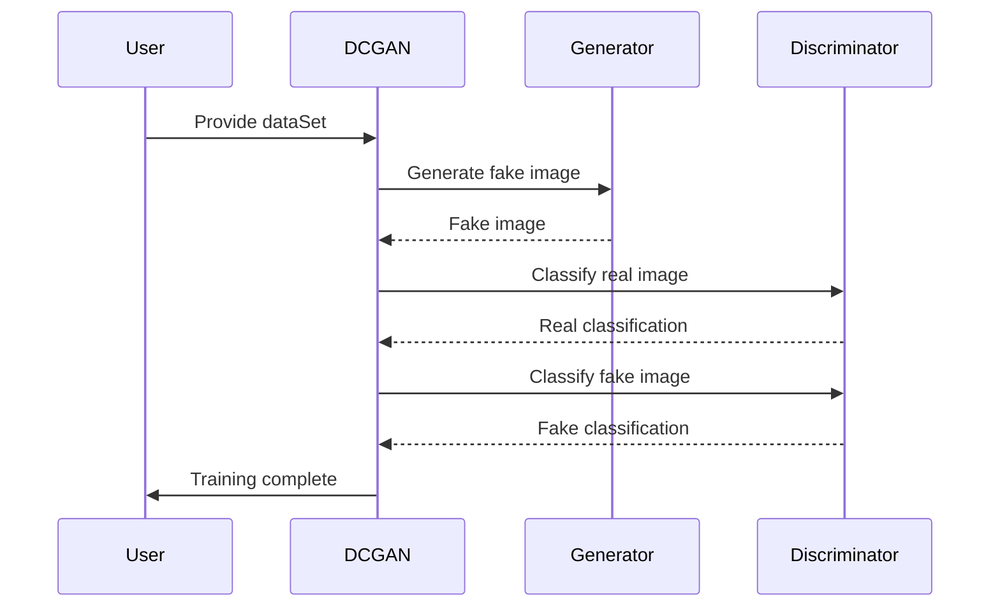

## DCGAN: Deep Convolutional Generative Adversarial Networks

### Overview

Deep Convolutional Generative Adversarial Networks (DCGANs) combine the strengths of Convolutional Neural Networks (CNNs) and Generative Adversarial Networks (GANs) to generate realistic images. DCGANs have been widely adopted in the field of generative modeling due to their capability to produce high-quality images and capture intricate details.

### Key Components

DCGAN consists of two primary components:
1. **Generator:** Generates fake images from random noise.
2. **Discriminator:** Distinguishes between real and fake images.

### UML Class Diagram



### Sequence Diagram



### Python Example

```python
import torch
import torch.nn as nn
import torch.optim as optim

class Generator(nn.Module):
    def __init__(self):
        super(Generator, self).__init__()
        self.main = nn.Sequential(
            nn.ConvTranspose2d(100, 64 * 8, 4, 1, 0, bias=False),
            nn.BatchNorm2d(64 * 8),
            nn.ReLU(True),
            # ... (additional layers)
            nn.ConvTranspose2d(64, 3, 4, 2, 1, bias=False),
            nn.Tanh()
        )
        
    def forward(self, input):
        return self.main(input)

class Discriminator(nn.Module):
    def __init__(self):
        super(Discriminator, self).__init__()
        self.main = nn.Sequential(
            nn.Conv2d(3, 64, 4, 2, 1, bias=False),
            nn.LeakyReLU(0.2, inplace=True),
            # ... (additional layers)
            nn.Conv2d(64 * 8, 1, 4, 1, 0, bias=False),
            nn.Sigmoid()
        )
        
    def forward(self, input):
        return self.main(input)

def train_dcgan(generator, discriminator, dataloader, epochs):
    criterion = nn.BCELoss()
    optimizerD = optim.Adam(discriminator.parameters(), lr=0.0002, betas=(0.5, 0.999))
    optimizerG = optim.Adam(generator.parameters(), lr=0.0002, betas=(0.5, 0.999))
    for epoch in range(epochs):
        for i, data in enumerate(dataloader, 0):
            # ... (training loop)
            pass
```

### Java Example

```java
public class DCGAN {
    public static void main(String[] args) {
        // Implement Java version of DCGAN training loop
    }
}

class Generator {
    // Implement generator using appropriate library (e.g., DL4J)
}

class Discriminator {
    // Implement discriminator using appropriate library (e.g., DL4J)
}
```

### Scala Example

```scala
object DCGAN {
  def main(args: Array[String]): Unit = {
    // Implement Scala version of DCGAN training loop
  }
}

class Generator {
  // Implement generator using appropriate library (e.g., Breeze, DL4J)
}

class Discriminator {
  // Implement discriminator using appropriate library (e.g., Breeze, DL4J)
}
```

### Clojure Example

```clojure
(ns dcgan.core)

(defn generator []
  ;; Implement generator using appropriate library
  )

(defn discriminator []
  ;; Implement discriminator using appropriate library
  )

(defn train-dcgan [epochs]
  ;; Implement training loop
  )
```

### Benefits

- **High-Quality Image Generation:** DCGANs excel at generating high-resolution and realistic images.
- **Scalability:** The use of CNNs enables DCGANs to scale efficiently to larger image sizes.
- **Versatility:** Can be applied to various domains including image-to-image translation and super-resolution.

### Trade-offs

- **Training Instability:** GANs in general, including DCGANs, can be challenging to train due to potential instability and mode collapse.
- **Resource Intensive:** Training DCGANs requires substantial computational resources.

### Use Cases

- **Image Synthesis:** Generation of realistic images for art, design, and other creative fields.
- **Data Augmentation:** Creating synthetic data to augment training datasets.
- **Super-Resolution:** Enhancing the resolution of low-quality images.

### Related Design Patterns

- **Vanilla GANs:** The basic form of GANs from which DCGAN is derived.
- **Conditional GANs (cGANs):** Extends GANs by adding conditional information such as class labels.
- **Wasserstein GANs (WGANs):** Improved GAN variant addressing instability in training.

### Resources and References

- [Original DCGAN Paper](https://arxiv.org/abs/1511.06434)
- [PyTorch DCGAN Tutorial](https://pytorch.org/tutorials/beginner/dcgan_faces_tutorial.html)
- [TensorFlow DCGAN Tutorial](https://www.tensorflow.org/tutorials/generative/dcgan)

### Open Source Frameworks

- **PyTorch:** `torch.nn`, `torchvision`
- **TensorFlow:** `tf.keras.layers`, `tf.data.Dataset`
- **Keras:** `keras.layers`, `keras.models`
- **DL4J:** DeepLearning4J for Java and Scala implementations

### Summary

DCGANs represent a powerful and versatile approach for generating realistic images by leveraging the strengths of Convolutional Neural Networks. While they offer significant benefits in image quality and scalability, they also come with challenges such as training instability and resource demands. Overall, DCGANs are a crucial tool in the toolkit of any deep learning practitioner interested in generative modeling.

By understanding and utilizing DCGANs, developers can create advanced applications in image synthesis, data augmentation, and beyond, pushing the boundaries of what is possible in AI-driven content generation.
