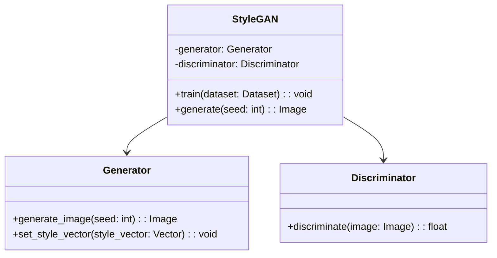
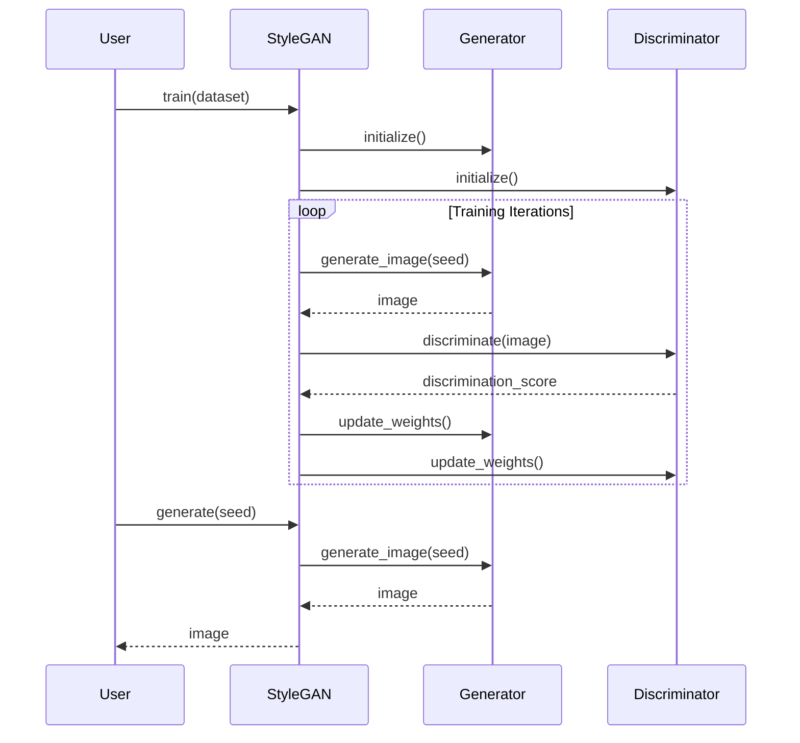

## Overview

StyleGAN is an advanced generative adversarial network (GAN) architecture developed by Nvidia, designed to produce high-quality images with unprecedented control over the image synthesis process. The key innovation of StyleGAN lies in its unique ability to disentangle the image generation process into style components, allowing for fine-grained control over the features of the generated images.

## Key Concepts

- **Style Mixing**: Enables control over individual levels of details in the generated images.
- **Adaptive Instance Normalization (AdaIN)**: Used for transferring styles into the network.
- **Progressive Growing**: Gradually increases image resolution during training for stability and improved quality.

## UML Class Diagram



## UML Sequence Diagram



## Python Example

```python
import torch
from stylegan import StyleGAN

stylegan = StyleGAN()
stylegan.train(dataset)

image = stylegan.generate(seed=42)
image.save('generated_image.png')
```

## Java Example

```java
public class StyleGANExample {
    public static void main(String[] args) {
        StyleGAN styleGAN = new StyleGAN();
        styleGAN.train(new Dataset());

        // Generate a new image
        Image image = styleGAN.generate(42);
        image.save("generated_image.png");
    }
}
```

## Scala Example

```scala
object StyleGANExample {
  def main(args: Array[String]): Unit = {
    val styleGAN = new StyleGAN()
    styleGAN.train(new Dataset())

    // Generate a new image
    val image = styleGAN.generate(42)
    image.save("generated_image.png")
  }
}
```

## Clojure Example

```clojure
(ns stylegan-example
  (:require [stylegan.core :as sg]))

(defn -main []
  (let [stylegan (sg/create-stylegan)]
    (sg/train stylegan dataset)
    ;; Generate a new image
    (let [image (sg/generate stylegan 42)]
      (sg/save image "generated_image.png"))))
```

## Benefits and Trade-offs

### Benefits

- **High Image Quality**: StyleGAN can generate images with high resolution and remarkable detail.
- **Control Over Features**: Allows for manipulation of specific attributes of the generated images.
- **Flexible Architecture**: Can be adapted and extended for different types of image synthesis tasks.

### Trade-offs

- **Resource Intensive**: Requires significant computational power and memory.
- **Training Time**: Training StyleGAN models can be time-consuming.
- **Complexity**: The architecture and training procedure can be complex and challenging to implement.

## Use Cases

- **Art and Design**: Generation of artwork or design prototypes.
- **Gaming and Movies**: Creating realistic textures and characters.
- **Healthcare**: Generating synthetic medical images for training and research.
- **Fashion**: Designing new apparel patterns and styles.

## Related Design Patterns

- **Vanilla GANs**: The basic architecture for generative adversarial networks.
- **Progressive GANs**: Introduces progressive training to improve quality and stability.
- **CycleGAN**: Enables image-to-image translation without paired examples.

## Resources and References

- **Original Paper**: [A Style-Based Generator Architecture for Generative Adversarial Networks](https://arxiv.org/abs/1812.04948)
- **Nvidia’s Implementation**: [StyleGAN Github Repository](https://github.com/NVlabs/stylegan)
- **Further Reading**: [Understanding StyleGAN – A Thorough Analysis](https://medium.com/@jonathan_hui/understanding-stylegan-part-i-what-is-stylegan-b0f4dd232499)

## Open Source Frameworks

- **TensorFlow**: StyleGAN implementation using TensorFlow framework.
- **PyTorch**: Multiple PyTorch implementations available on GitHub.
- **Keras**: High-level API implementation with Keras.

## Summary

StyleGAN revolutionizes the field of image synthesis with its novel architecture and fine-grained control over generated images. While resource-intensive and complex, it provides unparalleled image quality and flexibility, making it invaluable for applications in art, entertainment, healthcare, and beyond. Its related design patterns, extensive research references, and available open-source implementations further underscore its impact and utility in various domains.
