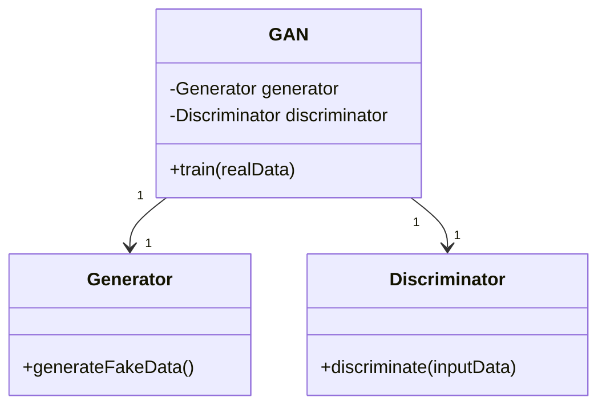
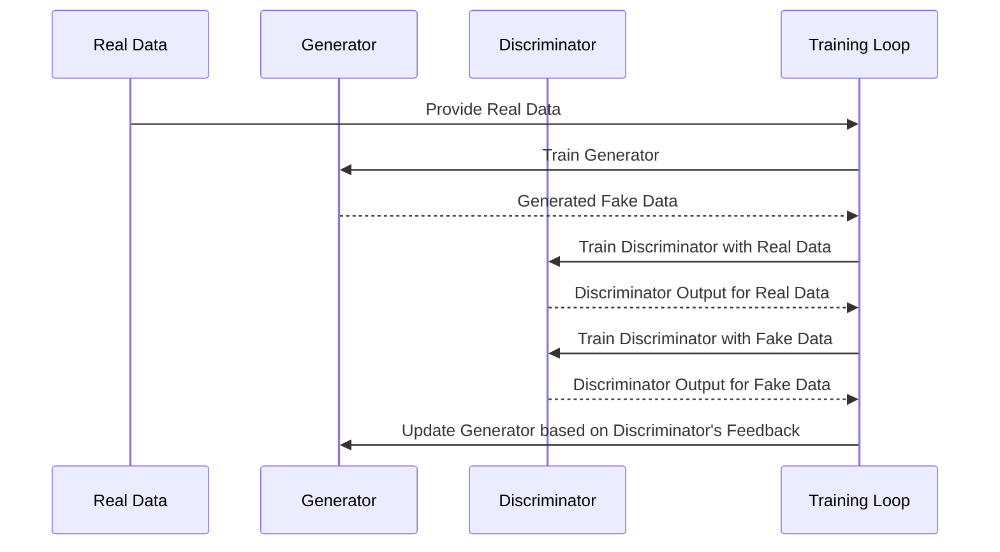

Generative Adversarial Networks (GANs) are a class of neural networks used in unsupervised machine learning, widely known for their ability to generate realistic data. The **Vanilla GAN** is the most fundamental form of GAN architecture consisting of two neural networks: the generator and the discriminator.

## Overview

A **Vanilla GAN** is composed of:
- A **Generator (G)** that captures the data distribution and attempts to generate fake data resembling real data.
- A **Discriminator (D)** that evaluates the authenticity of data, distinguishing between real and generated (fake) data.

## UML Class Diagram

Here’s a simple UML class diagram illustrating the basic structure of a Vanilla GAN:



## UML Sequence Diagram

Below is a UML sequence diagram showing the interaction between the Generator and Discriminator during the training process of a Vanilla GAN:



## Components

### Generator
- **Function:** Generate data that mimics real data.
- **Architecture:** Typically a neural network, often a simple Multi-Layer Perceptron (MLP) or Convolutional Neural Network (CNN).

### Discriminator
- **Function:** Discriminate between real and generated data.
- **Architecture:** Usually a neural network similar to the generator but configured to output a single probability value.

## Workflow

1. **Initialization**: Initialize both Generator (G) and Discriminator (D) networks.
2. **Data Feed**: Provide real data to the system.
3. **Generator Training**: Train G to generate fake data.
4. **Discriminator Training**: Train D to distinguish between real and fake data.
5. **Adversarial Feedback**: Use D's feedback to improve G.
6. **Iteration**: Repeat steps 3-5 for several epochs.

## Python Example

```python
import tensorflow as tf
from tensorflow.keras import layers

def build_generator():
    model = tf.keras.Sequential([
        layers.Dense(128, activation='relu', input_dim=100),
        layers.Dense(784, activation='sigmoid')
    ])
    return model

def build_discriminator():
    model = tf.keras.Sequential([
        layers.Dense(128, activation='relu', input_shape=(784,)),
        layers.Dense(1, activation='sigmoid')
    ])
    return model

generator = build_generator()
discriminator = build_discriminator()
discriminator.compile(optimizer='adam', loss='binary_crossentropy')

discriminator.trainable = False
gan_input = layers.Input(shape=(100,))
generated_image = generator(gan_input)
gan_output = discriminator(generated_image)
gan = tf.keras.Model(gan_input, gan_output)
gan.compile(optimizer='adam', loss='binary_crossentropy')

for epoch in range(epochs):
    # Train Discriminator with real and fake data
    real_data = ...  # Fetch real data
    fake_data = generator.predict(noise)
    discriminator.train_on_batch(real_data, real_labels)
    discriminator.train_on_batch(fake_data, fake_labels)
    
    # Train Generator
    gan.train_on_batch(noise, true_labels)
```

## Java Example

```java
// Due to Java's complexity, one might use a deep learning framework like Deeplearning4j

import org.deeplearning4j.nn.multilayer.MultiLayerNetwork;
import org.deeplearning4j.nn.conf.MultiLayerConfiguration;
import org.deeplearning4j.nn.conf.NeuralNetConfiguration;
import org.deeplearning4j.nn.layers.DenseLayer;
import org.deeplearning4j.nn.layers.OutputLayer;
import org.deeplearning4j.nn.weights.WeightInit;
import org.deeplearning4j.optimize.api.IterationListener;
import org.nd4j.linalg.activations.Activation;
import org.nd4j.linalg.api.ndarray.INDArray;
import org.nd4j.linalg.factory.Nd4j;
import org.nd4j.linalg.lossfunctions.LossFunctions;

public class VanillaGAN {

    public static void main(String[] args) {
        int seed = 123;
        int inputSize = 100;

        // Generator Configuration
        MultiLayerConfiguration genConf = new NeuralNetConfiguration.Builder()
                .seed(seed)
                .weightInit(WeightInit.XAVIER)
                .list()
                .layer(0, new DenseLayer.Builder().nIn(inputSize).nOut(128)
                        .activation(Activation.RELU).build())
                .layer(1, new OutputLayer.Builder(LossFunctions.LossFunction.MSE)
                        .activation(Activation.SIGMOID).nIn(128).nOut(784).build())
                .build();

        MultiLayerNetwork generator = new MultiLayerNetwork(genConf);
        generator.init();

        // Discriminator Configuration
        MultiLayerConfiguration disConf = new NeuralNetConfiguration.Builder()
                .seed(seed)
                .weightInit(WeightInit.XAVIER)
                .list()
                .layer(0, new DenseLayer.Builder().nIn(784).nOut(128)
                        .activation(Activation.RELU).build())
                .layer(1, new OutputLayer.Builder(LossFunctions.LossFunction.XENT)
                        .activation(Activation.SIGMOID).nIn(128).nOut(1).build())
                .build();

        MultiLayerNetwork discriminator = new MultiLayerNetwork(disConf);
        discriminator.init();

        // Training loop
        for (int epoch = 0; epoch < epochs; epoch++) {
            // Generator and Discriminator training logic
        }
    }
}
```

## Scala Example

```scala
// Using deep learning libraries like DL4J or Breeze

import org.deeplearning4j.nn.conf.NeuralNetConfiguration
import org.deeplearning4j.nn.conf.layers.{DenseLayer, OutputLayer}
import org.deeplearning4j.nn.multilayer.MultiLayerNetwork
import org.nd4j.linalg.activations.Activation
import org.nd4j.linalg.factory.Nd4j
import org.nd4j.linalg.lossfunctions.LossFunctions

object VanillaGAN {
  def main(args: Array[String]): Unit = {
    val seed = 123
    val inputSize = 100

    // Generator configuration
    val genConf = new NeuralNetConfiguration.Builder()
      .seed(seed)
      .list()
      .layer(new DenseLayer.Builder().nIn(inputSize).nOut(128)
        .activation(Activation.RELU).build())
      .layer(new OutputLayer.Builder(LossFunctions.LossFunction.MSE)
        .activation(Activation.SIGMOID).nIn(128).nOut(784).build())
      .build()

    val generator = new MultiLayerNetwork(genConf)
    generator.init()

    // Discriminator configuration
    val disConf = new NeuralNetConfiguration.Builder()
      .seed(seed)
      .list()
      .layer(new DenseLayer.Builder().nIn(784).nOut(128)
        .activation(Activation.RELU).build())
      .layer(new OutputLayer.Builder(LossFunctions.LossFunction.XENT)
        .activation(Activation.SIGMOID).nIn(128).nOut(1).build())
      .build()

    val discriminator = new MultiLayerNetwork(disConf)
    discriminator.init()

    // Training loop
    for (epoch <- 0 until epochs) {
      // Train Generator and Discriminator
    }
  }
}
```

## Clojure Example

```clojure
; Using DL4J Clojure binding - Cortex

(ns vanilla-gan
  (:require [cortex.nn :as nn]
            [cortex.dataset :as ds]))

(defn build-generator []
  (nn/build-model [(nn/input-layer 100)
                   (nn/fully-connected-layer 128 :activation :relu)
                   (nn/fully-connected-layer 784 :activation :sigmoid)]))

(defn build-discriminator []
  (nn/build-model [(nn/input-layer 784)
                   (nn/fully-connected-layer 128 :activation :relu)
                   (nn/fully-connected-layer 1 :activation :sigmoid)]))

(def generator (build-generator))
(def discriminator (build-discriminator))

(defn train-gan [epochs]
  (dotimes [epoch epochs]
    ; Training logic for generator and discriminator
  ))

(train-gan 100)
```

## Benefits

- **Flexibility**: GANs are versatile and can be applied to various domains including image generation, video prediction, and text-to-image synthesis.
- **Realistic Data Generation**: Capable of generating highly realistic data, which can be used for augmenting datasets.
- **Adversarial Training**: Ensures that the generator continuously improves based on the feedback from the discriminator.

## Trade-offs

- **Training Instability**: Training GANs can be difficult due to the need for balancing the generator and discriminator’s performances.
- **Mode Collapse**: The generator might produce limited variations of outputs, reducing the model’s ability to generate diverse data.
- **Resource Intensive**: Requires substantial computational resources and time.

## Use Cases

- **Image Generation**: Creating realistic images, often used in creating avatars, art, and enhancing photos.
- **Video Generation**: Predicting the next frames in a video sequence.
- **Data Augmentation**: Augmenting datasets in scenarios with limited data.

## Related Design Patterns

- **Conditional GAN (cGAN)**: Extends GANs by conditioning both the generator and discriminator on additional information.
- **CycleGAN**: Used for image-to-image translation without requiring paired examples.
- **DCGAN**: Deep Convolutional GAN that employs convolutional layers instead of dense layers.

## Resources and References

- **Papers**:
  - Goodfellow, I., et al., "Generative Adversarial Nets," Advances in Neural Information Processing Systems, 2014.
- **Books**:
  - "Deep Learning" by Ian Goodfellow, Yoshua Bengio, Aaron Courville.
- **Frameworks**:
  - [TensorFlow](https://www.tensorflow.org)
  - [PyTorch](https://pytorch.org)
  - [Deeplearning4j](https://deeplearning4j.org)
  - [DL4J in Scala](https://github.com/eclipse/deeplearning4j-examples/tree/master/dl4j-examples/src/main/scala/org/deeplearning4j/examples)

## Summary

The **Vanilla GAN** introduces the foundational concepts of Generative Adversarial Networks, leveraging a generator and discriminator in an adversarial setting to produce realistic data. While they offer significant advantages in data generation, their training complexity and computational demands must be considered. Their applications span a wide range of fields from image and video generation to data augmentation, making them a vital tool in modern machine learning.

By understanding the core mechanics and implementation details, one can effectively utilize and extend Vanilla GANs for various practical applications.
