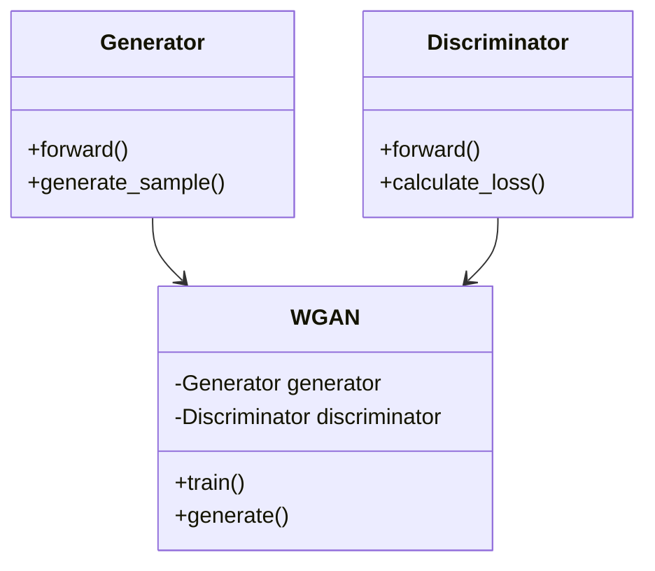
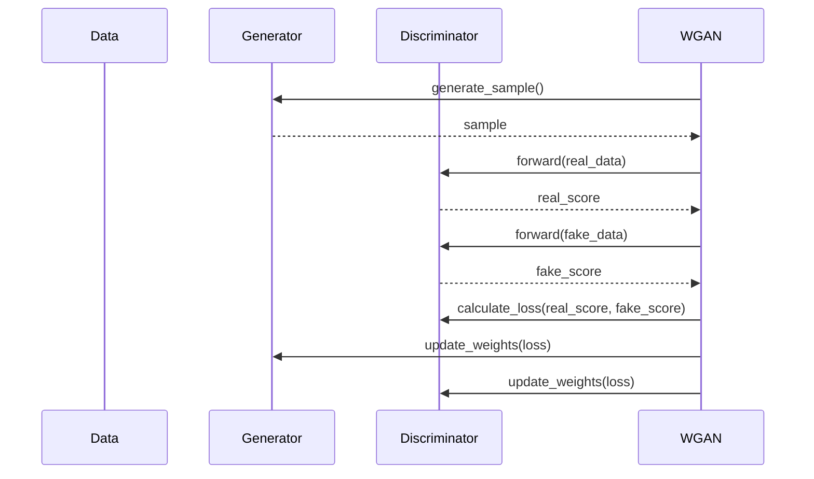

## Overview

The **Wasserstein GAN (WGAN)** is a design pattern aimed at stabilizing the training of Generative Adversarial Networks (GANs) by using a Wasserstein distance-based loss function instead of the standard JS-divergence or KL-divergence loss. This helps in achieving more stable training and generating higher quality samples.

## Introduction

Generative Adversarial Networks (GANs) have been revolutionary in the field of machine learning and deep learning, particularly in generating realistic images, text, and other complex data types. However, traditional GANs often face issues with training instability and mode collapse. The WGAN addresses these issues by replacing the original loss function with the Wasserstein distance, which provides a smoother and more reliable gradient for the generator.

## UML Class Diagram

Here's UML class diagram to visually describe the WGAN structure:



### Class Descriptions

- **Generator**
  - `forward()`: Runs the generator forward pass.
  - `generate_sample()`: Generates a sample from the latent space.

- **Discriminator**
  - `forward()`: Runs the discriminator forward pass.
  - `calculate_loss()`: Calculates the Wasserstein loss.

- **WGAN**
  - `generator`: Instance of the Generator class.
  - `discriminator`: Instance of the Discriminator class.
  - `train()`: Trains both generator and discriminator.
  - `generate()`: Uses the generator to generate new samples.

## UML Sequence Diagram

Below is sequence diagram to explain the WGAN training process:



### Sequence Description

1. The WGAN requests the generator to generate a sample.
2. The generator provides a sample from the latent space.
3. The WGAN feeds real data to the discriminator and obtains a score.
4. The WGAN feeds the generated (fake) data to the discriminator and obtains another score.
5. The discriminator calculates the Wasserstein loss using both scores.
6. The generator's weights are updated based on the loss.
7. The discriminator's weights are updated based on the loss.

## Benefits

- **Stable Training:** WGANs provide a more stable training process by using the Wasserstein loss.
- **Improved Sample Quality:** Generates higher quality samples.
- **Avoids Mode Collapse:** Less prone to mode collapse compared to traditional GANs.

## Trade-offs

- **Computational Overhead:** Additional computational requirements due to more complex loss calculations.
- **Parameter Tuning:** Still requires careful tuning of hyperparameters.
- **Clip Values:** Requires appropriate clipping of weights to enforce Lipschitz continuity.

## Example Code

### Python (PyTorch)

```python
import torch
import torch.nn as nn
import torch.optim as optim

class Generator(nn.Module):
    # Define your Generator network

class Discriminator(nn.Module):
    # Define your Discriminator network

class WGAN:
    def __init__(self, generator, discriminator):
        self.generator = generator
        self.discriminator = discriminator
        self.gen_optimizer = optim.RMSprop(self.generator.parameters(), lr=0.00005)
        self.disc_optimizer = optim.RMSprop(self.discriminator.parameters(), lr=0.00005)

    def train(self, real_data):
        # Training code goes here

    def generate(self):
        # Sample generation code goes here

generator = Generator()
discriminator = Discriminator()
wgan = WGAN(generator, discriminator)

for epoch in range(num_epochs):
    for real_data in dataloader:
        wgan.train(real_data)
```

### Java (Deeplearning4j)

```java
// Assuming you have Deeplearning4j set up

public class WGAN {

    private MultiLayerNetwork generator;
    private MultiLayerNetwork discriminator;

    public WGAN(MultiLayerNetwork generator, MultiLayerNetwork discriminator) {
        this.generator = generator;
        this.discriminator = discriminator;
    }

    public void train(DataSet realData) {
        // Training code goes here
    }

    public INDArray generate() {
        // Sample generation code goes here
        return null;
    }

    public static void main(String[] args) {
        // Initialize and train WGAN
    }
}
```

### Scala (Breeze)

```scala
// Assuming you are using Breeze

class WGAN(generator: Generator, discriminator: Discriminator) {

  def train(realData: DenseMatrix[Double]): Unit = {
    // Training code goes here
  }

  def generate(): DenseMatrix[Double] = {
    // Sample generation code goes here
    DenseMatrix.zeros[Double](1, 1)
  }
}

object WGANApp extends App {
  // Initialize and train WGAN
}
```

### Clojure (DeepLearning4j)

```clojure
(ns wgan-example.core
  (:require [clojure.core.matrix :as m]))

(defn train [generator discriminator real-data]
  ;; Training code goes here
  )

(defn generate [generator]
  ;; Sample generation code goes here
  )

;; Main code to initialize and train WGAN
```

## Use Cases

- **Image Generation:** Creating high-quality images from a given dataset.
- **Text-to-Image Generation:** Generating images based on textual descriptions.
- **Super-Resolution:** Enhancing the resolution of images.
- **Video Generation:** Creating realistic video frames.

## Related Design Patterns

- **Vanilla GAN:** The original GAN model, using JS-divergence.
- **DCGAN:** Deep Convolutional GANs for image data.
- **LSGAN:** Least Squares GANs, which minimize the Pearson Chi-Squared divergence.

## Resources and References

- [Original WGAN Paper](https://arxiv.org/abs/1701.07875)
- [PyTorch WGAN Implementation](https://github.com/eriklindernoren/PyTorch-GAN)
- [TensorFlow WGAN Tutorial](https://www.tensorflow.org/tutorials/generative/wasserstein)
- [Deeplearning4j Documentation](https://deeplearning4j.org/)

## Summary

The Wasserstein GAN (WGAN) introduces significant improvements to GAN training by utilizing a Wasserstein distance-based loss function. This provides a stable and more effective training process, leading to better quality generated samples. While it has its own set of trade-offs and requires careful parameter tuning, the benefits it brings to the field of generative models make it a crucial advancement in machine learning.

By understanding the structure and implementation of WGANs, you can effectively utilize this design pattern in various applications, from image generation to super-resolution tasks.
