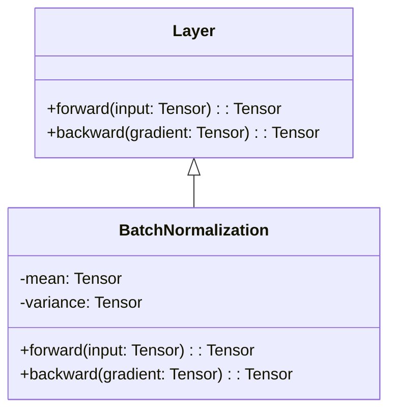
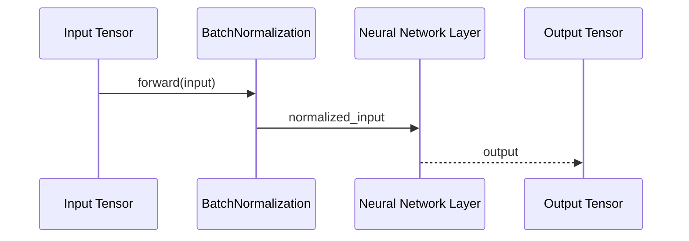

Batch Normalization is a widely-used technique in neural networks, aimed at normalizing the input to each layer to accelerate training and improve performance. This article dives deep into the Batch Normalization design pattern, explaining its concept, benefits, trade-offs, use cases, and related patterns, along with code examples in Python, Java, Scala, and Clojure. Additionally, it includes UML diagrams for a comprehensive understanding.

## Description

Batch Normalization involves normalizing the inputs of a layer during training. This process helps stabilize the learning process and significantly reduces the number of training epochs required to train deep networks.

## Use Case

The primary use cases for Batch Normalization are:

- **Smoothing Optimization**: Reduces internal covariate shift, making the optimization landscape smoother and easier to navigate.
- **Improving Training Speed**: Accelerates training by allowing the use of higher learning rates and achieving convergence faster.

## Benefits

- **Accelerates Training**: Speeds up training by reducing the amount of internal covariate shift.
- **Higher Learning Rates**: Allows the use of higher learning rates, thus speeding up convergence.
- **Regularization Effect**: Adds a slight regularization effect, reducing the need for other regularization methods.
- **Improved Performance**: Can lead to significant performance improvements in deep networks.

## Trade-Offs

- **Additional Computation**: Adds extra computation during both the forward and backward passes.
- **Memory Overhead**: Requires additional memory to store batch statistics.
- **Complexity**: Adds additional layers of complexity to the model architecture.

## UML Class Diagram



## UML Sequence Diagram



## Code Examples

### Python

```python
import tensorflow as tf

class BatchNormalizationLayer(tf.keras.layers.Layer):
    def __init__(self):
        super(BatchNormalizationLayer, self).__init__()
        self.batch_norm = tf.keras.layers.BatchNormalization()
    
    def call(self, inputs, training=False):
        return self.batch_norm(inputs, training=training)

model = tf.keras.Sequential([
    tf.keras.layers.Dense(64),
    BatchNormalizationLayer(),
    tf.keras.layers.Activation('relu'),
    tf.keras.layers.Dense(10)
])

model.compile(optimizer='adam', loss='sparse_categorical_crossentropy')
```

### Java

```java
import org.deeplearning4j.nn.conf.layers.BatchNormalization;
import org.deeplearning4j.nn.conf.layers.DenseLayer;
import org.deeplearning4j.nn.conf.NeuralNetConfiguration;
import org.deeplearning4j.nn.conf.MultiLayerConfiguration;
import org.deeplearning4j.nn.multilayer.MultiLayerNetwork;

MultiLayerConfiguration conf = new NeuralNetConfiguration.Builder()
    .list()
    .layer(new DenseLayer.Builder().nIn(784).nOut(64).build())
    .layer(new BatchNormalization.Builder().build())
    .layer(new DenseLayer.Builder().nOut(10).activation("relu").build())
    .build();

MultiLayerNetwork model = new MultiLayerNetwork(conf);
model.init();
model.setListeners(new ScoreIterationListener(100));
```

### Scala

```scala
import org.deeplearning4j.nn.conf.layers.{BatchNormalization, DenseLayer}
import org.deeplearning4j.nn.conf.{NeuralNetConfiguration, MultiLayerConfiguration}
import org.deeplearning4j.nn.multilayer.MultiLayerNetwork
import org.deeplearning4j.optimize.listeners.ScoreIterationListener

val conf: MultiLayerConfiguration = new NeuralNetConfiguration.Builder()
  .list()
  .layer(new DenseLayer.Builder().nIn(784).nOut(64).build())
  .layer(new BatchNormalization.Builder().build())
  .layer(new DenseLayer.Builder().nOut(10).activation("relu").build())
  .build()

val model = new MultiLayerNetwork(conf)
model.init()
model.setListeners(new ScoreIterationListener(100))
```

### Clojure

```clojure
(require '[org.deeplearning4j.nn.conf.layers :as layers])
(require '[org.deeplearning4j.nn.conf :as conf])
(require '[org.deeplearning4j.nn.multilayer :as multi])

(def configuration
  (conf/neural-net-configuration
    :builder
    (list
      (layers/dense-layer :n-in 784 :n-out 64)
      (layers/batch-normalization-layer)
      (layers/dense-layer :n-out 10 :activation "relu"))))

(def model (multi/multi-layer-network configuration))

(.init model)
(.setListeners model (conf/score-iteration-listener 100))
```

## Examples of Use Cases

- **Convolutional Neural Networks (CNNs)**: Improving training stability and performance in image recognition tasks.
- **Recurrent Neural Networks (RNNs)**: Enhancing the performance of models dealing with time-series or sequential data.
- **Generative Adversarial Networks (GANs)**: Stabilizing training and improving image quality in GANs.

## Related Design Patterns

- **Layer Normalization**: Normalizes across the features instead of the batch dimension, suitable for RNNs and NLP tasks.
- **Instance Normalization**: Normalizes across each individual instance; commonly used in style transfer.
- **Group Normalization**: Divides the channels into groups and computes normalization across each group.

## Resources and References

- **[Batch Normalization: Accelerating Deep Network Training by Reducing Internal Covariate Shift (paper)](https://arxiv.org/abs/1502.03167)**
- **[TensorFlow Batch Normalization](https://www.tensorflow.org/api_docs/python/tf/keras/layers/BatchNormalization)**
- **[PyTorch Batch Normalization](https://pytorch.org/docs/stable/generated/torch.nn.BatchNorm1d.html)**
- **[DL4J Batch Normalization](https://deeplearning4j.org/api/latest/org/deeplearning4j/nn/conf/layers/BatchNormalization.html)**

## Open Source Frameworks

- **TensorFlow**
- **PyTorch**
- **Deeplearning4j**
- **Keras**

## Summary

Batch Normalization is an essential design pattern in deep learning that normalizes the inputs of each layer, thus accelerating training, improving performance, and allowing the use of higher learning rates. Despite the additional computational cost, its benefits often outweigh the trade-offs. Understanding and implementing Batch Normalization can significantly enhance the performance and efficiency of your neural network models.

By normalizing the inputs across mini-batches, Batch Normalization smooths the optimization landscape, leading to faster convergence and improved model accuracy. Utilize the provided code examples and UML diagrams to integrate Batch Normalization effectively into your machine learning workflows. For further reading and resources, explore the linked references and open-source frameworks.
