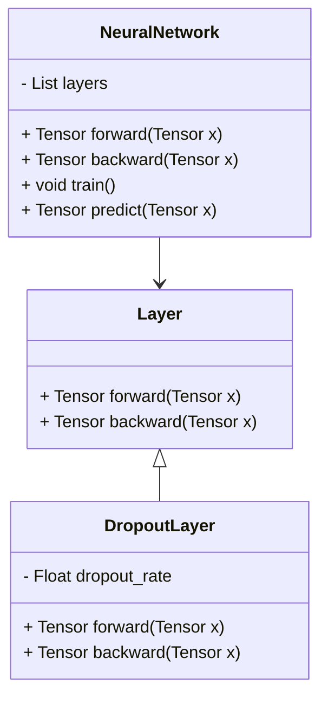
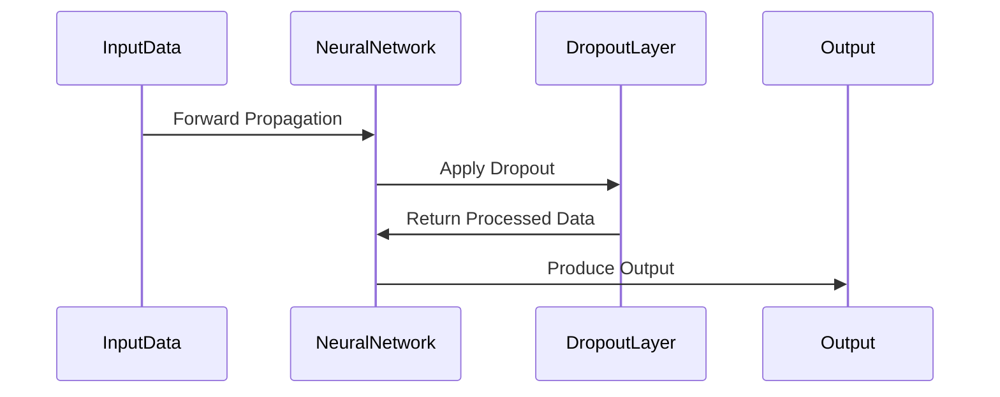

Dropout is a powerful regularization technique used to prevent overfitting in neural networks. This method involves temporarily dropping units (neurons) along with their connections from the neural network during training. By doing so, it prevents the network from becoming too dependent on any single neuron, thereby enhancing the model’s ability to generalize.

## Benefits
- **Reduced Overfitting:** By randomly omitting neurons during training, Dropout helps the model generalize better to unseen data.
- **Model Ensembles:** Dropout essentially trains multiple sub-models and then averages their results during inference, making the model robust.
- **Efficient:** It is computationally cheap and easy to implement.

## Trade-offs
- **Slower Convergence:** Dropout can sometimes slow down the training process as the model has to train multiple sub-networks.
- **Hyperparameter Tuning:** The dropout rate needs to be carefully selected, as dropping too many neurons can lead to underfitting.

## Use Cases
- **Image Classification:** Dropout is widely used in Convolutional Neural Networks (CNNs) for image recognition tasks.
- **Natural Language Processing (NLP):** Recurrent Neural Networks (RNNs) and Transformers also benefit from Dropout to handle sequence data.
- **Reinforcement Learning:** It helps in stabilizing learning agents by preventing the network from overfitting to specific states or actions.

## UML Class Diagram



## UML Sequence Diagram



## Examples in Various Languages

### Python
```python
import torch.nn as nn

class DropoutNetwork(nn.Module):
    def __init__(self):
        super(DropoutNetwork, self).__init__()
        self.fc1 = nn.Linear(784, 256)
        self.dropout = nn.Dropout(0.5)
        self.fc2 = nn.Linear(256, 10)

    def forward(self, x):
        x = torch.relu(self.fc1(x))
        x = self.dropout(x)
        return self.fc2(x)
```

### Java
```java
import org.deeplearning4j.nn.conf.layers.*;
import org.deeplearning4j.nn.conf.NeuralNetConfiguration;
import org.deeplearning4j.nn.multilayer.MultiLayerNetwork;
import org.deeplearning4j.nn.conf.MultiLayerConfiguration;

public class DropoutNetwork {
    public static void main(String[] args) {
        MultiLayerConfiguration conf = new NeuralNetConfiguration.Builder()
            .list()
            .layer(0, new DenseLayer.Builder().nIn(784).nOut(256)
                .activation(Activation.RELU).build())
            .layer(1, new DropoutLayer(0.5))
            .layer(2, new OutputLayer.Builder().nIn(256).nOut(10)
                .activation(Activation.SOFTMAX).build())
            .build();
        MultiLayerNetwork model = new MultiLayerNetwork(conf);
        model.init();
    }
}
```

### Scala
```scala
import org.deeplearning4j.nn.conf.layers._
import org.deeplearning4j.nn.conf.NeuralNetConfiguration
import org.deeplearning4j.nn.multilayer.MultiLayerNetwork

object DropoutNetwork {
    def main(args: Array[String]): Unit = {
        val conf = new NeuralNetConfiguration.Builder()
            .list()
            .layer(0, new DenseLayer.Builder().nIn(784).nOut(256)
                .activation(Activation.RELU).build())
            .layer(1, new DropoutLayer(0.5))
            .layer(2, new OutputLayer.Builder().nIn(256).nOut(10)
                .activation(Activation.SOFTMAX).build())
            .build()
        val model = new MultiLayerNetwork(conf)
        model.init()
    }
}
```

### Clojure
```clojure
(ns dropout-network
  (:require [clojure.core.matrix :as m]
            [clojure.core.matrix.dataset :as ds]
            [neural-networks :refer :all]))

(defn create-network []
  (build-network
    {:input 784
     :layers [{:type :dense, :units 256, :activation :relu}
              {:type :dropout, :rate 0.5}
              {:type :output, :units 10, :activation :softmax}]}))

(defn -main []
  (let [network (create-network)]
    (train network training-data)
    (println "Model trained.")))
```

## Related Design Patterns

- **Batch Normalization:** This technique standardizes the inputs to a layer for each mini-batch to stabilize learning and improve performance.
- **Weight Regularization (L1 and L2):** Adds penalty terms to the loss function to reduce model complexity and prevent overfitting.
- **Early Stopping:** Terminates training when the performance on a validation set starts to degrade, thus preventing overfitting.

## Resources and References

- **Books:**
  - *Deep Learning* by Ian Goodfellow, Yoshua Bengio, and Aaron Courville
- **Research Papers:**
  - Hinton, G., Srivastava, N., Krizhevsky, A., Sutskever, I., & Salakhutdinov, R. (2012). "Improving neural networks by preventing co-adaptation of feature detectors."
- **Open Source Frameworks:**
  - TensorFlow
  - PyTorch
  - Deeplearning4j

## Summary

Dropout is an effective regularization technique that reduces overfitting by randomly dropping neurons during training, ensuring the model is robust and generalizes well to new data. Its simplicity and computational efficiency make it a valuable tool for deep learning practitioners across various domains.

By understanding its benefits, trade-offs, and implementation, you can significantly enhance the performance of your neural network models.
