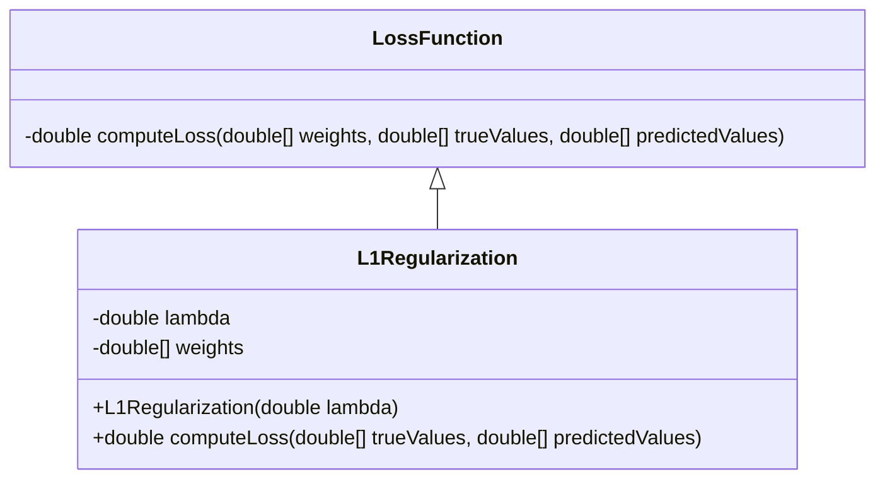
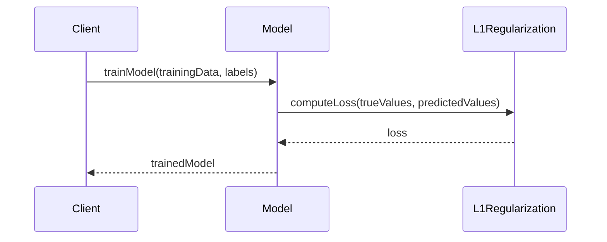

## Overview of L1 Regularization

L1 Regularization, also known as Lasso (Least Absolute Shrinkage and Selection Operator), is a technique in machine learning that adds the sum of the absolute values of weights as a penalty term to the loss function. This promotes sparsity in the weights, which can lead to feature selection.

## Detailed Description

L1 Regularization modifies the loss function to include a penalty proportional to the absolute value of the weights:


L(w) = L_0(w) + \lambda \sum_i |w_i|


where:
- \\( L_0(w) \\) is the original loss function,
- \\( \lambda \\) is the regularization parameter,
- \\( w_i \\) are the weights of the neural network.

The key feature of L1 Regularization is that it encourages the weights to be exactly zero, leading to a sparse model, which is useful for feature selection.

## Benefits

1. **Feature Selection:** Promotes sparsity, effectively selecting a subset of relevant features.
2. **Interpretability:** Models are simpler and more interpretable due to the sparsity of features.
3. **Avoids Overfitting:** Regularization helps prevent overfitting by penalizing large weights.

## Trade-offs

1. **Model Performance:** Can sometimes hurt model performance if too many features are set to zero.
2. **Optimization Complexity:** May lead to slower convergence in the optimization process.
3. **Parameter Tuning:** Requires careful tuning of the regularization parameter \\( \lambda \\).

## Use Cases

- **High-dimensional Data:** Particularly useful in scenarios with a large number of features.
- **Medical Diagnostics:** Identifying the most relevant biomarkers for a disease.
- **Natural Language Processing:** Feature selection in text classification tasks.

## UML Diagrams

### UML Class Diagram



### UML Sequence Diagram



## Examples

### Python

```python
import numpy as np

def l1_regularization(weights, lambda_):
    return lambda_ * np.sum(np.abs(weights))

weights = np.array([0.5, -0.3, 0.0, 1.2])
lambda_ = 0.01
penalty = l1_regularization(weights, lambda_)
print(f"L1 Regularization Penalty: {penalty}")
```

### Java

```java
public class L1Regularization {
    public static double l1Regularization(double[] weights, double lambda) {
        double sum = 0.0;
        for (double weight : weights) {
            sum += Math.abs(weight);
        }
        return lambda * sum;
    }

    public static void main(String[] args) {
        double[] weights = {0.5, -0.3, 0.0, 1.2};
        double lambda = 0.01;
        double penalty = l1Regularization(weights, lambda);
        System.out.println("L1 Regularization Penalty: " + penalty);
    }
}
```

### Scala

```scala
object L1Regularization {
    def l1Regularization(weights: Array[Double], lambda: Double): Double = {
        lambda * weights.map(math.abs).sum
    }

    def main(args: Array[String]): Unit = {
        val weights = Array(0.5, -0.3, 0.0, 1.2)
        val lambda = 0.01
        val penalty = l1Regularization(weights, lambda)
        println(s"L1 Regularization Penalty: $penalty")
    }
}
```

### Clojure

```clojure
(defn l1-regularization [weights lambda]
  (* lambda (reduce + (map abs weights))))

(def weights [0.5 -0.3 0.0 1.2])
(def lambda 0.01)
(def penalty (l1-regularization weights lambda))

(println "L1 Regularization Penalty:" penalty)
```

## Related Design Patterns

- **L2 Regularization (Ridge):** Adds the sum of squared weights to the loss function, which discourages large weights but does not lead to sparse solutions.
- **Elastic Net:** Combines L1 and L2 regularization to promote both sparsity and small weights.

## Resources and References

- [Deep Learning by Ian Goodfellow, Yoshua Bengio, and Aaron Courville](https://www.deeplearningbook.org/)
- [Hands-On Machine Learning with Scikit-Learn, Keras, and TensorFlow by Aurélien Géron](https://www.oreilly.com/library/view/hands-on-machine-learning/9781492032632/)

## Open Source Frameworks

- **Scikit-learn:** Includes implementations of L1 regularization in various models.
- **TensorFlow:** Provides functions for adding L1 regularization to neural network layers.
- **PyTorch:** Supports L1 regularization through its `torch.nn` module.

## Summary

L1 Regularization is a powerful technique in machine learning, particularly effective for feature selection by promoting sparsity in the weights. It has significant benefits but requires careful tuning of parameters and consideration of potential trade-offs. Understanding its applications and how to implement it in various programming languages can be instrumental in developing more interpretable and efficient models.
