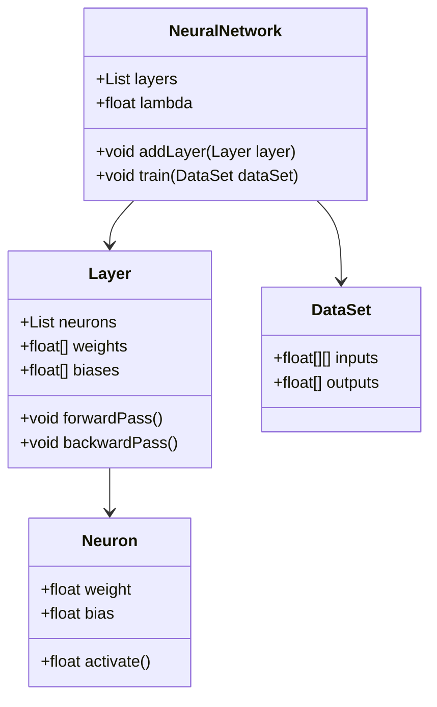
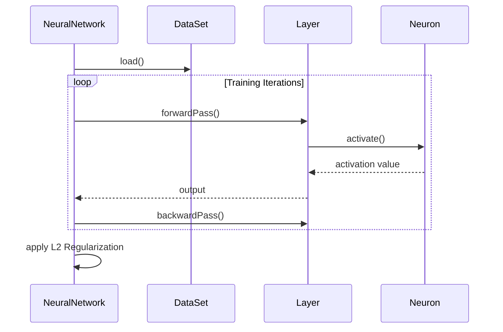

## Introduction to L2 Regularization (Ridge)

L2 Regularization, also known as Ridge Regularization, is a technique used in machine learning and neural networks to prevent overfitting by penalizing large weights in the model. The regularization term is added to the loss function, which is the sum of the squared values of the model weights.

## Detailed Description

L2 Regularization introduces a penalty term to the cost function to discourage the learning algorithm from fitting to the training data too closely, thereby improving the generalization of the model. The cost function with L2 Regularization is given by:

 J(\theta) = \frac{1}{m} \sum_{i=1}^{m} \left( h_\theta(x^{(i)}) - y^{(i)} \right)^2 + \frac{\lambda}{2m} \sum_{j=1}^{n} \theta_j^2 

where:
- \\( J(\theta) \\) is the cost function.
- \\( m \\) is the number of training examples.
- \\( h_\theta \\) is the hypothesis function.
- \\( x^{(i)} \\) and \\( y^{(i)} \\) are the i-th training data input and output, respectively.
- \\( \lambda \\) is the regularization parameter.
- \\( \theta_j \\) are the weights of the model.

## Use Case

L2 Regularization is primarily used to control model complexity, especially in neural networks with a large number of parameters. By penalizing large weights, L2 Regularization helps to prevent overfitting and improve the generalization performance of the model.

## UML Class and Sequence Diagrams

### UML Class Diagram



### UML Sequence Diagram



## Examples

### Python

```python
import numpy as np

class RidgeRegression:
    def __init__(self, alpha=1.0):
        self.alpha = alpha

    def fit(self, X, y):
        n, m = X.shape
        I = np.eye(m)
        self.weights = np.linalg.inv(X.T @ X + self.alpha * I) @ X.T @ y

    def predict(self, X):
        return X @ self.weights

X = np.array([[1, 2], [2, 4], [3, 6]])
y = np.array([3, 6, 9])
model = RidgeRegression(alpha=0.1)
model.fit(X, y)
predictions = model.predict(X)
print(predictions)
```

### Java

```java
public class RidgeRegression {
    private double alpha;
    private double[] weights;

    public RidgeRegression(double alpha) {
        this.alpha = alpha;
    }

    public void fit(double[][] X, double[] y) {
        int n = X.length;
        int m = X[0].length;
        double[][] I = new double[m][m];
        for (int i = 0; i < m; i++) {
            I[i][i] = 1;
        }
        double[][] XtX = MatrixUtils.multiply(MatrixUtils.transpose(X), X);
        double[][] regularization = MatrixUtils.multiply(I, alpha);
        double[][] XtXplusReg = MatrixUtils.add(XtX, regularization);
        double[] XtY = MatrixUtils.multiply(MatrixUtils.transpose(X), y);
        weights = MatrixUtils.solve(XtXplusReg, XtY);
    }

    public double[] predict(double[][] X) {
        return MatrixUtils.multiply(X, weights);
    }
}
```

### Scala

```scala
import breeze.linalg._

class RidgeRegression(alpha: Double = 1.0) {
  private var weights: DenseVector[Double] = _

  def fit(X: DenseMatrix[Double], y: DenseVector[Double]): Unit = {
    val I = DenseMatrix.eye[Double](X.cols)
    weights = inv(X.t * X + alpha * I) * X.t * y
  }

  def predict(X: DenseMatrix[Double]): DenseVector[Double] = {
    X * weights
  }
}

// Sample usage
val X = DenseMatrix((1.0, 2.0), (2.0, 4.0), (3.0, 6.0))
val y = DenseVector(3.0, 6.0, 9.0)
val model = new RidgeRegression(0.1)
model.fit(X, y)
val predictions = model.predict(X)
println(predictions)
```

### Clojure

```clojure
(ns ridge-regression
  (:require [clojure.core.matrix :as m]))

(defn fit [X y alpha]
  (let [I (m/identity-matrix (m/column-count X))]
    (m/mmul
      (m/inverse (m/add (m/mmul (m/transpose X) X) (m/scale I alpha)))
      (m/mmul (m/transpose X) y))))

(defn predict [X weights]
  (m/mmul X weights))

;; Sample usage
(def X [[1 2] [2 4] [3 6]])
(def y [3 6 9])
(def alpha 0.1)
(def weights (fit X y alpha))
(def predictions (predict X weights))
(println predictions)
```

## Benefits

- **Reduces Overfitting:** By penalizing large weights, L2 Regularization helps to reduce overfitting and improve the model's generalization to new data.
- **Stable Solution:** Ridge regression often results in more stable and interpretable models.
- **Simplicity:** Simple to implement and integrate with existing neural network training algorithms.

## Trade-offs

- **Bias-Variance Trade-off:** While it reduces variance, L2 Regularization can introduce bias, which might lead to underfitting in some cases.
- **Computational Overhead:** The addition of the regularization term increases the computational complexity of the training process, especially for very large models.

## Examples of Use Cases

- **Image Classification:** L2 Regularization is commonly used in convolutional neural networks to prevent overfitting.
- **Time Series Prediction:** Used in recurrent neural networks to stabilize the training process.
- **Natural Language Processing:** In tasks like text classification and sentiment analysis to control model complexity.

## Related Design Patterns

- **L1 Regularization (Lasso):** Similar to L2 but uses the absolute values of the weights for regularization, promoting sparsity in the model.
- **Dropout Regularization:** Randomly dropping neurons during training to prevent overfitting.

## Resources and References

- **Books:**
  - "Deep Learning" by Ian Goodfellow, Yoshua Bengio, and Aaron Courville
  - "Pattern Recognition and Machine Learning" by Christopher Bishop

- **Research Papers:**
  - Andrew Ng’s "Feature selection, L1 vs. L2 regularization, and rotational invariance"

- **Open Source Frameworks:**
  - **TensorFlow:** Provides built-in functions for L2 Regularization.
  - **PyTorch:** Supports L2 Regularization in its optimizers.

## Summary

L2 Regularization (Ridge) is an effective technique for controlling model complexity in neural networks by adding a penalty term to the loss function that is the sum of the squared weights. This prevents overfitting and improves generalization. While introducing some computational overhead and the possibility of underfitting, the benefits generally outweigh these trade-offs, making L2 Regularization a staple in neural network design.

---

By understanding and applying L2 Regularization, practitioners can build more robust and generalizable models, enhancing their performance in various machine learning applications.
