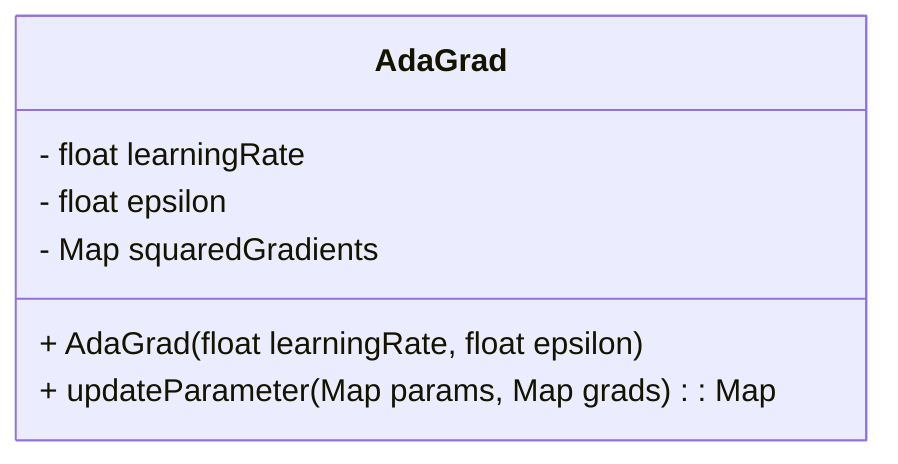
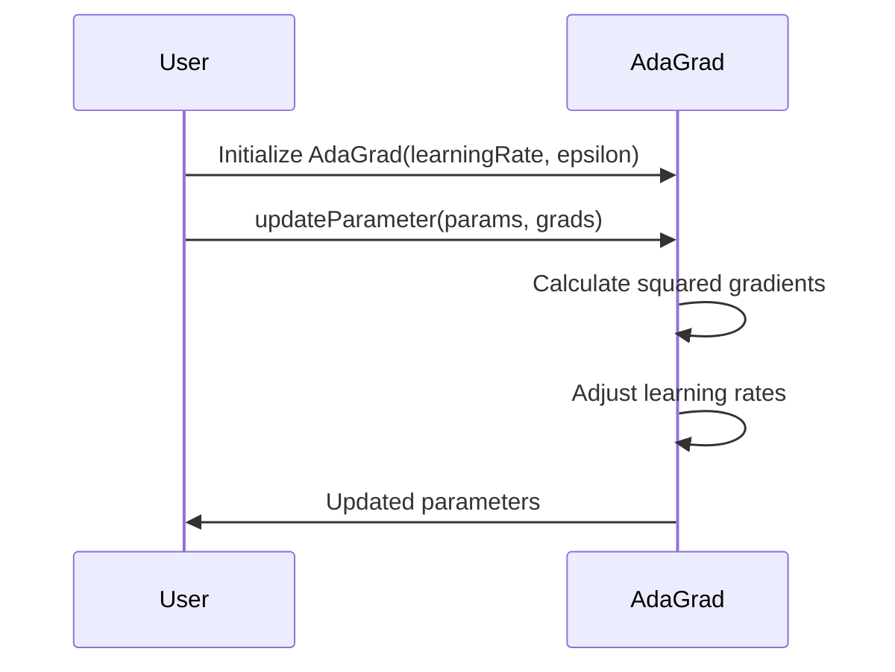

The AdaGrad (Adaptive Gradient Algorithm) optimization technique adapts the learning rate to the parameters during training, providing a significant advantage in dealing with sparse data. By scaling down the learning rate for frequently updated parameters and scaling it up for infrequently updated parameters, AdaGrad can achieve more efficient and effective training.

## Introduction

AdaGrad, introduced by Duchi et al. in 2011, is an algorithm for gradient-based optimization. It dynamically adapts the learning rate based on the historical gradient information for each parameter, making it particularly useful for sparse data scenarios.

## Algorithm Details

AdaGrad modifies the general gradient descent algorithm by introducing a per-parameter learning rate adjustment. The adjustment is based on the accumulation of squared gradients.

The parameter update rule for AdaGrad is given by:


\theta_{t+1,i} = \theta_{t,i} - \frac{\eta}{\sqrt{G_{t,ii} + \epsilon}} \cdot g_{t,i}


where:
- \\(\theta_{t,i}\\) is the parameter at iteration \\(t\\),
- \\(\eta\\) is the learning rate,
- \\(G_{t,ii}\\) is the sum of the squares of the past gradients,
- \\(g_{t,i}\\) is the gradient of the loss with respect to the parameter \\(\theta_{i}\\) at iteration \\(t\\),
- \\(\epsilon\\) is a small smoothing term to prevent division by zero.

## UML Diagrams

### Class Diagram



### Sequence Diagram



## Implementation

### Python

```python
import numpy as np

class AdaGrad:
    def __init__(self, learning_rate=0.01, epsilon=1e-8):
        self.learning_rate = learning_rate
        self.epsilon = epsilon
        self.squared_gradients = {}

    def update_parameter(self, params, grads):
        for param in params.keys():
            if param not in self.squared_gradients:
                self.squared_gradients[param] = np.zeros_like(grads[param])
            self.squared_gradients[param] += grads[param]**2
            params[param] -= self.learning_rate * grads[param] / (np.sqrt(self.squared_gradients[param]) + self.epsilon)
        return params
```

### Java

```java
import java.util.HashMap;
import java.util.Map;

public class AdaGrad {
    private final double learningRate;
    private final double epsilon;
    private final Map<String, double[]> squaredGradients = new HashMap<>();

    public AdaGrad(double learningRate, double epsilon) {
        this.learningRate = learningRate;
        this.epsilon = epsilon;
    }

    public Map<String, double[]> updateParameter(Map<String, double[]> params, Map<String, double[]> grads) {
        for (String key : params.keySet()) {
            squaredGradients.putIfAbsent(key, new double[grads.get(key).length]);
            for (int i = 0; i < grads.get(key).length; i++) {
                squaredGradients.get(key)[i] += grads.get(key)[i] * grads.get(key)[i];
                params.get(key)[i] -= learningRate * grads.get(key)[i] / (Math.sqrt(squaredGradients.get(key)[i]) + epsilon);
            }
        }
        return params;
    }
}
```

### Scala

```scala
class AdaGrad(var learningRate: Double, var epsilon: Double) {
    private val squaredGradients: scala.collection.mutable.Map[String, Array[Double]] = scala.collection.mutable.Map()

    def updateParameter(params: Map[String, Array[Double]], grads: Map[String, Array[Double]]): Map[String, Array[Double]] = {
        params.map { case (param, values) =>
            squaredGradients.getOrElseUpdate(param, Array.fill(values.length)(0.0))
            val newValues = values.zip(grads(param)).map { case (v, g) =>
                val squaredGradient = squaredGradients(param)
                squaredGradient.foreach(sg => sg + g * g)
                v - learningRate * g / (math.sqrt(squaredGradient.sum) + epsilon)
            }
            param -> newValues
        }
    }
}
```

### Clojure

```clojure
(defn adagrad
  [params grads {:keys [learning-rate epsilon squared-gradients] :or {learning-rate 0.01 epsilon 1e-8 squared-gradients {}}}]
  (reduce (fn [acc param]
            (let [grad (grads param)
                  squared-gradient (get squared-gradients param (mapv (fn [_] 0) grad))
                  new-squared-gradient (mapv + squared-gradient (mapv #(* % %) grad))
                  update (mapv #(- %1 (* learning-rate %2 (/ (Math/sqrt %3) (+ (Math/sqrt %3) epsilon)))) params grad new-squared-gradient)]
              (-> acc
                  (assoc-in [:params param] update)
                  (assoc-in [:squared-gradients param] new-squared-gradient))))
          {:params params, :squared-gradients squared-gradients}
          (keys params)))
```

## Benefits

- **Automatic Learning Rate Adjustment:** Dynamically adjusts learning rates for each parameter, facilitating efficient training.
- **Efficient for Sparse Data:** Especially advantageous when dealing with sparse features.

## Trade-offs

- **Learning Rate Decay:** Accumulated gradients can cause the learning rate to decay and become overly small.
- **Memory Overhead:** Requires maintaining additional parameters for squared gradients.

## Use Cases

- **Natural Language Processing:** Typically involves sparse features (e.g., word representations).
- **Recommender Systems:** Feature matrices are often sparse.
- **Large-Scale Machine Learning:** Effective for massive datasets with high-dimensional feature spaces.

## Related Design Patterns

- **RMSProp:** An improvement over AdaGrad to handle the decaying learning rate problem by introducing a decay factor.
- **Adam:** Combines the benefits of both AdaGrad and RMSProp by incorporating adaptive learning rates with momentum.

## Resources and References

- [Original Paper: Duchi et al.](http://www.jmlr.org/papers/volume12/duchi11a/duchi11a.pdf)
- [AdaGrad Wikipedia](https://en.wikipedia.org/wiki/Stochastic_gradient_descent#AdaGrad)
- [Deep Learning Book by Ian Goodfellow](https://www.deeplearningbook.org/)

## Summary

AdaGrad is a powerful optimization algorithm for training neural networks, especially when dealing with sparse data. By adapting the learning rate individually for each parameter based on historical gradient information, AdaGrad ensures efficient and effective parameter updates. However, it requires careful management to avoid excessively small learning rates. Understanding its benefits and limitations is crucial for leveraging its full potential in machine learning applications.

---

