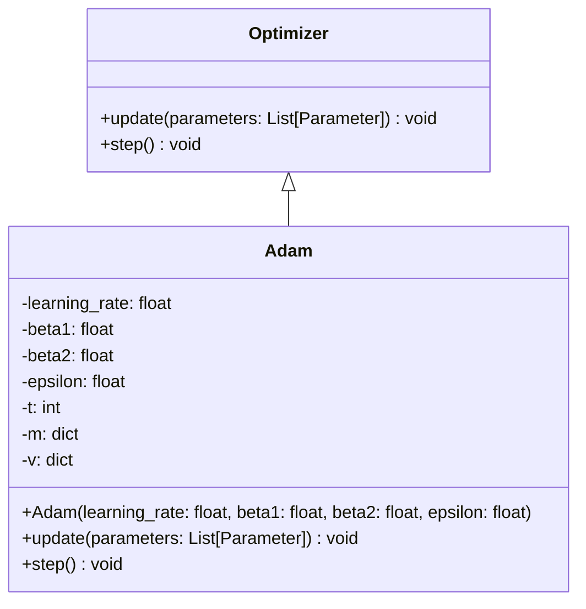
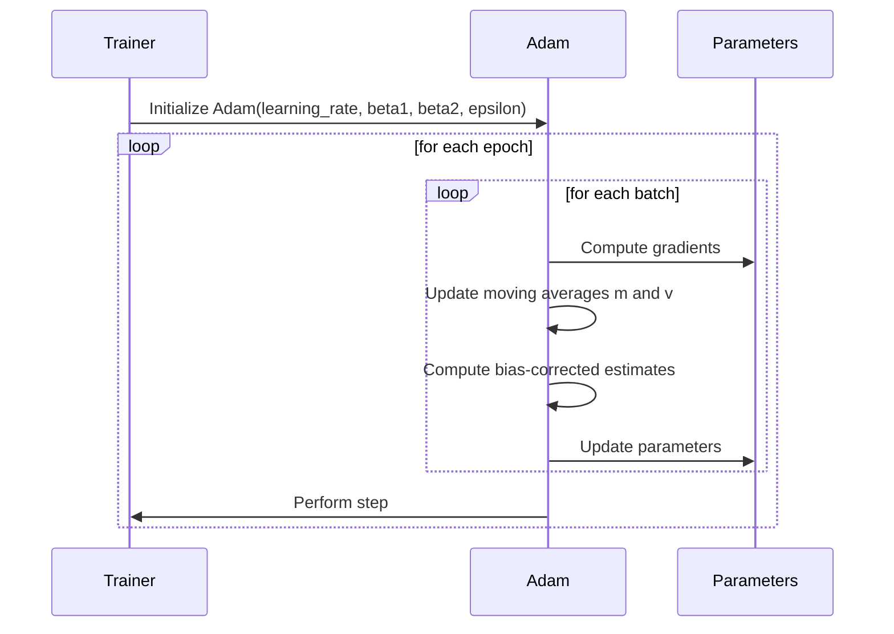

## Adam Optimizer: Adaptive Moments for Efficient Optimization

The Adam optimizer is a popular algorithm in the field of machine learning and deep learning. It combines the advantages of two other extensions of stochastic gradient descent, namely RMSProp and momentum. This makes Adam particularly efficient for training deep neural networks.

### UML Class Diagram



### UML Sequence Diagram



### Detailed Description

The **Adam** optimizer stands for **Adaptive Moment Estimation**. The algorithm combines the benefits of both **RMSProp** and **momentum** to provide an optimization algorithm that can adaptively tune the learning rate for each parameter. The key concepts are:

- **Adaptive Learning Rate**: Adjusts the learning rate for each parameter based on the first and second moments of the gradient.
- **Momentum**: Adds a fraction of the previous gradient to the current gradient to speed up convergence.
- **Bias Correction**: Applies bias-corrected estimates to counteract the initialization bias.

### Algorithm

The Adam optimizer involves the following steps:
1. Initialize parameters: learning rate (\\(\alpha\\)), exponential decay rates (\\(\beta_1\\), \\(\beta_2\\)), and a small constant for numerical stability (\\(\epsilon\\)).
2. Initialize first moment vector (\\(m_0\\)) and second moment vector (\\(v_0\\)) to zeros.
3. For each iteration \\(t\\):
   - Compute gradients (\\(g_t\\))
   - Update biased first moment estimate (\\(m_t = \beta_1 \cdot m_{t-1} + (1 - \beta_1) \cdot g_t\\))
   - Update biased second moment estimate (\\(v_t = \beta_2 \cdot v_{t-1} + (1 - \beta_2) \cdot g_t^2\\))
   - Compute bias-corrected first moment estimate (\\(\hat{m}_t = \frac{m_t}{1 - \beta_1^t}\\))
   - Compute bias-corrected second moment estimate (\\(\hat{v}_t = \frac{v_t}{1 - \beta_2^t}\\))
   - Update parameters (\\(\theta_{t+1} = \theta_t - \alpha \cdot \frac{\hat{m}_t}{\sqrt{\hat{v}_t} + \epsilon}\\))

### Python Example

```python
import numpy as np

class Adam:
    def __init__(self, lr=0.001, beta1=0.9, beta2=0.999, epsilon=1e-8):
        self.lr = lr
        self.beta1 = beta1
        self.beta2 = beta2
        self.epsilon = epsilon
        self.t = 0
        self.m = {}
        self.v = {}

    def update(self, parameters, gradients):
        self.t += 1
        for p in parameters:
            if p not in self.m:
                self.m[p] = np.zeros_like(parameters[p])
                self.v[p] = np.zeros_like(parameters[p])
            
            # Update biased first moment estimate
            self.m[p] = self.beta1 * self.m[p] + (1 - self.beta1) * gradients[p]
            # Update biased second moment estimate
            self.v[p] = self.beta2 * self.v[p] + (1 - self.beta2) * (gradients[p] ** 2)

            # Compute bias-corrected first moment estimate
            m_hat = self.m[p] / (1 - self.beta1 ** self.t)
            # Compute bias-corrected second moment estimate
            v_hat = self.v[p] / (1 - self.beta2 ** self.t)

            # Update parameters
            parameters[p] -= self.lr * m_hat / (np.sqrt(v_hat) + self.epsilon)

parameters = {'w': np.array([1.0]), 'b': np.array([0.5])}
gradients = {'w': np.array([0.1]), 'b': np.array([0.01])}

adam = Adam()
adam.update(parameters, gradients)
print(parameters)
```

### Java Example

```java
import java.util.HashMap;
import java.util.Map;

public class Adam {
    private double lr, beta1, beta2, epsilon;
    private int t;
    private Map<String, double[]> m, v;

    public Adam(double lr, double beta1, double beta2, double epsilon) {
        this.lr = lr;
        this.beta1 = beta1;
        this.beta2 = beta2;
        this.epsilon = epsilon;
        this.t = 0;
        this.m = new HashMap<>();
        this.v = new HashMap<>();
    }

    public void update(Map<String, double[]> parameters, Map<String, double[]> gradients) {
        t++;
        for (String key : parameters.keySet()) {
            if (!m.containsKey(key)) {
                m.put(key, new double[parameters.get(key).length]);
                v.put(key, new double[parameters.get(key).length]);
            }

            double[] mCurr = m.get(key);
            double[] vCurr = v.get(key);
            double[] param = parameters.get(key);
            double[] grad = gradients.get(key);

            for (int i = 0; i < param.length; i++) {
                mCurr[i] = beta1 * mCurr[i] + (1 - beta1) * grad[i];
                vCurr[i] = beta2 * vCurr[i] + (1 - beta2) * grad[i] * grad[i];

                double mHat = mCurr[i] / (1 - Math.pow(beta1, t));
                double vHat = vCurr[i] / (1 - Math.pow(beta2, t));

                param[i] -= lr * mHat / (Math.sqrt(vHat) + epsilon);
            }
        }
    }
}
```

### Scala Example

```scala
import scala.collection.mutable

class Adam(
  val lr: Double = 0.001,
  val beta1: Double = 0.9,
  val beta2: Double = 0.999,
  val epsilon: Double = 1e-8
) {
  private var t = 0
  private val m = mutable.Map[String, Array[Double]]()
  private val v = mutable.Map[String, Array[Double]]()

  def update(parameters: Map[String, Array[Double]], gradients: Map[String, Array[Double]]): Unit = {
    t += 1
    for ((key, param) <- parameters) {
      val grad = gradients(key)
      val mCurr = m.getOrElseUpdate(key, Array.fill(param.length)(0.0))
      val vCurr = v.getOrElseUpdate(key, Array.fill(param.length)(0.0))

      for (i <- param.indices) {
        mCurr(i) = beta1 * mCurr(i) + (1 - beta1) * grad(i)
        vCurr(i) = beta2 * vCurr(i) + (1 - beta2) * grad(i) * grad(i)

        val mHat = mCurr(i) / (1 - math.pow(beta1, t))
        val vHat = vCurr(i) / (1 - math.pow(beta2, t))

        param(i) -= lr * mHat / (math.sqrt(vHat) + epsilon)
      }
    }
  }
}

// Example usage
val parameters = Map("w" -> Array(1.0), "b" -> Array(0.5))
val gradients = Map("w" -> Array(0.1), "b" -> Array(0.01))

val adam = new Adam()
adam.update(parameters, gradients)
println(parameters)
```

### Clojure Example

```clojure
(defn init-adam
  [lr beta1 beta2 epsilon]
  {:lr lr :beta1 beta1 :beta2 beta2 :epsilon epsilon :t 0 :m {} :v {}})

(defn update-adam
  [adam parameters gradients]
  (let [{:keys [lr beta1 beta2 epsilon t m v]} adam
        t (inc t)]
    (reduce
      (fn [acc [param-key param-val]]
        (let [m-val (or (get m param-key) (vec (repeat (count param-val) 0.0)))
              v-val (or (get v param-key) (vec (repeat (count param-val) 0.0)))
              grad-val (get gradients param-key)]
          (reduce
            (fn [inner-acc idx]
              (let [m-updated (update m-val idx #(+ (* beta1 %) (* (- 1 beta1) (nth grad-val idx))))
                    v-updated (update v-val idx #(+ (* beta2 %) (* (- 1 beta2) (* (nth grad-val idx) (nth grad-val idx)))))
                    m-hat (/ (nth m-updated idx) (- 1 (Math/pow beta1 t)))
                    v-hat (/ (nth v-updated idx) (- 1 (Math/pow beta2 t)))]
                (assoc-in inner-acc [:parameters param-key idx]
                          (- (nth param-val idx) (* lr (/ m-hat (+ (Math/sqrt v-hat) epsilon))))))
            (assoc acc :m m-updated :v v-updated)
            (range (count param-val)))))
      {:t t :m m :v v :parameters parameters}
      parameters)))

;; Example usage
(def parameters {:w [1.0] :b [0.5]})
(def gradients {:w [0.1] :b [0.01]})

(def adam (init-adam 0.001 0.9 0.999 1e-8))
(def updated-adam (update-adam adam parameters gradients))
(println (:parameters updated-adam))
```

### Benefits

- **Efficient**: Combines the best aspects of RMSProp and Momentum.
- **Adaptive**: Adjusts learning rates for each parameter.
- **Stabilized**: Includes bias correction.

### Trade-offs

- **Hyperparameters**: Requires tuning of several hyperparameters (\\(\alpha\\), \\(\beta_1\\), \\(\beta_2\\)).
- **Computational Overhead**: Slightly more computationally expensive compared to simpler optimizers like SGD.

### Use Cases

- Training deep neural networks.
- General-purpose optimization in machine learning.

### Related Design Patterns

- **RMSProp**: An adaptive learning rate method.
- **Momentum**: Accelerates gradient descent by adding momentum.

### Resources and References

- [Original Adam Paper](https://arxiv.org/abs/1412.6980)
- [Adam on TensorFlow](https://www.tensorflow.org/api_docs/python/tf/keras/optimizers/Adam)
- [PyTorch Adam Optimizer](https://pytorch.org/docs/stable/generated/torch.optim.Adam.html)

### Open Source Frameworks

- **TensorFlow**: Provides Adam optimizer in its `tf.keras.optimizers` module.
- **PyTorch**: Supports Adam optimizer through `torch.optim`.

### Summary

The Adam optimizer is a versatile and effective optimization algorithm widely used for training deep neural networks. Its adaptive learning rate mechanism and combination of RMSProp and momentum offer significant benefits for efficient and stabilized training. However, careful hyperparameter tuning is required to harness its full potential.


