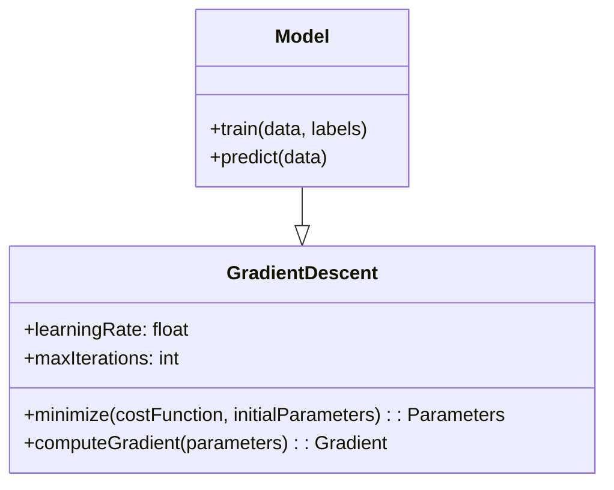
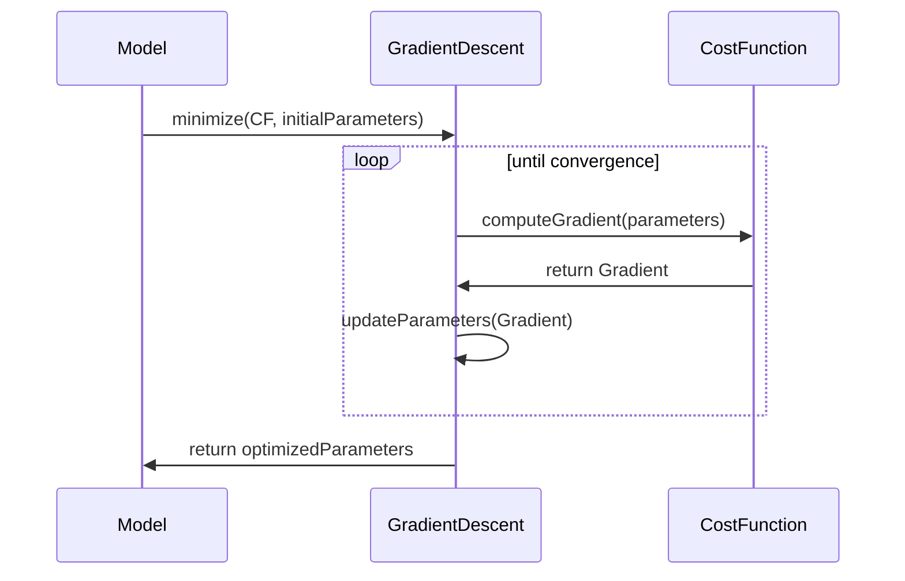

Gradient Descent is a fundamental optimization algorithm used in machine learning and neural networks to minimize a cost function. This method involves iterative adjustments of parameters to find the minima of a function, which in the context of machine learning, corresponds to the optimal parameters for the model.

## Overview

### Definition

Gradient Descent is an iterative optimization algorithm used to minimize the cost function of a model by moving in the direction of the steepest decrease, as defined by the gradient of the function.

### Importance in Machine Learning

The algorithm is crucial for training neural networks and other machine learning models. It helps in finding the optimal weights that minimize the error in predictions made by the model.

## Benefits

1. **Simplicity**: Easy to understand and implement.
2. **Versatile**: Can be applied to various types of cost functions.
3. **Scalability**: Effective for large datasets when using variants like Stochastic Gradient Descent.

## Trade-offs

1. **Convergence**: May converge to local minima or saddle points.
2. **Computational Cost**: Can be slow if the number of parameters is large.
3. **Hyperparameter Sensitivity**: Requires careful tuning of learning rates and other hyperparameters.

## Use Cases

- Training neural networks
- Optimizing machine learning algorithms
- Minimizing convex and non-convex functions in various applications

## UML Diagrams

### Class Diagram



### Sequence Diagram



## Example Implementations

### Python

```python
import numpy as np

def gradient_descent(X, y, learning_rate=0.01, epochs=1000):
    m = X.shape[0]
    theta = np.zeros(X.shape[1])
    
    for _ in range(epochs):
        gradients = (2/m) * X.T.dot(X.dot(theta) - y)
        theta -= learning_rate * gradients
    
    return theta
```

### Java

```java
public class GradientDescent {
    public static double[] gradientDescent(double[][] X, double[] y, double learningRate, int epochs) {
        int m = X.length;
        double[] theta = new double[X[0].length];
        
        for (int i = 0; i < epochs; i++) {
            double[] gradients = computeGradients(X, y, theta);
            for (int j = 0; j < theta.length; j++) {
                theta[j] -= learningRate * gradients[j];
            }
        }
        
        return theta;
    }

    private static double[] computeGradients(double[][] X, double[] y, double[] theta) {
        int m = X.length;
        double[] gradients = new double[theta.length];
        for (int i = 0; i < m; i++) {
            double error = dotProduct(X[i], theta) - y[i];
            for (int j = 0; j < theta.length; j++) {
                gradients[j] += 2 * error * X[i][j] / m;
            }
        }
        return gradients;
    }

    private static double dotProduct(double[] a, double[] b) {
        double result = 0;
        for (int i = 0; i < a.length; i++) {
            result += a[i] * b[i];
        }
        return result;
    }
}
```

### Scala

```scala
object GradientDescent {
  def gradientDescent(X: Array[Array[Double]], y: Array[Double], learningRate: Double, epochs: Int): Array[Double] = {
    val m = X.length
    var theta = Array.fill(X(0).length)(0.0)
    
    for (_ <- 1 to epochs) {
      val gradients = computeGradients(X, y, theta)
      theta = theta.zip(gradients).map { case (t, g) => t - learningRate * g }
    }
    
    theta
  }

  private def computeGradients(X: Array[Array[Double]], y: Array[Double], theta: Array[Double]): Array[Double] = {
    val m = X.length
    val gradients = new Array[Double](theta.length)
    for (i <- 0 until m) {
      val error = dotProduct(X(i), theta) - y(i)
      for (j <- 0 until theta.length) {
        gradients(j) += 2 * error * X(i)(j) / m
      }
    }
    gradients
  }

  private def dotProduct(a: Array[Double], b: Array[Double]): Double = {
    (a zip b).map { case (x, y) => x * y }.sum
  }
}
```

### Clojure

```clojure
(defn gradient-descent [X y learning-rate epochs]
  (let [m (count X)
        n (count (first X))
        theta (atom (vec (repeat n 0.0)))]
    (dotimes [_ epochs]
      (let [gradients (vec (map #(apply + %)
                                (apply map vector
                                       (for [i (range m)]
                                         (let [error (- (reduce + (map * @theta (X i))) (y i))]
                                           (map #(* 2 (/ error m)) (X i)))))))]
        (swap! theta #(mapv - % (map #(* learning-rate %) gradients)))))
    @theta))
```

## Related Design Patterns

- **Stochastic Gradient Descent (SGD)**: A variant where each update is made using a single sample.
- **Mini-Batch Gradient Descent**: Combines the benefits of batch and stochastic methods by using mini-batches for updates.

## Resources and References

- [Goodfellow, I., Bengio, Y., & Courville, A. (2016). Deep Learning. MIT Press](http://www.deeplearningbook.org/)
- [Andrew Ng's Machine Learning Course on Coursera](https://www.coursera.org/learn/machine-learning)
- [Open Source Frameworks: TensorFlow, PyTorch](https://github.com/tensorflow/tensorflow), [PyTorch](https://github.com/pytorch/pytorch)

## Summary

Gradient Descent is a foundational algorithm in the field of machine learning. Its simplicity and versatility make it widely applicable for training neural networks and other models. Despite its computational costs and sensitivity to hyperparameters, its basic idea has inspired numerous more sophisticated optimization algorithms. Understanding Gradient Descent is essential for anyone looking to delve into machine learning and neural network training.

By leveraging this design pattern effectively, practitioners can ensure efficient training processes, better convergence, and more accurate models.
