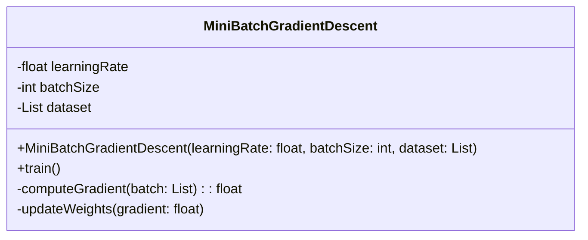
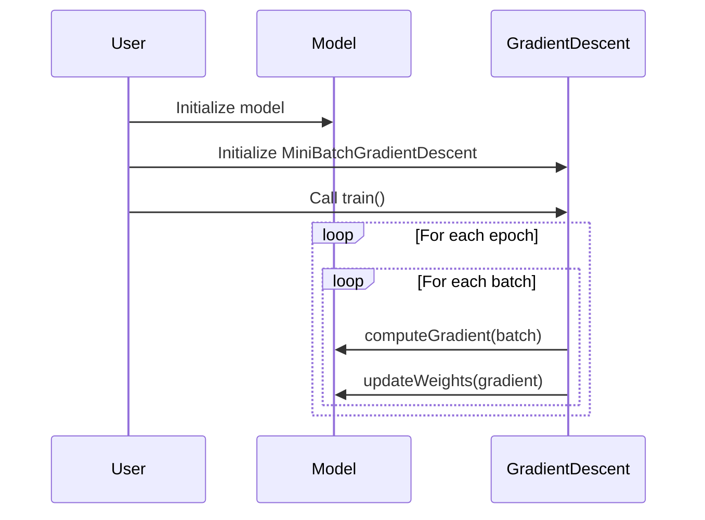

Mini-batch Gradient Descent (MBGD) is an optimization algorithm that strikes a balance between Stochastic Gradient Descent (SGD) and full-batch gradient descent. It processes small subsets of the training data, enabling efficient and scalable training of neural networks.

## Description

Mini-batch Gradient Descent divides the training dataset into small batches and performs an update for each batch. This approach combines the advantages of both SGD (speed and computational efficiency) and full-batch gradient descent (accurate gradient estimation).

## Benefits

- **Efficient Computation:** Smaller batches lead to faster computation compared to full-batch gradient descent.
- **Smoother Convergence:** Averaging gradients over batches provides smoother convergence compared to SGD, which can be noisy.
- **Reduced Memory Usage:** Requires less memory than full-batch gradient descent, making it suitable for large datasets.
- **Parallelization:** Allows parallel processing across multiple processors or GPUs.

## Trade-offs

- **Choice of Batch Size:** Selecting an optimal batch size is crucial. Small batches can still be noisy, while very large batches may lose the computational advantages.
- **Implementation Complexity:** Requires careful management of batch creation and optimization loops.

## Use Cases

- **Image Classification:** Efficiently trains deep convolutional neural networks on large image datasets.
- **Natural Language Processing:** Optimizes training on large text corpora for tasks like language modeling and sentiment analysis.
- **Reinforcement Learning:** Balances exploration and exploitation by learning from small batches of experience data.

## UML Diagrams

### Class Diagram



### Sequence Diagram



## Example Implementations

### Python

```python
import numpy as np

class MiniBatchGradientDescent:
    def __init__(self, learning_rate, batch_size, dataset):
        self.learning_rate = learning_rate
        self.batch_size = batch_size
        self.dataset = dataset
    
    def train(self, epochs):
        for epoch in range(epochs):
            np.random.shuffle(self.dataset)
            for i in range(0, len(self.dataset), self.batch_size):
                batch = self.dataset[i:i + self.batch_size]
                gradient = self.compute_gradient(batch)
                self.update_weights(gradient)
    
    def compute_gradient(self, batch):
        # Example gradient computation
        return np.mean(batch)
    
    def update_weights(self, gradient):
        # Example weight update
        pass

dataset = np.random.randn(1000)
mbgd = MiniBatchGradientDescent(0.01, 32, dataset)
mbgd.train(10)
```

### Java

```java
import java.util.Collections;
import java.util.List;
import java.util.Random;

public class MiniBatchGradientDescent {
    private double learningRate;
    private int batchSize;
    private List<Double> dataset;

    public MiniBatchGradientDescent(double learningRate, int batchSize, List<Double> dataset) {
        this.learningRate = learningRate;
        this.batchSize = batchSize;
        this.dataset = dataset;
    }

    public void train(int epochs) {
        for (int epoch = 0; epoch < epochs; epoch++) {
            Collections.shuffle(dataset, new Random());
            for (int i = 0; i < dataset.size(); i += batchSize) {
                List<Double> batch = dataset.subList(i, Math.min(i + batchSize, dataset.size()));
                double gradient = computeGradient(batch);
                updateWeights(gradient);
            }
        }
    }

    private double computeGradient(List<Double> batch) {
        return batch.stream().mapToDouble(d -> d).average().orElse(0.0);
    }

    private void updateWeights(double gradient) {
        // Implement weight update logic
    }
}
```

### Scala

```scala
import scala.util.Random

class MiniBatchGradientDescent(learningRate: Double, batchSize: Int, dataset: Array[Double]) {
  
  def train(epochs: Int): Unit = {
    for (_ <- 1 to epochs) {
      Random.shuffle(dataset.toSeq).grouped(batchSize).foreach { batch =>
        val gradient = computeGradient(batch.toArray)
        updateWeights(gradient)
      }
    }
  }

  private def computeGradient(batch: Array[Double]): Double = {
    batch.sum / batch.length
  }

  private def updateWeights(gradient: Double): Unit = {
    // Implement weight update logic
  }
}

val dataset = Array.fill(1000)(Random.nextGaussian)
val mbgd = new MiniBatchGradientDescent(0.01, 32, dataset)
mbgd.train(10)
```

### Clojure

```clojure
(defn shuffle-dataset [dataset]
  (shuffle dataset))

(defn compute-gradient [batch]
  (/ (reduce + batch) (count batch)))

(defn update-weights [gradient]
  ;; Implement weight update logic
)

(defn train [dataset learning-rate batch-size epochs]
  (doseq [_ (range epochs)]
    (doseq [batch (partition batch-size (shuffle-dataset dataset))]
      (let [gradient (compute-gradient batch)]
        (update-weights gradient)))))

(def dataset (repeatedly 1000 #(rand)))
(train dataset 0.01 32 10)
```

## Related Design Patterns

- **Stochastic Gradient Descent (SGD):** Processes one sample at a time, leading to faster updates but noisier convergence.
- **Batch Gradient Descent:** Uses the entire dataset for each update, providing accurate gradients but at a high computational cost.
- **Momentum:** Enhances gradient descent by accumulating previous gradients to smooth updates.
- **Adam:** Combines adaptive learning rates and momentum, improving convergence speed and stability.

## Resources and References

- [Deep Learning by Ian Goodfellow, Yoshua Bengio, and Aaron Courville](https://www.deeplearningbook.org/)
- [Mini-batch Gradient Descent](https://www.cs.toronto.edu/~tijmen/csc321/slides/lecture_slides_lec6.pdf) by University of Toronto
- [OpenAI Gym](https://gym.openai.com/) - Reinforcement Learning Environments
- [TensorFlow](https://www.tensorflow.org/) - Open Source Machine Learning Framework

## Summary

Mini-batch Gradient Descent is an efficient and effective optimization technique for training neural networks, especially when dealing with large datasets. By splitting the training data into manageable batches, it balances the computational efficiency of SGD with the stability of full-batch gradient descent. Properly tuning the batch size and other hyperparameters can lead to significant performance improvements in various machine learning tasks.

By understanding and implementing Mini-batch Gradient Descent, practitioners can optimize their neural network training processes, making them faster and more scalable while maintaining accuracy and stability.
