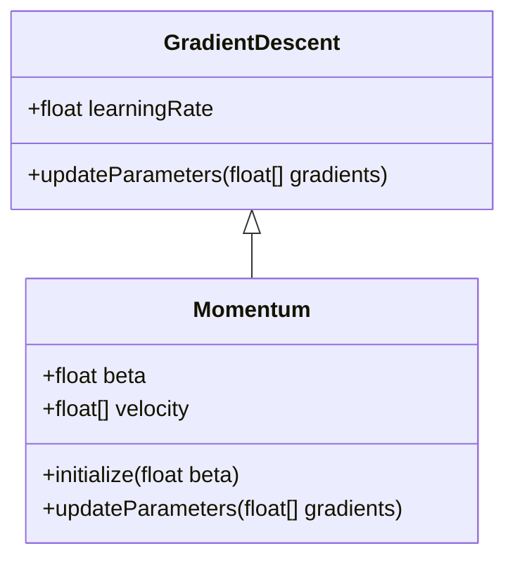
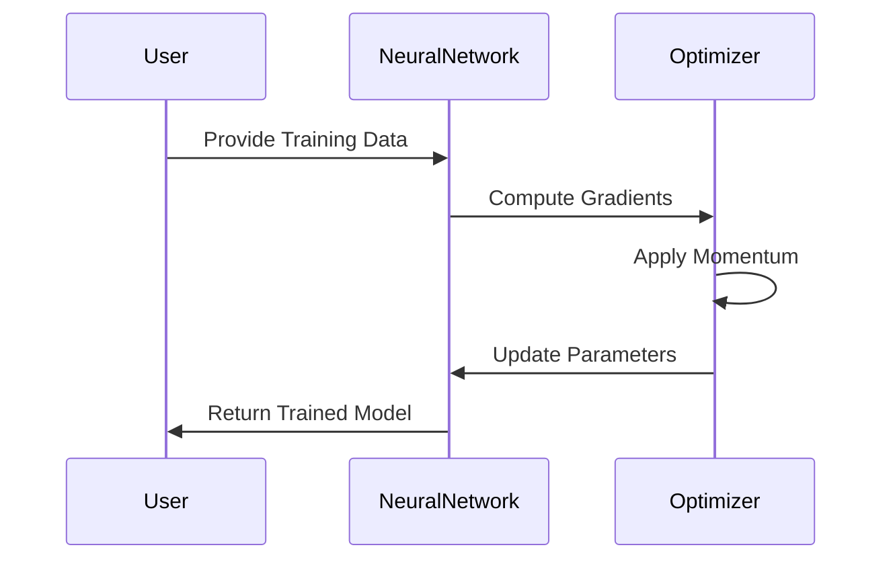

## Introduction
Momentum is a technique in neural networks used to accelerate the convergence of the gradient descent algorithm by considering the past gradients. This helps the model escape local minima more efficiently. By incorporating a fraction of the previous update to the current update, the model gains a momentum effect, which is particularly useful in navigating the complex loss landscapes common in deep learning.

## Detailed Description
The concept of momentum is analogous to the physical term where an object accumulates momentum as it moves, thus gaining speed and energy to push through resistances. In the context of neural networks, the update rule with momentum is given by:


v_t = \beta v_{t-1} + (1 - \beta) \nabla \theta J(\theta)


\theta = \theta - \eta v_t


Here:
- \\( v_t \\) is the velocity (momentum) term at time \\( t \\).
- \\( \beta \\) is the momentum coefficient.
- \\( \eta \\) is the learning rate.
- \\( \nabla \theta J(\theta) \\) is the gradient of the objective function \\( J \\) with respect to the parameters \\( \theta \\).

## UML Diagrams

### UML Class Diagram


### UML Sequence Diagram


## Benefits
- **Accelerated Convergence:** Faster convergence to the optimal solution compared to vanilla gradient descent.
- **Stability:** Reduces the oscillations in the updates, leading to a smoother convergence.
- **Escaping Local Minima:** Helps in escaping shallow local minima and saddle points.

## Trade-offs
- **Complexity:** Adds additional hyperparameter (\\(\beta\\)) that needs tuning.
- **Overshooting:** If the momentum coefficient is too high, it may lead to overshooting the minima.

## Examples

### Python
```python
class MomentumOptimizer:
    def __init__(self, learning_rate, beta):
        self.learning_rate = learning_rate
        self.beta = beta
        self.velocity = None

    def update(self, params, gradients):
        if self.velocity is None:
            self.velocity = [0.0 for _ in gradients]

        self.velocity = [self.beta * v + (1 - self.beta) * g for v, g in zip(self.velocity, gradients)]
        return [p - self.learning_rate * v for p, v in zip(params, self.velocity)]
```

### Java
```java
public class MomentumOptimizer {
    private double learningRate;
    private double beta;
    private double[] velocity;

    public MomentumOptimizer(double learningRate, double beta) {
        this.learningRate = learningRate;
        this.beta = beta;
        this.velocity = null;
    }

    public double[] update(double[] params, double[] gradients) {
        if (velocity == null) {
            velocity = new double[gradients.length];
        }

        for (int i = 0; i < gradients.length; i++) {
            velocity[i] = beta * velocity[i] + (1 - beta) * gradients[i];
            params[i] -= learningRate * velocity[i];
        }
        return params;
    }
}
```

### Scala
```scala
class MomentumOptimizer(learningRate: Double, beta: Double) {
  private var velocity: Option[Array[Double]] = None

  def update(params: Array[Double], gradients: Array[Double]): Array[Double] = {
    if (velocity.isEmpty) {
      velocity = Some(Array.fill(gradients.length)(0.0))
    }

    for (i <- gradients.indices) {
      velocity.get(i) = beta * velocity.get(i) + (1 - beta) * gradients(i)
      params(i) -= learningRate * velocity.get(i)
    }
    params
  }
}
```

### Clojure
```clojure
(defn momentum-optimizer [learning-rate beta]
  (let [velocity (atom nil)]
    (fn [params gradients]
      (when-not @velocity
        (reset! velocity (vec (repeat (count gradients) 0.0))))
      (reset! velocity (mapv (fn [v g] (+ (* beta v) (* (- 1 beta) g))) @velocity gradients))
      (mapv (fn [p v] (- p (* learning-rate v))) params @velocity))))
```

## Use Cases
- **Deep Learning:** Effective in large-scale deep learning models where the loss landscape is complex.
- **Image Recognition:** Accelerates training in convolutional neural networks (CNNs) used for image classification tasks.
- **Natural Language Processing:** Helps in training recurrent neural networks (RNNs) and transformers more efficiently.

## Related Design Patterns
- **Nesterov Accelerated Gradient (NAG):** A variant of momentum that looks ahead to improve convergence.
- **Adam Optimizer:** Combines the advantages of both momentum and RMSProp optimizers.

## Resources and References
- **Deep Learning Book by Ian Goodfellow:** A comprehensive resource for understanding optimization techniques in deep learning.
- **Andrew Ng's Machine Learning Course:** Online lectures and materials discussing optimization algorithms.
- **TensorFlow and PyTorch Documentation:** For implementations and practical applications.

## Open Source Frameworks
- **TensorFlow:** Provides an implementation of momentum optimizer.
- **PyTorch:** Supports momentum through its SGD optimizer class.

## Final Summary
Momentum is a vital optimization technique in neural networks that accelerates convergence by leveraging past gradients. It offers significant benefits in terms of stability and efficiency, making it a preferred choice for training complex models. Although it introduces additional complexity with the momentum coefficient, its advantages in escaping local minima and achieving faster convergence make it indispensable in the deep learning toolbox. 

Implementing momentum in various programming languages highlights its versatility and ease of integration into existing machine learning pipelines, ensuring it remains a fundamental technique for practitioners and researchers alike.
