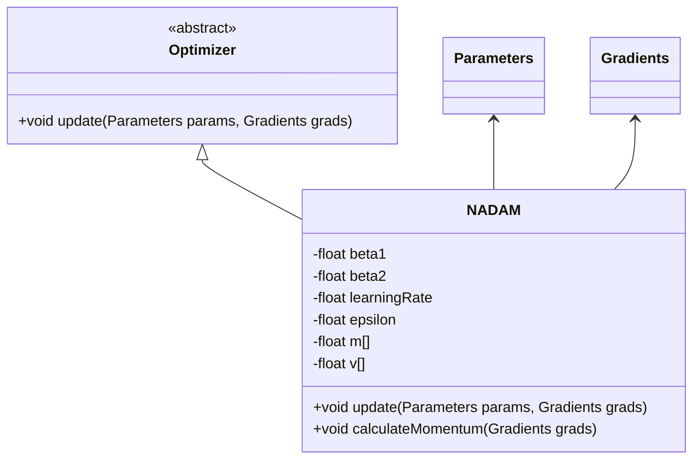
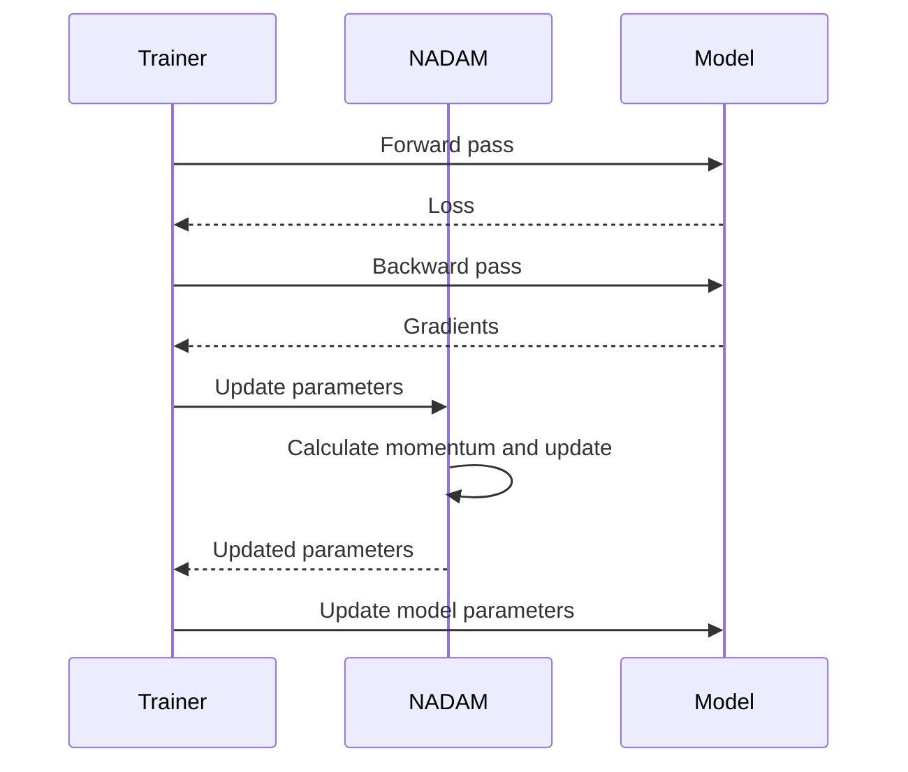

NADAM is an advanced gradient descent optimization algorithm that merges the strengths of Adam (Adaptive Moment Estimation) with Nesterov Accelerated Gradient (NAG) momentum. This combination aims to provide faster convergence and more stable training for neural networks.

## Detailed Description

NADAM integrates the adaptive learning rate strategy of Adam with the momentum approach of Nesterov. By doing this, it optimizes the parameters more effectively, helping in quicker convergence compared to traditional optimization methods.

### Mathematical Formulation

NADAM combines the updates of Adam and Nesterov Momentum:


m_t = \beta_1 m_{t-1} + (1 - \beta_1) g_t



v_t = \beta_2 v_{t-1} + (1 - \beta_2) g_t^2



\hat{m}_t = \frac{m_t}{1 - \beta_1^t}



\hat{v}_t = \frac{v_t}{1 - \beta_2^t}



\theta_t = \theta_{t-1} - \eta \left( \frac{\hat{m}_t}{\sqrt{\hat{v}_t} + \epsilon} \right)


Here, \\( g_t \\) is the gradient, \\( \beta_1 \\) and \\( \beta_2 \\) are hyperparameters, \\( \eta \\) is the learning rate, and \\( \epsilon \\) is a small constant for numerical stability.

### Benefits

- **Faster Convergence:** NADAM typically converges faster than other optimization algorithms due to the integration of Nesterov momentum.
- **Stable Training:** By using adaptive learning rates and momentum, NADAM helps maintain stability during training.
- **Optimized for Sparse Gradients:** Like Adam, NADAM works well with problems involving sparse gradients.

### Trade-offs

- **Hyperparameter Sensitivity:** It requires careful tuning of hyperparameters to achieve optimal performance.
- **Computational Overhead:** Slightly higher computational overhead compared to simpler optimization algorithms.

## UML Class Diagram



## UML Sequence Diagram



## Examples

### Python

```python
import numpy as np

class NADAM:
    def __init__(self, learning_rate=0.001, beta1=0.9, beta2=0.999, epsilon=1e-7):
        self.lr = learning_rate
        self.beta1 = beta1
        self.beta2 = beta2
        self.epsilon = epsilon
        self.m = None
        self.v = None
        self.t = 0

    def update(self, params, grads):
        if self.m is None:
            self.m = {k: np.zeros_like(v) for k, v in params.items()}
            self.v = {k: np.zeros_like(v) for k, v in params.items()}

        self.t += 1
        for k in params.keys():
            self.m[k] = self.beta1 * self.m[k] + (1 - self.beta1) * grads[k]
            self.v[k] = self.beta2 * self.v[k] + (1 - self.beta2) * (grads[k] ** 2)

            m_hat = self.m[k] / (1 - self.beta1 ** self.t)
            v_hat = self.v[k] / (1 - self.beta2 ** self.t)

            params[k] -= self.lr * m_hat / (np.sqrt(v_hat) + self.epsilon)
```

### Java

```java
import java.util.Map;

public class NADAM {
    private double beta1, beta2, learningRate, epsilon;
    private Map<String, double[]> m, v;
    private int t;

    public NADAM(double learningRate, double beta1, double beta2, double epsilon) {
        this.learningRate = learningRate;
        this.beta1 = beta1;
        this.beta2 = beta2;
        this.epsilon = epsilon;
        this.t = 0;
    }

    public void update(Map<String, double[]> params, Map<String, double[]> grads) {
        if (m == null) {
            m = new HashMap<>();
            v = new HashMap<>();
            for (String key : params.keySet()) {
                m.put(key, new double[params.get(key).length]);
                v.put(key, new double[params.get(key).length]);
            }
        }

        t++;
        for (String key : params.keySet()) {
            double[] grad = grads.get(key);
            double[] mt = m.get(key);
            double[] vt = v.get(key);

            for (int i = 0; i < grad.length; i++) {
                mt[i] = beta1 * mt[i] + (1 - beta1) * grad[i];
                vt[i] = beta2 * vt[i] + (1 - beta2) * grad[i] * grad[i];

                double mHat = mt[i] / (1 - Math.pow(beta1, t));
                double vHat = vt[i] / (1 - Math.pow(beta2, t));

                params.get(key)[i] -= learningRate * mHat / (Math.sqrt(vHat) + epsilon);
            }
        }
    }
}
```

### Scala

```scala
class NADAM(
  var learningRate: Double = 0.001,
  var beta1: Double = 0.9,
  var beta2: Double = 0.999,
  var epsilon: Double = 1e-7
) {
  private var m: Map[String, Array[Double]] = _
  private var v: Map[String, Array[Double]] = _
  private var t: Int = 0

  def update(params: Map[String, Array[Double]], grads: Map[String, Array[Double]]): Unit = {
    if (m == null) {
      m = params.mapValues(_.map(_ => 0.0))
      v = params.mapValues(_.map(_ => 0.0))
    }

    t += 1
    for ((key, param) <- params) {
      val grad = grads(key)
      val mt = m(key)
      val vt = v(key)

      for (i <- grad.indices) {
        mt(i) = beta1 * mt(i) + (1 - beta1) * grad(i)
        vt(i) = beta2 * vt(i) + (1 - beta2) * grad(i) * grad(i)

        val mHat = mt(i) / (1 - Math.pow(beta1, t))
        val vHat = vt(i) / (1 - Math.pow(beta2, t))

        param(i) -= learningRate * mHat / (Math.sqrt(vHat) + epsilon)
      }
    }
  }
}
```

### Clojure

```clojure
(ns nadam-optimizer)

(defn nadam [learning-rate beta1 beta2 epsilon]
  (let [state (atom {:m {} :v {} :t 0})]
    (fn update [params grads]
      (swap! state update :t inc)
      (doseq [[k grad] grads]
        (let [m-k (or (get-in @state [:m k]) (vec (repeat (count grad) 0)))
              v-k (or (get-in @state [:v k]) (vec (repeat (count grad) 0)))
              t (:t @state)
              beta1-power (Math/pow beta1 t)
              beta2-power (Math/pow beta2 t)]
          (swap! state assoc-in [:m k]
                 (mapv #(+ (* beta1 %1) (* (- 1 beta1) %2)) m-k grad))
          (swap! state assoc-in [:v k]
                 (mapv #(+ (* beta2 %1) (* (- 1 beta2) (* %2 %2))) v-k grad))
          (let [m-hat (mapv #(/ % (- 1 beta1-power)) (get-in @state [:m k]))
                v-hat (mapv #(/ % (- 1 beta2-power)) (get-in @state [:v k]))
                param-update (mapv #(/ % (Math/sqrt %2 epsilon)) m-hat v-hat)]
            (swap! params update k (partial mapv - param-update))))))))

;; Usage
(def params (atom {:w (vec [0.1 0.2]) :b (vec [0.3 0.4])}))
(def grads {:w (vec [0.01 0.02]) :b (vec [0.03 0.04])})
(def update-params (nadam 0.001 0.9 0.999 1e-7))
(update-params params grads)
```

## Use Cases

- **Image Classification:** Convolutional Neural Networks (CNNs) benefit from faster convergence.
- **Natural Language Processing:** Recurrent Neural Networks (RNNs) and Transformers training stabilization.
- **Reinforcement Learning:** Helps in faster learning of policies.

## Related Design Patterns

- **Adam:** An adaptive learning rate optimization algorithm.
- **Nesterov Momentum:** Enhances momentum by looking ahead.

## Resources and References

- **Original Paper on NADAM:** ["Incorporating Nesterov Momentum into Adam"](https://arxiv.org/abs/1412.6980).
- **Optimizers Documentation in TensorFlow:** [TensorFlow Optimizers](https://www.tensorflow.org/api_docs/python/tf/keras/optimizers).
- **PyTorch Optimizers Documentation:** [PyTorch Optimizers](https://pytorch.org/docs/stable/optim.html).

## Open Source Frameworks

- **TensorFlow:** Includes NADAM optimizer.
- **Keras:** Provides a ready-to-use implementation of NADAM.
- **PyTorch:** Custom implementations of NADAM can be used.

## Summary

NADAM optimizes the strengths of Adam and Nesterov Momentum to provide a powerful tool for faster and more stable convergence in neural network training. While it involves careful tuning of hyperparameters, its benefits often outweigh the complexities, making it a popular choice among deep learning practitioners.
