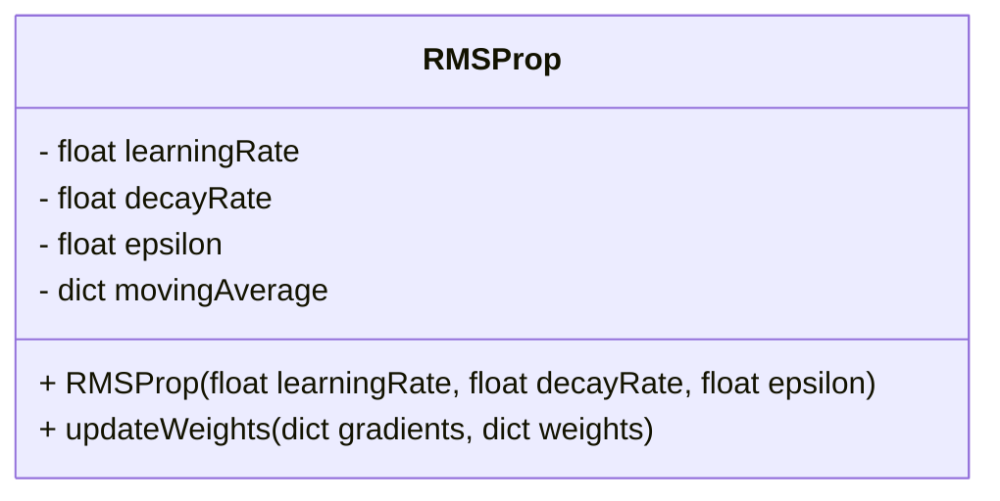
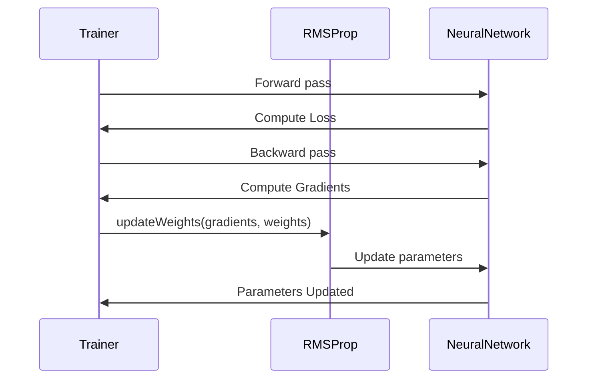

## RMSProp: Normalizing Gradients by Cumulative Average

### Overview

RMSProp (Root Mean Square Propagation) is an adaptive learning rate optimization algorithm for training neural networks. It was introduced by Geoffrey Hinton and has become a staple due to its ability to handle non-stationary objectives and improve convergence by normalizing gradients with a cumulative average.

### Benefits

- **Adaptive Learning Rate:** RMSProp adjusts the learning rate dynamically, making it suitable for diverse problem sets.
- **Convergence Stability:** Helps in stabilizing the learning process, especially for neural networks with noisy gradients.
- **Efficiency:** Balances the learning process, thereby speeding up convergence.

### Trade-offs

- **Hyperparameter Tuning:** Requires careful selection of the decay rate and learning rate.
- **Memory Consumption:** Maintains a moving average of squared gradients, which can increase memory usage.

### Use Cases

- Training deep learning models where the objective function can change over time.
- Models prone to noisy gradients or sparse updates.
- Situations where a fixed learning rate leads to suboptimal convergence.

### Algorithm Description

RMSProp normalizes the gradients by dividing the learning rate by a moving average of the magnitudes of recent gradients.

#### Mathematical Formulation

Given:
- \\(\theta\\): parameters
- \\(g_t\\): gradient at time step \\(t\\)
- \\(\eta\\): learning rate
- \\(\gamma\\): decay rate
- \\(\epsilon\\): smoothing term (to avoid division by zero)

The algorithm updates the parameters as follows:
1. Compute the moving average of the squared gradients:
   
   E[g^2]_t = \gamma E[g^2]_{t-1} + (1 - \gamma) g_t^2
   
2. Update the parameters:
   
   \theta_{t+1} = \theta_t - \frac{\eta}{\sqrt{E[g^2]_t + \epsilon}} g_t
   

### UML Diagrams

#### Class Diagram



#### Sequence Diagram



### Code Examples

#### Python

```python
import numpy as np

class RMSProp:
    def __init__(self, learning_rate=0.001, decay_rate=0.9, epsilon=1e-8):
        self.learning_rate = learning_rate
        self.decay_rate = decay_rate
        self.epsilon = epsilon
        self.moving_average = {}

    def update_weights(self, gradients, weights):
        for w in weights:
            if w not in self.moving_average:
                self.moving_average[w] = np.zeros_like(gradients[w])
            self.moving_average[w] = self.decay_rate * self.moving_average[w] + (1 - self.decay_rate) * gradients[w] ** 2
            weights[w] -= self.learning_rate * gradients[w] / (np.sqrt(self.moving_average[w]) + self.epsilon)

gradients = {'w1': np.array([0.1, -0.2]), 'w2': np.array([0.4, -0.5])}
weights = {'w1': np.array([0.5, 0.5]), 'w2': np.array([0.6, 0.6])}

optimizer = RMSProp()
optimizer.update_weights(gradients, weights)
print(weights)
```

#### Java

```java
import java.util.HashMap;
import java.util.Map;

public class RMSProp {
    private float learningRate;
    private float decayRate;
    private float epsilon;
    private Map<String, float[]> movingAverage;

    public RMSProp(float learningRate, float decayRate, float epsilon) {
        this.learningRate = learningRate;
        this.decayRate = decayRate;
        this.epsilon = epsilon;
        this.movingAverage = new HashMap<>();
    }

    public void updateWeights(Map<String, float[]> gradients, Map<String, float[]> weights) {
        for (String key : weights.keySet()) {
            if (!movingAverage.containsKey(key)) {
                movingAverage.put(key, new float[gradients.get(key).length]);
            }

            float[] avg = movingAverage.get(key);
            float[] grad = gradients.get(key);
            for (int i = 0; i < grad.length; i++) {
                avg[i] = decayRate * avg[i] + (1 - decayRate) * grad[i] * grad[i];
                weights.get(key)[i] -= learningRate * grad[i] / (Math.sqrt(avg[i]) + epsilon);
            }
        }
    }

    public static void main(String[] args) {
        Map<String, float[]> gradients = new HashMap<>();
        gradients.put("w1", new float[]{0.1f, -0.2f});
        gradients.put("w2", new float[]{0.4f, -0.5f});

        Map<String, float[]> weights = new HashMap<>();
        weights.put("w1", new float[]{0.5f, 0.5f});
        weights.put("w2", new float[]{0.6f, 0.6f});

        RMSProp optimizer = new RMSProp(0.001f, 0.9f, 1e-8f);
        optimizer.updateWeights(gradients, weights);

        for (Map.Entry<String, float[]> entry : weights.entrySet()) {
            System.out.println(entry.getKey() + ": " + Arrays.toString(entry.getValue()));
        }
    }
}
```

#### Scala

```scala
class RMSProp(val learningRate: Double = 0.001, val decayRate: Double = 0.9, val epsilon: Double = 1e-8) {
  private var movingAverage: Map[String, Array[Double]] = Map()

  def updateWeights(gradients: Map[String, Array[Double]], weights: Map[String, Array[Double]]): Unit = {
    for ((key, weight) <- weights) {
      if (!movingAverage.contains(key)) {
        movingAverage += (key -> Array.fill(gradients(key).length)(0.0))
      }

      val avg = movingAverage(key)
      val grad = gradients(key)
      for (i <- grad.indices) {
        avg(i) = decayRate * avg(i) + (1 - decayRate) * Math.pow(grad(i), 2)
        weight(i) -= learningRate * grad(i) / (Math.sqrt(avg(i)) + epsilon)
      }
    }
  }
}

// Example usage
val gradients = Map("w1" -> Array(0.1, -0.2), "w2" -> Array(0.4, -0.5))
val weights = Map("w1" -> Array(0.5, 0.5), "w2" -> Array(0.6, 0.6))

val optimizer = new RMSProp()
optimizer.updateWeights(gradients, weights)

weights.foreach{ case (k, v) => println(s"$k: ${v.mkString(", ")}") }
```

#### Clojure

```clojure
(defn rmsprop [learning-rate decay-rate epsilon gradients weights]
  (let [moving-average (atom (into {} (map #(vector % (vec (repeat (count (gradients %)) 0.0))) (keys weights))))]
    (doseq [k (keys weights)]
      (let [avg (atom (moving-average k))]
        (doseq [i (range (count (gradients k)))]
          (swap! avg update-in [i] #(+ (* decay-rate %1) (* (- 1 decay-rate) (Math/pow (nth (gradients k) i) 2))))
          (assoc-in weights [k i] (- (nth weights k i) (* learning-rate (nth (gradients k) i) (/ 1 (Math/sqrt (+ (nth @avg i) epsilon))))))))
      (swap! moving-average assoc k @avg)))
  weights)

;; Example usage
(def gradients {"w1" [0.1 -0.2] "w2" [0.4 -0.5]})
(def weights {"w1" [0.5 0.5] "w2" [0.6 0.6]})

(def updated-weights (rmsprop 0.001 0.9 1e-8 gradients weights))
(println updated-weights)
```

### Related Design Patterns

- **Adam:** Similar to RMSProp but with momentum, combining the benefits of RMSProp and momentum-based SGD.
- **AdaGrad:** Focuses on adjusting the learning rate for each parameter, accumulating squared gradients.
- **Momentum:** An optimization strategy that helps to accelerate SGD in the relevant direction and dampens oscillations.

### References & Resources

- Geoffrey Hinton’s Coursera Lecture: [Neural Networks for Machine Learning](https://www.cs.toronto.edu/~hinton/coursera/lecture6/lec6.pdf)
- Original RMSProp Paper: "A Practical Guide to Training Restricted Boltzmann Machines" by Geoffrey Hinton
- Open Source Implementations: [TensorFlow](https://www.tensorflow.org/api_docs/python/tf/keras/optimizers/RMSprop), [PyTorch](https://pytorch.org/docs/stable/optim.html#torch.optim.RMSprop), [scikit-learn](https://scikit-learn.org/stable/)

### Summary

RMSProp is a powerful optimization algorithm designed to normalize gradients by a cumulative average, making it suitable for non-stationary objectives and improving the convergence stability of neural network training. Through examples in Python, Java, Scala, and Clojure, we illustrated its practical use and integration. The algorithm has related patterns like Adam and AdaGrad, offering a spectrum of choices for optimizing neural network training.

Explore RMSProp further through its extensive resources and references to implement and fine-tune for your specific machine learning needs.
