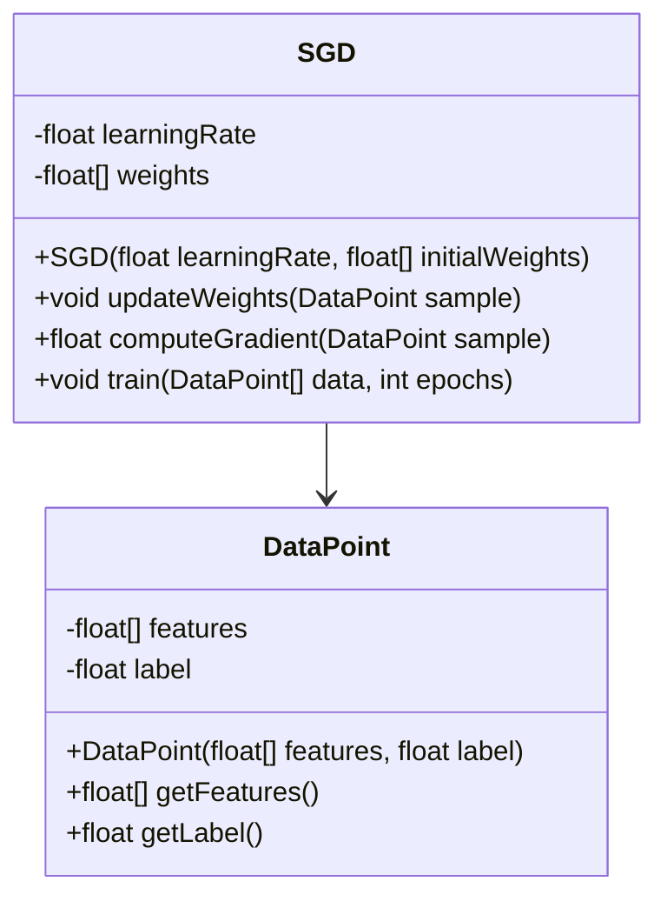
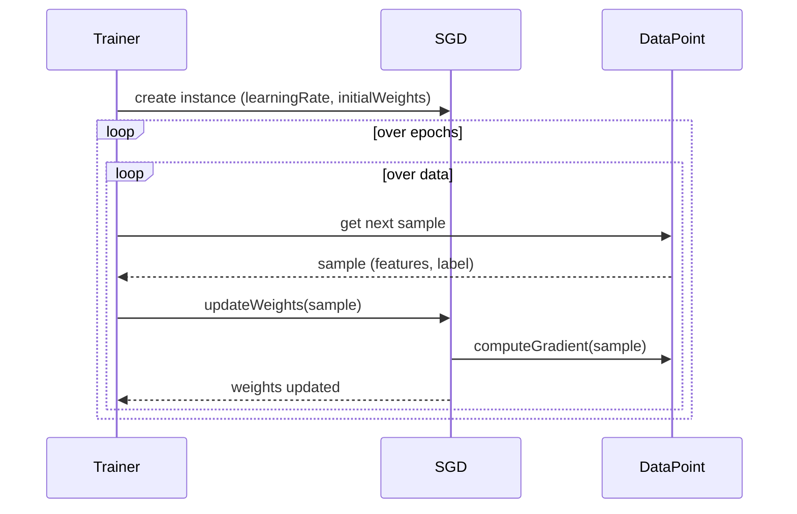

## Overview of SGD (Stochastic Gradient Descent)

Stochastic Gradient Descent (SGD) is an optimization algorithm commonly used in training neural networks. Unlike Batch Gradient Descent which updates weights after computing the gradient over the entire dataset, SGD updates weights using a single training example at a time.

## Benefits and Trade-offs

### Benefits
- **Efficiency:** Handles large datasets efficiently by processing one sample at a time.
- **Memory Utilization:** Requires significantly less memory than Batch Gradient Descent.
- **Faster Convergence:** Potentially converges faster to a minimum, especially for very large datasets.

### Trade-offs
- **Noise in Updates:** Introduces variance in the updates which can make the path to convergence noisy.
- **Learning Rate Sensitivity:** Requires careful tuning of the learning rate to ensure stable and efficient convergence.
- **Convergence:** Can get stuck in local minima or take longer to converge compared to more sophisticated variants like Mini-batch Gradient Descent.

## UML Diagrams

### Class Diagram



### Sequence Diagram



## Implementation Examples

### Python

```python
import numpy as np

class SGD:
    def __init__(self, learning_rate, initial_weights):
        self.learning_rate = learning_rate
        self.weights = np.array(initial_weights)

    def compute_gradient(self, sample):
        features, label = sample
        prediction = np.dot(self.weights, features)
        error = prediction - label
        gradient = error * features
        return gradient

    def update_weights(self, sample):
        gradient = self.compute_gradient(sample)
        self.weights -= self.learning_rate * gradient

    def train(self, data, epochs):
        for _ in range(epochs):
            for sample in data:
                self.update_weights(sample)

data = [([2.5, 3.0], 1), ([0.5, 1.5], -1)]
sgd = SGD(learning_rate=0.01, initial_weights=[0.1, 0.1])
sgd.train(data, epochs=10)
print(sgd.weights)
```

### Java

```java
public class SGD {
    private double learningRate;
    private double[] weights;

    public SGD(double learningRate, double[] initialWeights) {
        this.learningRate = learningRate;
        this.weights = initialWeights.clone();
    }

    private double[] computeGradient(DataPoint sample) {
        double[] features = sample.getFeatures();
        double label = sample.getLabel();
        double prediction = dotProduct(weights, features);
        double error = prediction - label;
        double[] gradient = new double[features.length];
        for (int i = 0; i < features.length; i++) {
            gradient[i] = error * features[i];
        }
        return gradient;
    }

    public void updateWeights(DataPoint sample) {
        double[] gradient = computeGradient(sample);
        for (int i = 0; i < weights.length; i++) {
            weights[i] -= learningRate * gradient[i];
        }
    }

    public void train(DataPoint[] data, int epochs) {
        for (int epoch = 0; epoch < epochs; epoch++) {
            for (DataPoint sample : data) {
                updateWeights(sample);
            }
        }
    }

    private double dotProduct(double[] a, double[] b) {
        double result = 0.0;
        for (int i = 0; i < a.length; i++) {
            result += a[i] * b[i];
        }
        return result;
    }
}

// Example usage
class Main {
    public static void main(String[] args) {
        DataPoint[] data = {
            new DataPoint(new double[]{2.5, 3.0}, 1),
            new DataPoint(new double[]{0.5, 1.5}, -1)
        };
        SGD sgd = new SGD(0.01, new double[]{0.1, 0.1});
        sgd.train(data, 10);
        System.out.println(Arrays.toString(sgd.getWeights()));
    }
}

class DataPoint {
    private final double[] features;
    private final double label;

    public DataPoint(double[] features, double label) {
        this.features = features;
        this.label = label;
    }

    public double[] getFeatures() {
        return features;
    }

    public double getLabel() {
        return label;
    }
}
```

### Scala

```scala
import scala.collection.mutable.ArrayBuffer

class SGD(val learningRate: Double, var weights: Array[Double]) {
    
    def computeGradient(sample: (Array[Double], Double)): Array[Double] = {
        val (features, label) = sample
        val prediction = weights.zip(features).map { case (w, x) => w * x }.sum
        val error = prediction - label
        features.map(_ * error)
    }

    def updateWeights(sample: (Array[Double], Double)): Unit = {
        val gradient = computeGradient(sample)
        weights = weights.zip(gradient).map { case (w, g) => w - learningRate * g }
    }

    def train(data: Array[(Array[Double], Double)], epochs: Int): Unit = {
        for (_ <- 1 to epochs) {
            data.foreach(updateWeights)
        }
    }
}

// Example usage
object Main extends App {
    val data = Array((Array(2.5, 3.0), 1), (Array(0.5, 1.5), -1))
    val sgd = new SGD(0.01, Array(0.1, 0.1))
    sgd.train(data, 10)
    println(sgd.weights.mkString(", "))
}
```

### Clojure

```clojure
(defn dot-product [v1 v2]
  (reduce + (map * v1 v2)))

(defn compute-gradient [weights sample]
  (let [[features label] sample
        prediction (dot-product weights features)
        error (- prediction label)]
    (mapv #(* error %) features)))

(defn update-weights [weights sample learning-rate]
  (let [gradient (compute-gradient weights sample)]
    (mapv (fn [w g] (- w (* learning-rate g))) weights gradient)))

(defn train [data weights learning-rate epochs]
  (loop [weights weights epochs epochs]
    (if (zero? epochs)
      weights
      (recur
        (reduce #(update-weights %1 %2 learning-rate) weights data)
        (dec epochs)))))

;; Example usage
(def data [[ [2.5 3.0] 1] [ [0.5 1.5] -1]])
(def initial-weights [0.1 0.1])
(def trained-weights (train data initial-weights 0.01 10))
(println trained-weights)
```

## Use Cases

- **Large-scale Learning:** Ideal for datasets that are too large to fit into memory.
- **Online Learning:** Suitable for real-time learning applications where data comes in a stream.
- **Reinforcement Learning:** Often used in RL where updates are made frequently with new experiences.

## Related Design Patterns

- **Mini-batch Gradient Descent:** A compromise between Batch Gradient Descent and SGD, where updates are made on a small batch of samples.
- **Momentum:** An extension to SGD that helps to accelerate gradients vectors in the right directions, leading to faster converging.

## References and Resources

- [Understanding Gradient Descent](https://towardsdatascience.com/understanding-gradient-descent-algorithm-7cbeaa67232a)
- [OpenAI's Spinning Up in Deep RL](https://spinningup.openai.com/en/latest/)
- **Frameworks:**
  - [TensorFlow](https://www.tensorflow.org)
  - [PyTorch](https://pytorch.org)
  - [scikit-learn](https://scikit-learn.org)

## Summary

Stochastic Gradient Descent (SGD) is a cornerstone algorithm in machine learning and neural network training. Its simplicity, efficiency, and effectiveness make it highly suitable for large datasets and online learning scenarios. However, its susceptibility to noisy updates and sensitivity to learning rates necessitates thoughtful implementation and tuning. By understanding its benefits and trade-offs, developers can better leverage SGD in various machine learning projects.
