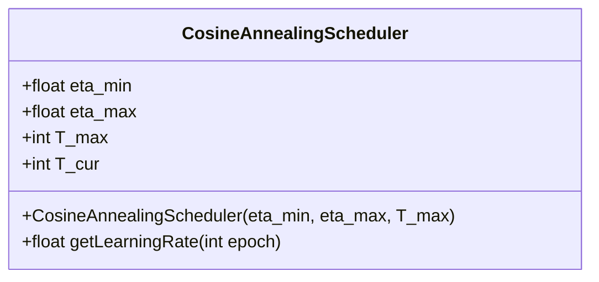
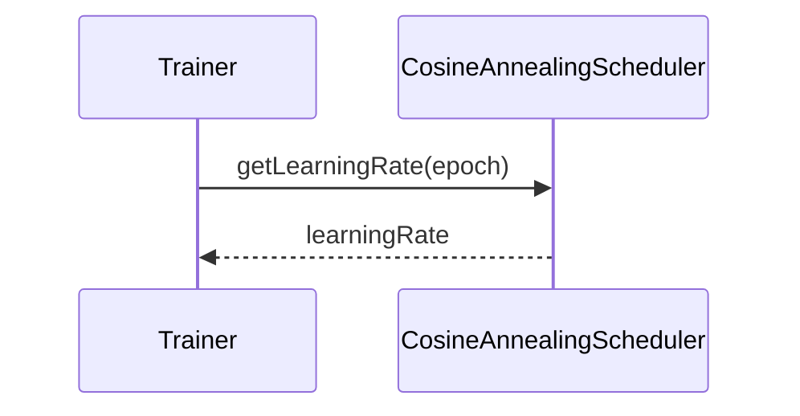

## Introduction

Cosine Annealing is a learning rate schedule that adjusts the learning rate using the cosine function. This method is particularly useful for scenarios requiring cyclic learning rates, helping to improve the training efficiency and performance of neural networks. 

### Benefits
- **Smooth Convergence**: Reduces the risk of overshooting the minima, leading to smoother convergence.
- **Effective Learning Rate Adjustment**: Dynamically adjusts the learning rate to suit different stages of training.
- **Improved Training Performance**: Enhances the ability of the network to escape local minima and converge to better solutions.

### Trade-offs
- **Complex Implementation**: Slightly more complex to implement compared to constant or step decay learning rates.
- **Requires Tuning**: Proper tuning of the hyperparameters is necessary for optimal performance.

## Detailed Description

Cosine Annealing involves adjusting the learning rate following the cosine function over a predefined number of epochs. The learning rate decreases and increases cyclically, promoting effective training dynamics.

The cosine annealing learning rate \\(\eta_t\\) at time step \\(t\\) can be defined mathematically as:


\eta_t = \eta_{min} + \frac{1}{2} (\eta_{max} - \eta_{min}) \left(1 + \cos\left(\frac{T_{cur}}{T_{max}} \pi\right)\right)


where:
- \\(\eta_{min}\\) is the minimum learning rate.
- \\(\eta_{max}\\) is the maximum learning rate.
- \\(T_{cur}\\) is the current number of epochs.
- \\(T_{max}\\) is the total number of epochs.

## UML Diagrams

### UML Class Diagram



### UML Sequence Diagram



## Example Implementations

### Python

```python
import math

class CosineAnnealingScheduler:
    def __init__(self, eta_min, eta_max, T_max):
        self.eta_min = eta_min
        self.eta_max = eta_max
        self.T_max = T_max
        self.T_cur = 0

    def get_learning_rate(self, epoch):
        self.T_cur = epoch
        return self.eta_min + 0.5 * (self.eta_max - self.eta_min) * (1 + math.cos(math.pi * self.T_cur / self.T_max))

scheduler = CosineAnnealingScheduler(eta_min=0.001, eta_max=0.1, T_max=100)
for epoch in range(100):
    print(f"Epoch {epoch}: Learning Rate = {scheduler.get_learning_rate(epoch)}")
```

### Java

```java
public class CosineAnnealingScheduler {
    private double etaMin;
    private double etaMax;
    private int TMax;
    private int TCur;

    public CosineAnnealingScheduler(double etaMin, double etaMax, int TMax) {
        this.etaMin = etaMin;
        this.etaMax = etaMax;
        this.TMax = TMax;
        this.TCur = 0;
    }

    public double getLearningRate(int epoch) {
        this.TCur = epoch;
        return etaMin + 0.5 * (etaMax - etaMin) * (1 + Math.cos(Math.PI * TCur / TMax));
    }

    public static void main(String[] args) {
        CosineAnnealingScheduler scheduler = new CosineAnnealingScheduler(0.001, 0.1, 100);
        for (int epoch = 0; epoch < 100; epoch++) {
            System.out.println("Epoch " + epoch + ": Learning Rate = " + scheduler.getLearningRate(epoch));
        }
    }
}
```

### Scala

```scala
import scala.math._

class CosineAnnealingScheduler(val etaMin: Double, val etaMax: Double, val TMax: Int) {
  private var TCur: Int = 0

  def getLearningRate(epoch: Int): Double = {
    TCur = epoch
    etaMin + 0.5 * (etaMax - etaMin) * (1 + cos(Pi * TCur / TMax))
  }
}

object Main extends App {
  val scheduler = new CosineAnnealingScheduler(0.001, 0.1, 100)
  for (epoch <- 0 until 100) {
    println(s"Epoch $epoch: Learning Rate = ${scheduler.getLearningRate(epoch)}")
  }
}
```

### Clojure

```clojure
(defn cosine-annealing-scheduler [eta-min eta-max T-max]
  (fn [epoch]
    (let [TCur epoch
          cos-val (Math/cos (* Math/PI (/ TCur T-max)))]
      (+ eta-min (* 0.5 (- eta-max eta-min) (+ 1 cos-val))))))

;; Usage Example
(def scheduler (cosine-annealing-scheduler 0.001 0.1 100))
(doseq [epoch (range 100)]
  (println (str "Epoch " epoch ": Learning Rate = " (scheduler epoch))))
```

## Use Cases

- **Training Neural Networks**: Particularly beneficial when training large deep neural networks where cyclic learning rates improve convergence.
- **Avoiding Overfitting**: By cyclically adjusting the learning rate, it can help in avoiding overfitting by promoting escape from local minima.

## Related Design Patterns

- **Step Decay**: Reduces the learning rate by a factor at regular intervals.
- **Exponential Decay**: Decreases the learning rate exponentially over time.
- **Cyclical Learning Rate**: Varies the learning rate within a range, often in a triangular or sinusoidal pattern.

## Resources and References

- [Original Paper on Cosine Annealing](https://arxiv.org/abs/1608.03983)
- [Deep Learning Book](https://www.deeplearningbook.org/)
- [PyTorch Learning Rate Schedulers](https://pytorch.org/docs/stable/optim.html#how-to-adjust-learning-rate)

## Open Source Frameworks

- **TensorFlow**: Provides support for various learning rate schedules including cosine annealing.
- **PyTorch**: Built-in support for cosine annealing learning rate schedulers.

## Summary

Cosine Annealing is a powerful design pattern for optimizing learning rates in neural networks. By cyclically adjusting the learning rate using the cosine function, it enhances the training performance and convergence of neural networks. Despite the need for proper hyperparameter tuning, the benefits of smoother convergence and dynamic learning rate adjustments make it a valuable tool in the deep learning toolkit.

By leveraging this pattern, practitioners can achieve better generalization performance and more efficient training dynamics in their neural network models.
