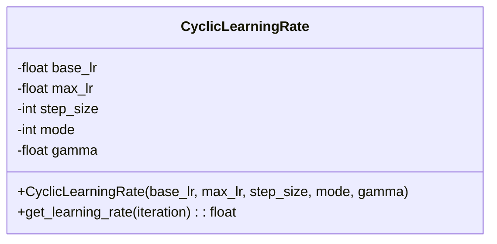
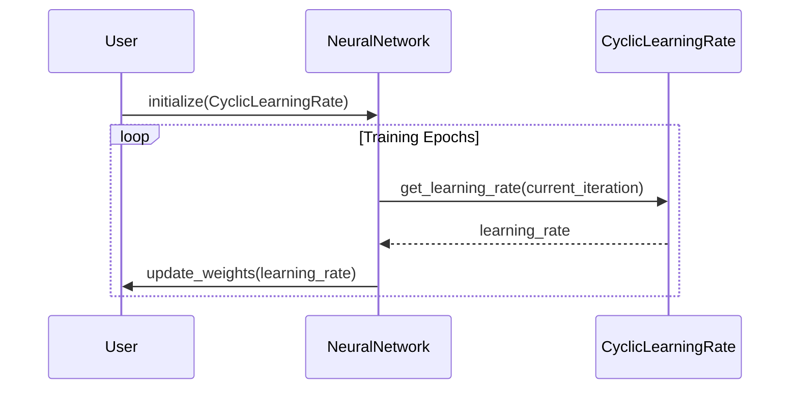

## Introduction

Cyclic Learning Rate (CLR) is a neural network training technique that varies the learning rate within a specified range of values. By cycling between a lower bound and an upper bound, this method aims to avoid the pitfalls of overfitting and getting stuck in local minima, leading to more robust model training.

## UML Diagrams

### UML Class Diagram



### UML Sequence Diagram



## Detailed Description

The Cyclic Learning Rate method fluctuates the learning rate cyclically between a lower limit and an upper limit, which can help in multiple ways:

1. **Avoiding Local Minima:** By periodically increasing the learning rate, the optimizer can jump out of local minima.
2. **Reducing Overfitting:** Varying the learning rate helps to prevent overfitting by introducing variability in the optimization process.
3. **Better Generalization:** Fluctuating the learning rate can lead to a model that generalizes better on unseen data.

### Modes

CLR has three primary modes to manage the learning rate cycles:

- **Triangular:** The learning rate simply oscillates between two bounds.
- **Triangular2:** The same as triangular, but the learning rate is halved at the end of each cycle.
- **Exp Range:** The learning rate varies between two bounds, but the amplitude of oscillations decreases over time.

## Implementation Examples

### Python

```python
import numpy as np

class CyclicLearningRate:
    def __init__(self, base_lr, max_lr, step_size, mode='triangular', gamma=1.0):
        self.base_lr = base_lr
        self.max_lr = max_lr
        self.step_size = step_size
        self.mode = mode
        self.gamma = gamma

    def get_learning_rate(self, iteration):
        cycle = np.floor(1 + iteration / (2 * self.step_size))
        x = np.abs(iteration / self.step_size - 2 * cycle + 1)
        
        if self.mode == 'triangular':
            lr = self.base_lr + (self.max_lr - self.base_lr) * np.maximum(0, (1 - x))
        elif self.mode == 'triangular2':
            lr = self.base_lr + (self.max_lr - self.base_lr) * np.maximum(0, (1 - x)) * (1 / (2 ** (cycle - 1)))
        elif self.mode == 'exp_range':
            lr = self.base_lr + (self.max_lr - self.base_lr) * np.maximum(0, (1 - x)) * (self.gamma ** iteration)
        return lr
```

### Java

```java
public class CyclicLearningRate {
    private double baseLR;
    private double maxLR;
    private int stepSize;
    private String mode;
    private double gamma;

    public CyclicLearningRate(double baseLR, double maxLR, int stepSize, String mode, double gamma) {
        this.baseLR = baseLR;
        this.maxLR = maxLR;
        this.stepSize = stepSize;
        this.mode = mode;
        this.gamma = gamma;
    }

    public double getLearningRate(int iteration) {
        double cycle = Math.floor(1 + iteration / (2 * stepSize));
        double x = Math.abs(iteration / stepSize - 2 * cycle + 1);

        if ("triangular".equals(mode)) {
            return baseLR + (maxLR - baseLR) * Math.max(0, (1 - x));
        } else if ("triangular2".equals(mode)) {
            return baseLR + (maxLR - baseLR) * Math.max(0, (1 - x)) * (1 / Math.pow(2, cycle - 1));
        } else if ("exp_range".equals(mode)) {
            return baseLR + (maxLR - baseLR) * Math.max(0, (1 - x)) * Math.pow(gamma, iteration);
        }
        return baseLR;
    }
}
```

### Scala

```scala
class CyclicLearningRate(
    val baseLR: Double, 
    val maxLR: Double, 
    val stepSize: Int, 
    val mode: String = "triangular", 
    val gamma: Double = 1.0) {
    
    def getLearningRate(iteration: Int): Double = {
        val cycle = Math.floor(1 + iteration / (2 * stepSize))
        val x = Math.abs(iteration.toDouble / stepSize - 2 * cycle + 1)

        mode match {
            case "triangular" =>
                baseLR + (maxLR - baseLR) * Math.max(0, 1 - x)
            case "triangular2" =>
                baseLR + (maxLR - baseLR) * Math.max(0, 1 - x) * (1 / Math.pow(2, cycle - 1))
            case "exp_range" =>
                baseLR + (maxLR - baseLR) * Math.max(0, 1 - x) * Math.pow(gamma, iteration)
            case _ =>
                baseLR
        }
    }
}
```

### Clojure

```clojure
(defn cyclic-learning-rate
  [base-lr max-lr step-size mode gamma iteration]
  (let [cycle (Math/floor (inc (/ iteration (* 2 step-size))))
        x (Math/abs (- (/ iteration step-size) (* 2 cycle - 1)))]
    (case mode
      "triangular" (+ base-lr (* (- max-lr base-lr) (max 0 (- 1 x))))
      "triangular2" (* (+ base-lr (* (- max-lr base-lr) (max 0 (- 1 x)))) (/ 1 (Math/pow 2 (dec cycle))))
      "exp_range" (* (+ base-lr (* (- max-lr base-lr) (max 0 (- 1 x)))) (Math/pow gamma iteration))
      base-lr)))
```

## Benefits

- **Improved Convergence:** By periodically changing the learning rate, the convergence can be more rapid and effective.
- **Reduced Overfitting:** Keeps the model from settling too quickly into overfit state.
- **Flexibility:** Works well with various neural network architectures and datasets.

## Trade-offs

- **Complexity:** The added parameters and cyclic behavior increase the complexity of model training.
- **Performance:** The cyclic changes can sometimes lead to less predictable performance gains.

## Use Cases

- **Image Classification:** When training deep convolutional networks where local minima are a concern.
- **Natural Language Processing:** Tasks like language modeling where variability in gradients helps.
- **Recommendation Systems:** Where data is often noisy and prone to overfitting.

## Related Design Patterns

- **Learning Rate Schedulers:** General category of techniques for adjusting learning rates during training.
- **Adaptive Learning Rates:** Techniques like Adam or RMSprop that adapt learning rates based on gradients.

## Resources

- [Original Paper on CLR by Leslie Smith](https://arxiv.org/abs/1506.01186)
- [CLR Implementation in TensorFlow](https://www.tensorflow.org/api_docs/python/tf/keras/callbacks/LearningRateScheduler)
- [PyTorch CLR Implementation](https://github.com/bckenstler/CLR)

## Summary

Cyclic Learning Rate is a powerful yet flexible technique to adjust learning rates dynamically during neural network training. By cycling the learning rate, it mitigates the risks of overfitting and local minima, leading to potentially more robust models. This pattern is beneficial in various neural network applications, enhancing the model's generalization capabilities.


