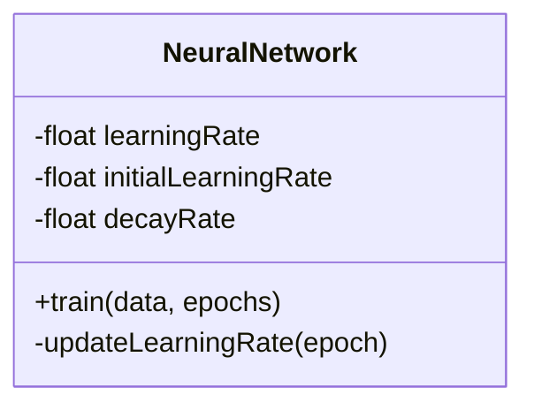
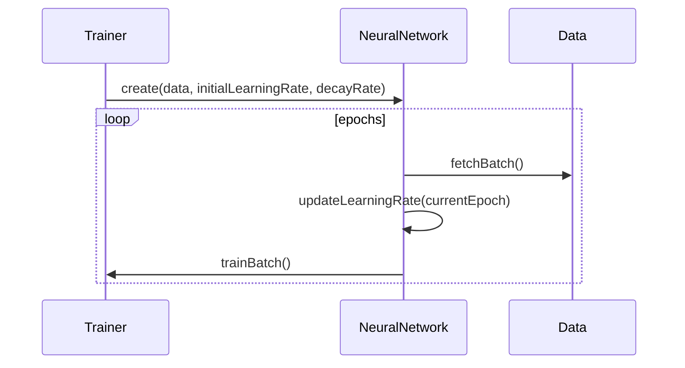

## Overview

Exponential Decay is a design pattern that reduces the learning rate of a neural network exponentially over epochs. This strategy helps in refining the learning process and achieving better convergence in training models.

## Detailed Description

In neural network training, the learning rate is a critical hyperparameter that defines the step size at each iteration while moving toward a minimum of the loss function. However, a high learning rate can lead to overshooting the minimum, while a low learning rate can slow down the convergence. The Exponential Decay pattern helps in adjusting the learning rate dynamically:

 \eta_{t} = \eta_{0} \cdot \exp(-\lambda t) 

Where:
- \\(\eta_{t}\\) is the learning rate at epoch \\(t\\).
- \\(\eta_{0}\\) is the initial learning rate.
- \\(\lambda\\) is the decay rate.

## UML Diagrams

### Class Diagram



### Sequence Diagram



## Benefits

- **Improved Convergence:** Gradual decrease in learning rate helps in precise convergence.
- **Enhanced Stability:** Prevents drastic changes in weights by reducing the learning rate exponentially.
- **Controlled Overfitting:** Slower learning rates in later epochs help in avoiding overfitting.

## Trade-offs

- **Computational Overhead:** The function to decrease the learning rate needs to be computed at every epoch.
- **Initial Setup:** Choosing the right initial learning rate and decay factor can be tricky and may require extensive experimentation.

## Examples

### Python

```python
import tensorflow as tf

initial_learning_rate = 0.1
decay_rate = 0.96
global_step = tf.Variable(0, trainable=False)

learning_rate = tf.compat.v1.train.exponential_decay(
    initial_learning_rate, global_step, 100000, decay_rate, staircase=True)

optimizer = tf.compat.v1.train.GradientDescentOptimizer(learning_rate)
```

### Java

```java
import org.deeplearning4j.nn.api.OptimizationAlgorithm;
import org.deeplearning4j.nn.conf.GradientNormalization;
import org.deeplearning4j.nn.conf.NeuralNetConfiguration;
import org.deeplearning4j.nn.conf.layers.DenseLayer;
import org.deeplearning4j.nn.multilayer.MultiLayerNetwork;
import org.deeplearning4j.nn.weights.WeightInit;
import org.nd4j.linalg.activations.Activation;
import org.nd4j.linalg.learning.config.ExponentialDecay;
import org.nd4j.linalg.lossfunctions.LossFunctions.LossFunction;

NeuralNetConfiguration.ListBuilder listBuilder = new NeuralNetConfiguration.Builder()
    .optimizationAlgo(OptimizationAlgorithm.STOCHASTIC_GRADIENT_DESCENT)
    .learningRateDecayPolicy(LearningRatePolicy.Exponential)
    .lrPolicyDecayRate(0.96)
    .learningRate(0.1)
    .list();

listBuilder.layer(0, new DenseLayer.Builder().nIn(784).nOut(1000)
    .activation(Activation.RELU)
    .weightInit(WeightInit.XAVIER)
    .build());

MultiLayerNetwork model = new MultiLayerNetwork(listBuilder.build());
model.init();
```

### Scala

```scala
import org.deeplearning4j.nn.api.OptimizationAlgorithm
import org.deeplearning4j.nn.conf.NeuralNetConfiguration
import org.deeplearning4j.nn.conf.layers.DenseLayer
import org.deeplearning4j.nn.multilayer.MultiLayerNetwork
import org.nd4j.linalg.activations.Activation
import org.nd4j.linalg.lossfunctions.LossFunctions

val conf = new NeuralNetConfiguration.Builder()
    .optimizationAlgo(OptimizationAlgorithm.STOCHASTIC_GRADIENT_DESCENT)
    .learningRateDecayPolicy("exponential")
    .lrPolicyDecayRate(0.96)
    .learningRate(0.1)
    .list()
    .layer(0, new DenseLayer.Builder().nIn(784).nOut(1000)
        .activation(Activation.RELU)
        .build())
    .build()

val model = new MultiLayerNetwork(conf)
model.init()
```

### Clojure

```clojure
(ns example.core
  (:require [dl4clj.nn.api.optimization-algorithm :refer :all]
            [dl4clj.nn.conf.builders.nn :refer :all]
            [dl4clj.nn.conf.layers.dense-layer :refer :all]
            [dl4clj.nn.model.multi-layer-network :refer :all]
            [org.nd4j.linalg.activations.activation :refer :all]))

(let [conf (-> (neural-net-conf-builder)
               (optimization-algo OptimizationAlgorithm/STOCHASTIC_GRADIENT_DESCENT)
               (learning-rate-decay-policy "exponential")
               (learning-rate 0.1)
               (lr-policy-decay-rate 0.96)
               (list)
               (layer (dense-layer-builder :nIn 784 :nOut 1000)
                      (activation Activation/RELU)))
      model (multi-layer-network conf)]
  (init! model))
```

## Use Cases

- **Deep Learning Models:** For training large, complex neural networks.
- **Convolutional Neural Networks (CNNs):** Especially in computer vision tasks where large datasets and overfitting are common.
- **Recurrent Neural Networks (RNNs):** Helps in stabilizing learning over long sequences.

## Related Design Patterns

- **Learning Rate Annealing:** A more general approach where the learning rate can be decreased following different schedules such as step decay, linear decay, etc.
- **Adaptive Learning Rates:** Methods like AdaGrad, RMSprop, and Adam dynamically adjust the learning rate during training.

## Resources and References

- [TensorFlow: Exponential Decay](https://www.tensorflow.org/api_docs/python/tf/compat/v1/train/exponential_decay)
- [DeepLearning4J: Learning Rate Decay Policies](https://deeplearning4j.org/docs/latest/deeplearning4j-nn-conf#learning-rate-schedules)
- [PyTorch Learning Rate Schedulers](https://pytorch.org/docs/stable/optim.html#how-to-adjust-learning-rate)

## Open Source Frameworks

- **TensorFlow:** Provides built-in support for learning rate decay methods.
- **PyTorch:** Offers a variety of learning rate schedulers.
- **Keras:** Supports various decay mechanisms via callbacks.

## Summary

The Exponential Decay pattern plays a vital role in the neural network training process by dynamically reducing the learning rate. This method helps in achieving better convergence, improved stability, and controlled overfitting. While it offers significant benefits, it requires careful tuning of hyperparameters to achieve optimal performance. This pattern is widely supported across popular machine learning frameworks, making it accessible and easy to implement for practitioners.
